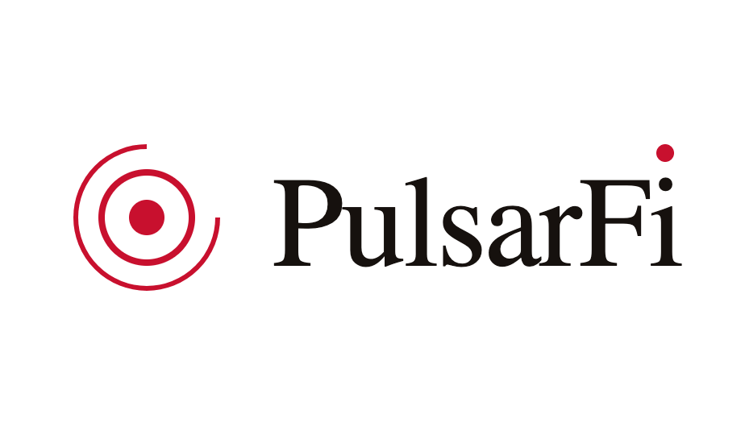
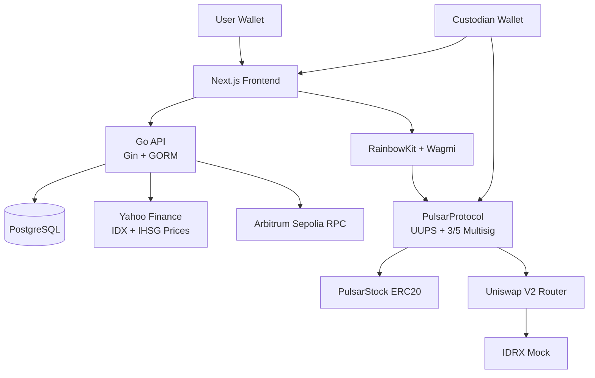
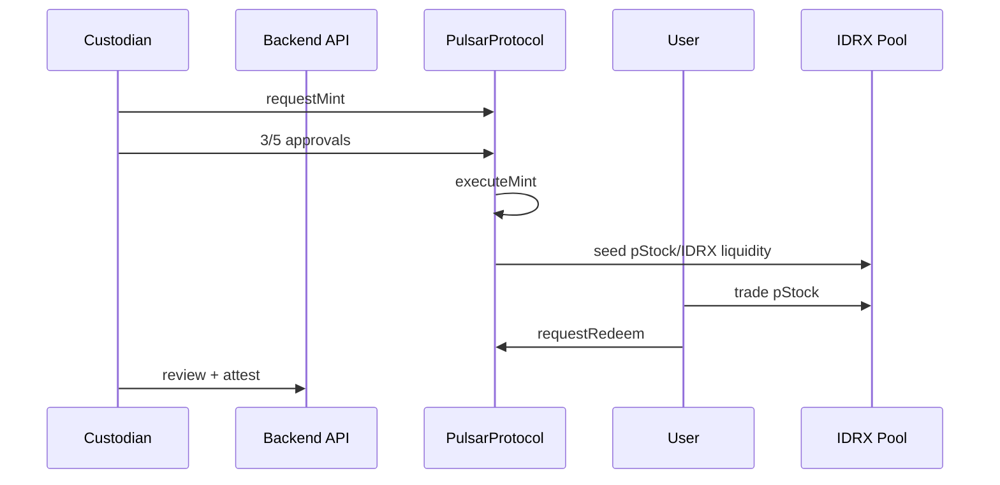

<div align="center">

# 

### Asset-backed Indonesian equity tokenization on Arbitrum Sepolia

[](https://soliditylang.org/)
[](https://book.getfoundry.sh/)
[](https://go.dev/)
[](https://nextjs.org/)
[](https://arbitrum.io/)

**PulsarFi turns selected IDX equities into 1:1 pStock receipts with custodian attestations, IDRX settlement, and on-chain liquidity.**

[Explore Docs](https://pulsarfi-docs.vercel.app) · [Frontend](./frontend) · [Backend](./backend) · [Smart Contracts](./smart-contract) · [Mobile App](https://github.com/hafidluqman50/pulsarfi-app)

Demo custodian wallets and the operator flow for judging are documented in [Judge Demo Access](https://pulsarfi-docs.vercel.app/docs/judge-demo-access). Custodian private keys are not published publicly; the trading flow remains self-serve with any Arbitrum Sepolia wallet.

<br/>


</div>

---

## Overview

**A Note on Development:** This project was built with strict architectural oversight. While AI tools were leveraged to accelerate development, every line of code was explicitly directed, reviewed, and deeply understood. There is no 'vibecoding' here. AI acts solely as a velocity multiplier for a deliberately engineered system.

PulsarFi tokenizes Indonesian public equities into pStock tokens on Arbitrum Sepolia. Each pStock represents custodian-backed IDX exposure, priced through IDX market data and traded against IDRX liquidity.

The product surface is intentionally compact:

- Markets: browse pStocks, IDX prices, IHSG, and token detail pages.
- Portfolio: view wallet holdings, transfers, swaps, and redemption requests.
- Custodian console: submit mint proposals, attest reserves, and manage redemption access.
- Protocol: mint, approve, execute, and redeem pStocks through smart contracts.

## Architecture



## Flow



## Stack

| Layer | Technology |
|---|---|
| Frontend | Next.js 16, React 19, TailwindCSS, RainbowKit, Wagmi, React Query |
| Backend | Go, Gin, GORM, PostgreSQL |
| Smart contracts | Solidity, Foundry, UUPS, OpenZeppelin, Uniswap V2 |
| Data | Yahoo Finance chart API, on-chain AMM reserves, custodian attestations |
| Network | Arbitrum Sepolia |

## Repository

```text
frontend/        Next.js app for markets, portfolio, swap, and custodian console
backend/         Go API for auth, public market data, custodian workflows, and records
smart-contract/  Foundry project for PulsarProtocol and PulsarStock
docs/            Docusaurus documentation source
```

## Quick Start

```bash
cd smart-contract
cp .env.example .env
forge build
forge test
```

```bash
cd backend
cp .env.example .env
go run main.go
```

```bash
cd frontend
npm install
npm run dev
```

## Docs

Full documentation lives at [pulsarfi-docs.vercel.app](https://pulsarfi-docs.vercel.app).
