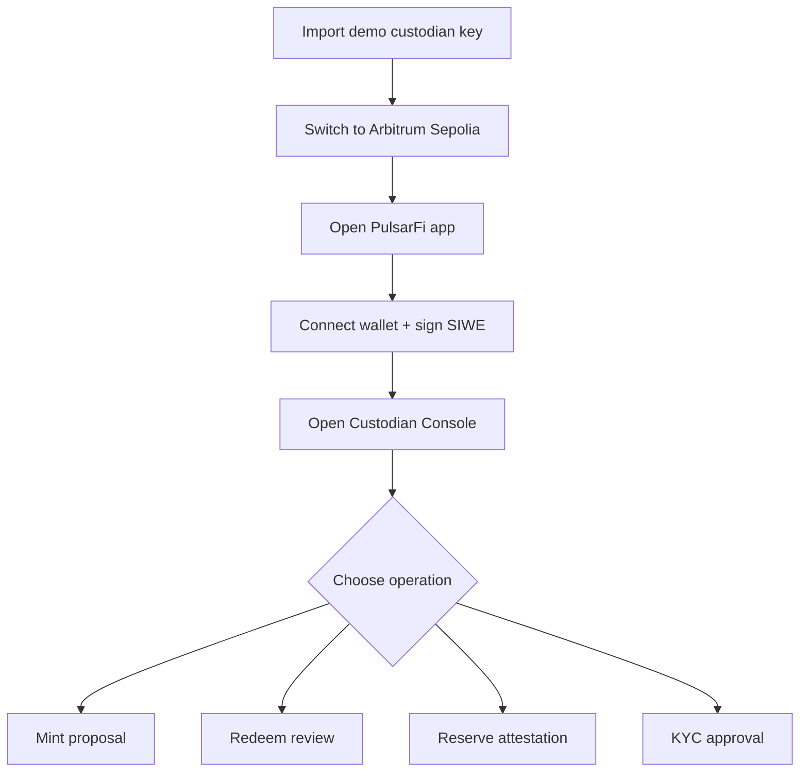
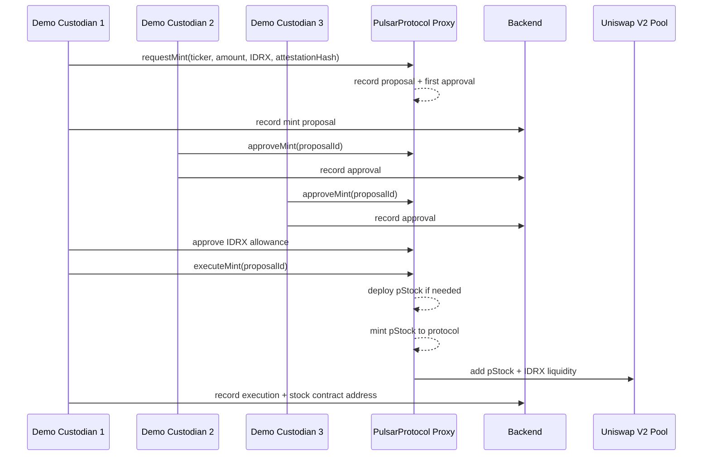
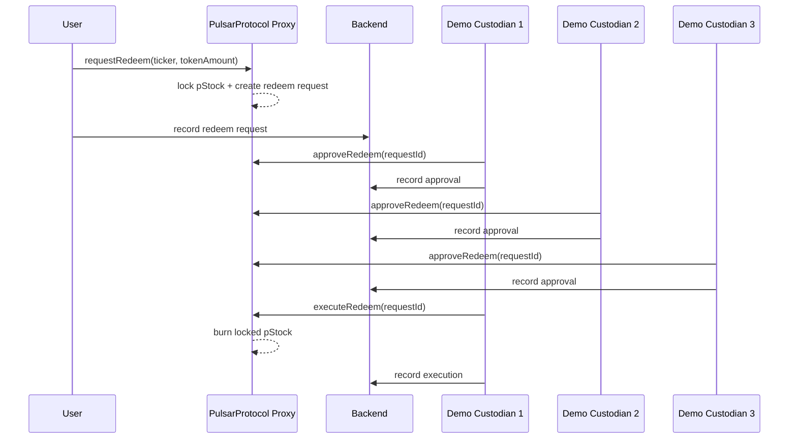
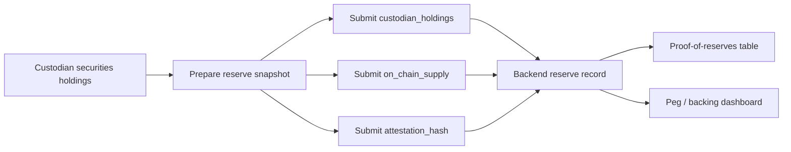
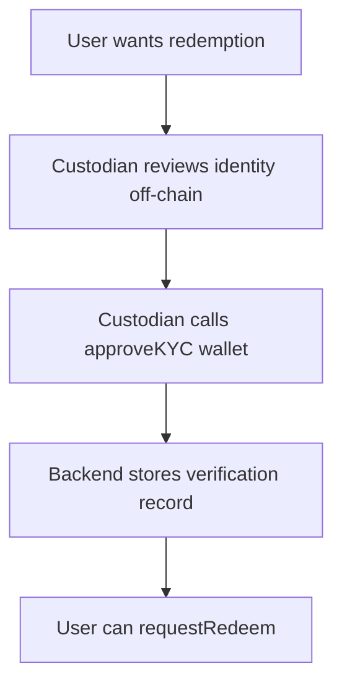

This page provides reviewer context for the Arbitrum Sepolia demo environment.
The custodian wallets below are burner wallets created only for hackathon
testing. They hold testnet assets only and will be revoked after judging.

## Demo links

| Item | Value |
| --- | --- |
| App | `https://pulsarfi-app.vercel.app` |
| Docs | `https://pulsarfi-docs.vercel.app` |
| Network | Arbitrum Sepolia |
| Chain ID | `421614` |
| Protocol proxy | `0x204488318C0E75978B3c851382Aa83f3065a8f5A` |
| IDRX mock | `0x03b53A71C5517907006EAb512A31C1eD5a56Ae64` |

## Demo custodian wallets

These addresses are registered in the backend `custodians` table and have
`CUSTODIAN_ROLE` on the PulsarProtocol proxy.

| Wallet | Address | Status |
| --- | --- | --- |
| Demo Custodian 1 | `0x52edE37B32Eb3f2e916Ab91390df4aD14c38056d` | Active |
| Demo Custodian 2 | `0x7175D6910d4F9744C6B3c10b5278b0618A44eeAA` | Active |
| Demo Custodian 3 | `0x4d9443565e79D40aEF3643717136C9A3E7B3A1C2` | Active |

Private keys are intentionally not published in public documentation. Publishing
all three keys would give anyone full threshold control over demo custodian
operations. The trading flow is self-serve with any Arbitrum Sepolia wallet; the
custodian flow is documented below and can be demonstrated live if interactive
operator testing is requested.

Each demo custodian wallet has:

- `CUSTODIAN_ROLE` on the PulsarProtocol proxy.
- Backend custodian access through SIWE authentication.
- `500,000,000,000 IDRX` testnet balance for demo mint/liquidity operations.

## How to test custodian flow

The smart contract requires `3` custodian approvals before execution, so the
full multisig path needs all three demo custodian wallets.



## Custodian treatment per wallet

Each demo custodian wallet represents one independent authorized operator.

| Wallet | Recommended use in demo | On-chain effect |
| --- | --- | --- |
| Demo Custodian 1 | Initiates proposal and executes after threshold. | First approval is recorded automatically on `requestMint`; can execute if it is the requester. |
| Demo Custodian 2 | Reviews and approves/rejects. | Adds one independent vote. |
| Demo Custodian 3 | Reviews and approves/rejects. | Adds the third vote needed to reach threshold. |

This separation matters because the protocol does not allow one wallet to
complete mint or redeem alone.

## Mint walkthrough

Use this flow when a custodian wants to bring new backed IDX exposure on-chain.



Minting rules:

- The requester becomes the first approver.
- Two additional custodians are required before execution.
- Only the original requester can execute an approved mint.
- The requester must have enough IDRX and must approve the protocol before
  `executeMint`.
- New pStock supply is paired with IDRX liquidity instead of being released
  directly to an operator wallet.

## Redeem walkthrough

Use this flow when a KYC-approved user wants to move from pStock into the
off-chain securities settlement process.



Redeem rules:

- The user must be KYC-approved before requesting redemption.
- User pStock is locked while the request is pending.
- After `3` approvals, the first approver can execute the approved redeem.
- If rejected by threshold vote, locked assets are returned to the user.
- Off-chain delivery is handled by the custodian process after on-chain approval.

## Reserve attestation walkthrough

Reserve attestations are backend records used to explain backing status.



Reserve records do not mint tokens by themselves. They are audit evidence that
helps reviewers compare custodian-held underlying shares against on-chain pStock
supply.

## KYC treatment

KYC is only required for redemption, not for trading.



This keeps secondary trading open while keeping off-chain securities settlement
under custodian control.

## Security note

The demo wallets are burner wallets for judging only. They are not deployer,
treasury, admin, or upgrade wallets. After judging, their contract role can be
revoked with:

```bash
ROLE=$(cast keccak "CUSTODIAN_ROLE")

cast send $PULSAR_PROTOCOL_PROXY \
  "revokeRole(bytes32,address)" \
  $ROLE \
  0xDEMO_CUSTODIAN_ADDRESS \
  --rpc-url $RPC_URL \
  --private-key $ADMIN_PRIVATE_KEY
```
