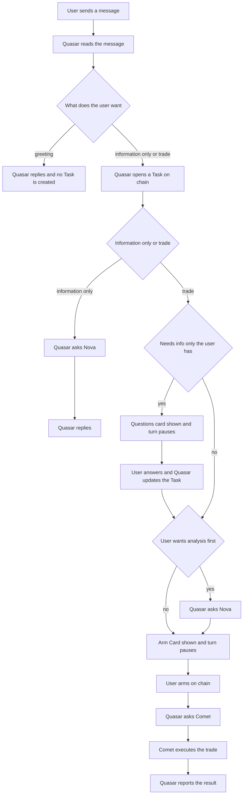
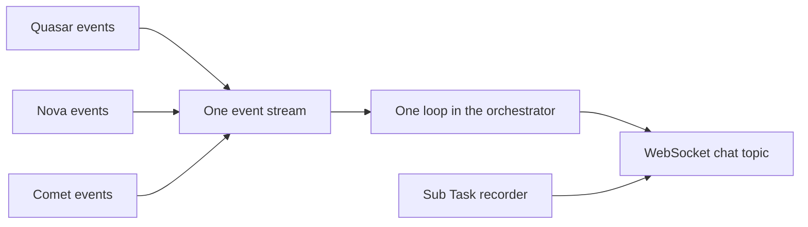

# Agent-as-Tool Orchestration (Eino Infrastructure Cleanup, Stage 1 of 2)

| | |
|---|---|
| **Version** | 1.10 |
| **Status** | Approved |
| **Date Created** | 2026-10-05 |
| **Last Updated** | 2026-10-05 |

| Version | Date | Change |
|---|---|---|
| 1.10 | 2026-10-05 | **Arm and Comet's execution proven live, end to end, with the demo wallet's own key.** §14: the live validation now covers `ArmTask`, the wallet's `approve`, and `ExecuteTask` resuming the Arm pause, for Task 327 (a buy of BBCAP, scalp, 1,000,000 IDRX budget, chat `d199503d-d78c-45c5-8c13-328fc9856a06`). Results: the pause survived in `agent_checkpoints` until execution; the approve and the swap (`submit_trade`) both confirmed `success` on the Arbitrum Sepolia node and target the configured IDRX token and AgentTaskManager; Comet bought 894,500.00 IDRX of BBCAP and the wallet balance dropped by exactly that amount, leaving 105,500.00 of the 1,000,000.00 allowance; the Sub Task chain has 11 steps, all on-chain, ending `armed, route_to_executor, decide, execute, sync_database`; the checkpoint was deleted afterwards; Comet's thinking (18), its tool calls (balance, spot price, `submit_trade`) and Quasar's closing reply (131 chunks) streamed live after Arm, which closes DoD 6. New opt-in test `TestLiveAgentAsTool_ArmAndExecute` (needs `LIVE_AGENT_FLOW=1` and `LIVE_ARM_TASK_ID`); it refuses to sign unless the key belongs to the Task's wallet and the chain is Arbitrum Sepolia. Gotcha recorded: a test file whose name ends in `_arm` is silently excluded on arm64 (Go reads it as a `GOARCH` suffix), so it was renamed `agent_as_tool_live_execute_test.go`. Still open: spike S6 (the frontend itself reading these events). |
| 1.9 | 2026-10-05 | **First live run against the real database, DeepSeek and chain found three defects the scripted tests could not; fixed and re-verified live. Process note: these code fixes were made before this revision, against AGENTS.md §2 (docs first); this row records them after the fact.** Live findings and fixes: (1) The questions-card turn came back with an empty reply, because Quasar called `ask_user` without writing an introducing sentence. Fix: `ask_user` and `await_arm` take a required `message` argument that travels in the interrupt payload (`QuestionsInterrupt.Message`, `ArmInterrupt.Message`); `consume` uses it as the reply only when the model wrote no text, so nothing is duplicated and no sentence is hardcoded. §6.4 snippets and the prompt (§12 decision 11) updated. (2) Quasar asked Nova before `update_task`, so Nova received an informational request (no ticker verification, no verdict) and the Sub Task chain showed `route_to_analyzer` before the second `route_decision`. Fix: `analyzer_agent` refuses while a trade is unsettled (`Side` set and `IsActionable` false), and the prompt says update_task comes first. (3) The hub dropped updates ("client send buffer full", 26 warnings) because reasoning arrived as ~5600 tiny `thinking` events in one Nova turn. Fix: thinking deltas are batched (160 bytes) per message in `publishAssistant`; the second run produced 40 thinking events and 0 dropped updates. Test-only: the live test's sub-task summary used wrong JSON tags. New flow test `TestFlowGuards_NovaWaitsForASettledTrade`; flow tests updated for `message`. §14: live results recorded. |
| 1.8 | 2026-10-05 | §13: open questions 4 and 5 marked resolved. Question 4 (guarding the live sub-task list across goroutines) is resolved by the mutex in `liveSubTasks` and a clean `go test -race` run of the proof and flow tests. Question 5 (chat while the Arm Card is open) is resolved for the new code by flow test H: the message is an ordinary turn, the Arm pause survives it and still resumes through `ResumeExecute`; the old code's behavior was never recorded, since it was replaced before the spike could run against it. The two supersede changelog rows on `agent-orchestration-graph-rebuild.md` (2.18) and `quasar-clean-routing-scalp-refactor.md` (2.1) are in place. |
| 1.7 | 2026-10-05 | **Implemented (P1 to P4 code), pending live validation; this revision records what was built and where it differs from the plan.** Built: `supervisor/` package, single event loop in `Orchestrator`, `await_arm` plus Comet guard, `RunContext`-based Task restore, tool-first guards, all deleted symbols (§6.8) gone by grep; flow tests A, B, D, H, the two guards and the no-pending-pause error pass on a disposable Postgres, S1 to S5 pass, all under `-race`. Differences from the plan: (1) §5: `orchestrator_workflow_service.go` was split into three files by responsibility because it reached 925 lines: `orchestrator_stream_service.go` (live sub-task list, the `consume` loop, event publishing), `reply_classifier_service.go` (news evidence, `classifyReply`) and the trimmed `orchestrator_workflow_service.go` (Task lifecycle, restore, Nova verdict helpers); the code was moved, not changed. (2) §12 decision 5: `graceful_tool_service.go` is unchanged and `RunContext.OnSubTaskStarted` / `OnSubTaskFailed` stay as plain publish functions created once in `newRunContext`, instead of deriving failures from `tool_error` events, because `executor` reads them and the plan forbids touching it. (3) After `await_arm` resumes, the reply persisted by `ExecuteTask` is Quasar's closing message, not Comet\'s own text, because Quasar now relays every result. (4) `route_decision` reasoning text is now "Task opened. Actionable: x" / "Task updated. Actionable: x" (the old text named the routing path, which no longer exists); step names, agents, order and the hash function are unchanged, so DoD 8 holds for structure but those two steps hash different text by nature. (5) `Orchestrator` keeps `ReplyModel` (the cancellation reply still needs one plain model call). (6) `ResumeExecute` with no pending Arm pause returns `ErrNoPendingExecution`; see §13 question 6. (7) The `finalizing` event stays declared in the frontend but is not emitted, exactly as before (no producer existed). (8) §9 Maintainer Guide filled with the real file references. (9) The old live tests lost their callbacks argument and the streaming-count assertion in `orchestrator_live_test.go` (covered by S1). Not done: live LLM validation of the rewritten Quasar prompt (waiting for a provider base URL), spike S6 (manual), and the two supersede notes on the old plans were added in this revision. |
| 1.6 | 2026-10-05 | **Proof tests S1 to S5 written and run; S3 falsified the first Arm design, so the design changed.** A tool that interrupts itself and then calls the Comet `AgentTool` in the same context fails ("agent tool 'comet' interrupt has happened, but cannot find interrupt state"). §6.1, §6.4, §3 table, §6.7: the single "Comet gate" is replaced by two tools: `await_arm` (the pause, resumed by `ExecuteTask`) and a Comet guard (checks `ArmedAt`, never interrupts, forwards `opts`). §6.4 Sub Task step table: `await_confirmation` is recorded by `await_arm`, `route_to_executor` by the Comet guard. §2: criteria 5 and 11 renamed accordingly. §10: spike table gains a Result column (S1 to S5 passed, S6 and S7 pending) and names the test file. §12: decision 1 rewritten, decision 10 added (order of the Arm tools). §14: test names updated. Also verified: a wrapper that drops `opts` loses every inner agent event (S5 control), so forwarding is mandatory. |
| 1.5 | 2026-10-05 | §11 heading: "only if P0 fails" reworded to match v1.4, where P0 was merged into P1 (a leftover reference). |
| 1.4 | 2026-10-05 | **Approved by the maintainer ("bisa dieksekusi"); status Draft to Approved.** §5: `Orchestrator` fields corrected (`RouteModel`, `ReplyModel`, `Analyzer`, `Executor` and the `*ModelName` fields are replaced by one `Quasar adk.Agent`, because Nova and Comet are wrapped inside it by `supervisor.New`); new row for `service/external/deepseek_service.go` (optional `DEEPSEEK_BASE_URL`, default unchanged). §10: P0 merged into P1 ("prove first, then build"); the spike tests are kept as the real tests, not thrown away; spike S2 uses an in-memory checkpoint store because the Postgres store is already covered by `checkpoint_store_test.go`. §14: live LLM tests read `backend/.env.test` (git-ignored) for `DEEPSEEK_API_KEY`, `DEEPSEEK_BASE_URL`, `TEST_LLM_MODEL`; scripted fake models are used wherever a real model is not the thing being tested. |
| 1.3 | 2026-10-05 | **Two invented names in the §6 snippets corrected after checking the code.** §6.4 `ask_user` and the Comet gate: `agent.MustRunContext(ctx)` does not exist; they now use the existing `agent.RunContextFrom(ctx)` (two return values). §6.1 and §5: `routeDecision` is unexported, so the `supervisor` package cannot name it; it is exported as `RouteDecision` in P2, and the `TaskOpener` interface uses that name. |
| 1.2 | 2026-10-05 | **Reuse pass: every [NEW] item re-checked against the existing code; most were duplicates.** Title and Summary: scope is now "Stage 1 of 2"; Stage 2 (Comet asks the user's questions through Quasar) is a separate plan, described in §15. §1: new rows (`ExecuteTask` already checks `ArmedAt`; a chat message while the Arm Card is open may resume the execute pause without that check, to be verified). §2: criterion 2 reworded (callbacks created in one place, no callback struct threaded through layers), criterion 10 now follows the existing role-package pattern, new criterion 12 (no DB change, reuse). §3: Nova and Comet remain full agents invoked through `adk.NewAgentTool`; they never speak to the user. §4: new scenario H (chat while Arm pending). §5 rewritten with a "Reuse check" column: dropped `TurnRunner`, `TurnSession`, `EventSink`, `event_pump.go`, `quasar_agent.go`, five `tool_*.go` files, and four moved-code files; new files are only `supervisor/index.go`, `supervisor/instructions.go`, `supervisor/tools_service.go`. §6 rewritten to match: `Orchestrator` keeps its name and gains `Send`; `RunContext` is kept; `realtime.Publish` is used directly; the Arm gate reads `ArmedAt` through a narrow interface implemented by the existing repository; `routeDecision` is reused as the `open_task` / `update_task` argument type. §9 file references updated. §10 spike S7 added. §12: decisions 7 to 9 added. §13: open question 5 added (chat while Arm pending). §14: test for scenario H. §15 new (Stage 2). |
| 1.1 | 2026-10-05 | Every Task is on-chain, confirmed by the maintainer. New finding row, criterion 11 (Task-first guard), scenario B opens a Task, `update_task` tool, Task-first guard, Sub Task step table, flowchart redrawn, decision 6, open question 1 resolved. |
| 1.0 | 2026-10-05 | Initial draft |

> [!IMPORTANT]
> **This plan changes how the code is built, not what the product does.** The conversation flow the user sees (questions card, Nova, Arm Card, Arm, Comet) stays exactly as it is today, and Quasar stays the one who asks the user's questions. Two small, approved UI-visible changes: real DeepSeek reasoning is shown as "thinking", and Comet's work after Arm is streamed live into the same chat.

---

## Summary

- Quasar becomes one real Eino agent. Nova and Comet stay full agents, each with its own model, instructions, tools and loop, and Quasar calls them through Eino's agent-call mechanism (`adk.NewAgentTool`). Nova and Comet never talk to the user and never to each other: everything goes through Quasar.
- Everything the three agents do (thinking, tool calls, replies) comes out of **one event stream**, read by one loop. The layers of callbacks that copy events upward go away.
- The two pauses stay where they are: the **questions card** (Quasar needs data from the user) and the **Arm Card** (user must arm before Comet runs). Both become Eino interrupts raised by a tool.
- The product flow, the four routing paths, the on-chain Task and Sub Task chain, the database, and the wire contract to the frontend do not change.
- Goal: the maintainer can read, change and extend this alone, without AI. The plan follows the existing code conventions instead of adding new ones.
- **Stage 1 of 2.** Stage 2, where Comet (not Quasar's prompt) decides what is missing, is a separate plan (§15).

---

## 1. Problem Statement

### What is wrong today (plain language)

Quasar, Nova and Comet are supposed to talk to each other, pause when the user must fill in data, and stream their thinking to the chat. Today none of that is built the natural way. Quasar is split into separate functions inside a hand-written graph, each agent's output is read by hand, and progress reaches the chat through callbacks passed from layer to layer. Adding or changing anything means touching many places.

The split was made on a wrong belief: `agent_registry.go` and `agent-orchestration-graph-rebuild.md` state that `adk.ChatModelAgent` "can never stream". Reading Eino v0.9.15 source shows this is false (see Findings).

### Findings and implications

| Finding | Implication |
|---|---|
| `ChatModelAgent` streams: `react.go` builds the model node with `AddChatModelNode` (supports `Stream`), and `AgentInput.EnableStreaming` makes `chatmodel.go` call `runnable.Stream` | The premise behind the graph rebuild is wrong. Quasar can be an agent again. |
| `NewAgentTool` + `ToolsConfig.EmitInternalEvents` forwards the inner agent's events, including `MessageStream`, into the parent's iterator, tagged with `AgentName` | One loop over one iterator sees Quasar, Nova and Comet. No callbacks needed to move events upward. |
| A tool can pause with `tool.StatefulInterrupt` and be resumed with data via `Runner.ResumeWithParams`; this works across one level of agent nesting | Both pauses can be tools. The hand-managed interrupt state in `runUnderstand` goes away. |
| Eino marks the `supervisor` transfer pattern "NOT RECOMMENDED" and recommends `ChatModelAgent` + `AgentTool` | The target shape is the library's recommended one. It also matches today's behavior: Nova and Comet receive only a request, and Quasar speaks to the user. |
| DeepSeek stream deltas carry `ReasoningContent` (`eino-ext/libs/acl/openai`, `chat_model.go:1222`); `drainAssistantThinking` only reads `chunk.Content` | The "thinking" shown today is the answer text, not reasoning. Real reasoning is available for free. |
| `ResumeExecute` builds its turn without binding callbacks | While Comet works after Arm, the user sees nothing live. |
| `orchestratorTurn` mixes data with 7 callbacks and `runCtx`; gob drops func and unexported fields on checkpoint | Workarounds: `turnCallbacks` in context, `onLatestSnapshot`, `ensureRunContext`, `GetInterruptState` recovery. All exist only to patch this mix. |
| `runUnderstand` opens the Task (Postgres row, on-chain `createTask`, `understand_request` and `route_decision` Sub Tasks) for every decision except `none`, including `needs_input` and `analyzer_only`, **before** the questions card is raised. Later rounds only update the same Task. The maintainer confirms: every Task is on-chain. | The `runAnalyze` comment ("informational requests never open a Task") and the `needs_input` line in `instructions.go` ("nothing goes on-chain") are stale. Tool order must be enforced in code: no Nova, Comet or questions card before a Task exists. |
| `runCommit` returns immediately because `runUnderstand` already opens the Task | The `commit` node does no work. |
| `ExecuteTask` already rejects an unarmed Task (`task.ArmedAt == nil \|\| task.OnChainTaskID == nil`, `task_service.go:303`) before calling `ResumeExecute` | The Arm check exists. The new gate reuses it instead of adding an abstraction. |
| `ChatService.resumeOrRun` resumes whatever interrupt is stored for the chat, with the user's message as data, including the execute pause that waits for Arm | A chat message typed while the Arm Card is open may resume the execute pause without the `ArmedAt` check in `ExecuteTask`. On-chain budget would still stop a trade. **Not verified**; recorded as spike S7. |
| `TickerProblem` is read but never set; history conversion is copied in three places; `ExtendedCheckPointStore` is type-asserted at six sites | Dead code and duplication to remove. |
| `orchestrator_workflow_service.go` is 1177 lines holding node functions, Task lifecycle, prompt builders, news extraction, reply classification and the agent runner | Node functions and the runner go; the helpers stay in place and are split only if P3 shows a need. |

---

## 2. Definition of Done

| # | Criterion | How it is checked |
|---|---|---|
| 1 | Quasar is one `adk.ChatModelAgent`; Nova and Comet are called by Quasar only and never call each other. | Code review, scenario tests |
| 2 | Quasar, Nova and Comet output is read by one loop and published to the WebSocket through the existing `realtime.Publish`. `AgentEventCallbacks`, `turnCallbacks`, `bindCallbacks` and `onLatestSnapshot` no longer exist. The remaining progress functions on `RunContext` are created in one place. | `grep` for removed symbols returns nothing |
| 3 | The questions-card pause and the Arm pause are Eino interrupts raised by tools and resumed with `ResumeWithParams`. | Spike S2, S3 |
| 4 | The product flow is unchanged for all four paths (none, analyzer only, executor only, analyzer then executor). | Scenario matrix (section 4) |
| 5 | Comet cannot run before the Task is armed on-chain, enforced in code by reading `ArmedAt`, not by prompt. | Test: the Comet guard refuses an unarmed Task (S3) |
| 6 | Comet's work after Arm streams live into the same chat topic, with the same event shapes as the first phase. | Spike S3, manual check |
| 7 | `thinking` events carry real reasoning when the model returns it; when it does not, they fall back to today's behavior (answer text). | Test with and without reasoning |
| 8 | The on-chain Task / Sub Task hash chain is byte-for-byte compatible: same step names, same order, same hashes for the same inputs. | Existing `execute_task_test.go` plus a chain parity test |
| 9 | The WebSocket event contract to the frontend (`sub_tasks`, `reply_delta`, `tool_call`, `thinking`, `finalizing`, `error`, `final`) is unchanged; no frontend file changes. | Frontend diff is empty |
| 10 | Maintainability: Quasar follows the existing role-package pattern (`index.go`, `instructions.go`, `tools_service.go`); no new abstraction where an existing one serves; the Maintainer Guide (section 9) exists and is accurate. | Review by the maintainer |
| 11 | Every turn that is not a plain greeting opens an on-chain Task before any other tool runs. `ask_user`, `nova`, `await_arm` and the Comet guard refuse to run without an open Task; enforced in code, not by prompt. | Tests: each of the three refuses with `ErrNoOpenTask`; scenarios A to G |
| 12 | No database change: no new table, no migration; `agent_sub_tasks`, `agent_tasks` and the checkpoint store are used as they are. | Migration directory diff is empty |

---

## 3. Feature Description

### What stays the same (plain language)

The user talks to Quasar. If a trade needs information only the user can give, Quasar shows a **questions card** (shape, ticker, side, budget, "analyze first?" and so on) and waits. If the user wants Nova's analysis, Nova works; otherwise Comet goes straight on. Quasar then shows the **Arm Card**. When the user arms it on-chain, Comet executes. Chart and news questions go to Nova only, and plain greetings need no one. Nova and Comet never speak to the user: Quasar asks the questions and relays the results.

### What changes underneath (plain language)

Quasar decides which of those paths to take exactly as today, but it expresses the decision by calling tools (open a Task, ask the user, update the Task, ask Nova, ask Comet) instead of returning a JSON object that code then interprets. The tool arguments are typed, so a malformed decision is rejected by the tool schema instead of silently falling back.

Nova and Comet are still complete agents. "Tool" is only Eino's word for how Quasar calls an agent: Quasar sends a request, the agent runs its whole loop, and the result comes back to Quasar.

<details>
<summary>Technical summary</summary>

| Concern | Today | After |
|---|---|---|
| Quasar | Two raw LLM calls plus a hand-built graph | `adk.ChatModelAgent` in `service/agent/supervisor/` |
| Nova, Comet | `adk.Agent` run by `runRoleAgent` inside node lambdas | Same agents, invoked through `adk.NewAgentTool` |
| Event delivery | `AgentEventCallbacks` bound to turn, copied to context, copied to `RunContext`, wrapped by `liveSubTasks` | One loop over the Runner iterator inside `Orchestrator`, publishing with `realtime.Publish` |
| Questions pause | `compose.StatefulInterrupt` inside `runUnderstand`, manual state recovery | `ask_user` tool interrupt |
| Arm pause | `compose.WithInterruptBeforeNodes("execute")` | `await_arm` tool (the pause) plus an in-code guard on the Comet call |
| Entry points | `Run`, `ResumeRoute`, `ResumeExecute`, each building its own turn | `Orchestrator.Send` and `Orchestrator.ResumeExecute` over one `adk.Runner` |
| Routing decision | `routeDecision` JSON parsed in Go | tool calls; `routeDecision` becomes the argument type of `open_task` and `update_task` |

</details>

---

## 4. Scenarios (Acceptance)

Every row is an existing path. Each becomes a test in `backend/test/service/agent/`.

| # | User says | Questions card answer | Path today | Task opened | Tools Quasar calls, in order |
|---|---|---|---|---|---|
| A | "Halo" | none | none | no | none |
| B | "Ambilin chart IHSG" | none | analyzer only | yes, not actionable | `open_task`, `nova` |
| C | "Beli BBCA 1 juta, gak usah dianalisa, langsung eksekusi" | already stated, not asked again | executor only | yes, actionable | `open_task`, `comet` (after Arm) |
| D | "Beli BBCA" | card asks shape, budget, "analyze first?"; user answers yes | analyzer then executor | yes, opened before the card | `open_task`, `ask_user`, `update_task`, `nova`, `comet` (after Arm) |
| E | "Beli BBCA" | card asks; user answers "no, execute directly" | executor only | yes, opened before the card | `open_task`, `ask_user`, `update_task`, `comet` (after Arm) |
| F | Cancel while the Arm Card is open | n/a | cancellation | already open | none (checkpoint deleted, current behavior kept) |
| G | Any message after a pending questions card | the message is the answer | resume | already open | `ask_user` resumes, then `update_task` |
| H | Any chat message while the Arm Card is open and the Task is not armed | n/a | unknown today (spike S7 records it first) | already open | expected: Comet does not run |

---

## 5. Impacted Files

Paths are under `backend/src/` unless noted. "Reuse check" states what was looked at and why a new item is still needed.

### New

| File | Reuse check |
|---|---|
| `service/agent/supervisor/index.go` | `analyzer/index.go` and `executor/index.go` are the pattern: `New(...)` returning `adk.Agent`, plus narrow interfaces the role needs (`TaskOpener`, `ArmedTaskReader`). Quasar has no package today since the old one was deleted. |
| `service/agent/supervisor/instructions.go` | Pattern of `analyzer/instructions.go`. Content is moved from `agent/instructions.go` (`quasarRouteInstructions`, `quasarRouteResumeInstructions`, `quasarReplyInstructions`), rewritten from "output JSON" to "call tools". `GlobalInstructions` stays in `agent`. |
| `service/agent/supervisor/tools_service.go` | Pattern of `analyzer/tools_service.go`: all of the role's tools in one file (`open_task`, `ask_user`, `update_task`, `nova` call, `await_arm`, Comet guard). Split only if it grows too long. |
| `backend/test/service/agent/` new tests | Spike and scenario tests; no existing test covers an agent-level run. |

### Modified

| File | Change |
|---|---|
| `service/external/deepseek_service.go` | Optional env `DEEPSEEK_BASE_URL` overrides the base URL; default stays `https://api.deepseek.com/v1`. No production behavior change. Lets tests point at another OpenAI-compatible provider. |
| `service/agent/orchestrator_service.go` | `Orchestrator` keeps its name, its repositories, `Chain`, `Stocks` and `CheckPointStore`; `RouteModel`, `ReplyModel`, `Analyzer`, `Executor` and the `*ModelName` fields are replaced by one `Quasar adk.Agent`. `NewOrchestrator` builds an `adk.Runner` instead of a graph. `Run` and `ResumeRoute` are replaced by `Send`; `ResumeExecute` keeps its name and caller. The single event loop lives here. `CheckPointStore` becomes `ExtendedCheckPointStore`. |
| `service/agent/orchestrator_workflow_service.go` | Node functions, `runRoleAgent`, `drainAssistantThinking` deleted. Keeps the Task lifecycle (`CommitTask`, `UpdateTask`, `buildTriggerDescription`), the restore of a Task into `RunContext`, and the Nova verdict helpers. `commitTask` and `updateTask` are exported, and `routeDecision` is exported as `RouteDecision`, so `supervisor` tools can call them through the `TaskOpener` interface. |
| `service/agent/orchestrator_stream_service.go` | [NEW, moved code] The live sub-task list (`liveSubTasks`, moved from the handler, mutex-guarded), the one `consume` loop over the Runner events, the event publishing and `ChatStreamTopic`. Created because the single workflow file reached 925 lines. |
| `service/agent/reply_classifier_service.go` | [NEW, moved code] News evidence extraction and `classifyReply`, unchanged apart from taking its inputs as parameters. |
| `service/agent/run_context_service.go` | Keeps `RunContext`, `WithRunContext`, `RunContextFrom`, so `analyzer/` and `executor/` need no change. Adds `TaskID` and the chat topic; the live sub-task list moves in. |
| `service/agent/chat_service.go` | Calls `Send`; no checkpoint type assertions; one chat-history conversion function shared with `scheduler_service.go`. |
| `service/agent/sub_task_recorder.go` | `OnRecord` is set from the one place that builds `RunContext`. |
| `service/agent/graceful_tool_service.go` | Failure signal derived from the `tool_error` tool-result event. |
| `service/agent/scheduler_service.go` | Uses the shared history function. |
| `service/agent/instructions.go` | Quasar prompts move out; `GlobalInstructions`, `currentTimeContext` stay. |
| `service/agent_registry.go` | Builds the supervisor agent with `supervisor.New` and passes it to `Orchestrator`; stale "can never stream" comment removed. |
| `http/handlers/agent/chats.go` | Calls `Send` and publishes `final`; `liveSubTasks` moves to the `agent` package; `chatStreamTopic` moves to the `agent` package as `ChatStreamTopic` because a service cannot import a handler. |
| `docs/plans/agent-orchestration-graph-rebuild.md`, `quasar-clean-routing-scalp-refactor.md` | One changelog row each, marking the "can never stream" premise superseded (version bump per AGENTS.md §7 rule 2), done at P3. |
| `backend/test/service/agent/*_test.go` listed in §14 | Rewritten against `Orchestrator.Send`. |

### Deleted

`orchestratorTurn` and its callback plumbing, `Orchestrator.Run`, `Orchestrator.ResumeRoute` (see §6.8 for the full symbol list).

### Not touched

`analyzer/` and `executor/` agents and their tools, `contracts/`, models, repositories, migrations, smart contracts, frontend.

---

## 6. Code Shape

All snippets are contracts, not final code. `UNVERIFIED` marks what the spike must prove.

### 6.1 Quasar as an agent, following the role-package pattern

```go
// service/agent/supervisor/index.go [NEW]
type TaskOpener interface {
    CommitTask(ctx context.Context, rc *agent.RunContext, decision agent.RouteDecision) error
    UpdateTask(ctx context.Context, rc *agent.RunContext, decision agent.RouteDecision) error
}

type ArmedTaskReader interface {
    FindByID(ctx context.Context, taskID int64) (dbmodel.AgentTask, bool, error)
}

func New(ctx context.Context, chatModel model.ToolCallingChatModel, nova, comet adk.Agent, tasks TaskOpener, armed ArmedTaskReader) (adk.Agent, error) {
    tools := []tool.BaseTool{
        newOpenTaskTool(tasks),
        newAskUserTool(),
        newUpdateTaskTool(tasks),
        newNovaTool(ctx, nova),
        newAwaitArmTool(),
        newCometGuard(adk.NewAgentTool(ctx, comet), armed),
    }
    return adk.NewChatModelAgent(ctx, &adk.ChatModelAgentConfig{
        Name:        "quasar",
        Description: "Talks to the user and coordinates Nova and Comet.",
        Instruction: instructions,
        Model:       chatModel,
        ToolsConfig: adk.ToolsConfig{
            ToolsNodeConfig:    compose.ToolsNodeConfig{Tools: tools},
            EmitInternalEvents: true,
        },
        MaxIterations: 12,
    })
}
```

This mirrors `executor.New`: interfaces defined in the role package, implemented elsewhere (`*Orchestrator` implements `TaskOpener`, the existing `AgentTaskRepository` implements `ArmedTaskReader`). `agent_registry.go` wires them, so package `agent` never imports `supervisor` (no import cycle).

### 6.2 Orchestrator keeps its name; two entry points

```go
// orchestrator_service.go [MODIFY]
func (o *Orchestrator) Send(ctx context.Context, in OrchestratorInput) (OrchestratorResult, error) {
    ctx = WithRunContext(ctx, o.newRunContext(in))
    if interruptID, ok := o.pendingQuestionsInterrupt(ctx, in.ChatID); ok {
        return o.consume(ctx, in.ChatID, o.runner.ResumeWithParams(ctx, in.ChatID.String(),
            &adk.ResumeParams{Targets: map[string]any{interruptID: in.RawPrompt}}))
    }
    return o.consume(ctx, in.ChatID, o.runner.Run(ctx, in.Messages, adk.WithCheckPointID(in.ChatID.String())))
}

func (o *Orchestrator) ResumeExecute(ctx context.Context, taskID int64, wallet string) (ExecuteTaskResult, error) // same name and caller as today
```

`Send` only resumes a **questions** interrupt from a chat message; the Arm interrupt is resumed only by `ResumeExecute`. This is what spike S7 checks and what closes the possible gap in §1.

### 6.3 The one loop (replaces `runRoleAgent` and `drainAssistantThinking`)

```go
// orchestrator_workflow_service.go [MODIFY]
func (o *Orchestrator) consume(ctx context.Context, chatID uuid.UUID, iter *adk.AsyncIterator[*adk.AgentEvent]) (OrchestratorResult, error) {
    topic := ChatStreamTopic(chatID)
    for {
        event, ok := iter.Next()
        if !ok { break }
        if event.Err != nil { return OrchestratorResult{}, event.Err }
        publishEvent(topic, event, RunContextFrom(ctx))   // maps AgentName + Role + stream to the existing wire events
    }
    return o.result(ctx), nil
}
```

Mapping (unchanged wire shapes, `realtime.Publish(topic, chatStreamEvent{...})` exactly as `chats.go` does today):

| Source event | Published as |
|---|---|
| Quasar assistant stream, content delta | `reply_delta` |
| Nova or Comet assistant stream, reasoning delta | `thinking` (`agent`, `delta`), batched to 160 bytes per event so the hub's send buffer is not overrun |
| Nova or Comet assistant stream, content delta when no reasoning exists | `thinking` (today's behavior) |
| Assistant message carrying tool calls | `tool_call` phase `start`, plus sub-task `in_progress` |
| Tool result message | `tool_call` phase `end`; a `tool_error` payload becomes a `failed` sub-task |
| Interrupt action | stored interrupt id, then the matching card in `final` |

### 6.4 Tools

```go
// supervisor/tools_service.go [NEW] — the questions card
// args carry "message" (the sentence above the card) and "questions"; both go into the interrupt payload.
func (t *askUserTool) InvokableRun(ctx context.Context, args string, _ ...tool.Option) (string, error) {
    if rc, ok := agent.RunContextFrom(ctx); !ok || rc.TaskID == 0 {
        return "", ErrNoOpenTask // Task-first guard: the Task exists before the card, as today
    }
    if was, _, _ := tool.GetInterruptState[string](ctx); !was {
        return "", tool.StatefulInterrupt(ctx, questionsCard(args), args)
    }
    if isTarget, hasData, answer := tool.GetResumeContext[string](ctx); isTarget && hasData {
        return answer, nil
    }
    return "", tool.StatefulInterrupt(ctx, questionsCard(args), args)
}
```

```go
// open_task / update_task — argument type is the existing routeDecision, minus routing-only fields
// (path, unanswered, questions, request_for_*). commitTask / updateTask are reused as they are.
// open_task: Postgres row, on-chain createTask, Recorder, understand_request + route_decision.
//            Called for every request except a plain greeting, even when parameters are missing.
// update_task: patch the same Task when answers settle the decision, on-chain markActionable on the
//            first false-to-true change, route_decision again. Never a second createTask.
```

```go
// await_arm — the Arm pause. A tool whose only job is to interrupt and be resumed by ExecuteTask.
// It must NOT wrap the Comet agent call: an AgentTool invoked inside a tool that interrupted
// itself reads that interrupt as its own and fails ("interrupt has happened, but cannot find
// interrupt state"). Proven by spike S3, which failed on the first design.
func (t *awaitArmTool) InvokableRun(ctx context.Context, args string, _ ...tool.Option) (string, error) {
    if rc, ok := agent.RunContextFrom(ctx); !ok || rc.TaskID == 0 {
        return "", ErrNoOpenTask
    }
    if was, _, _ := tool.GetInterruptState[string](ctx); !was {
        return "", tool.StatefulInterrupt(ctx, armCardFrom(ctx), args)
    }
    if isTarget, _, _ := tool.GetResumeContext[string](ctx); isTarget {
        return "armed", nil
    }
    return "", tool.StatefulInterrupt(ctx, armCardFrom(ctx), args)
}
```

```go
// comet guard — the in-code Arm check. Never interrupts; refuses unless the Task is armed, then
// hands over to the Comet agent call. Returned through WrapToolsGraceful so a refusal reaches
// Quasar as a soft tool_error (it can then call await_arm) instead of aborting the run.
func (g *cometGuard) InvokableRun(ctx context.Context, args string, opts ...tool.Option) (string, error) {
    rc, ok := agent.RunContextFrom(ctx)
    if !ok || rc.TaskID == 0 {
        return "", ErrNoOpenTask
    }
    task, found, err := g.armed.FindByID(ctx, rc.TaskID)
    if err != nil || !found || task.ArmedAt == nil || task.OnChainTaskID == nil {
        return "", agent.ErrTaskNotArmed // the same condition ExecuteTask already checks
    }
    return g.inner.InvokableRun(ctx, args, opts...) // opts MUST be forwarded: proven by S5
}
```

```go
// nova call — records route_to_analyzer and gather_evidence, parses the verdict.
// Refuses with ErrNoOpenTask when no Task exists (Task-first guard).
func newNovaTool(ctx context.Context, nova adk.Agent) tool.BaseTool // forwards opts, as the comet guard does (S5)
```

#### Who records each Sub Task step

The hash chain must stay identical (DoD 8). The recorder calls move from the graph nodes into the tools, with the same step names, agent names and order. This is a table in this document, not a database table; `agent_sub_tasks` is unchanged.

| Step (agent, step name) | Recorded today in | Recorded after by |
|---|---|---|
| supervisor, `understand_request` (once) | `recordUnderstandAndRoute` in `runUnderstand` | `open_task` |
| supervisor, `route_decision` (every round) | `recordUnderstandAndRoute` in `runUnderstand` | `open_task` (first round), `update_task` (later rounds) |
| supervisor, `await_confirmation` | `runUnderstand`, when actionable and settled | `await_arm`, just before it interrupts |
| supervisor, `route_to_analyzer` | `runAnalyze` | `nova` call, before Nova runs |
| analyzer, `gather_evidence` | `runAnalyze` | `nova` call, after Nova returns (or `failed`) |
| supervisor, `armed` | existing arm handler | unchanged |
| supervisor, `route_to_executor` | `runExecute` | Comet guard, after the armed check |
| executor, `decide`, `execute`, `sync_database` | Comet's own tools | unchanged |

### 6.5 RunContext is kept

```go
// run_context_service.go [MODIFY]
type RunContext struct {
    OnChainTaskID *int64
    Wallet        string
    Recorder      *SubTaskRecorder
    Locale        string
    TaskID        int64                     // new: tools need it for the Task-first guard
    ChatTopic     string                    // new: where the recorder and loop publish
    live          *liveSubTasks             // moved from the handler; mutex-guarded
    OnSubTaskStarted func(agentName, stepName, label string) // kept: executor's submit_trade reads it
    OnSubTaskFailed  func(agentName, stepName, reason string)
    CurrentAgent, CurrentStepName string
}
```

`OnSubTaskStarted` and `OnSubTaskFailed` stay because `executor` reads them. They are now plain publish functions created once in `newRunContext`, instead of being copied through four layers. `UNVERIFIED`: a `RunContext` set in `ctx` before `Run` is visible inside the tools of Nova and Comet through `AgentTool`. On resume it is rebuilt from the database (Task row, chain tip), as `ensureRunContext` does today.

### 6.6 Chat service and handler

Before:

```go
// chats.go
workflowCard, err := run(agentsvc.AgentEventCallbacks{
    OnSubTask: subTasks.done, OnSubTaskStarted: subTasks.started, OnSubTaskFailed: subTasks.failed,
    OnTextDelta: ..., OnToolCall: ..., OnThinking: ..., OnFinalizing: ...,
})
```

After:

```go
// chats.go
workflowCard, err := chatSvc.HandleChatMessage(ctx, chatID, claims.WalletAddress, message.Message, message.Hidden)
// the loop inside Orchestrator already published every live event; the handler publishes "final" and responds
```

`ChatService.HandleChatMessage` keeps persisting the user message, cancellation handling and persisting Quasar's reply; it stops choosing between resume and run (that moves into `Send`).

### 6.7 Call flow after the change

```
POST /chats/:id/messages
  ChatService.HandleChatMessage        persist user message, cancellation check
    Orchestrator.Send                  Run, or ResumeWithParams if a questions card is pending
      Quasar (ChatModelAgent)
        open_task         -> Task row, on-chain createTask, Recorder (every request except a greeting)
        ask_user          -> interrupt (questions card)    resume with the user's answer
        update_task       -> patch the same Task once answers settle the decision
        nova              -> Nova agent, Sub Tasks recorded
        await_arm         -> interrupt (Arm Card)          resume only via ExecuteTask
        comet guard       -> refuses unless ArmedAt is set, then calls Comet
          comet           -> Comet agent, submit_trade
      consume              every event above -> realtime.Publish -> WebSocket
  persist Quasar reply

POST /agent/tasks/:id/execute
  TaskService.ExecuteTask              unchanged checks (owner, actionable, armed)
    Orchestrator.ResumeExecute         ResumeWithParams on await_arm's interrupt id, same loop, same chat topic
```

### 6.8 Deleted symbols

`AgentEventCallbacks`, `turnCallbacks`, `turnCallbacksKey`, `withTurnCallbacks`, `turnCallbacksFrom`, `orchestratorTurn`, `bindCallbacks`, `onLatestSnapshot`, `latestTurn`, `Orchestrator.Run`, `Orchestrator.ResumeRoute`, `handleInvokeErr`, `formatResult`, `runUnderstand`, `runCommit`, `runAnalyze`, `runExecute`, `runReply`, `composeReply`, `recordUnderstandAndRoute`, `ensureRunContext` (replaced by `newRunContext`), `parseRouteDecision`, `routePath` constants, `runRoleAgent`, `drainAssistantThinking`, `notifySyntheticSubTask`, `TickerProblem`, `liveSubTasks` in the handler (moved), the duplicated history loops.

Kept: `Orchestrator`, `NewOrchestrator`, `OrchestratorInput`, `OrchestratorResult`, `ResumeExecute`, `RunContext`, `WithRunContext`, `RunContextFrom`, `routeDecision` (as tool argument type), `SubTaskRecorder`, `PostgresCheckPointStore`, `WrapToolGraceful`.

---

## 7. UI/UX Changes (Lo-Fi)

No new screens, no frontend file changes, and the event names and shapes are unchanged. Two behaviors differ.

**Thinking shows real reasoning.** Before: the Nova and Comet "thinking" line shows their answer text. After: it shows the model's reasoning when the model returns it, and falls back to today's text when it does not.

**Comet streams live after Arm.** Before:

```
[Arm Card]            [ Arm ]
      user clicks Arm
[Arm Card]            [ Arming ... ]      (nothing else until Comet finishes)
[Comet reply appears all at once]
```

After:

```
[Arm Card]            [ Arm ]
      user clicks Arm
[ Comet  thinking ...        ]   streams live
[ Comet  tool  get_idrx_balance  start/end ]
[ Sub Task  decide  in_progress -> done ]
[ Sub Task  execute in_progress -> done ]
[Comet reply]
```

`UNVERIFIED`: that `ChatThread` is still subscribed to the chat topic after Arm. Resolved by spike S6.

---

## 8. Flowchart



Read path for events: every agent output goes to the single event stream, then to the one loop in the orchestrator, then to the WebSocket topic of the chat.



---

## 9. Maintainer Guide

| I want to | Where | Rule |
|---|---|---|
| Add a tool to Nova or Comet | `analyzer/` or `executor/` `New` | Same as before; nothing else changes |
| Add a tool to Quasar | `supervisor/tools_service.go`, then the tool list in `supervisor/index.go` | Args are a typed struct. Call `runContextWithTask` first if it needs a Task, and return `refusal(...)` (not an error) when the order is wrong |
| Add a new pause (a card that waits for the user) | copy `askUserTool` in `supervisor/tools_service.go` | A plain `InvokableTool` (not `utils.InferTool`, which wraps errors and hides the interrupt), `tool.StatefulInterrupt` with a payload type registered in `orchestrator_service.go`'s `init`, `tool.GetResumeContext` to return the answer. Never wrap an agent call inside it (spike S3) |
| Resume a pause from a chat message or an endpoint | `Orchestrator.Send` (questions) or `Orchestrator.ResumeExecute` (Arm) | The kind of the pending pause is stored as `kind|interruptID`; only the matching entry point resumes it |
| Add a new live event | `publishAssistant` / `publishToolResult` in `orchestrator_stream_service.go` | One place; keep the wire name stable for the frontend |
| Change what Quasar says or does | `supervisor/instructions.go` | Tool-use instructions only; the card contract lives in `cardFieldSpecification` |
| Change what a card looks like | `contracts/agent.go` card types and the frontend card | The backend never writes card text; Quasar authors it in the user's language |
| Find why a turn misbehaved | the Sub Task chain (`agent_sub_tasks`) and the `consume` loop | The event stream is the single source; every hand-off is also a Sub Task |
| Run the flow tests | `TEST_DATABASE_URL=<disposable postgres> go test ./test/service/agent/ -run 'TestFlow\|TestEinoProof' -race` | The tests never read `DATABASE_URL`, so they cannot touch a shared database |

---|---|---|
| Add a tool to Nova or Comet | `analyzer/` or `executor/` `New` | Same as today; nothing else changes |
| Add a tool to Quasar | `supervisor/tools_service.go` and the tool list in `supervisor/index.go` | Args are a typed struct; the Task-first guard applies if it needs a Task |
| Add a new pause (a card that waits for the user) | copy `ask_user` in `supervisor/tools_service.go` | Interrupt, `GetResumeContext`, return the answer |
| Change what a card looks like | `contracts/` card types and the frontend card | Backend never builds card text; the model does |
| Add a new event to the stream | the mapping in `orchestrator_workflow_service.go` | One place; the wire name stays stable |
| Change Quasar's behavior | `supervisor/instructions.go` | Tool-use instructions only; no JSON-shape instructions |
| Find why a turn misbehaved | the `consume` loop and the Sub Task chain | The event stream is the single source |

---

## 10. Phases and Spike

Each phase updates this plan first (AGENTS.md §2: docs, then code) and ends with the full test suite green.

| Phase | Content | Gate |
|---|---|---|
| P1 Prove first, then loop and topic | First, the tests for the `UNVERIFIED` items (S1 to S5 and S7) with scripted fake chat models in `backend/test/service/agent/`; they are kept as the real tests. Then move `liveSubTasks` and `ChatStreamTopic` into `agent` and add the event mapping beside the current runner. Record today's behavior for scenario H before changing anything. | If any of S1 to S5 or S7 fails, stop and report; switch to a fallback (section 11) only on the maintainer's word. Wire contract tests green. |
| P2 Supervisor package | `supervisor/index.go`, `instructions.go`, `tools_service.go`; export `commitTask` / `updateTask` | Tool-level tests green |
| P3 Switch | `Orchestrator` builds the `Runner`, `Send`, `ChatService` and `ExecuteTask` switch, instructions rewrite | Scenario matrix A to H green |
| P4 Cleanup | Delete old symbols (6.8), finish Maintainer Guide, supersede notes on old plans | Section 2 criteria all met |

### Spike cases

| # | Proves | Method | Result (2026-10-05) |
|---|---|---|---|
| S1 | One iterator carries events from Quasar, Nova and Comet, each with `IsStreaming` and readable reasoning, distinguishable by `AgentName` | Scripted fake models, `EmitInternalEvents: true` | Passed |
| S2 | `ask_user` interrupt in request 1, resume with the answer in request 2 using a fresh `Runner` | Two Runner instances over one in-memory checkpoint store, simulating two HTTP requests (the Postgres store is covered by `checkpoint_store_test.go`) | Passed |
| S3 | `await_arm` interrupts before Comet; a separate resume call streams Comet's events; the Comet guard refuses an unarmed Task | Fake `armed` function | Passed on the second design. The first design (the interrupt and the Comet call in one tool) failed with "interrupt has happened, but cannot find interrupt state". |
| S4 | A `RunContext` set in `ctx` is readable inside Nova's tools through `AgentTool` | Tool asserts the context value | Passed |
| S5 | A wrapper tool that forwards `opts...` keeps the inner agent's events flowing | Compare event count: direct, forwarding wrapper, opts-dropping wrapper | Passed. The wrapper that drops `opts` loses every Nova event, so forwarding is mandatory. |
| S6 | `ChatThread` stays subscribed to the chat topic after Arm | Manual check in the running app | Pending |
| S7 | A chat message while the Arm Card is open: record what the current code does, then show that `Send` does not resume the Arm interrupt | Test against current code first (needs the database), then against `Send` | Pending |

Tests: `backend/test/service/agent/eino_agent_tool_proof_test.go`. They pass under `go test -race`.

---

## 11. Fallbacks (only if a P1 proof test fails, and only on the maintainer's word)

| Order | Option | When | Note |
|---|---|---|---|
| 1 | Primary: Quasar as `ChatModelAgent` with Nova and Comet called through `AgentTool` | default | This plan |
| 2 | `adk.NewSequentialAgent` | the code-level gate is judged not strong enough | Fixed order set by code, still one event stream, interrupt and resume supported (`workflow.go:694`). Branching paths are harder; `UNVERIFIED` |
| 3 | Keep the current graph and collapse the callback layers into one place | both above fail | Callbacks are tidied, not removed |

---

## 12. Decisions Requiring Review

> [!IMPORTANT]
> **Quasar's prompt must be rewritten from "output this JSON" to "call these tools".** This is the largest behavior risk, because the routing and sizing rules live in `instructions.go`. The rules themselves are kept; only the output mechanism changes. The scenario matrix (section 4) is the safety net.

> [!WARNING]
> **`thinking` falls back to answer text when the model returns no reasoning.** This keeps today's behavior but means two different contents travel under one event name. The alternative is a new event name, which would need a frontend change and is rejected here.

| # | Decision | Chosen | Alternative |
|---|---|---|---|
| 1 | Arm pause placement | A separate `await_arm` tool is the pause; a guard on the Comet call checks `ArmedAt` and never interrupts (flow unchanged) | Wrap the Comet call in a tool that interrupts (rejected: fails, S3). Wrap `submit_trade` (needed in Stage 2, see §15) |
| 2 | Comet after Arm | Stream live to the chat topic (approved) | Plain blocking response |
| 3 | Reasoning as `thinking` | Real reasoning with fallback (approved) | Keep answer text only |
| 4 | Where Task opening lives | `open_task` tool calling the existing `commitTask` | Keep inside a graph node |
| 5 | Sub Task failure signal | Kept: `RunContext.OnSubTaskFailed`, set once in `newRunContext`, read by the unchanged `WrapToolGraceful` (changed in v1.7; the `tool_error` derivation was dropped because `executor` reads these functions) | Derive from the `tool_error` tool-result event |
| 6 | Task-first order (every Task is on-chain) | Enforced in code: `ask_user`, `nova` and the Comet gate return `ErrNoOpenTask` when no Task exists | Rely on Quasar's prompt (rejected: the on-chain-first rule must not depend on an LLM) |
| 7 | How Quasar reaches Nova and Comet | `adk.NewAgentTool`: agents stay complete, Quasar relays to the user (matches today) | Supervisor transfer: agents speak to the user (rejected: changes behavior, Eino marks it not recommended) |
| 8 | New code vs existing | Reuse `Orchestrator`, `RunContext`, `realtime.Publish`, `routeDecision`, `commitTask`, the `ArmedAt` check; new files only for the new Quasar role package | New runner, session, sink and tool files (rejected in v1.2: all duplicated something that exists) |
| 9 | Scope | Stage 1 keeps Quasar as the asker; Stage 2 is a separate plan | One combined plan (rejected: a flow change mixed with an infra rewrite cannot be diagnosed when it misbehaves) |
| 11 | Where the sentence above a card comes from | A required `message` argument of `ask_user` and `await_arm`, shown by `consume` when the model wrote no text (found live: without it the questions card came with an empty bubble) | Prompt only (rejected: it failed on the first live run); a hardcoded fallback sentence (rejected: AGENTS.md §3 forbids hardcoded language) |
| 10 | Order of the Arm tools | Quasar's prompt teaches `await_arm` then `comet`; the guard enforces it: calling `comet` unarmed returns a soft tool_error (through `WrapToolsGraceful`) and Quasar can then call `await_arm` | Rely on the prompt alone (rejected: Arm must not depend on an LLM) |

---

## 13. Open Questions

| # | Question | Impact |
|---|---|---|
| 1 | `instructions.go` still says the `needs_input` path creates nothing on-chain, and the `runAnalyze` comment says informational requests open no Task. The real code and the maintainer say every Task is on-chain, opened before the questions card. | Resolved in behavior (see §1). The stale prompt text is corrected during the P2 instructions rewrite; the stale code comment disappears with the deleted function. |
| 2 | Cancellation passes the constant `"the asset"` as the ticker and can persist an empty reply when the LLM call fails; it does not visibly cancel the Task. | Out of scope (behavior-preserving). Recorded as a known issue for a separate fix. |
| 3 | Comet keeps sizing and the hold decision (`executor/index.go`). | Out of scope. Behavior kept. |
| 4 | How the live sub-task list is guarded when the recorder (tool goroutine) and the loop (request goroutine) both publish. | **Resolved (v1.8).** `liveSubTasks` is mutex-guarded; `go test -race` on the proof and flow tests is clean. |
| 5 | What happens when the user chats while the Arm Card is open (see §1). | **Resolved for the new code (v1.8).** Flow test H: an ordinary turn, the Arm pause survives and still resumes. The old code was never measured. |
| 6 | Recurring (DCA) tranches: `TaskScheduler` calls `ExecuteTask` for every due tranche, but the checkpoint is deleted after the first execution. In the old code the second tranche had no pause to resume, the graph only produced a reply and never reached the `execute` node. The new code returns `ErrNoPendingExecution`, which the scheduler logs. | Found while porting `ResumeExecute`; recurring execution needs its own design (it is a flow, not infrastructure). Reported to the maintainer, not fixed here. |
| 7 | Pauses open at deploy time (a questions card or an Arm Card waiting in a chat) were checkpointed by the old graph and cannot be resumed by the new runner. | No database migration is needed. Those chats start a fresh turn on the next message; an already armed Task can still be inspected but its execution pause is gone. Deploy when no Arm Card is waiting, or accept re-asking. |

---

## 14. Verification Plan

### Automated tests (all under `backend/test/`)

| Test | Verifies |
|---|---|
| Spike S1 to S5, S7 | Section 10 |
| Scenario A to H | Section 4, each with scripted fake models |
| Comet guard refuses an unarmed Task | DoD 5 |
| `ask_user`, `nova`, `await_arm` and the Comet guard each return `ErrNoOpenTask` without a Task | DoD 11 |
| Sub Task step table (section 6.4) | After each scenario, the recorded steps equal the "today" column: same names, agents and order |
| Chain parity | DoD 8: same steps, same order, same hashes as today for the same inputs |
| Wire contract | DoD 9: the exact JSON of each event type matches the frontend's expectations |
| Thinking with and without reasoning | DoD 7 |
| `go test -race` on the loop and the live list | Open question 4 |
| Migration directory unchanged | DoD 12 |
| Live LLM tests | Load `backend/.env.test` (git-ignored) before `.env`, for `DEEPSEEK_API_KEY`, `DEEPSEEK_BASE_URL` and `TEST_LLM_MODEL`; skip when absent. Scripted fake models are used wherever a real model is not what is being tested. |
| Existing live tests (`needs_input_resume_live_test.go`, `orchestrator_live_test.go`, `comet_regression_live_test.go`) | Rewritten against `Orchestrator.Send`, run against live Postgres and Arbitrum Sepolia as they are today |

### Live validation (2026-10-05)

Run with `LIVE_AGENT_FLOW=1 go test ./test/service/agent/ -run TestLiveAgentAsTool_Scenarios -v` against the configured database, real DeepSeek and the real chain client, for the demo wallet `0xd8bf50…feda6f`. It stops at the Arm Card: arming needs the wallet's own signature, so no trade runs. The test is opt-in because it writes real rows and on-chain transactions.

| Scenario | Result |
|---|---|
| A greeting | No Task, streamed reply (48 chunks), no tools |
| B "Ambilin chart IHSG" | Task opened, Nova called, chart card, Nova's thinking streamed, 4 Sub Tasks in the right order |
| D "Mau beli BBCA" | Task opened before the card; questions card with an introducing sentence; after the answers: `update_task`, Nova in actionable mode (`verify_ticker` ran), Arm Card sentence, `await_confirmation` recorded; chain `understand_request, route_decision, route_decision, route_to_analyzer, gather_evidence, await_confirmation` |
| On-chain | Tasks 323 and 324 from the first run carry `on_chain_task_id` 78 and 79; every Sub Task has `recorded_on_chain`, an id and a tx hash; one transaction was confirmed `success` on the Arbitrum Sepolia node against the configured AgentTaskManager address |
| Dropped updates | 0 after thinking batching (26 before) |

Arm and execution, proven live afterwards with the demo wallet's own key (`TestLiveAgentAsTool_ArmAndExecute`, Task 327):

| Step | Result |
|---|---|
| `ArmTask` | `grantTradePermission` for on-chain Task 82, budget 100000000 raw (1,000,000.00 IDRX) |
| `approve(IDRX to AgentTaskManager)` | Signed with the demo wallet's key, confirmed `success` on the node |
| `ExecuteTask` resumes the Arm pause | 28 seconds; Comet called `get_idrx_balance`, `get_spot_price`, `submit_trade` |
| Swap | Confirmed `success` on the node, target is the configured AgentTaskManager; 894,500.00 IDRX spent for about 1.4 BBCAP, wallet balance dropped by exactly that |
| Live events after Arm | Comet thinking (18), tool calls (8), Quasar's closing reply (131 chunks), Sub Tasks (7 snapshots) |
| Sub Task chain | 11 steps, all `recorded_on_chain`: `understand_request, route_decision, route_decision, route_to_analyzer, gather_evidence, await_confirmation, armed, route_to_executor, decide, execute, sync_database` |
| After | Task `executed`, one `agent_trades` row, checkpoint rows deleted |

Not covered by any run: the frontend itself reading these events (spike S6), and `createTask`'s own transaction (its hash is not stored).

### Manual verification

1. Run scenarios A to E in the running app; confirm the chat looks the same as before except live Comet output.
2. Click Arm and confirm Comet's thinking, tool calls and Sub Tasks appear live (spike S6).
3. Confirm a pending questions card survives a server restart (checkpoint in Postgres).
4. Compare a Task's Sub Task chain from before and after for the same prompt on the same data.
5. Read the Maintainer Guide and add a dummy tool by following only that guide.

---

## 15. Out of Scope: Stage 2 (separate plan)

**Comet asks the questions, through Quasar.** Quasar sends Comet "there is a trade, here is what it says"; Comet decides what is missing and replies "ask the user for X"; Quasar shows the questions card. Stage 1 does not change who decides what is missing: Quasar's prompt still does.

What Stage 2 will need, recorded here so Stage 1 does not block it:

| Item | Change |
|---|---|
| Quasar prompt | The long "confirmation gate" rules move out of Quasar's prompt into Comet's instructions; Quasar's prompt becomes much shorter |
| Comet | Can reply with a structured "needs input" (the existing `IntakeField` list) instead of executing |
| Arm pause | Comet runs before Arm only to ask, so the pause can no longer wrap the whole Comet call; it moves to the `submit_trade` tool, reading `ArmedAt` as in §6.4 |
| Arm Card position | Unchanged in the flow: after all data is complete, before execution |

Stage 1 makes Stage 2 small: Comet is already callable by Quasar and already replies to Quasar, so Stage 2 changes instructions and moves one guard, without touching the infrastructure again.
