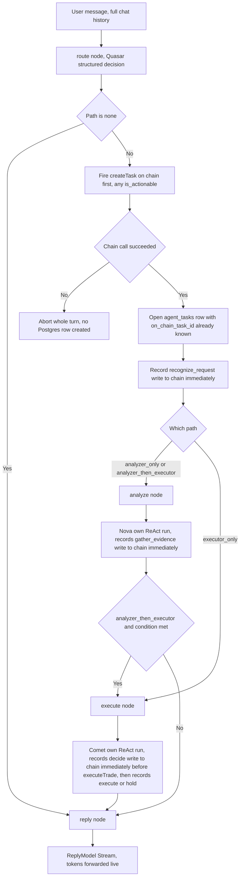

# Agent Orchestration Graph Rebuild

| | |
|---|---|
| **Version** | 2.17 |
| **Status** | Draft |
| **Date Created** | 2026-09-08 |
| **Last Updated** | 2026-09-09 |

> [!IMPORTANT]
> **Absolute rule, non-negotiable, applies to Task, Sub Task, and Trade alike (v2.15, implemented v2.16 for Task/Sub Task): on-chain first, always — no exceptions, no cost-based compromise.** No row is ever inserted into `agent_tasks`, `agent_sub_tasks`, or `agent_trades` unless the corresponding on-chain call (`createTask`, `recordSubTasks`, `executeTrade`) has already succeeded. If the on-chain call fails for any reason, the whole turn aborts immediately — no partial write, no fallback, no retry-and-continue. The user is never left without an explanation: Quasar sends an explicit chat message telling them the system hit a problem and to resend their message. Gas cost is explicitly **not** a valid reason to batch, defer, or otherwise weaken this — it is an accepted, known cost of submitting on-chain, not a trade-off to optimize against this rule.

| Version | Date | Change |
|---|---|---|
| 2.17 | 2026-09-09 | **Real bug found on first actual live use of v2.16, fixed.** User sent a real executor-only prompt ("minta Si Comet buat tradingin BRPTP") — Comet held (didn't call `submit_trade`), and the turn appeared completely frozen ("Done tapi gak ada apa apa") after `route_to_executor`, with no further progress ever shown. Root cause: `runExecute`'s synthetic hold record (fires when Comet's own chain tip didn't move, i.e. it decided not to act) never called `OnSubTaskStarted` before `Record` — every other `Record` call site in this file does. Harmless before v2.14 (`Record` was a plain Postgres insert, effectively instant); actively misleading now, since `Record` is chain-first and this specific call is a real on-chain transaction with real wait-for-mined latency, happening with zero live signal to the user. Fixed: `OnSubTaskStarted("executor", "decide", ...)` added immediately before this Record call, matching every other site. `go build`/`go vet`/`gofmt` clean, existing tests still pass. This does not shorten the on-chain wait itself (still real block-confirmation latency) — it only makes that wait visible instead of looking like a freeze. |
| 2.16 | 2026-09-08 | **v2.13/v2.14's chain-first Sub Task design implemented, not just documented.** `SubTaskRecorder.Record` now calls `Chain.RecordSubTasks` for its one row before ever touching Postgres, aborting with no row created if the chain call fails — same rule as `createTask`. `agenttaskmanager.Client.RecordSubTasks` now parses each row's `SubTaskRecorded` event from the mined receipt and returns the real on-chain ids (previously discarded, only a tx hash was kept); a new column, `agent_sub_tasks.on_chain_sub_task_id` (migration `021_agent_sub_task_on_chain_id.sql`, applied), persists it. `Orchestrator.Run`'s end-of-turn batch call is deleted entirely — nothing left to batch, every row already went on-chain the instant it was written. `RowsSince`/`RowCount` (now-dead) removed from `SubTaskRecorder`; a new `TaskID()` getter added (needed by `agent-trade-execution.md`'s trade recording). `SubTaskRetryService`/`recordSubTasksBatch` (`ArmTask`'s own catch-up path) both still compile against the new 3-return-value `RecordSubTasks` signature, but their own premise (rows can exist in Postgres unconfirmed) is now largely moot under this rule — left running as a narrow crash-recovery safety net, not removed outright this pass. `go build`/`go vet`/`gofmt` clean; existing tests (including the live orchestrator test) still pass — **the chain-first path itself has not been live-verified this pass** (the existing live test only exercises the `none` path, which never opens a Task; a real verification needs an analyzer/executor-opening prompt, held off to avoid burning DeepSeek credit per explicit instruction this session). Full detail: `docs/plans/agent-trade-execution.md` v1.5, where this same rule's Trade-side implementation (Gaps A–C) is also now done. |
| 2.15 | 2026-09-08 | **The v2.5/v2.1/v2.14 rules (zero-fallback, `createTask` on-chain-first, Sub Task chain-first) are unified into one explicit, absolute policy covering Task, Sub Task, and Trade together — stated as its own callout right under this document's header (above), not buried in a changelog entry, so it can never again be read as scoped to just one of the three.** Triggered by a direct, forceful restatement after v2.14's Sub Task fix: "Peraturan mutlak task sub task trade. Wajib onchain first. Tidak boleh melakukan insert data ke database... Gimana kalau onchain error? Error kan, exit process, kasih informasi ke quasar, bilang kalau proses gagal suruh chat lagi sistem bermasalah... gak peduli gas fee gas fee, GAK USAH URUSIN GAS FEE ITU RESIKO SUBMIT ON CHAIN." Nothing technical changes here beyond what v2.1/v2.14 and `agent-trade-execution.md` v1.2 already specify for Task and Sub Task — this entry exists to make the rule impossible to miss, and to extend it explicitly, in writing, to Trade (`executeTrade`) as well: a failed `executeTrade` call must never result in an `agent_trades` row, must abort the turn the same way a failed `createTask`/`recordSubTasks` does, and must reach the user as an explicit Quasar-voiced error, not a silent failure or a generic HTTP error. `agent-trade-execution.md` §2 (Definition of Done) cross-references this same rule rather than restating it with different wording. |
| 2.14 | 2026-09-08 | **Correction to v2.13: removing batching was not enough — the write ORDER itself was, and still is in the current codebase, backwards.** Read `sub_task_recorder_service.go` directly: `Record()` calls `r.subTasks.Create(ctx, ...)` — **Postgres — first**, unconditionally, every time; the on-chain write (batched today, meant to become per-row immediate per v2.13) only ever happens afterward. This is the exact opposite of `createTask`'s own rule (v2.1: "onchain = source of truth... Kalau SoC gak bisa, berarti batal") — Postgres can end up with a "decide" row, a "gather_evidence" row, any step, that the chain never actually attested to, if the chain call fails or the process dies in between. v2.13 only fixed *when* the chain call happens (immediately vs. batched at the end); it did not fix *which side goes first*, and that was the more serious of the two problems. **Corrected rule: every Sub Task write is chain-first, Postgres-second, same as `createTask`.** `SubTaskRecorder.Record` computes `DecisionHash` (needs only the in-memory `prevHash`, no DB/chain dependency), calls `Chain.RecordSubTasks` for this one row **first**, and only writes to Postgres — including the real on-chain-assigned id (new finding, below) — once that succeeds. If the chain call fails, `Record` returns an error and no Postgres row is created at all, matching `createTask`'s abort-the-whole-turn semantics exactly (a step that isn't on-chain never gets to exist in Postgres either, even transiently). **Second, separate gap found while verifying this**: `agenttaskmanager.Client.RecordSubTasks` currently only returns a tx hash — the contract's own `recordSubTasks` returns `uint256[] memory subTaskIds` and emits `SubTaskRecorded(taskId, subTaskId, agent, stepName, summary)` per row, but the Go client parses neither; the actual on-chain-assigned `subTaskId` is silently discarded today. `agent_sub_tasks` also has no column to hold it (only `recorded_on_chain bool` and `on_chain_tx_hash`) — a schema change (`on_chain_sub_task_id`) is needed so it can be persisted and later referenced by `executeTrade` (`agent-trade-execution.md`). `subtask_retry_service.go`'s role shrinks under this corrected design: since a row can no longer exist in Postgres without already being confirmed on-chain, its only remaining job is a narrow crash-recovery case (chain call succeeded, process died before the Postgres write completed) — not the routine "retry whatever wasn't confirmed yet" path it was built for. §4/§5 below updated to match (chain-first order, the new `on_chain_sub_task_id` column); §6's flow diagram already said "write to chain immediately" at each step from v2.13 and needed no further change — it was never wrong about *when*, only §4/§5's prose was wrong about *which side goes first*. |
| 2.13 | 2026-09-08 | **Decision, documentation only, not yet implemented: end-of-turn Sub Task batching (§4/§6, since v2.0) is dropped — every Sub Task is recorded on-chain immediately, one `Chain.RecordSubTasks` call per row, the instant it's written, never collected and sent as one batch at the end of the turn.** Two reasons, both found live discussing `docs/plans/agent-trade-execution.md`'s own Gap B: (1) `AgentTaskManager.executeTrade` requires its `subTaskId` argument to already exist on-chain at call time — a real trade cannot use a `subTaskId` that only gets minted once the whole turn's batch is written at the very end, well after the trade itself would already need to have executed. (2) More fundamental: **batching quietly defeats the hash chain's own reason for existing.** Each Sub Task's `DecisionHash` already commits to the previous step's hash the moment it's computed in memory — but that commitment only means anything as an on-chain guarantee if it's actually written on-chain before the next (possibly irreversible) action happens. Dumping every row at the very end, after even a real trade has already executed, downgrades "each step is committed on-chain before the next one proceeds" to "we uploaded a hash of what we claim happened, after the fact" — the opposite of "fully transparent." This applies to every Sub Task, not just trade-related ones — no special-cased "record this one early" path, one rule for all of them. `subtask_retry_service.go` (still kept, v2.7) now retries individual unconfirmed rows rather than unconfirmed batches, same mechanism, per-row instead of per-batch. Gas cost per Task rises (N on-chain calls instead of 1), accepted as the correct trade-off — Arbitrum Sepolia gas is free in practice for this project's scale, and `AGENT_WALLET` has already been funded and re-funded manually this session. §4/§6 below updated to match, they still described the old batched design. |
| 2.12 | 2026-09-08 | **Four live-UX fixes, implemented, not yet restarted/verified against a live backend.** Found via screenshots during real use: (1) **Markdown never rendered in Sub Task reasoning** (both the live `thinking` text and the persisted `reasoning` shown once a step is `done`) — both paths were a bare `<div>{raw}</div>`. `MessageMarkdown` moved out of `ChatThread.tsx` into `SubTaskReasoning.tsx` (avoids a circular import, since `ChatThread` already imports from `SubTaskReasoning`) and gained an optional `fontSize` prop (12.5 for these smaller contexts, defaults to 14.5 for the main chat bubbles); both `StructuredOrProse`'s prose paths and the live `thinking` render now use it. (2) **The `LiveSubTasks` banner said "Working" even once every listed Sub Task was `DONE`**, with nothing left to point at ("apa yang masih working? gak jelas"). Label is now derived: `Working` while any row is `in_progress`, `Composing reply` once none are but the reply hasn't finished, `Finalizing on-chain` once a new backend signal (below) fires. (3) **The stretch between the reply finishing and the turn's on-chain Sub Task batch write (`Chain.RecordSubTasks`) had no signal reaching the UI at all** — a fully-answered turn looked frozen with no explanation ("semua done, tapi gak ada proses apa apa, no info"). New `AgentEventCallbacks.OnFinalizing func()`, fired once in `Orchestrator.Run` right before the batch write; new WebSocket event `finalizing` (`chats.go`); frontend sets `isFinalizing`, feeding the banner label in (2). (4) **A chart's skeleton (v2.9) only ever appeared once the whole turn finished and the real chart landed in the persisted message** — nothing hinted a chart was coming while Nova was still fetching it. Now: the existing `tool_call` event is checked against `CHART_TOOLS = {get_portfolio_snapshot, get_stock_chart}` (mirrors `classifyReply`'s own check) — the instant one starts, `ChartSkeletonCard` (same skeleton treatment as v2.9's `LineChart` fix) renders immediately, in the same visual slot the real chart card will occupy once the message is persisted. Verification: `go build`/`go vet`/`gofmt` clean; `tsc --noEmit`/`eslint` clean; `TestOrchestratorLiveConversation` re-run, still PASS. **Not yet live-verified**: the backend process serving the frontend has not been restarted since these changes (Go doesn't hot-reload — same caveat as every prior backend change this session), so `finalizing`/chart-skeleton-on-tool-call have not actually been observed firing yet. |
| 2.11 | 2026-09-08 | **Correction: `AGENT_WALLET` is funded and real `createTask` on-chain calls are confirmed working — v2.10's "still blocked by 0 ETH" note was stale.** Verified empirically, not assumed: `cast balance` on `AGENT_WALLET` (`0x4580AFAc7A8BB73976d6261f29E62796886D4B11`) shows **0.00707 ETH**. Postgres `agent_tasks` has 10 rows with `on_chain_task_id` set (0 through 9, created 2026-09-08 05:11–11:12 UTC). Cross-checked directly against the chain via `cast call tasks(uint256)` on `AgentTaskManager` (`0x15080823e6d91DfE37593Fb4CE91E08bb294B01f`) for task IDs 0 and 9 — owner address and summary text match the Postgres rows exactly. **`createTask` on-chain-first ordering (§2, v2.1) is therefore confirmed working end-to-end against the real chain**, not just compile-verified — every one of these 10 Tasks has `is_actionable: false` (informational-only prompts so far; none have exercised the `executor_only`/`analyzer_then_executor` paths or `ExecuteTrade`, which remains unimplemented per §11). |
| 2.10 | 2026-09-08 | **Real live streaming of Nova's/Comet's own thinking, implemented — and a correction to a wrong assumption this whole rebuild was built on.** Live discussion surfaced that `adk.ChatModelAgent` (Nova, Comet) is **not** Generate()-only as v2.0 claimed — re-reading `eino@v0.9.15/adk/chatmodel.go` directly (not from memory) shows `buildMessageReActRunFunc` calls `runnable.Stream(ctx, in, ...)` instead of `.Invoke(...)` whenever `AgentInput.EnableStreaming` is `true`, and each resulting `AgentEvent.Output.MessageOutput` then carries `IsStreaming: true` plus a `MessageStream *schema.StreamReader[*schema.Message]` instead of a single `Message`. **v2.0's finding only ever held for the `reply` step specifically** (which isn't an `adk.Agent` at all) — it was wrongly generalized to "ChatModelAgent can never stream," which is false; Nova/Comet, both real `adk.ChatModelAgent`s, can stream their own reasoning the same way. `adk.ChatModelAgent` itself is untouched by this fix — confirmed as a hard requirement before implementing ("RISET DAN PIKIRKAN CARANYA TANPA MENGORBANKAN adk.ChatModelAgent"). Implementation: `runRoleAgent` (`orchestrator_service.go`) now sets `EnableStreaming: true` on the `AgentInput` it builds for both Nova and Comet; for `Role == schema.Assistant` streaming events specifically, a new `drainAssistantThinking` helper reads `MessageStream.Recv()` chunk by chunk and forwards each non-empty piece live via a new `OnThinking(agentName, delta string)` callback (added to `AgentEventCallbacks`), instead of the old behavior of fully buffering via `schema.ConcatMessageStream` before returning anything. `Role == schema.Tool` events (tool results) still get fully concatenated — a tool's result is a one-shot blob, not itself a point of live "thinking." New WebSocket event `thinking` (`{agent, delta}`) published from `chats.go`'s `runAgentOverSocket` alongside the existing `tool_call`/`sub_task`/`reply_delta` events. Frontend (`ChatThread.tsx`): the in-progress Sub Task row's old hardcoded placeholder sentences ("Nova sedang memproses langkah ini…", and v2.8's own "Nova memanggil web_search…" template) are both removed — replaced with the actual accumulated `thinking` text for that agent, rendered verbatim as it streams in, plus a small factual tool-name tag (not a sentence) when a tool call is in flight; genuinely blank (not a fake sentence) in the brief gap before the first `thinking` chunk arrives, per the explicit requirement ("TIDAK ADA HARDCODE"). New `ThinkingEvent`/`thinking` case added to `ChatStreamEvent` (`chatApi.ts`). **Verification, partial**: `go build`/`go vet`/`gofmt` clean on every touched file; `npx tsc --noEmit`/`eslint` clean on the frontend; `TestOrchestratorLiveConversation` re-run against the real DeepSeek API, still PASS. **Not yet live-verified**: this test only exercises the `none` path (no Task opened), so `OnThinking` has not actually been observed firing against the real API yet — doing so needs an `analyzer_only`/`executor_only` prompt, which opens a real on-chain Task first, which is still blocked by `AGENT_WALLET` having 0 ETH (§11, unresolved). Frontend rendering not verified by Claude at all, per standing instruction — the user verifies that side personally. |
| 2.9 | 2026-09-08 | **Stub cleanup and the `AgentEventCallbacks` refactor, both implemented and verified this pass.** (1) **Files deleted, confirmed zero real callers** (finishing the v2.7 sweep): `llm_service.go` (`RunAgentWithTrace`/`RunAgentWithHistory`/`InvokeAgentStructured`), `text_delta_middleware_service.go`, and the entire `supervisor/` package (`index.go`, `tools_service.go`, `instructions.go`). (2) **`contract_client_stub_service.go` (`StubAgentContractClient`) deleted** — it became genuinely dead once `agent_registry.go`'s zero-fallback fix (v2.7) removed its only caller; a failed `agenttaskmanager.NewClientFromEnv` now disables the whole agent service instead of falling back to it. (3) **`executor/stub_service.go` rewritten**: `StubTaskExecutor` renamed to `UnimplementedTaskExecutor`; `ExecuteTrade`/`TradePermissionRemaining` no longer fabricate a fake tx hash (`"0xstub-trade-%d"`) — both now return `ErrTradeExecutionNotImplemented`, per the v2.5 zero-fallback rule (fail honestly, never a fake success). This does not close the real gap tracked in §11/§3 (`executor.TaskExecutor`'s interface is still missing `subTaskId`/`token`/`minimumOutputAmount`/`summary`, so a real `ExecuteTrade` still cannot be written) — it only stops the existing stub from lying about success while that gap remains open. (4) **`AgentEventCallbacks` struct added** — bundles `OnSubTask`/`OnSubTaskStarted`/`OnTextDelta`/`OnToolCall` into one struct, embedded into `OrchestratorInput`/`orchestratorTurn` (`orchestrator_service.go`), threaded through `TaskService.HandleChatMessage`/`RetryLastMessage`, and consumed by `chats.go`'s `runAgentOverSocket`, which publishes each one to the same `agent-chat-stream:{chatId}` WebSocket topic (§2.8's `OnToolCall` publishes a new `tool_call` event there). Verification: `go build ./...`, `go vet ./...`, and `gofmt -l` all clean on every file touched (a broader `gofmt -l` sweep flagged 7 other files — `mint.go`, `ratelimit.go`, `mint_proposal.go`, `redeem_proposal.go`, `mint_proposal_repository.go`, `redeem_service.go`, `stats_service.go` — all pre-existing, unrelated, not touched this session); `TestOrchestratorLiveConversation` re-run twice against the real DeepSeek API post-refactor, still PASS (36–64 streamed chunks, correct WIB date/time, `TaskID == 0` for pure conversation). |
| 2.8 | 2026-09-08 | **Per-tool-call live visibility for Nova/Comet, designed here before code — a partial, uncommitted start on this already exists in `orchestrator_service.go` (an `OnToolCall` field added to `OrchestratorInput`/`orchestratorTurn`, `callbacks`/`components` imports added) and must not be extended further until this section is reviewed.** Problem, flagged live twice with a screenshot both times: while Nova (or Comet) is "IN PROGRESS" on a Sub Task, the UI shows only a static placeholder, "Nova sedang memproses langkah ini…" — no indication of what it is actually doing (which tool, on what input) at that moment. Root cause: `OnSubTaskStarted` fires once per Sub Task (the whole `gather_evidence`/`decide` step), never once per tool call inside it, and Nova's/Comet's own tool-use loop is otherwise opaque to the orchestrator (§3, finding #1) — nothing between "step started" and "step done" was ever surfaced. Mechanism confirmed by reading eino source directly, not assumed: `adk.WithCallbacks(handlers ...callbacks.Handler) AgentRunOption` (`adk/call_option.go`) attaches a callback handler to a single `adk.Agent.Run(...)` call; `compose/tool_node.go` confirmed to call `callbacks.ReuseHandlers(...)` around every individual tool invocation inside a ReAct loop, firing `OnStart`/`OnEnd` with a `callbacks.RunInfo{Name, Component}` where `Component == components.ComponentOfTool` and `Name` is the tool's own registered name (`web_search`, `get_stock_chart`, `submit_trade`, etc.) — exactly the per-tool-call boundary needed, reachable without touching `analyzer`/`executor` internals at all. Design: a new `OnToolCall(agentName, toolName, phase string)` callback (`phase` is `"start"`/`"end"`) threaded through `OrchestratorInput`/`orchestratorTurn`, passed into `runRoleAgent` (which builds the `callbacks.Handler` via `callbacks.NewHandlerBuilder()...Build()` and attaches it via `adk.WithCallbacks(handler)` when calling `a.Run(...)`); `runAnalyze`/`runExecute` pass a closure capturing the right `agentName` ("analyzer"/"executor"). Transport: a new `tool_call` event (`{agent, tool, phase}`) published to the same `agent-chat-stream:{chatId}` WebSocket topic as everything else (§2.6). Frontend: rather than adding a new row per tool call (which would misuse `addStartedPlaceholder`'s existing "mark the old one retried" logic, meant for genuine retries, not live sub-progress), the *existing* in-progress placeholder row for that `(agent, step_name)` gets its displayed text updated live — e.g. "Nova memanggil web_search…" replacing the current static string — requiring `AgentSubTask`'s in-progress placeholder shape to carry a mutable "current activity" string distinct from `reasoning` (which only exists once the step is actually done). **Fully implemented as of v2.9/v2.10** — `runRoleAgent`, `runAnalyze`/`runExecute`, the socket publish side, and the frontend (`toolActivityByAgent` in `ChatThread.tsx`) are all written; `tsc`/`eslint`/`go build`/`go vet`/`gofmt` all clean. |
| 2.7 | 2026-09-08 | **File restructuring sweep, analyzed live in chat across several passes.** Two lenses were applied, not one: first "is this referenced anywhere" (grep), then corrected per direct feedback to "does this deliver real business value, or does it fake/undermine it" — a file can pass the first test and fail the second. **Confirmed load-bearing, keep as-is:** `orchestrator_service.go` (the graph itself); `sub_task_recorder_service.go` + `hashchain_service.go` (the hash-chain writer and its hash functions — literally the "fully transparent" promise); `subtask_retry_service.go` (real goroutine, started in `bootstrap.go:115`, makes the on-chain mirror eventually-consistent); `state_service.go`, `graceful_tool_service.go`, `instructions.go` (`GlobalInstructions`) — all three actively called from inside `analyzer/`/`executor/`, confirmed by grep on each individual symbol, not the package as a whole; `task_service.go`/`agent_registry.go` — real, in-use wiring, already modified this session, not dead. **Confirmed dead, deletion executed in v2.9:** `llm_service.go` — `RunAgentWithTrace`'s only remaining caller was `task_service.go`'s `Evaluate`, which is already removed (§2.2); `RunAgentWithHistory`/`InvokeAgentStructured` have zero callers; `ToolCallTrace` (the type) is only referenced by `RunContext.NestedToolCalls`, itself dead. `text_delta_middleware_service.go` — `TextDeltaMiddleware`'s only caller was `supervisor/index.go`, and confirmed by grep that nothing anywhere imports the `supervisor` package at all anymore; its own doc comment already admitted it was inert even when wired (`adk.ChatModelAgent` never calls `Stream()`). `supervisor/index.go`, `supervisor/tools_service.go`, `supervisor/instructions.go` — the entire package, zero importers anywhere, confirmed by grep; also actively the wrong pattern now (routing hidden in an LLM tool call), not just unused. **`RunContext` (kept as a mechanism) carries 6 dead fields out of 10** — checked one by one against real usage inside `analyzer`/`executor` (grep per field, not per file): `OnChainTaskID`, `Wallet`, `Recorder`, `OnSubTaskStarted` are genuinely read there and stay. `TaskID`, `TriggerDescription`, `SourceMessageID`, `NestedToolCalls`, `OnSubTask`, `OnTextDelta` are set by `orchestrator_service.go` but never read back through `RunContext` by anything live — `orchestrator_service.go` already has its own copies of the same data on `orchestratorTurn` and uses those directly instead. The carrier mechanism itself (`WithRunContext`/`RunContextFrom`) stays — it is the only channel into Nova's/Comet's own tool closures, confirmed necessary in the same discussion, not the thing being trimmed. **Zero-fallback correction applied to `agent_registry.go`, this version**: the chain-client fallback to `StubAgentContractClient` is removed — a failed `agenttaskmanager.NewClientFromEnv` now disables the whole agent service (`return nil, nil`), matching how a missing DeepSeek key already behaves, per the v2.5 zero-fallback requirement (`contract_client_stub_service.go` itself was deleted once this made it dead, v2.9). `StubTaskExecutor` was explicitly **not** touched by this same logic at the time — it was not a fallback for a sometimes-working real feature, it was the only implementation `executor.TaskExecutor.ExecuteTrade` has ever had, because the interface itself is missing fields (`subTaskId`/`token`/`minimumOutputAmount`/`summary`) needed to call the real contract; v2.9 later renamed it to `UnimplementedTaskExecutor` and made it fail loudly instead, without closing that interface gap (still tracked in §11, unresolved). |
| 2.6 | 2026-09-08 | **Explicit go-ahead to implement, with three concrete requirements for this pass.** (1) Live-test the wiring against the real DeepSeek API (no mocks), not just `go build`/`go vet`. (2) Text streaming and Sub Task events must both be genuinely real-time. (3) **Chat message streaming moves off SSE onto the existing WebSocket infrastructure** (`backend/src/service/realtime`, `GET /api/v1/realtime/ws`, already used for `market-stocks`/`protocol-stats`/`agent-task-reasoning:*`/etc. per `realtime-websocket-updates.md`) — `POST /agent/chats/:id/messages`'s current SSE response (`chats.go`'s `streamAgentRun`) is replaced, not kept alongside. Frontend consumption (`chatApi.ts`'s SSE-based `streamChatMessage`, whatever component renders it) must be checked and updated too, not just the backend — explicitly instructed, not assumed sufficient to verify server-side alone. Sequencing for this pass: finish the already-agreed wiring (`Evaluate` removal, §2.2) and confirm it against the real API first, since that validates the orchestrator itself independent of which transport carries it; the SSE-to-WebSocket transport swap and frontend update are the following, separate step. |
| 2.5 | 2026-09-08 | **Zero-fallback policy confirmed as an absolute requirement, documentation only, no code proposed.** "Gua tidak menerima fallback, error ya error. Nol fallback. Kalau error Quasar wajib kasih tau... 0 Fallback, gua gak peduli, mau error null env kek apa kek." Two parts, both mandatory: (1) **No dependency in this pipeline may ever be silently substituted with a fake/stub implementation** — this directly supersedes `StubAgentContractClient` and `executor.StubTaskExecutor`'s current role as silent (or, for the latter, unconditional) substitutes; a missing or failing real dependency (on-chain client, trade executor, or anything else) must produce a visible failure, never a fake success dressed up as one. (2) **Every failure must reach the user as an explicit, Quasar-voiced message** — "an error happened, please resend your message, try again shortly" — not a generic system error string, not silence, not a bare HTTP error code with no chat-level acknowledgment. Explicitly flagged as a tension with the existing codebase-wide "disabled, not fatal" pattern (`agent_registry.go` disables the whole agent service silently at startup when a dependency like a DeepSeek key is missing, surfacing only as a generic `"agent task service not configured"` HTTP error, never a Quasar-voiced chat message) — reconciling that pattern with this requirement is not designed here, tracked in §11/§12. |
| 2.4 | 2026-09-08 | **Hard requirement confirmed for the long-investment/standing-instruction item (§12), documentation only, no code proposed.** "Long investment wajib dan wajib loop condition. Gak akan selesai kalau tidak memenuhi waktu dan menyelesaikan tugas trade nya." Captured precisely: this capability must be a genuine recurring loop (repeated checks over time, not a single evaluation), and the underlying Task is not considered complete until **both** of the following hold, not either alone — (a) its own time condition is satisfied (the duration/deadline the standing instruction specified), and (b) the trade task itself has actually been resolved (the position is closed out / the instructed outcome reached, not merely "time ran out with nothing done"). Time elapsing alone does not end the loop if the trade itself is still unresolved, and the trade resolving alone does not end the loop if the specified time hasn't elapsed either — both conditions are required together. §12's entry updated to state this as a firm constraint the eventual design must satisfy, still itself undesigned (scheduler cadence, where "time condition" and "trade resolved" are represented/stored, and what happens if they conflict, are not decided). |
| 2.3 | 2026-09-08 | **Two findings from live discussion, both documentation only — no code proposed or changed.** (1) **`execute --> reply` (§4) treats every one of Comet's decisions identically, but Comet's own decision is not uniform.** Comet receives Nova's analysis and decides not just whether to trade, but what kind of position: scalping (single, immediate, self-contained fill) versus swing or invest (a position that, once opened, implies an ongoing need to keep watching it). For a scalp decision, `execute --> reply` ending the turn is correct — nothing further is owed. For a swing/invest decision, the graph today has no step that turns "Comet decided to hold a position going forward" into an actually-armed standing watch — it flows into `reply` exactly the same as a scalp, and the turn simply ends. (2) **This reframes the already-tracked "long-investment / standing-instruction monitoring" open item (§12): its trigger is not only an explicit user instruction ("tolong jaga dan pantau"), it can also originate from Comet's own strategy choice made mid-trade, during an ordinary short-trade turn.** The two were previously treated as cleanly separate ("short trade stays as built, standing-instruction is separate future scope") — that separation still holds for *how the graph is structured*, but not for *what can trigger* the standing-instruction path. Both findings folded into §12's existing bullet on this topic, not treated as a new item, since they're the same undesigned capability, now better understood. Separately noted but not re-litigated (already covered in §11's first note): `agent_trades` has zero writers anywhere in the codebase today, so neither a scalp nor a swing/invest fill is currently recorded in the table the Trade Ledger UI actually reads from — that gap's fix is not proposed here either, per this version's documentation-only scope. |
| 2.2 | 2026-09-08 | **Wiring plan for `task_service.go`/`agent_registry.go` — the Orchestrator (§4) is connected to the real chat-message path.** Current state: both files have uncommitted edits, `Evaluate`'s removal is mid-edit, and the build has not been re-verified since these specific changes — flagged here for review before anything further is done. Exact scope: **`agent_registry.go`** — `newAgentTaskServices` stops calling `supervisor.New(...)` (drops the `supervisor` package import entirely) and the `analyzerModelDeep`/`analyzerAgentDeep` quick/deep split (already tracked as deferred, §12); builds a single `analyzerAgent`, then `agentsvc.NewOrchestrator(ctx, &agentsvc.Orchestrator{Tasks, SubTasks, Chain: contractClient, RouteModel: supervisorModel, ReplyModel: supervisorModel, Analyzer: analyzerAgent, Executor: executorAgent})` (the same `supervisorModel` instance reused for both Quasar calls — a stateless API client wrapper, safe to share); `TaskService` is constructed with a new `Orchestrator` field instead of `Supervisor`. **`task_service.go`** — `TaskService.Supervisor adk.Agent` field replaced by `Orchestrator *Orchestrator`; `runForMessage` rewritten to call `s.Orchestrator.Run(...)` instead of binding a `RunContext`/`SubTaskRecorder` by hand and calling `RunAgentWithHistory(..., s.Supervisor, ...)` — the Orchestrator now owns all of that internally; `buildWorkflowCard`, `unwrapReplyJSON`, `extractNewsEvidence`, `NewsEvidenceItem` deleted outright (dead once `Orchestrator.Run` returns plain text instead of a `[]ToolCallTrace` list to classify — chart/news classification was already tracked in §12 as "not reproduced yet," this edit is what actually removes the old code path, not a new decision); `recordSubTasksBatch` **kept** (still called by `ArmTask`, unrelated to this rebuild); `Evaluate` **proposed for removal** (not yet done) — it calls `RunAgentWithTrace(..., s.Supervisor, ...)`, which no longer compiles once `Supervisor` is gone, and its own approach (re-running the whole route decision from Quasar on every scheduler tick) was already agreed to be the wrong shape for the standing-instruction case (§11/§12 — that flow should start at Comet, calling Nova directly, not restart at Quasar) — `Evaluate` has zero callers anywhere in the codebase today (confirmed by grep before this note was written), so removing it deletes no working feature, only a stub that was already known to need a full redesign. **Not yet done, waiting on this plan's review**: re-running `go build ./...`/`go vet ./...`/`gofmt -l` against the current working tree to confirm the wiring compiles end to end (it has not been confirmed clean since these specific edits started); live-testing any of it. |
| 2.1 | 2026-09-08 | **Four clarifications, all from live discussion after v2.0, none changing the graph shape itself.** (1) **On-chain-first ordering, confirmed as a hard requirement, not a preference**: "Kalau onchain error, gak boleh bikin task sama sekali... onchain = source of truth. Kalau SoC gak bisa, berarti batal." `route` now calls `Chain.CreateTask` **before** `Tasks.Create`, and aborts the whole turn (returns an error, no Postgres row, no recorder) if the chain call fails — reversed from v2.0's original order, which created the Postgres row first and merely logged a chain failure. Implemented and re-verified (`go build`/`go vet`/`gofmt` clean); §4/§6/§8 below updated to match, they still described the old order. (2) **Confirmed: `orchestrator_service.go` must never define its own tools, only accept already-built objects.** Verified by grep — zero `utils.InferTool`/`tool.InvokableTool` calls, zero import of the `analyzer`/`executor` packages anywhere in the file; `Analyzer`/`Executor` are plain `adk.Agent`-typed struct fields, injected from outside. Whatever eventually replaces `agent_registry.go` still owns calling `analyzer.New(...)`/`executor.New(...)` (where Nova's/Comet's own tools actually get attached) and only passes the finished agents in. (3) **Long-investment/standing-instruction monitoring (Comet calling Nova directly, bypassing Quasar, on a scheduler tick) is confirmed as a separate, additional capability — it does not replace or alter the existing short-trade/live-turn graph.** "Kalau short trade ya tetep lewat analyzer dulu terus ke comet. Jangan diganti-ganti." The `route → analyze/execute → reply` shape in §4 stays exactly as built; a Comet-initiated background loop (mapping to the still-undesigned `TaskService.Evaluate` scheduler and `agent-role-architecture.md` §7a) is tracked as new, unscheduled work in §12, not a revision of this graph. (4) **Confirmed already correct, not a gap**: Comet's own reasoning for a hold (not just a boolean) already reaches Quasar today — `turn.ExecutorReply` (Comet's full reply text) is threaded into `reply`'s own system context, so a hold like "wait and see because of MSCI" is available for Quasar to relay in its own words, not silently reduced to a flag. |
| 2.0 | 2026-09-08 | **Quasar drops `adk.Agent` entirely — split into two plain LLM calls owned directly by the graph — and `orchestrator_service.go` is written, compiling clean against the real `analyzer`/`executor` packages.** Three things forced this revision, all found or decided live in this same pass: (1) Validated the whole "graph, not tool-call" direction against a real working reference, `CATAT/SERVER`'s LangGraph `createSupervisor` usage — confirmed each domain agent there is a real compiled graph passed in as a node, and a handoff tool triggers an actual `Command(goto:...)` node transition, not a bare function call; eino has no equivalent sugar (`createHandoffTool`/`createSupervisor`), so this rebuild reproduces the same *property* (real node, real transition) by hand with `compose.Graph`/`AddBranch`. (2) Explicit new requirement: the reply to the user must genuinely stream token-by-token. Re-confirmed against `eino@v0.9.15`/`v0.9.19`/`v0.10.0-alpha.31` that `adk.ChatModelAgent` hardcodes its ChatModel node as `compose.InvokableLambda` in all three — `Generate()` only, never `Stream()`, a structural library choice, not a bug to patch. The only way to get real streaming is for the reply step to call `model.BaseChatModel.Stream()` directly, which means that step cannot be an `adk.Agent` at all. Since Quasar's *routing* decision doesn't need tool-calling either (Task creation moved to deterministic Go, see next point), Quasar is dropped as an `adk.Agent` entirely — it becomes two plain calls (`route`, `reply`) owned by the new graph, while Nova and Comet stay full, untouched `adk.Agent`s (they still genuinely need their own tool-use ReAct loop). (3) **Real bug found and fixed as part of this rebuild's own Definition of Done, not filed separately**: `createTask` (on-chain) was wrongly gated behind the same human-confirmed "Arm" flow as `grantTradePermission`, and the frontend's `ArmPanel` only ever renders for `is_actionable: true` — meaning an informational Task (arguably the majority of chat traffic) could **never** reach on-chain, permanently, contradicting `agent-task-manager-rebuild.md` §2's own Definition of Done ("No Task exists purely off-chain") and confirmed live as unacceptable ("Gak boleh, ini agent mesti fully transparent... harus, gak boleh kosong itu di onchain"). Fixed at the design level: `createTask` now fires the instant a Task is recognized, in the `route` node itself, for every Task regardless of `is_actionable` — `grantTradePermission` stays the only step gated behind human confirmation, exactly matching `agent-task-manager-rebuild.md` §3 point 1's own original intent ("createTask... never signed by the owner's own wallet"). `backend/src/service/agent/orchestrator_service.go` implements all of this; `go build ./...`, `go vet ./...`, `gofmt -l` all clean against the real repo as of this version. Not yet wired to `task_service.go`/`agent_registry.go`/HTTP handlers — see §9. Two separate, real on-chain gaps were found while tracing this and are explicitly **not** fixed by this rebuild (§11): `executor.StubTaskExecutor` is hardcoded in `agent_registry.go` regardless of on-chain client config, so `ExecuteTrade` is 100% fake even when everything else is live; `AgentTradeRepository.Create` has zero callers anywhere, so `agent_trades` is never populated even after a real trade. Also added: real current-date/time context (WIB, fixed UTC+7 offset) injected into both `route` and `reply` — found live to be completely missing even in the old design (a plain "hari ini hari apa" had nothing in any prompt that could ever answer it correctly). |
| 1.0 | 2026-09-08 | Initial version — outer `compose.Graph` wrapping all three roles (Quasar included) as opaque `adk.Agent` Lambda nodes, hash-chain recording moved to `WithStatePreHandler`/`WithStatePostHandler`. Superseded by v2.0 once the streaming requirement made Quasar-as-`adk.Agent` untenable for the `reply` step specifically. |

---

## 0. Timeline Context

Hackathon submission deadline is **2026-09-30** (22 days from this document's creation). Noted here because it directly shapes what stays in scope for this rebuild versus what gets tracked as a follow-up (§11/§12) rather than blocking this pass.

## 1. Problem Statement

Quasar (Supervisor), Nova (Analyzer), and Comet (Executor) were each built as an independent `adk.Agent` (`supervisor.New`, `analyzer.New`, `executor.New`). The problem was never that they weren't three separate things — it's *how they talked to each other*: `supervisor/tools_service.go` wrapped Nova and Comet as ordinary LLM tools (`analyzer_agent`, `executor_agent`) that Quasar's own ChatModel decided to call, mid-conversation, the same way it would call any other tool. Whether Nova ran, whether Comet ran, and in what order, was a judgment call made *inside Quasar's own LLM generation*, expressed as a tool-call the Go code merely executed — not a structural property of any graph. There was no `compose.Graph` anywhere in `backend/src/service/agent/`; the only real graph in the whole pipeline was the generic two-node (`ChatModel` ↔ `ToolNode`) ReAct loop eino's own `adk` package builds internally for *each* of the three agents separately (confirmed by reading `eino@v0.9.15/adk/react.go` directly).

This was a known, discussed trade-off, not an oversight: `agent-role-architecture.md` §12 explicitly considered eino's own `adk.NewAgentTool` and rejected using it directly, because a bare `AgentTool` gives no hook to write `agent_sub_tasks` rows in true chronological order. The chosen fix at the time (a thin custom `tool.InvokableTool` wrapper) solved the ordering problem but kept the actual routing decision buried inside an LLM tool call instead of expressed as real graph structure.

**Validated against a real, working reference**, not just eino's own docs: `CATAT/SERVER`'s `services/assistant/modes/manage/supervisor/workflow.ts` uses LangGraph's `createSupervisor({ agents: [bookkeeperGraph, researcherGraph, ...] })` — each domain agent there is built via `createAgent(...).graph`, a real compiled `StateGraph`, passed directly to the supervisor as a **node**, not a tool. Routing is a `createHandoffTool` call that LangGraph's own runtime turns into a `Command(goto: "bookkeeper_agent")` — a literal graph-node jump, inspectable as part of the graph's own execution trace. `forceBookkeeperRoute.ts` (a `postModelHook`) shows the same property applied to forced/deterministic routing: a hook that runs right after the supervisor's own node, before the graph moves on. eino has no `createSupervisor`/`createHandoffTool` equivalent, so this rebuild reproduces the same *property* — each role is addressable as a real node, and a routing decision is a real graph transition (`AddBranch`) — by hand.

## 2. Definition of Done

- Nova and Comet remain their own full `adk.Agent` (`analyzer.New`/`executor.New`, unchanged) — this rebuild does not touch either package's own tool-use behavior.
- Quasar is **not** an `adk.Agent`. It is two plain LLM calls, `route` and `reply`, each a node directly owned by the new `compose.Graph` — required specifically because `reply` must call `model.BaseChatModel.Stream()` itself to genuinely stream to the user (§3).
- A real `compose.Graph` (`compose.NewGraph`/`AddLambdaNode`/`AddBranch`/`AddEdge`) is the only thing that decides which of Nova/Comet runs, in what order, for a given turn — expressed as a `GraphBranch`, never as a tool schema field an LLM fills in.
- **`createTask` (on-chain) fires immediately once a Task is recognized, for every Task, `is_actionable` true or false — never gated behind a human "Arm" action.** Only `grantTradePermission` (and the owner's own ERC20 `approve()`) stays human-confirmed, and only for actionable Tasks. No Task may ever exist purely off-chain, matching `agent-task-manager-rebuild.md` §2's own original Definition of Done, and matching the explicit, non-negotiable requirement confirmed live this pass.
- `agent_sub_tasks` keeps exactly the same shape and hash-chain guarantee. This rebuild changes *how* a row gets written, never what a row means or how it's independently verified.
- The four routing paths (`none`, `analyzer_only`, `executor_only`, `analyzer_then_executor`) are each a distinct, traceable path through the graph's own edges.
- The user's final reply streams token-by-token, genuinely, not a single blocking response revealed all at once.
- `orchestrator_service.go` never defines its own tools and never imports the `analyzer`/`executor` packages — it only ever accepts already-built objects (`adk.Agent` instances, `model.BaseChatModel` instances, repositories, the chain client) via dependency injection. Confirmed by grep, not just intent — see v2.1 changelog.
- If the on-chain `CreateTask` call fails, the whole turn aborts — no `agent_tasks` row, no Sub Task, nothing partially created. On-chain and Postgres must never disagree about whether a Task exists, even temporarily.

## 3. Research Findings (Confirmed Against Real Source, Not Assumed)

| Finding | Implication |
|---|---|
| `compose.AnyGraph` (what `AddGraphNode` accepts) is closed to `*compose.Graph`/`*compose.Chain`/`*compose.StateChain` — an `adk.Agent`'s own internal ReAct graph cannot be nested in. | Each role is wrapped as an opaque unit the outer graph calls into (a plain Go function for Nova/Comet's `adk.Agent.Run`, not even a `Lambda`-wrapped sub-graph) — the outer graph sees "Nova ran and returned X," never Nova's own internal tool-call steps. |
| `adk.ChatModelAgent` builds its ChatModel node as `compose.InvokableLambda` in **every** eino version checked (`v0.9.15`, `v0.9.19`, `v0.10.0-alpha.31`) — `Generate()` only, confirmed by reading `adk/chatmodel.go` directly in each. | An `adk.Agent`'s own reply can never stream, structurally, regardless of how it's invoked. The only path to real token streaming is a plain `model.BaseChatModel.Stream()` call outside `adk` entirely — this is why Quasar's `reply` step cannot be an `adk.Agent`. |
| `compose.Graph` defaults to DAG mode and rejects cycles (`DAGInvalidLoopErr`) unless built with Pregel semantics. | Every approved routing path (`agent-role-architecture.md` §9) is a single-pass decision tree per turn — Quasar never needs to be re-entered mid-turn after seeing Nova's/Comet's output. A plain DAG (route → branch → analyze/execute → reply → END) is sufficient; no cycles needed. |
| `analyzer/chart_service.go`'s `get_portfolio_snapshot` and `executor/tools_service.go`'s `submit_trade` both call `agent.RunContextFrom(ctx)` directly — `RunContext`/`SubTaskRecorder` (`run_context_service.go`/`sub_task_recorder_service.go`) are a load-bearing contract of the role packages themselves, not orchestration-only glue. | These two files are **kept**, not replaced — the new orchestrator builds a `*RunContext` and a `*SubTaskRecorder` exactly as before and injects them via `WithRunContext` before calling Nova/Comet, so neither package needs any change. Only `llm_service.go`'s own run/trace helpers (`RunAgentWithTrace`/`RunAgentWithHistory`) are set aside — replaced with a fresh local drain function (`runRoleAgent`) inside the new file, since nothing else in `analyzer`/`executor` depends on those specific functions. |
| Analyzer's own package never records `gather_evidence` itself — the old `supervisor/tools_service.go`'s `newAnalyzerTool` wrapper did, right after Nova's whole run returned. Executor's own package (`submit_trade`) *does* record its own `decide`/`execute` internally. | Asymmetric by design, not a bug: the new `analyze` node must record `gather_evidence` itself (mirroring the old wrapper exactly); the new `execute` node only needs to record the routing hop (`route_to_executor`) plus a synthetic `hold` row if Comet's own hash-chain tip didn't move — Comet already recorded `decide`/`execute` if it acted. |
| `TaskDetail.tsx:31` — `{task.is_actionable && !isArmed && <ArmPanel .../>}`. `ArmTask`'s only caller anywhere is the `POST /agent/tasks/:id/arm` handler. | Confirms the bug precisely: an informational Task has **no path to Arm at all**, ever, in the current frontend — not delayed, structurally absent. This is what made the createTask/Arm bundling in the old design a real, live-blocking bug rather than a theoretical one. |
| `agent_registry.go:50` — `taskExecutor := executor.StubTaskExecutor{}`, unconditional, never branches to the real on-chain client the way `contractClient` (same file, a few lines below) does. `AgentTradeRepository.Create` — zero callers anywhere in the repo (`grep -rn` confirmed). | Two separate, still-open gaps, **not fixed by this rebuild**: `ExecuteTrade` is 100% fake regardless of env config (not just "not yet configured"), and `agent_trades` is never populated even once a real trade lands, so `GET /agent/tasks/:id/trades` always returns empty. Tracked in §11 as follow-up work, since neither blocks the graph-structure rebuild itself. |

## 4. Approach / Solution Overview

`backend/src/service/agent/orchestrator_service.go` (`[NEW]`, written and compiling as of v2.0) owns a `compose.Graph[*orchestratorTurn, *orchestratorTurn]` with four nodes, all plain `Lambda` nodes (uniform I/O type, so every edge/branch trivially type-matches):

```
route (plain LLM call, Quasar — structured decision, non-streaming)
  --branch(Decision.Path)--> analyzer_only / analyzer_then_executor --> analyze
                          --> executor_only                          --> execute
                          --> none                                   --> reply

analyze (Lambda, wraps Nova's own unmodified adk.Agent.Run)
  --branch(gate)--> analyzer_then_executor AND condition_met --> execute
                 --> otherwise                                --> reply

execute (Lambda, wraps Comet's own unmodified adk.Agent.Run) --> reply

reply (plain LLM call, Quasar — model.BaseChatModel.Stream(), real token streaming)
  --> END
```

- **`route`**: one `RouteModel.Generate(...)` call (no tools, no streaming needed — this is an internal decision, never shown to the user token-by-token). Quasar's own LLM returns a small structured JSON decision (`path`, `is_actionable`, `summary`, `label`, `request_for_analyzer`, `request_for_executor`), parsed defensively (falls back to `path: "none"` on a malformed response rather than crashing the turn). If `path != "none"`: **fires `Chain.CreateTask` on-chain first** (§2's own Definition of Done) — if that fails, the whole turn aborts right there, no Postgres row is ever created (on-chain is the source of truth, per v2.1); only once it succeeds does it open the `agent_tasks` row (with `on_chain_task_id` already known), build the `SubTaskRecorder`/`RunContext` pair the rest of the turn shares, and record `recognize_request`.
- **`analyze`** / **`execute`**: each a thin Lambda around a fresh local `runRoleAgent(ctx, agent, prompt)` (a local, independent replacement for `llm_service.go`'s `RunAgentWithTrace` — drains the same `AsyncIterator[*AgentEvent]`, prefers the last non-empty Assistant message, same fix as the original). `RunContext` is injected via `WithRunContext` before each call, so Nova's/Comet's own internal tools keep working unmodified.
- **`reply`**: builds the message list (system persona + current WIB date/time + full chat history + whatever Nova/Comet produced this turn), calls `ReplyModel.Stream(...)` directly, and forwards every non-empty chunk through `OnTextDelta` as it arrives — genuine token-by-token streaming, achievable specifically because this step never goes through `adk.ChatModelAgent`.
- **Every Sub Task is chain-first, Postgres-second — same rule as `createTask` (v2.1), now applied consistently (v2.13/v2.14).** `SubTaskRecorder.Record` calls `Chain.RecordSubTasks` for this one row *before* writing anything to Postgres — never batched, never deferred to end of turn, and never Postgres-first. If the chain call fails, `Record` returns an error and no Postgres row is created for that step at all, matching `createTask`'s own abort semantics. The real on-chain-assigned id (from the contract's `SubTaskRecorded` event) is captured and persisted alongside the row (§5) — not just a tx hash. `Orchestrator.Run` no longer does any end-of-turn batch write; `subtask_retry_service.go`'s role shrinks to crash recovery only (chain succeeded, process died before the Postgres write landed), not routine retry of "not yet confirmed" rows — there shouldn't be any such rows anymore.

### Alternatives Considered

| Option | Description | Verdict |
|---|---|---|
| **A — Quasar split into `route`/`reply`, owned directly by the graph (chosen, v2.0)** | As above. | Chosen — the only option that satisfies real token streaming, given `adk.ChatModelAgent`'s confirmed Generate-only limitation. |
| A′ — Quasar stays a single `adk.Agent`, wrapped as one more Lambda node (v1.0's original design) | Real graph structure, but Quasar's reply is generated the same way as today (`Run()`/`Generate()`, all-at-once). | Superseded — does not satisfy the streaming requirement added after v1.0; kept only as a fallback if a future eino upgrade or a different mechanism removes the streaming blocker and simplicity is preferred over it. |
| B — Keep tool-call routing, add a graph only for bookkeeping | No change to the actual routing mechanism. | Rejected (unchanged from v1.0) — does not satisfy "communicate via node graph." |
| C — Full graph-of-graphs, expand Nova's/Comet's own internal tool calls as outer-graph nodes too | Rebuild Nova/Comet directly on `compose.Graph`. | Rejected for this pass (unchanged from v1.0) — much larger blast radius, not required by the stated goal, tracked as a possible future step. |
| D — eino's own `SetSubAgents`/"agent transfer" flow | eino's built-in hierarchical transfer mechanism. | Rejected (unchanged from v1.0) — eino's own doc comment recommends against it. |

## 5. Database / Data Design

**One new column, per v2.14**: `agent_sub_tasks.on_chain_sub_task_id` (nullable bigint) — the real, contract-assigned id from `recordSubTasks`'s own `SubTaskRecorded` event, captured by `Client.RecordSubTasks` (currently discarded) and written alongside the row itself. Needed so `executeTrade`'s own `subTaskId` argument (`agent-trade-execution.md`) has something real to reference, and so a row can never exist without the on-chain id that proves it was actually confirmed. Otherwise no schema change — `agent_tasks`/`agent_trades` keep their exact current shape. `RunContext`/`SubTaskRecorder` are reused as-is (§3) — not replaced by `compose.WithGenLocalState` as v1.0 proposed, since the role packages' own tools already depend on their exact current shape and there is no correctness or clarity benefit to swapping the mechanism this pass.

## 6. Flow Diagram

**Write path**



**Read path** — unchanged: `GET /agent/tasks/:id/reasoning` still recomputes the hash chain from `agent_sub_tasks` forward.

## 7. Event Summary Table

| Step | Written by | Notes |
|---|---|---|
| `recognize_request` | `route` node, directly | Fires for every Task, always paired with an immediate on-chain `createTask` attempt |
| `route_to_analyzer` | `analyze` node, before calling Nova | |
| `gather_evidence` | `analyze` node, after Nova returns | Nova's own package never writes this itself (§3) |
| `route_to_executor` | `execute` node, before calling Comet | |
| `decide` / `execute` | Comet's own `submit_trade` (unchanged) | `execute` node only adds a synthetic `hold` row if the hash-chain tip didn't move |

## 8. Scenario Walkthrough

- **Pure conversation ("Eh lu kabarnya gimana, hari ini hari apa?")**: `route` returns `path: "none"` — no Task, no on-chain call at all — straight to `reply`, which now has real WIB date/time injected and answers correctly instead of guessing.
- **Analyzer-only, hybrid ("ambil berita BRPT dari liputan6, dan chart Yahoo/IDX 1 minggu terakhir")**: `route` → `createTask` on-chain fires first (`is_actionable: false`) → succeeds → Task opened in Postgres with `on_chain_task_id` already set → `analyze` → Nova calls both `read_article` (liputan6, trusted domain) and `get_stock_chart` in the same run → `gather_evidence` recorded → `reply` streams the synthesized answer.
- **Executor-only ("sell 20% BRPTP now")**: `route` → `createTask` on-chain fires first (`is_actionable: true`, same as any Task) → succeeds → Task opened → straight to `execute`, skipping `analyze` → Comet decides and calls `submit_trade` (still fake end-to-end per §3/§11's `StubTaskExecutor` finding, unrelated to this rebuild) → `reply`.
- **On-chain `createTask` fails (RPC timeout, network blip)**: `route` returns an error immediately — no Postgres `agent_tasks` row, no Sub Task, no reply generated at all. The turn fails outright; the user has to resend. Deliberate, per v2.1: on-chain and Postgres must never be allowed to disagree about whether a Task exists.
- **Analyzer-then-executor, gate fails**: `route` → `analyze` → Nova's `condition_met: false` → gate branch routes straight to `reply`, `execute` never runs.

## 9. Impacted Files / Components

| Layer | File | Status |
|---|---|---|
| Chain-first recording | `backend/src/service/agent/sub_task_recorder_service.go` | `[DONE, per v2.16]` — chain-first `Record`, `ChainSubTaskRecorder` interface, `TaskID()` getter, `RowsSince`/`RowCount` removed |
| On-chain client | `backend/src/onchain/agenttaskmanager/client_service.go` | `[DONE, per v2.16]` — `RecordSubTasks` returns real ids; `ExecuteTrade` fully implemented (`agent-trade-execution.md`) |
| DB migration | `backend/migrations/021_agent_sub_task_on_chain_id.sql` | `[DONE, per v2.16]` — applied to the live database |
| Model | `backend/src/model/agent_sub_task.go` | `[DONE, per v2.16]` — `OnChainSubTaskID *int64` |
| Orchestrator | `backend/src/service/agent/orchestrator_service.go` | `[DONE, per v2.16]` — end-of-turn batch call removed; `OrchestratorChainClient` now embeds `ChainSubTaskRecorder` |
| Retry/catch-up | `backend/src/service/agent/subtask_retry_service.go`, `task_service.go`'s `recordSubTasksBatch`/`ArmTask` | `[MODIFY, per v2.16]` — compile against the new signature; **`ArmTask` itself found to still call `Chain.CreateTask` redundantly, not fixed this pass** — see `agent-trade-execution.md` v1.5 |
| Orchestration | `backend/src/service/agent/orchestrator_service.go` | `[DONE]` — graph + chart/news classification (§2.7's `classifyReply`) restored; `go build`/`go vet`/`gofmt` clean; live-tested against the real API for the `none` path only (§13) |
| Analyzer / Executor | `analyzer/*.go`, `executor/*.go` | **Unaffected** — confirmed, not just assumed (§3) |
| Run context | `run_context_service.go`, `sub_task_recorder_service.go`, `hashchain_service.go` | **Kept as-is** — `RunContext` still carries 6 dead fields (v2.7), not yet trimmed |
| Task orchestration | `backend/src/service/agent/task_service.go` | `[DONE]` — `runForMessage` calls `Orchestrator.Run`, persists `QuasarErrorMessage` on failure (v2.5/v2.6), `Evaluate` removed, chart/news `ContentType`/`UIProps` wired through; build clean |
| Registry | `backend/src/service/agent_registry.go` | `[DONE]` — builds `*Orchestrator`; zero-fallback applied (v2.7) — a failed on-chain client now disables the whole service instead of substituting `StubAgentContractClient`; build clean |
| HTTP | `backend/src/http/handlers/agent/chats.go` | `[DONE, per v2.6]` — SSE (`streamAgentRun`) replaced by a plain blocking POST + live progress published to the `agent-chat-stream:{chatId}` WebSocket topic (`runAgentOverSocket`); build clean |
| Realtime | `backend/src/service/realtime/authorization_service.go` | `[DONE, per v2.6]` — `agent-chat-stream:` topic prefix added, any authenticated wallet |
| Frontend | `frontend/http/agent/chatApi.ts` | `[DONE, per v2.6]` — `sendChatMessage`/`retryLastMessage` are plain POSTs now; manual SSE frame parsing removed; new `chatStreamTopic()` helper |
| Frontend | `frontend/components/agent/ChatThread.tsx` | `[DONE, per v2.6]` — subscribes to `chatStreamTopic(chatId)` via the existing `useRealtimeTopic` hook; also newly renders `reply_delta` as a live-growing text bubble (real text streaming was never actually rendered in the UI before this, only sub-task progress was) |
| Orchestration (old, dead) | `supervisor/index.go`, `supervisor/tools_service.go`, `supervisor/instructions.go`, `llm_service.go`, `text_delta_middleware_service.go` | `[DELETED, per v2.9]` |
| Chain client stub | `backend/src/service/agent/contract_client_stub_service.go` (`StubAgentContractClient`) | `[DELETED, per v2.9]` — dead once the v2.7 zero-fallback fix removed its only caller |
| Executor stub | `backend/src/service/agent/executor/stub_service.go` | `[MODIFY, per v2.9]` — `StubTaskExecutor` renamed to `UnimplementedTaskExecutor`; now returns `ErrTradeExecutionNotImplemented` instead of a fake tx hash (§11's real-`ExecuteTrade` gap is still open, this only stops the silent fake success) |
| Frontend | `frontend/components/agent/SubTaskReasoning.tsx` | `[MODIFY, per v2.12]` — now owns `MessageMarkdown` (moved from `ChatThread.tsx`), used by `StructuredOrProse`'s prose rendering |
| Frontend | `frontend/components/agent/PortfolioChart.tsx` | `[MODIFY, per v2.12]` — `LineChart` reserves a fixed 220px height and shows a skeleton until `lightweight-charts` mounts; unrelated pre-existing `setState`-in-effect (`data`/`payload.data` sync) fixed via React's "adjust state during render" pattern instead of an effect |
| Frontend verification | Browser check of the above | `[NOT DONE BY CLAUDE]` — user runs and verifies this side personally, per explicit instruction |

## 10. Data Migration / Backfill Strategy

None needed — no schema change (§5).

## 11. Decisions Requiring Review

> [!IMPORTANT]
> **Two real on-chain gaps were found while tracing this rebuild's own dependency chain — one partially addressed, one still NOT fixed here.** `executor.StubTaskExecutor` (renamed `UnimplementedTaskExecutor`, v2.9) is still hardcoded in `agent_registry.go`, unconditionally — `ExecuteTrade` still cannot do a real trade, because `executor.TaskExecutor`'s own interface is missing `subTaskId`/`token`/`minimumOutputAmount`/`summary`. What changed in v2.9 is only that it now fails loudly (`ErrTradeExecutionNotImplemented`) instead of fabricating a fake tx hash — the zero-fallback fix, not the interface fix. Separately, `AgentTradeRepository.Create` has zero callers anywhere in the codebase — `agent_trades` never gets a row even once a real trade executes. Both predate this rebuild and are unrelated to the graph-structure problem it solves; flagged here so they are not lost, and so a decision can be made about whether either needs to land before 2026-09-30 (§0).

> [!IMPORTANT]
> **Quasar now makes two LLM calls per turn (`route`, non-streaming; `reply`, streaming) instead of one ReAct loop.** Both can stay on the cheap/default model tier. `route`'s own JSON decision replaces what used to be three separate LLM-visible tools (`create_task`, `analyzer_agent`, `executor_agent`) with one structured output — net tool-schema surface goes down even though call count goes up by one.

> [!WARNING]
> **`agent-role-architecture.md` §12's original objection to a bare `adk.NewAgentTool` is resolved here for a different reason than a smarter tool wrapper** — not using a tool-call abstraction for inter-role communication at all. That document's §12 note should be updated to point at this plan once approved.

> [!WARNING]
> **If the on-chain `createTask` call itself fails, the whole turn aborts — no `agent_tasks` row, no recorder, nothing partially created.** Confirmed as a hard requirement, not a preference: on-chain is the source of truth, so a Task existing only in Postgres is never an acceptable degraded state, not even temporarily pending retry. `route` calls `Chain.CreateTask` **before** `Tasks.Create`, and returns an error immediately if it fails — the caller sees a failed turn, not a silently degraded one. This means a real RPC/network blip currently costs the user the whole turn (they have to resend), which is the deliberate trade-off against ever letting Postgres and the chain disagree about whether a Task exists.

## 12. Open Questions

- **Node naming** (`route`/`analyze`/`execute`/`reply`) was flagged live as feeling off ("Kok agak gimana gitu") but never resolved to a concrete alternative. Candidates raised in discussion: persona-prefixed names (`quasar_route`, `nova_analyze`, `comet_decide`, `quasar_reply`), and renaming `execute` to `decide` specifically since Comet's own outcome is sometimes a hold, not an action — "execute" overclaims what always happens. Not renamed yet; needs an explicit decision before this is considered final, not just left as the first names that compiled.
- **Long-investment / standing-instruction monitoring** (confirmed in v2.1 as separate, additional scope, not a revision of the existing graph's own shape): Comet-initiated, on a scheduler tick, calling Nova directly without going through Quasar, reporting up to Quasar only when there's something to say. Maps to `agent-role-architecture.md` §7a's already-flagged "Not Yet Designed" placeholder and the still-zero-caller `TaskService.Evaluate`. **Reframed in v2.3**: the trigger for entering this mode is not only an explicit user instruction ("tolong jaga dan pantau") — it can also be Comet's own decision, made mid-turn during an ordinary short-trade request, to open a swing or invest position rather than a scalp. A scalp decision needs nothing further after `execute --> reply`; a swing/invest decision implies a position that should be armed for ongoing watching, which nothing today actually does. **Hard requirement, confirmed in v2.4**: this must be a genuine recurring loop, and the Task it governs is not complete until **both** its time condition is satisfied **and** the trade task itself is resolved — neither alone ends it. Entirely undesigned as of v2.4, on both triggers and on the loop-completion rule itself — needs its own pass (likely its own plan document, given it's structurally different enough from a chat-turn graph to warrant one) before 2026-09-30 if it's meant to ship for the deadline.
- Whether `reply` should always receive the full chat history (current behavior, matches `agent-role-architecture.md` §7.AB's own earlier fix) or something narrower, purely for cost.
- Whether the "needs_input" chat-intake gate (outstanding-questions before a Task is even created) fits as a fifth branch off `route`, or needs its own pre-`route` step — not designed in this pass; every turn currently opens a fresh Task, no rebind-to-a-waiting-Task logic exists yet in the new orchestrator.
- Quick/deep Analyzer model tiering (`dynamic-model-tier-routing.md`) is not carried over yet — the new orchestrator uses one `Analyzer` instance. Worth restoring before this replaces the old path in production, given it was a real, measured cost concern.
- Chart/news `content_type` classification (`task_service.go`'s `buildWorkflowCard`) is not reproduced yet — needs to move somewhere once `Orchestrator.Run`'s caller is decided.
- Whether closing the two gaps in §11's first note (real `ExecuteTrade`, `agent_trades` writes) belongs inside this rebuild's own remaining work or as separate, parallel work before 2026-09-30.

## 13. Verification Plan

### Done as of v2.1

- `go build ./...`, `go vet ./...`, `gofmt -l backend/src/service/agent/orchestrator_service.go` all clean against the real repo — re-verified after the v2.1 on-chain-first reordering, not just at v2.0.
- Confirmed by grep: zero tool-construction code and zero `analyzer`/`executor` package imports in `orchestrator_service.go` (the "pure orchestrator, objects only" rule in §2).

### Automated Tests (Not Yet Written)

- Graph runs standalone (fake Analyzer/Executor/model stand-ins) for all four paths, including the gate-pass/gate-fail split.
- `recognize_request` + immediate `createTask` fires for both `is_actionable: true` and `false`, confirming the §2 fix actually holds for both, not just the actionable case that used to work via Arm.
- A hash-chain built through this path matches the same `DecisionHash`/`PrevDecisionHash` computation as before, for the same step sequence.

### Manual Verification (Not Yet Run — Requires Wiring First)

- A real multi-turn conversation against the real DeepSeek API exercising all four paths.
- Confirm an informational Task's `on_chain_task_id` is set immediately after its first turn, with no Arm action taken — the concrete, live test of §2's core fix.
- `curl -N` against the streamed reply, confirming real incremental `reply_delta` events, not one batch at the end.
- `GET /agent/tasks/:id/reasoning` on a Task produced by the new graph, independently recomputing the hash chain client-side.
- A regression pass over the specific live bugs already fixed pre-rebuild (double-send, blank final reply, chart classification, tool-error graceful degradation).
