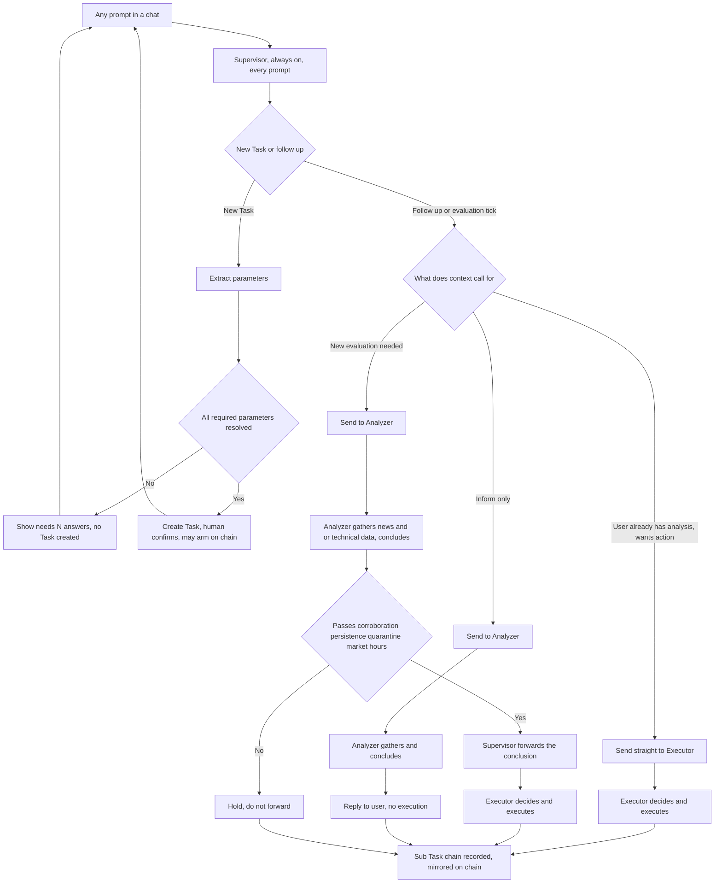

# Agent Architecture (Supervisor, Analyzer, Executor)

| | |
|---|---|
| **Version** | 1.4 |
| **Status** | Draft |
| **Date Created** | 2026-09-04 |
| **Last Updated** | 2026-09-07 |

| Version | Date | Change |
|---|---|---|
| 1.4 | 2026-09-07 | **New §6a, Reasoning-Depth Gate — a fifth code-enforced gate, same class as §6/§7's corroboration/persistence/quarantine/market-hours checks.** Originally drafted as a narrow "which model tier" cost concern in `dynamic-model-tier-routing.md`, but it is architecturally the same thing §3 already assigns Supervisor: "applies the code-enforced validity checks... to Analyzer's output before forwarding — mechanical gate-keeping, not content judgment it invents itself." §8's example Sub Task sequence updated to include it. Full mechanical detail (exact struct/threshold/code) stays in `dynamic-model-tier-routing.md` §5 and `agent-task-manager-code-implementation.md` §7.AG, not duplicated here |
| 1.3 | 2026-09-06 | **§3a's persona implemented and verified live; one gap closed.** First live test ("Halo, kamu siapa?") showed Quasar correctly using its own name but still leaking the word "supervisor" ("Saya Quasar, supervisor di sistem trading agent PulsarFi") — the instruction said not to describe itself as "the Supervisor node" but did not ban the bare word. Strengthened `supervisor/instructions.go`: explicitly forbids saying "supervisor", "node", "agent", or "system" about itself in any language, and gives a concrete fallback line ("I'm Quasar, PulsarFi's trading assistant"). Re-tested in both Indonesian and English: "Saya Quasar, asisten trading PulsarFi" / "I'm Quasar, PulsarFi's trading assistant", no technical labels, no em dash, language mirrored correctly both ways |
| 1.2 | 2026-09-06 | **New §3a, Persona and Voice.** PulsarFi is a global product (submitted to an international hackathon, not an Indonesia-only audience), so every role needed a user-facing identity instead of its technical node name, plus a consistent voice. Supervisor now goes by **Quasar** to the user (the name already used in the frontend's Quasar panel), Analyzer by **Nova**, Executor by **Comet** — an astronomy-themed trio matching Quasar's own naming, chosen so Executor's persona name never collides with the platform's own name (PulsarFi already uses "Pulsar", reusing it for one sub-agent would be confusing). A shared "Voice" rule (professional, warm, plain modern language, no em dash, mirrors whichever language the user wrote in) is added to `agent.GlobalInstructions` so it governs every user-facing string across all three roles, including `reasoning`/`summary` fields that surface directly in the Sub Task UI, not just Supervisor's own reply text. Implemented directly in `supervisor/instructions.go`, `analyzer/instructions.go`, `executor/instructions.go`, `agent/instructions.go` |
| 1.1 | 2026-09-05 | **§5's intake plan (the "N" in "PLAN N of N") made strict, not dynamic.** N is negotiated once, up front, between Supervisor and Analyzer/Executor (each reporting how many steps its part needs) — not guessed by Supervisor alone, and not revised mid-flight once set. Reasoning: letting N change during intake invites unbounded re-planning, which directly costs unbounded LLM tokens. The only path to a different N is an explicit user action (stop the in-progress intake, then choose revise-with-a-new-plan or resume-the-existing-plan) — Supervisor never changes N unilaterally |
| 1.0 | 2026-09-04 | Consolidated from four previously separate documents — `agent-role-architecture.md`, `ai-agent-role-dispatcher.md`, `fundmanager-sentiment-rebalancing.md`, `trader-technical-triggers.md` — into this single file. All four covered different facets of the same agent behavior (routing, chat intake, sentiment judgment, technical judgment) and required manual cross-referencing and synchronized edits every time any one of them changed. This is a clean rewrite of the current, correct design; it does not restate the incremental correction history of the documents it replaces. Contract/code-level detail (`AgentTaskManager.sol`) stays in its own separate document, `agent-task-manager-rebuild.md`, since that concerns implementation, not agent behavior |

---

## 1. Problem Statement

PulsarFi's tokenized stocks are tradeable 24/7 on-chain, while the real IDX-listed stock they mirror is only tradeable roughly 6.5 hours a day on weekdays. Worse, once the market reopens, a stock that gapped down on overnight news can hit **Auto Rejection Bawah (ARB)**, IDX's daily lower price-band limit, trapping a real holder at a bad price for days. PulsarFi's 24/7 tradability is the only way to exit before that trap closes — but that advantage is worthless if a human has to watch the news around the clock to use it. This is the entire reason an AI agent exists in this product.

An earlier architecture split this agent into fixed role identities (Watcher, Orchestrator, Fund Manager, Trader), each tied to a specific data source (news vs. technical) and a fixed graph position. That does not match how a real trading desk works (a real trader reads news and technical data together) and created rigid routing that could not express "skip straight to execution," "stop after analysis," or a hybrid condition mixing sentiment and technical signals. The fix is fewer roles, none tied to a data source or strategy label, with dynamic routing between them.

Separately, none of the prior documents gave the agent an explicit, checkable definition of what counts as a valid trigger — sentiment judgment was effectively vibes-based, with no corroboration requirement, no IDX-hours awareness, and no deterministic technical indicator math. And no document defined how a plain-language chat prompt becomes a structured, confirmed instruction in the first place, or specified that a human must be the one to confirm it.

## 2. Definition of Done

- The workflow has exactly three nodes: **Supervisor**, **Analyzer**, **Executor**. No other named agent role exists in the codebase.
- Neither Analyzer nor Executor is tied to a fixed data source or strategy label — either can use news, technical data, or both, per what the current Task actually needs.
- Supervisor's routing is genuinely dynamic per prompt: analyzer-only (inform, don't act), analyzer-then-executor (the default when new evaluation is needed), or executor-only (the user already has what they need).
- **Task never implies Trade.** A Task is the general, global request container — informational or actionable — and does not automatically or implicitly become a Trade. A purely informational Task (e.g. "kasih aku berita BRPT, aku gak mau trade") is a complete, valid Task on its own, not an incomplete version of a trading Task.
- **A Task manages no numbers at all — not a ticker, not a direction, not an amount, not a price.** Those belong to a Trade, which only ever exists at the moment of an actual execution. A Task's own representation (off-chain or on-chain) must be equally meaningful for a Task that never becomes a Trade as for one that does — it must never carry fields that sit empty/meaningless for the informational case.
- **Both a Task and its Sub Tasks are mandatorily traceable — a parallel requirement, not a side effect of Sub Tasks existing.** This agent executes autonomously with no per-fill human confirmation once a Task is armed; full traceability at both levels is the only substitute for a human in that execution loop, not a nice-to-have.
- **The human is the primary gate for creating a Task — Supervisor must ask, never assume, any parameter not yet explicit** (ticker, direction, amount, risk/reward, rebalance percentage, whatever the instruction leaves open). A Task is never created or armed while such questions remain. Only the ongoing execution of an already-confirmed, already-armed Task is autonomous — that autonomy never extends to Task creation itself.
- A sentiment-shaped trigger is judged against an explicit five-axis rubric with a corroboration requirement, not vibes.
- A technical trigger is judged against deterministic, Go-computed indicator math, never an LLM eyeballing raw numbers.
- A chat prompt becomes a structured Task through an explicit extraction + confirmation flow; the same structured `POST /agent/tasks` path keeps working unchanged for a caller that bypasses chat entirely.

## 3. Roles

1. **Supervisor.** Implemented as an `adk.NewChatModelAgent` with Analyzer and Executor wired in as callable tools (Eino's dynamic multi-agent routing pattern — see §9 for why a thin custom tool wrapper is used instead of a bare `adk.NewAgentTool`). It is the mandatory entry point for every prompt in a chat, from the first message onward. Per prompt, it decides: new Task or follow-up; does it need Analyzer's research; can it skip straight to Executor; should it stop after Analyzer. It also applies the code-enforced validity checks (corroboration, persistence, quarantine, market-hours) to Analyzer's output before forwarding — mechanical gate-keeping, not content judgment it invents itself.
2. **Analyzer.** Gathers whatever a Task's trigger actually requires — news (trusted domains, full articles via `read_article`), technical/price data (indicator-appropriate history, computed deterministically in code), or both for a hybrid condition. Produces a conclusion, not raw evidence: what it found, what it means, how confident.
3. **Executor.** Receives Analyzer's forwarded conclusion or a direct instruction from Supervisor, decides the concrete action (sell, buy, DCA-style accumulation, whatever the Task's confirmed instruction specifies), sizes it, and submits it on-chain itself — this is the moment, if any, a Task's confirmed instruction actually executes as a Trade.
4. No role is a data-source specialist, and no standalone role survives from the old model — "Watcher," "Orchestrator," "Fund Manager," and "Trader" are retired as names and as packages.

## 3a. Persona and Voice

PulsarFi is a global product, not an Indonesia-only one, so the three roles above carry technical names for the codebase and the hash chain, but a different, user-facing identity in conversation.

| Technical role | User-facing name | Why this name |
|---|---|---|
| Supervisor | **Quasar** | Already the name of the frontend's chat panel. The brightest, most central point, fits the mandatory entry point every prompt goes through. |
| Analyzer | **Nova** | A nova brightens only after gathering matter first, matching a role that reads evidence before concluding anything. |
| Executor | **Comet** | Fast, visible, moves with clear direction once it does, matching a role that only acts once a decision is actually made. |

Quasar introduces itself as Quasar, never as "the Supervisor node" or any other technical label, so the user experiences one consistent person, not a system component. Nova and Comet do not talk to the user directly, but their name is what Quasar uses if it ever refers to them, and what appears if their own `reasoning`/`summary` text is ever shown in the UI (e.g. the Sub Task detail view) — never their technical role name in either place.

**Voice**, shared across all three roles via `agent.GlobalInstructions`: professional but warm, plain modern language, confident without being stiff. No em dash character in any text a user will read, a comma or a period instead. Replies match whichever language the user wrote in (Indonesian, English, or otherwise) rather than defaulting to English, since the product itself is global but its actual users are not assumed to be English-only.

## 4. Data Model

Three terms, used consistently everywhere — no other name for any of them is valid.

- **Task** — the general, global, literal concept. Every request Supervisor recognizes is a Task, informational or actionable. A Task never automatically or implicitly becomes a Trade. A Task manages no numbers — no ticker, no direction, no amount, no price, no budget. It is nothing more than: a request exists, someone made it, and whether it is even capable of further escalation.
- **Trade** — a specific, narrower, downstream occurrence: an actual execution/fill against an already-armed Task. Ticker, direction, amount, and price all belong to a Trade, decided at the moment Executor actually acts — never pre-locked onto the Task itself. A Task can produce zero, one, or many Trades over its life, potentially against different tickers or directions each time, since neither is fixed at the Task level.
- **Sub Task** — a breakdown of a Task into the steps needed to reach its goal (Supervisor routing, Analyzer gathering, Executor deciding). A Task's goal is reached *through* its Sub Tasks, not by the Task existing as a single opaque unit. Separately, and just as mandatorily, every Sub Task is part of a **hash chain, scoped per Task**: each one's hash is computed from the previous one's hash, rooted in the Task's own genesis hash, so the chain is tamper-evident and independently re-computable — this is a parallel requirement to the breakdown-into-steps property, not a consequence of it (see §8).

```
agent_chats (1) --- (many) agent_chat_messages (1) --- (many) agent_tasks (1) --- (many) agent_sub_tasks
                                                              agent_tasks (1) --- (0 or 1) armed on-chain Task
                                                                                   (which may produce 0..N Trades)
```

**`agent_chats`** — a conversation thread with Supervisor. `id`, `owner_wallet`, `description` (derived from the first prompt, lets a user tell chats apart), `created_at`. Carries no role selection of any kind — Executor is a single, unified role, so there is nothing to pre-select per chat.

**`agent_chat_messages`** — the full transcript, every turn, whether or not it ever becomes a Task. `id`, `chat_id`, `sender` (`user`/`supervisor`), `content_type` (`text`/`workflow_card`/`chart`), `content` (plain fallback text, never the component data itself), `ui_component` (nullable, allowlist `plan_tracker`/`clarifying_questions`/`compiled_rule` when `content_type = workflow_card`; null for `chart`, whose shape is described by `ui_props.lens` instead, since the AI picks the visualization itself), `ui_props` (JSON, frozen at message creation — never re-rendered from live state later), `ui_ref_task_id` (nullable FK, convenience deep-link only, not the rendering source), `created_at`.

Two non-text families, grounded in the internal "Quasar" design reference:

```
plan_tracker:         { planProgress: "3 of 5", tasks: [{ n: "01", title: "Read your instruction",
                         subs: [{ t: "Entity to watch: MSCI Inc.", d: "index provider" },
                                { t: "2 terms too vague to execute", d: "flagged", warn: true }] }] }
                       // each tasks[i] mirrors one agent_sub_tasks row; each subs[] entry is that
                       // step's output detail, frozen as of this message
clarifying_questions:  { questions: [{ n: 1, q: "question text", why: "why asking",
                         opts: [{ t: "option label" }] }] }
                       // this is the human-confirmation-gate mechanism (§6) rendered as UI —
                       // never skippable, never silently defaulted
compiled_rule:         { bands: [{ key: "Execution", lines: [{ k: "Approval", v: "fully autonomous,
                         no signature per fill" }] },
                         { key: "Limits", lines: [{ k: "Max per event", v: "Rp 25.0M" },
                                                    { k: "Frequency", v: "1 execution per 24 hours" }] }] }
                       // "Approval: fully autonomous" is deliberate — see §7's no-per-fill-
                       // confirmation decision. The reference design shows a per-fill-signature
                       // version; this product does not use that.

chart: { chartQ: "the user's question verbatim",
  lens: "net_worth_vs_index" | "allocation" | "drift_from_target",
  lensNote: "short explanation of this lens",
  data: [...] }  // shape depends on lens. Rendered via echarts-for-react + echarts (confirmed
                 // against the design reference, which already loads echarts@5.5.0 for exactly
                 // these three chart instances). A deterministic, non-LLM mapping function turns
                 // ui_props.data into the ECharts option object per lens.
```

**`agent_tasks`** — one row per request Supervisor recognized as distinct, not every raw message.

*Always populated (every Task, informational or actionable):*

| Column | Type | Notes |
|---|---|---|
| `id` | PK | |
| `source_message_id` | FK -> `agent_chat_messages.id`, nullable | The message this Task was extracted from. Chat and owner are derived by joining through this. Null only for the structured `POST /agent/tasks` path, which bypasses chat entirely |
| `wallet_address` | string | Denormalized owner. Not solely derived via the chat join, because the structured path above leaves `source_message_id` null and has no chat to join through |
| `raw_prompt` | text | The user's own words, verbatim |
| `is_actionable` | bool | `false` = information-only, stops here. `true` = capable of escalating into a Trade |
| `status` | enum | `answered` (info-only) or `pending`/`executed`/`skipped`/`cancelled`/`failed` (actionable) |
| `created_at` | timestamp | |

*Populated only when `is_actionable = true`:*

| Column | Type | Notes |
|---|---|---|
| `trigger_description` | text | The compiled condition Supervisor extracted — sentiment, technical, or hybrid. This is the *why*, not the *what to trade* — it names no ticker or direction of its own |
| `expires_at` | timestamp | Mirrors the on-chain armed Task's expiry |
| `on_chain_task_id` | uint, nullable | The id of the armed on-chain Task (see `agent-task-manager-rebuild.md`), set once armed; null before arming |

No `ticker`, no `is_buy`/`side`, no budget amount, and no `tx_hash` column exists on `agent_tasks`, ever. A Task is not scoped to one stock or one direction, and it can produce more than one Trade over its life — a single column for any of these would either be meaningless for most Tasks or silently overwrite itself on a second execution. Each actual execution gets its own row in **`agent_trades`** instead: `id, task_id, sub_task_id, tx_hash, ticker, side, amount, executed_at` — `side` as `'buy'`/`'sell'`, matching the existing `stock_transactions.side` convention (not a boolean).

**`agent_sub_tasks`** — the breakdown of a Task into the steps needed to reach its goal, one row per step, matching the "PLAN" step-tracker UI pattern.

| Column | Type | Notes |
|---|---|---|
| `id` | PK | |
| `task_id` | FK -> `agent_tasks.id` | |
| `step_order` | int | Sequence within the parent Task |
| `agent` | enum | `supervisor`, `analyzer`, or `executor` |
| `step_name` | string | e.g. `route_to_analyzer`, `gather_evidence`, `dedup`, `corroboration_check`, `persistence_check`, `market_hours_check`, `route_to_executor`, `decide`, `execute` |
| `status` | enum | `pending`, `done`, `failed`, `needs_input` (backs the "needs N answers" UI pattern, §6) |
| `reasoning` | text | Why this agent made this decision — a first-class field, never buried inside `output` |
| `output` | text | Whatever this step produced (evidence list, score, gate result, decision parameters, tx hash), as raw JSON text — never a JSON/JSONB column type, because the exact bytes here must be byte-identical to what was hashed into `decision_hash`, and Postgres's JSONB reformats stored JSON (whitespace, key order) in a way that would silently break independent verification |
| `prev_decision_hash` | bytes32 | The previous row's `decision_hash`. For the first row, the Task's own genesis hash: `keccak256(task_id, trigger_description, owner)` |
| `decision_hash` | bytes32 | `keccak256(agent, step_name, reasoning, output, prev_decision_hash)`, computed deterministically in Go |
| `created_at` | timestamp | |

**On-chain arming.** Once a Task is actionable and confirmed, it gets an armed on-chain counterpart (full struct/event design, and the reasoning behind keeping it just as pure as the off-chain Task row, in `agent-task-manager-rebuild.md`). A Trade is not its own struct on-chain either — it's what an execution event captures, each time, including whichever ticker and direction that specific execution touched.

## 5. Chat Intake and Human Confirmation Gate

1. **Chat creation.** A user starts a chat and writes what they want in their own words — no picker, no upfront category choice.
2. **Supervisor as the permanent front door.** Every prompt in the chat goes to Supervisor first.
3. **Extraction.** Supervisor extracts whatever a Task needs from the user's free-form words — ticker, trigger condition (sentiment, technical, or hybrid), amount/cap, duration — producing the same shape the structured API already creates.
4. **The human is the gate, not a suggestion.** If any required parameter cannot be extracted with reasonable confidence, Supervisor surfaces it as an explicit outstanding question (the "needs N answers" pattern), each with a suggested default, and never creates or arms a Task while questions remain. It never invents a value silently. The outstanding-questions flow never requires the user to name a specific fundamental event to proceed — a general, un-named threshold is always an acceptable, complete answer.
5. **The intake plan (the "N" in "PLAN N of N") is fixed once, up front, and locked for the rest of intake — never revised mid-flight.** Supervisor determines N by negotiating with Analyzer and Executor (asking each how many steps its own part of this Task will need), not by guessing alone from the prompt text. Once set, N does not change while intake is in progress, for a concrete reason, not just tidiness: letting it change mid-flight invites unbounded re-planning, which directly translates into unbounded LLM token growth. The only way N changes is an explicit user action — the user stops the in-progress intake, and is then offered a choice: revise (start a new plan, a new N) or resume the existing plan unchanged. Supervisor never makes this call unilaterally.
6. **Multiple Tasks per chat.** A chat is not one-Task-and-done — one Chat can create more than one Task over its lifetime.

**UI/UX (Lo-Fi)**, reusing the internal "Quasar" design reference's component patterns:

```
Step 1, free-form chat box, used for every message in this chat, including the first:
+----------------------------------------------------+
|  [ Tell me what to watch and what to do..........] |
|  only this box is treated as a command       [Send] |
+----------------------------------------------------+

Step 2, outstanding-questions block, shown only when parameters are missing:
+----------------------------------------------------+
|  PLAN                                    2 of 4     |
|  01  Read your instruction         [DONE]           |
|  02  Bind the data sources         [DONE]           |
|  03  Pin down the trigger      [NEEDS YOU]          |
|      What counts as "sentimen buruk" here?          |
|      You gave no threshold, so I will not guess one |
|      silently. Either works:                        |
|      ( A named event, e.g. MSCI downgrade )         |
|      ( A general negative-sentiment threshold,      |
|        no specific event required )     [accept]    |
+----------------------------------------------------+

Step 3, confirmation of the compiled Task:
+----------------------------------------------------+
|  Locked. I will sell 20% of BRPTP into IDRX when     |
|  sentiment holds negative for 15 minutes across two  |
|  sources, or when MA50 crosses below MA200, whichever|
|  comes first. Capped at Rp 25.0M per event, once per |
|  24 hours.                                           |
|                                    [Create task]     |
+----------------------------------------------------+
```

A chat continues after Step 3 — the same chat box accepts further prompts, all routed through Supervisor. Exact visual placement and copy are a frontend decision outside this document's authority.

## 6. Sentiment-Judgment Capability

What Analyzer and Executor do when a Task's trigger is a sentiment/fundamental condition — not a separate role.

- **Five-axis analysis.** Event Taxonomy, Relevance (0-1), Surprise-vs-consensus, and Polarity+Magnitude (-1.0 to +1.0) are LLM-judged, framed by an **Institutional Foreign Fund Manager lens**: severity is scored by the probability of forced institutional selling, liquidity dry-up, and capital flight — not by whether the wording sounds emotionally positive or negative. The fifth axis, Novelty, is computed separately in deterministic Go code via embedding cosine similarity, never judged by an LLM (naive text/headline/URL-overlap matching is insufficient since independent outlets rewrite rather than republish).
- **Composite score.** Analyzer computes a numeric composite (-1.0 to +1.0) from all five axes and reports it with its reasoning.
- **Lagging-evidence rule.** A report that a drawdown has *already happened* is corroborating context, never the sole basis for a strong conclusion.
- **Supervisor's gates, code-enforced, not content judgment:**
  - *Persistence* — forwards only once the score has held at or below the Task's threshold for a configured duration (default 15 minutes).
  - *Corroboration* — at least 2 of the 4 trusted domains (`liputan6.com`, `kompas.com`, `market.bisnis.com`, `cnbcindonesia.com`), as primary sources, independently reporting the same fact, counted after Novelty dedup.
  - *Quarantine* — any source whose content contains instruction-shaped text aimed at an automated reader is dropped before scoring, logged verbatim.
  - *Cooldown* — a per-Task 24-hour (default) cooldown prevents a second execution within that window, checked before Supervisor even invokes Analyzer.
- **Social/community sentiment is permanently excluded** (Stockbit, X/Twitter, forums) — final, not an open item. Large/mid-cap Indonesian equity price action is driven by institutional and foreign fund flow, not retail sentiment; including it would reintroduce the exact failure mode this capability exists to prevent, and would open a real prompt-injection surface.
- **IDX market-hours awareness.** A deterministic `IsIDXOpen` helper (shared with §7's technical capability) tells Supervisor/Executor whether IDX is open; while closed, a corroborated conclusion is complete and sufficient on its own — Executor does not wait for the market to reopen to act.

## 7. Technical-Judgment Capability

What Analyzer and Executor do when a Task's trigger includes a technical/price condition — not a separate role, and can combine with §6 in the same evaluation for a hybrid Task.

- **Indicator-aware price tool.** Sized to whichever indicator the Task's trigger names (e.g. a 50/200-day moving-average crossover needs 200+ days of history to compute one valid point of the slower average) — never a fixed, generic lookback window.
- **Indicators computed deterministically in Go**, never estimated by an LLM reading a raw price list — the same class of arithmetic-error risk already rejected for Novelty detection in §6.
- **Market-hours-aware freshness.** Real IDX price/volume data is only fresh during the ~6.5 IDX trading hours per weekday. Supervisor distinguishes "genuinely not met" from "cannot be evaluated right now" — a stale last-close price outside those hours is never silently treated as "condition not met." A price/technical condition cannot fire while IDX is closed and holds for the next tick; a sentiment-only condition within the same hybrid Task is unaffected and can still evaluate 24/7.

## 6a. Reasoning-Depth Gate (Model Tier Escalation)

A fifth code-enforced gate, the same class as §6/§7's corroboration/persistence/quarantine/market-hours checks — Supervisor decides how much reasoning weight (which DeepSeek V4 tier, Flash or Pro) a given Analyzer call actually gets, from two independent, code-computed signals, never a free-text depth claim the model states directly. Motivation: the prior mechanism (a plain `"quick"`/`"deep"` string Supervisor's own tool call filled in) had zero Go-level validation behind it — unpredictable, and indefensible under the question "how was this cost/model-tier decision actually made."

- **Capability count.** Supervisor enumerates which analysis lenses (sentiment, technical, fundamental) a request genuinely needs; code escalates to Pro once 2 or more are named together — the genuine cross-analysis synthesis case a benchmark search confirmed Pro is meaningfully better at (ICBCBench, financial deep research), not a single-lens lookup Flash already matches Pro on (Terminal Bench 2.1).
- **Actionable + `condition_met` re-verification.** Whenever a Task is actionable (§4) and Analyzer's own quick-tier conclusion reports `condition_met: true`, the same evaluation is silently re-run on Pro before Supervisor ever forwards it onward — the hallucination-sensitive case (SimpleQA-Verified shows Pro roughly 2x ahead), since this conclusion could be about to authorize a real Trade. The model is never asked to request or acknowledge this escalation itself.

Full mechanical detail (exact struct fields, threshold function, code changes) lives in `dynamic-model-tier-routing.md` §5 and `agent-task-manager-code-implementation.md` §7.AG — this section only establishes the gate's existence and its place among Supervisor's other code-enforced checks, so §8's Sub Task sequence stays complete and this doesn't quietly drift into a cost-only side document the way the model-tier mechanism almost did.

**Not yet implemented** — same status as §6/§7's corroboration/persistence/quarantine/market-hours checks below: designed here, not yet coded.

## 7a. Executor Risk Profile and Standing-Instruction Review (Not Yet Designed)

Flagged live, not yet designed in this document: a standing instruction ("urus portofolio ku dalam 1 minggu ke depan") implies Executor should reason about the user's own risk profile and an explicit maximum drawdown before sizing a trade, and implies a recorded Nova (Analyzer) <-> Quasar (Supervisor) review/confirm exchange before anything reaches Executor — currently only implicit in Supervisor's own unrecorded internal reasoning, not a Sub Task row of its own. Also implies a real scheduler behind `TaskService.Evaluate` (currently zero callers anywhere), with its own cost controls (longer check intervals, quick-tier by default, hard caps, a visible check-count) given a standing instruction can run for a week or a month. Tracked here as a placeholder so it is not lost, not designed — see Open Questions (§13).

## 8. Sub Task Chain and Auditability

A Task's goal is reached through its Sub Tasks (§4) — Supervisor routing, Analyzer gathering, Executor deciding, each its own `agent_sub_tasks` row. Separately and just as mandatorily, that same sequence is also a **hash chain**: each row's hash computed from the previous row's hash, independent of role names. Both properties are required — the breakdown into steps because that's how a Task's goal is actually reached, and the hash chain because this agent executes autonomously and full traceability is the only substitute for a human confirming each step.

A typical sequence: `route_to_analyzer` (Supervisor) -> `gather_evidence` (Analyzer) -> `reverify_deep` (Analyzer, only when the Task is actionable and `condition_met: true`, §6a) -> `dedup` (Analyzer) -> `corroboration_check` (Supervisor) -> `persistence_check` (Supervisor) -> `market_hours_check` (Supervisor) -> `route_to_executor` (Supervisor) -> `decide` (Executor) -> `execute` (Executor). Executor's `decide`/`execute` rows are not free-standing — their `decision_hash` is only valid if computed over the exact, unaltered `prev_decision_hash` inherited from every row before it, all the way back to the Task's genesis hash. Changing any earlier row breaks every hash after it — a property anyone can independently re-verify by recomputing the chain, not something enforced by a foreign key or convention.

**Drift, stated plainly rather than left implicit.** `dedup`, `corroboration_check`, `persistence_check`, and `market_hours_check` are designed here but have no corresponding code anywhere in the actual agent implementation — confirmed by reading the real `supervisor`/`analyzer` packages, not assumed. `reverify_deep` (§6a) is a fifth item joining that same not-yet-coded list, tracked together here so it does not silently become a sixth untracked gap the next time this document is read against the real code.

**Scoped per Task, not per Chat.** A Chat can hold multiple Tasks; chaining across all of them into one chat-wide sequence was considered and rejected — a chat-wide chain would force verifying one Task's reasoning to also pull in unrelated Tasks that happened to share a chat, with no natural total order across Tasks ticking independently on their own schedule.

This is computed for **every** Task, whether information-only or actionable — an information-only request still gets a persisted, hash-chained record, it simply never reaches a `decide`/`execute` row. Every row is also mirrored on-chain (mechanism owned by `agent-task-manager-rebuild.md`) — all agentic activity is transparent on-chain, not only the activity that happens to move funds. `GET /agent/tasks/:id/reasoning` exposes the full chain for any Task; independent verification means recomputing it from the genesis hash forward and comparing each row's hash to its on-chain record. A sub-task with status `needs_input` is exactly an unresolved question in the "needs N answers" UI block (§5).

## 9. Flowchart



## 10. Impacted Files

| File | Change |
|---|---|
| `backend/src/model/agent_chat.go`, `agent_chat_message.go`, `agent_task.go`, `agent_sub_task.go` | Chat/Message/Task/SubTask models per §4 |
| `backend/src/repository/agent_chat_repository.go`, `agent_chat_message_repository.go`, `agent_task_repository.go`, `agent_sub_task_repository.go` | CRUD for each |
| `backend/src/service/agent/supervisor/` | Identity + instructions covering dynamic routing (§3) and the code-enforced validity gates (§6, §7), plus chat-intake extraction/confirmation (§5) |
| `backend/src/service/agent/analyzer/` | Identity + instructions covering both news analysis (§6) and technical analysis (§7), selected by what the Task needs |
| `backend/src/service/agent/executor/` | Decision-plus-execution role — sizing, direction, and the final on-chain call |
| `backend/src/service/agent/novelty.go` | Deterministic Novelty dedup via embedding cosine similarity |
| `backend/src/service/external/embedding_service.go` | Wraps a text-embedding API call (provider not yet decided, §12) |
| `backend/src/service/agent/cooldown.go` | Per-Task cooldown/rate-limit check (24h default) |
| `backend/src/service/agent/market_hours.go` | Shared `IsIDXOpen(t time.Time) bool`, consumed by both §6 and §7 |
| `backend/src/service/agent/price_tool.go`, `indicators.go` | Indicator-aware price tool + deterministic indicator math (§7) |
| `backend/src/http/handlers/agent/chats.go`, `tasks.go` | Create a chat, post a prompt, create/list/cancel a Task, serve the reasoning chain |
| `frontend/package.json`, `components/chart/ChartRenderer.tsx`, `lensToOption.ts` | `echarts` + `echarts-for-react`, the deterministic `lens -> option` mapping (§4) |

## 11. Verification Plan

### Automated Tests

- Supervisor, given sufficient-information-and-wants-execution, calls Executor directly without invoking Analyzer.
- Supervisor, given a pure information request, stops after Analyzer and never invokes Executor.
- Supervisor withholds forwarding when a validity gate fails.
- A fully-specified prompt creates the correct Task in one pass, including a hybrid sentiment+technical one; an underspecified prompt returns outstanding questions and creates no Task; a follow-up prompt in an existing chat routes correctly without redoing established work.
- Analyzer's axis classification: a fundamental-category headline vs. a pure-political headline with no named mechanism, confirming both can produce a qualifying conclusion.
- Novelty dedup: near-identical embeddings collapse into one fact; dissimilar embeddings count as two.
- Corroboration gate: a single-primary-source (post-dedup) conclusion is held; a 2-primary-source conclusion held for the persistence window is forwarded.
- Persistence gate: a score dipping below threshold once and recovering before the window elapses is not forwarded.
- Quarantine: instruction-shaped content excluded from scoring, logged.
- Cooldown: a second trigger within 24 hours resolves to hold without invoking Analyzer at all.
- `IsIDXOpen`: table-driven across session boundaries, Friday's shorter schedule, and a weekend date.
- Indicator computation: a fixture price series with a known crossover produces the correct values independent of any LLM call; the same condition does not fire, and is logged as "cannot evaluate, market closed," when `IsIDXOpen` is false.
- A hybrid Task correctly combines both capabilities' conclusions before Executor decides.
- Every path (analyzer-only, executor-only, analyzer-then-executor, held) produces a complete, hash-chained Sub Task record.

### Manual Verification

- A real multi-turn conversation against the real DeepSeek API exercising all three Supervisor paths, confirming routing matches intent each time.
- Start a chat, send a realistic Indonesian-language hybrid prompt, confirm the created Task matches intent, then send a second prompt in the same chat.
- Real-API live test with a multi-source-corroborated scenario, a single-source scenario, and a republished-duplicate scenario, confirming they diverge as expected.
- Manually inspect a produced Sub Task chain to confirm it records the score, axis values, corroborating/quarantined sources, and cooldown/market-hours state.

## 12. Decisions Requiring Review

> [!IMPORTANT]
> **Eino's `AgentTool` pattern is real and confirmed working** (`adk.NewAgentTool`), but Supervisor uses a thin custom `tool.InvokableTool` wrapper instead of calling it directly — a bare `AgentTool` gives no hook to write Sub Task rows in true chronological order relative to what each node actually did, which would break the "recursively commits to the whole trail" property in §8. Same externally-visible dynamic-routing behavior, just not the literal API call.

> [!IMPORTANT]
> **The embedding provider for Novelty detection is not yet decided.**

> [!IMPORTANT]
> **Whether the sentiment threshold, the persistence window, and the Novelty similarity threshold are fixed system defaults or per-Task configurable is not decided.**

> [!IMPORTANT]
> **No per-fill human confirmation anywhere in this document — final, not an open item.** Consistent with the product's core reason for existing (§1): reacting during the hours a human cannot, before ARB can trap a real-market position. This does not extend to Task creation, which is always human-confirmed (§5).

## 13. Open Questions

- Should the >=2-source corroboration requirement apply uniformly to every sentiment category, or only to the psychological/narrative-driven one?
- Should the indicator-aware price tool support an open set of indicators, or a fixed initial set with room to add more?
- Does a technical condition need a persistence/hold-duration concept similar to §6's 15-minute window, or fire on the first qualifying tick?
- What does Supervisor do with a prompt that is well-formed but not an instruction at all (a general question)? Assumed to answer conversationally without creating a Task.
- Whether "Trade shape" (fixed-amount-one-shot vs. AI-sized-ongoing) needs to be an explicit field the user sets, or should be inferred flexibly by Supervisor from the prompt.
- The still-unbuilt heartbeat/scheduler loop is assumed by every capability in this document (cooldown checks, technical re-evaluation, DCA) but is not itself designed here.
- Should chat creation and prompt submission require the same wallet-owner auth as `POST /agent/tasks`, or a different guard given less-structured input?
