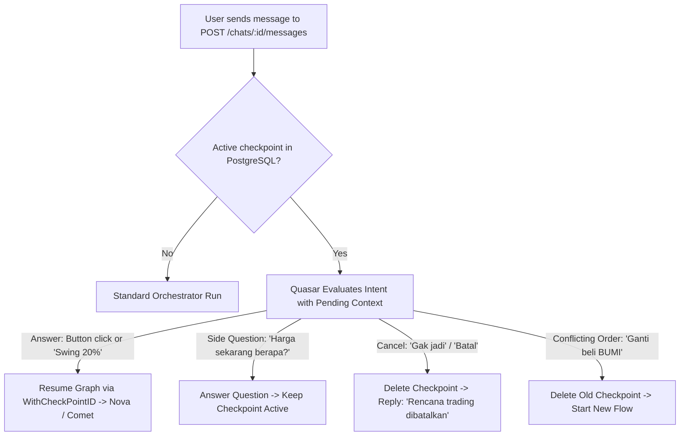

# Agent Chat Service Decomposition and Resilient Checkpointing

| | |
|---|---|
| **Version** | 1.4 |
| **Status** | Approved |
| **Date Created** | 2026-09-12 |
| **Last Updated** | 2026-09-12 |

| Version | Date | Change |
|---|---|---|
| 1.4 | 2026-09-12 | Added explicit Lo-Fi wireframes (§5) showing active confirmation card with `[Batalkan Rencana]`, side-question chat interleaving, and the cancelled card state. |
| 1.3 | 2026-09-12 | Refined checkpoint lifecycle: side-questions (e.g. asking for price/metrics before confirming) will **keep the checkpoint alive** without deleting it, allowing the user to resume later. Checkpoints are only deleted on explicit cancellation, conflicting replacement, or TTL expiry. |
| 1.2 | 2026-09-12 | Refined Human-in-the-Loop handling: unified single endpoint (`POST /chats/:id/messages`), support for both button clicks and natural chat responses, and first-class cancellation handling. |
| 1.1 | 2026-09-12 | Corrected file naming convention for `checkpoint_store_service.go` adhering to AGENT.md (§3a: every non-index/instructions file ends with `_service.go`). |
| 1.0 | 2026-09-12 | Initial draft for Phase 1 decomposition and checkpointing architecture. |

## 1. Problem Statement

1. **Overloaded `TaskService` (Violation of Single Responsibility Principle):**
   `TaskService` (`backend/src/service/agent/task_service.go`) currently serves as a monolithic "God Service". It mixes two fundamentally distinct domains:
   - **Conversation Domain:** Managing chat threads, saving user messages, fetching transcripts, and retrying failed chat messages.
   - **On-chain Execution Domain:** On-chain task creation, managing `TradePermission`, verifying hash-chain sub-tasks, and submitting on-chain Uniswap V4 trades.

2. **Frontend Navigation Disconnect ("Pindah Navigasi Keputus"):**
   Currently, a chat turn in progress relies on an open in-memory HTTP/WebSocket connection. When a user navigates away (e.g. from `/` to `/swap` or `/custodian`), the React component unmounts, the socket closes, and transient state is severed.
   Furthermore, when Quasar requests user confirmation (`needs_input`), the system does not actually pause or persist the graph state. Instead, it terminates the turn and relies on re-reading raw transcript messages on the next turn. If navigation occurs or the transcript parser misinterprets past context, the workflow breaks or restarts from scratch.

3. **Handling Side-Questions vs Cancellations ("Gak Jadi"):**
   Users interact via buttons or free-form chat. When a confirmation card is displayed:
   - Often users ask a **side question** (e.g. *"Harga live BRPTP berapa sekarang?"* or *"Dividen yield-nya berapa?"*) before committing. Deleting the checkpoint on a side question is an anti-pattern that burns user context.
   - Alternatively, users explicitly change their mind (*"Eh gak jadi"*, *"Batalin"*).
   - A resilient architecture must differentiate between answering side-questions while keeping the checkpoint alive versus clearing the checkpoint on explicit cancellation.

---

## 2. Definition of Done

1. **Dedicated `ChatService`:**
   - A new `ChatService` in `backend/src/service/agent/chat_service.go` handles chat threads and messages (`ListChats`, `GetChatMessages`, `HandleChatMessage`, `RetryLastMessage`).
   - `TaskService` is trimmed down to purely handle Task lifecycle (`ListTasks`, `ArmTask`, `DisarmTask`, `PauseTask`, `ResumeTask`, `GetTrades`, `GetReasoningChain`).
   - `chats.go` HTTP handler depends on `ChatService`, not `TaskService`.

2. **PostgreSQL Eino `CheckPointStore`:**
   - A database migration (`backend/migrations/023_create_agent_checkpoints.sql`) adds the `agent_checkpoints` table.
   - `checkpoint_store_service.go` implements Eino's `compose.CheckPointStore` interface (`Get` and `Set`) to store binary state snapshots in PostgreSQL keyed by `checkpoint_id` (`chat_id`).

3. **Durable Pause & Resume with Keep-Alive for Side-Questions:**
   - Single unified endpoint: `POST /api/v1/agent/chats/:id/messages`.
   - When Quasar triggers `pathNeedsInput` (confirmation card), the graph freezes immediately via `compose.StatefulInterrupt` and stores the snapshot in PostgreSQL.
   - **Interaction Handling:**
     - **Answer Intent (Button click or "Swing 20%"):** Graph resumes seamlessly from the checkpoint and proceeds to Analyzer/Executor.
     - **Side-Question Intent ("Bentar, harga sekarang berapa?"):** Answered normally; **checkpoint is retained** in PostgreSQL. User can still submit the card afterward.
     - **Cancel Intent ("Gak jadi", "Batal"):** Checkpoint is deleted from PostgreSQL, and Quasar confirms the cancellation cleanly.
     - **Conflicting Order ("Ganti, beli BUMI aja"):** Old checkpoint is cleared, and new order evaluation begins.

4. **100% Pure Go Verification Test Suite:**
   - Automated tests in `backend/test/service/agent/` verify:
     1. Chat message creation and separation of concerns.
     2. Saving and retrieving checkpoints to/from PostgreSQL.
     3. Triggering an interrupt (pause) and asserting that state is frozen in DB.
     4. Side-question execution without dropping the checkpoint.
     5. Resuming from the checkpoint with user input (button answer and text answer).
     6. Canceling from checkpoint when user sends "gak jadi".
     7. No frontend or browser is required to verify full functionality.

---

## 3. Feature Description

### 3.1 Architectural Decomposition

```
[ HTTP Layer: handlers/agent/chats.go ]
                  │
                  ▼
          [ ChatService ]  <-- Manages threads, messages, and invokes Orchestrator
                  │
                  ├── Persists User Message to `agent_chat_messages`
                  │
                  ▼
       [ Orchestrator Graph ]  <-- Compiled with Eino Postgres CheckPointStore
                  │
          ┌───────┴────────────────────────┐
          │ (Needs Confirmation)           │ (Actionable Execution)
          ▼                                ▼
[ compose.StatefulInterrupt ]      [ TaskService ]
  - Saves State to PostgreSQL        - Calls Arbitrum RPC (createTask)
  - Halts turn cleanly               - Manages TradePermission
  - Returns UI Confirmation card     - Executes Uniswap V4 trade
```

### 3.2 CheckPointStore Design

```sql
CREATE TABLE IF NOT EXISTS agent_checkpoints (
    checkpoint_id VARCHAR(255) PRIMARY KEY,
    data BYTEA NOT NULL,
    updated_at TIMESTAMP WITH TIME ZONE DEFAULT NOW()
);
CREATE INDEX IF NOT EXISTS idx_agent_checkpoints_updated_at ON agent_checkpoints(updated_at);
```

Implementation of `compose.CheckPointStore` in `checkpoint_store_service.go`:
```go
type PostgresCheckPointStore struct {
    db *gorm.DB
}

func (s *PostgresCheckPointStore) Get(ctx context.Context, checkPointID string) ([]byte, bool, error)
func (s *PostgresCheckPointStore) Set(ctx context.Context, checkPointID string, checkPoint []byte) error
func (s *PostgresCheckPointStore) Delete(ctx context.Context, checkPointID string) error
```

### 3.3 State Transition Logic with Checkpoints



---

## 4. Impacted Files

| File | Action | Purpose |
|---|---|---|
| `backend/migrations/023_create_agent_checkpoints.sql` | Create | Database schema for Eino checkpoints |
| `backend/src/service/agent/checkpoint_store_service.go` | Create | Implements `compose.CheckPointStore` via GORM/PostgreSQL |
| `backend/src/service/agent/chat_service.go` | Create | Dedicated service for chat thread and message management |
| `backend/src/service/agent/task_service.go` | Modify | Strip chat management responsibilities; retain Task & Trade execution |
| `backend/src/service/agent_registry.go` | Modify | Wire `CheckPointStore` into `NewOrchestrator` and instantiate `ChatService` |
| `backend/src/http/handlers/agent/chats.go` | Modify | Update handler to invoke `ChatService` instead of `TaskService` |
| `backend/src/service/agent/orchestrator_service.go` | Modify | Support `StatefulInterrupt` on `needs_input`, checkpoint awareness, and intent routing |
| `backend/test/service/agent/chat_checkpoint_test.go` | Create | End-to-end automated Go tests for Pause, Resume, Side-questions, and Cancellation |
| `frontend/components/agent/ClarifyingQuestions.tsx` | Modify | Add `[Batalkan Rencana]` button and handle cancelled visual state |

---

## 5. UI/UX Changes (Lo-Fi)

### 5.1 ClarifyingQuestions Card — Active State (Awaiting Confirmation)

```
+-----------------------------------------------------------------------------+
| [MERAH] CONFIRM BEFORE EXECUTION                             0 of 2 [Mono]  |
+-----------------------------------------------------------------------------+
| 01  What kind of trade is this: scalp, swing, or investment?    [NEEDS YOU] |
|     Decides how long the position is held...                                |
|                                                                             |
|     [ scalp ]   [ swing ]   [ investment ]                                  |
+-----------------------------------------------------------------------------+
| 02  How much of your portfolio to allocate?                     [NEEDS YOU] |
|     Limits execution budget...                                              |
|                                                                             |
|     [ 10% ]   [ 20% ]   [ 50% ]   [ Custom Input... ]                       |
+-----------------------------------------------------------------------------+
| State is saved. You can safely switch pages or ask side questions anytime.  |
|                                                                             |
| [  Batalkan Rencana  ]                  [  Lanjutkan & Kirim Jawaban  ]     |
| (Secondary Button - Outline)            (Primary Action - Merah Background) |
+-----------------------------------------------------------------------------+
```

### 5.2 Chat Thread Interleaving — Side-Question Flow

```
[User]: "Saya mau beli saham BRPTP"
  │
[Quasar]: (Menampilkan ClarifyingQuestions Card di atas)
  │
[User]: "Eh bentar, PE ratio BRPTP berapa sih sekarang?"   <-- (User ngetik di input biasa)
  │
[Quasar]: "PE ratio BRPTP saat ini berada di 8.4x (di bawah rata-rata sektor).
           Rencana trading BRPTP Anda di atas masih aktif ya. Kabari kalau mau dilanjut."
  │
  └── (ClarifyingQuestions Card tetap aktif di atas, tombol kirim tetap bisa diklik)
```

### 5.3 ClarifyingQuestions Card — Cancelled State

```
+-----------------------------------------------------------------------------+
| [MUTED/GREY] CONFIRMATION CANCELLED                                 BATAL   |
+-----------------------------------------------------------------------------+
| Rencana trading ini telah dibatalkan. Tidak ada order yang dieksekusi.      |
+-----------------------------------------------------------------------------+
```

---

## 6. Verification Plan

### Automated Go Tests:
1. **Checkpoint Store Unit Test (`checkpoint_store_test.go`):**
   - Save binary payload with key `test-chat-uuid`.
   - Retrieve payload and assert byte equality.
   - Delete payload and assert non-existence.
2. **Pause & Resume Integration Test (`chat_checkpoint_test.go`):**
   - Initialize test database with migration `023`.
   - Send input requiring clarification.
   - Assert `compose.ExtractInterruptInfo(err)` is true.
   - Assert row exists in `agent_checkpoints` for the chat UUID.
   - Send answers using `WithCheckPointID`.
   - Assert graph resumes and reaches completion without restarting from step 1.
3. **Side-Question Retention Test:**
   - Send input requiring clarification.
   - Send side question *"Berapa harga BRPTP?"*.
   - Assert answer is returned and row STILL exists in `agent_checkpoints`.
4. **Cancellation Test:**
   - Send input requiring clarification.
   - Send message *"Eh gak jadi deh"*.
   - Assert checkpoint row is deleted from `agent_checkpoints`.
   - Assert Quasar response confirms cancellation without creating on-chain task.
5. **`go test ./...` and `go vet ./...`:**
   - Verify entire codebase builds clean without regression.
