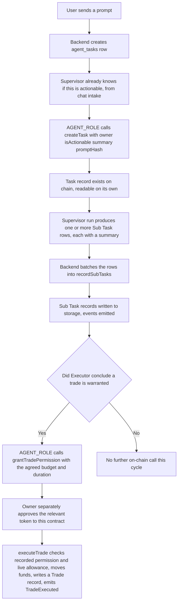
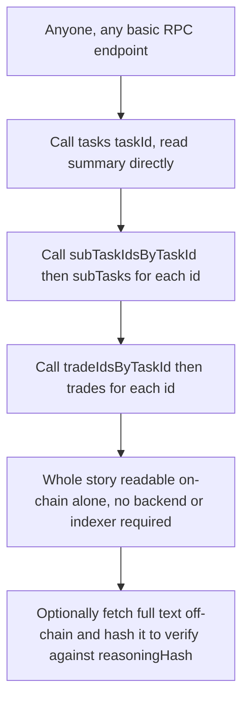

# AgentTaskManager Ground-Up Rebuild (Full On-Chain Transparency)

| | |
|---|---|
| **Version** | 1.4 |
| **Status** | Implemented |
| **Date Created** | 2026-09-04 |
| **Last Updated** | 2026-09-05 |

| Version | Date | Change |
|---|---|---|
| 1.4 | 2026-09-05 | **Status: Draft → Implemented.** `AgentTaskManager.sol` is written and fork-tested — 17/17 tests pass against the real, live Arbitrum Sepolia `PulsarProtocol` proxy (`smart-contract/src/AgentTaskManager.sol`, `smart-contract/test/AgentTaskManagerFork.t.sol`), including real BBCAP sell/buy fills. **§3a's code block below is a design-time sketch, not a byte-for-byte mirror of the real file** — going forward, the deployed `.sol` file is the authoritative source for exact code; this document is not kept in lockstep with every subsequent contract edit. One known gap between them: this sketch's `executeTrade` never gained the `subTaskId` parameter the real implementation needed (§8 already flagged this as unresolved), and the real file's `executeTrade` also has a Task-0/`subTaskId`-existence collision guard (`subTaskId >= subTaskCount`) this sketch doesn't show. See `agent-task-manager-code-implementation.md` §7.H for the full backend/frontend as-built reconciliation |
| 1.3 | 2026-09-05 | Resolved both items §9 left open in v1.2: (1) **Pause/resume designed and included** — per-Task (matches every other per-Task-scoped concept in this document), `agent_tasks.paused`/`paused_at`, evaluation heartbeat skips a paused Task's tick entirely (a deliberate full-skip simplification, not partial gathering), no on-chain call since no funds/state change. (2) **Shadow run/backtest explicitly deferred to PulsarFi's own v3 roadmap** — genuinely needs more study, and this cycle (v2) already carries the Uniswap V4 upgrade; not designed here, not silently dropped either |
| 1.2 | 2026-09-05 | Added §5 (real UI/UX, replacing "N/A") and §5a (Backend Implementation), per request to keep BE/FE planning in this document rather than split further. §5 is grounded directly in the internal "Quasar" design reference's latest revision (`Agent Chat.dc.html`), which — independently of this document — has already been updated to match this architecture: no profile picker (replaced by a plain "Three agents" roster card), no per-fill confirmation, Task/Trade IDs, and Activity-log `kind`/`actor` values that are literally `agent_sub_tasks.step_name`/`agent`. Flagged explicitly: `Agent Mandates.dc.html` is a separate, never-updated draft still showing the rejected profile picker and per-fill confirmation, and must not be used as a reference. Two genuinely new, undesigned features surfaced by the reference (pause/resume, shadow-run/backtest) are tracked in §9, not fabricated |
| 1.1 | 2026-09-05 | Two fixes: (1) **`logDecision` removed entirely** — it only ever emitted an event with no storage, and duplicated what a "decide" `SubTaskRecord` (already real storage via `recordSubTasks`) already anchors; a hold needs no separate function. (2) **`recordSubTasks` batching now has a real failure/retry story.** Previously implied every batch always lands; a reverted or dropped transaction now correctly leaves its rows `recorded_on_chain = false` in Postgres (never speculatively marked confirmed), with a retry job re-submitting the same rows in the same order. Also corrected the "One Supervisor run" wording — Sub Task rows are written by whichever agent (Supervisor, Analyzer, or Executor) actually did that step, not Supervisor alone |
| 1.0 | 2026-09-04 | Initial version. Ground-up rebuild of `AgentTaskManager.sol` — not an incremental patch of the prior sell-only contract, and not a restatement of that contract's naming. `Task` (identity, lifecycle status, readable summary, prompt fingerprint) is fully separate from `TradePermission` (budget ceiling, expiry — granted later, only once a trade is actually warranted, never at Task creation), which is itself separate from a Trade (an actual execution, a real queryable record, not an event and not a struct on Task). `createTask`, `grantTradePermission`, `recordSubTasks`, and `executeTrade` are all bookkeeping/execution calls made by `AGENT_ROLE`; the real custody boundary is the owner's own, independent ERC20 `approve()` to this contract's address, which nothing here can substitute for. Every Task, Sub Task, and Trade is real on-chain storage with a short human-readable `summary`, not just a hash — verified against live gas prices (§8) to confirm storage is cheap enough on every plausible deployment chain to make this the right default, not events-only |

---

## 1. Problem Statement

The existing `AgentTaskManager.sol` was written as a single-purpose trading-permission ledger: every field on its central struct, every function, exists to create, execute, or cancel a trade. It has no representation at all for a Task that never involves money — informational activity (Supervisor routing, Analyzer reading news, Executor concluding there's nothing to do) leaves no on-chain trace. That is inconsistent with what this product is: an **agentic** system that can research, analyze, and advise, not a bot that only trades. If "on-chain and verifiable" is the entire justification for running autonomously with no per-fill human confirmation, that justification cannot only cover the minority of activity that happens to move funds.

This is a genuine ground-up rebuild, not a migration: the contract has never been deployed anywhere (fork-tested only), so there is no live state or deployment risk constraining the redesign.

## 2. Definition of Done

- Every Task — informational or actionable — gets an on-chain owner record. No Task exists purely off-chain.
- **The on-chain `Task` itself manages no money-related numbers.** Budget and expiry live in a separate `TradePermission` record, keyed by the same Task id, only ever present for an actionable Task. `Task` does carry its own lifecycle `status` (`Active`/`Cancelled`), since that applies to every Task regardless of money.
- **Every Task, Sub Task, and Trade carries a short, human-readable `summary` on-chain, in addition to a hash of its full detail.** Reading pure chain data — no backend, no database — must tell a real story: what was asked, what each step concluded, what actually got traded and why. A hash alone is not this; it only lets someone verify a claim they already have from elsewhere.
- **Sub Task and Trade records are real on-chain storage, retrievable by anyone via a plain contract call, forever** — not events-only. Verified against real gas prices (§8): storage is cheap enough on every plausible deployment chain that there is no cost justification for trading away reliable, indexer-free retrievability.
- Long, unbounded text (full reasoning, full evidence, full output JSON) is never written on-chain — only its keccak256 hash. The full text stays in Postgres, independently re-hashable by anyone via `GET /agent/tasks/:id/reasoning`.
- Neither a Task's budget nor a Trade is forced into `Task` itself. Ticker and direction are parameters at the moment of execution, never pre-locked to a Task, since a Task is not a commitment to one stock or one side.
- Custody stays allowance-based: the contract never holds user funds beyond the lifetime of a single execution call. No pooled balance across users, ever. The allowance is always to this contract's own address, never to any wallet, agent-controlled or otherwise.
- Executor supports both directions — sell and buy — plus DCA (a scheduled, repeated buy against the same Task), as a base capability.
- No per-fill human confirmation once a Task is armed (`agent-role-architecture.md` §12). The human confirms at Task-creation time only (`agent-role-architecture.md` §5's "needs N answers" gate) — this document only concerns what happens on-chain after that confirmation.
- **`createTask` is a bookkeeping insertion, called by `AGENT_ROLE` for every Task, informational or actionable — never a custody-relevant call, and never signed by the owner's own wallet.** It moves no funds and reserves no budget. The owner's actual consent to move funds is the separate, independent ERC20 `approve()` they make directly to this contract's address — a step that, by the ERC20 standard itself, only the owner can ever perform, and which this contract cannot bypass, forge, or make happen on their behalf. That is the real custody boundary, not the identity of `createTask`'s caller.
- A `TradePermission` (budget ceiling, expiry) is granted separately from Task creation — only once Executor has actually concluded a trade is warranted, not reserved upfront on the chance one might be. Every `executeTrade` call checks both the recorded `TradePermission` and the live ERC20 allowance, and proceeds only if the amount fits under both.

## 3. Feature Description

**Core decision, revised: everything meaningful is real on-chain storage, queryable forever by a plain call, with events layered on top only for cheap real-time notification — not the other way around.** Gas cost was the reason an earlier draft avoided this; checked against real current gas prices (§8), that reasoning does not hold on any plausible deployment chain.

1. **`Task` is an identity, a lifecycle status, and a readable fingerprint of the request — never a money-related number.** `owner`, `isActionable`, `status` (`Active`/`Cancelled` — applies to every Task, informational or actionable), a short `summary` (AI-compiled one-liner of what's being asked), and `promptHash` (keccak256 of the full raw prompt). Created via a single `createTask`, always called by `AGENT_ROLE` — Task creation is bookkeeping, not a custody action, so there is no reason for it to require the owner's own signature the way an actual fund-movement step does.
2. **`TradePermission` (budget ceiling, expiry) is granted separately, later, via `grantTradePermission` — never at Task creation, and never inline on `Task`.** It only comes into existence once Executor has concluded a trade is actually warranted for this Task, matching how the real flow works: the agent does not know at Task-creation time whether or how much budget will ultimately be needed. Still `AGENT_ROLE`-called and still bookkeeping only — it records what was agreed off-chain (via the human-confirmation gate, `agent-role-architecture.md` §5), it does not itself move or reserve any funds.
3. **The owner's own ERC20 `approve()` to this contract's address is the actual custody boundary, entirely independent of anything above.** Nothing in this contract can substitute for it, forge it, or grant it on the owner's behalf — that's guaranteed by the ERC20 standard itself, not by this contract's own access control. `executeTrade` checks both the recorded `TradePermission` and the live `allowance(owner, address(this))`, and only proceeds if the requested amount fits under both.
4. **`recordSubTasks`, batched into storage.** One Task-processing cycle produces several Sub Task rows written by whichever agent actually did that step — Supervisor's own routing decisions, Analyzer's gathering/conclusion, Executor's decide — not Supervisor alone; the `agent` field on each `SubTaskRecord` says which. Batching all of them into one transaction still pays the chain's base fee once instead of once per row. Each record is written to a real mapping (queryable by anyone, forever) and also emits a `SubTaskRecorded` event (for anyone listening in real time). Each Sub Task carries its own short `summary` alongside its `reasoningHash`/`outputHash`.
5. **Batch failure is a real, handled case, not an assumed-away edge case.** If `recordSubTasks` reverts or the transaction never lands, the Sub Task rows it was carrying already exist in Postgres with `recorded_on_chain = false` — they are not lost, but they are not yet genuinely retrievable on-chain either, so the "retrievable by anyone, forever" claim only holds once confirmation actually happens. A retry job re-submits any batch still `recorded_on_chain = false` past a short grace period, using the same rows (same hashes, same order) so the chain stays correct — it never re-derives or reorders them.
6. **`executeTrade(taskId, token, ticker, side, amount, minimumOutputAmount, summary, reasoningHash)` — ticker, direction, and summary are call-time inputs, written into a real Trade record, never pre-locked on the Task.** Renamed from `executeTask`: every parameter here is trade-specific, and an informational Task never calls this at all — naming it after `Task` implied a generality it never had. Sell path: `amount` is the stock token quantity pulled from the owner; the realized IDRX proceeds increment the Task's `TradePermission.usedBudget`. Buy path: `amount` is the IDRX quantity pulled from the owner; `usedBudget` increments by `amount` directly. DCA is not a separate on-chain code path — it is a scheduled, repeated call to `executeTrade` against the same armed Task, driven by the off-chain scheduler (open item, `agent-role-architecture.md` §13).
7. **A Trade is now a real, queryable record — ticker, direction, amount, proceeds, and a readable `summary` of why it happened — not just an event.** Zero, one, or many can exist per Task, each possibly against a different ticker or direction, since neither is ever locked to the Task itself.

## 3a. Data Model

**On-chain**

```solidity
enum TaskAgent { Supervisor, Analyzer, Executor }
enum SubTaskStatus { Done, Failed, NeedsInput }

// A trade's direction is a classification, not a configuration toggle —
// matches the off-chain stock_transactions.side convention (a categorical
// value, not a boolean), and the standard practice of real trading
// systems (e.g. FIX protocol's numeric Side field) of coding direction as
// an enumerable category rather than a binary flag.
enum TradeSide { Buy, Sell }

// A Task's own lifecycle — applies to every Task, informational or
// actionable. Not a money concept, so it lives on Task itself, not on
// TradePermission. Only two states are ever actually stored: nothing
// on-chain automatically transitions a Task when time passes or a budget
// runs out, so "expired" and "budget exhausted" are derived at read time
// in isActive(), never written as a status value.
enum TaskStatus { Active, Cancelled }

// Every Task, informational or actionable: an identity, a lifecycle
// status, and a readable fingerprint of the request. Never a money-related
// number.
struct Task {
    address owner;
    bool isActionable;
    TaskStatus status;
    string summary;       // short, AI-compiled, human-readable — e.g.
                           // "Sell 20% BRPT if MSCI sentiment turns negative"
    bytes32 promptHash;    // keccak256 of the full raw prompt
}

mapping(uint256 taskId => Task) public tasks;
uint256 public taskCount;

// Budget and expiry: always created together, in the same transaction that
// arms a Task, so they are one struct — not four separate mappings, which
// would prevent the compiler from packing these fields into shared storage
// slots for no benefit. Still a *separate* mapping from Task, because the
// relationship is optional: an informational Task never has one of these.
struct TradePermission {
    uint256 totalBudget;  // IDRX-equivalent value ceiling
    uint256 usedBudget;    // IDRX-equivalent value consumed so far
    uint64  expiresAt;
}

mapping(uint256 taskId => TradePermission) public tradePermissions;

// Always AGENT_ROLE — Task creation is bookkeeping, never a custody
// action, so there is no reason to require the owner's own signature here.
// isActionable is already known by this point: Supervisor's chat-intake
// flow (agent-role-architecture.md §5) has already established whether
// this request has a trigger condition at all before this is ever called.
function createTask(address owner, bool isActionable, string calldata summary, bytes32 promptHash)
    external onlyRole(AGENT_ROLE) returns (uint256 taskId);

// Called only once Executor concludes a trade is actually warranted for
// this Task — not reserved speculatively at creation time. Still
// bookkeeping only: this records what was agreed off-chain, it does not
// move or reserve any funds itself. The real custody boundary is the
// owner's own separate ERC20 approve() to this contract's address,
// checked live in executeTrade below, independent of this record.
function grantTradePermission(uint256 taskId, uint256 totalBudget, uint256 duration)
    external onlyRole(AGENT_ROLE);

function isActive(uint256 taskId) external view returns (bool) {
    Task storage task = tasks[taskId];
    if (task.status != TaskStatus.Active) return false;
    if (!task.isActionable) return true;
    TradePermission storage tradePermission = tradePermissions[taskId];
    return block.timestamp <= tradePermission.expiresAt
        && tradePermission.usedBudget < tradePermission.totalBudget;
}

// Real storage, not events-only — retrievable by anyone, forever, with a
// plain call, no indexer required. subTaskIdsByTaskId gives on-chain
// discovery of which Sub Tasks belong to a Task, without needing to scan
// event logs.
struct SubTaskRecord {
    uint256 taskId;
    TaskAgent agent;
    string stepName;         // e.g. "route_to_analyzer", "gather_evidence", "decide"
    SubTaskStatus status;
    string routingTarget;    // e.g. "executor", "" when terminal
    string summary;          // short, human-readable conclusion of this step — e.g.
                              // "Confirmed: 2 primary sources report negative MSCI news"
    bytes32 reasoningHash;   // keccak256 of the full off-chain reasoning text
    bytes32 outputHash;      // keccak256 of the full off-chain output JSON
    bytes32 decisionHash;
    bytes32 previousDecisionHash;
}

mapping(uint256 subTaskId => SubTaskRecord) public subTasks;
mapping(uint256 taskId => uint256[] subTaskIds) public subTaskIdsByTaskId;
uint256 public subTaskCount;

function recordSubTasks(uint256 taskId, SubTaskRecord[] calldata subTaskRecords)
    external onlyRole(AGENT_ROLE) returns (uint256[] memory subTaskIds);

// Also real storage — a Trade is what actually happened, the single most
// consequential record in the whole system, and the one most in need of
// being trivially findable without special tooling.
struct TradeRecord {
    uint256 taskId;
    uint256 subTaskId;
    string ticker;
    TradeSide side;
    uint256 amount;
    uint256 receivedAmount;
    string summary;            // short, human-readable reason — e.g.
                                // "Confirmed negative sentiment, sized per corroboration strength"
    bytes32 reasoningHash;
    uint256 executedAt;
}

mapping(uint256 tradeId => TradeRecord) public trades;
mapping(uint256 taskId => uint256[] tradeIds) public tradeIdsByTaskId;
uint256 public tradeCount;

// Renamed from executeTask: every parameter here is trade-specific, and an
// informational Task never reaches this function at all. token is the
// ERC20 being pulled from the owner (the stock token for a sell, IDRX for
// a buy) — its live allowance to this contract's own address is the real
// custody boundary; the recorded TradePermission is the bookkeeping
// ceiling. Both must agree before any transfer happens.
function executeTrade(
    uint256 taskId,
    address token,
    string calldata ticker,
    TradeSide side,
    uint256 amount,
    uint256 minimumOutputAmount,
    string calldata summary,
    bytes32 reasoningHash
) external onlyRole(AGENT_ROLE) returns (uint256 tradeId) {
    Task storage task = tasks[taskId];
    TradePermission storage tradePermission = tradePermissions[taskId];

    uint256 remainingRecordedBudget = tradePermission.totalBudget - tradePermission.usedBudget;
    uint256 currentLiveAllowance = IERC20(token).allowance(task.owner, address(this));

    require(amount <= remainingRecordedBudget, "exceeds recorded TradePermission");
    require(amount <= currentLiveAllowance, "exceeds live allowance to this contract");

    // ... pull amount of token from task.owner, swap, forward proceeds,
    // update tradePermission.usedBudget, write the TradeRecord, emit
    // TradeExecuted. Full mechanics unchanged from the prior sell-only
    // version, extended to both directions.
}

// Cancel is risk-reducing — it only ever removes a future possibility,
// never moves funds — so, unlike executeTrade, it's safe to let either the
// owner or AGENT_ROLE call it. Sets Task.status to Cancelled; isActive()
// then returns false for this Task regardless of any TradePermission
// headroom remaining.
function cancelTask(uint256 taskId) external;
```

A hold (Analyzer's conclusion didn't confirm the trigger, or Executor decided nothing was warranted) needs no separate function at all — the "decide" step is already a real, stored `SubTaskRecord` written via `recordSubTasks`, queryable via `subTasks(subTaskId)`. A dedicated `logDecision`/`AgentDecisionLogged` would only duplicate that same anchor a second time.

**Off-chain (backend, mirrors `agent-role-architecture.md` §4)**

| Table | Notes |
|---|---|
| `agent_tasks` | No `ticker`, no `is_buy`/`side`, no `tx_hash` — matches the on-chain `Task`'s own purity. Gains no new columns here — `summary`/`promptHash` are derived from `raw_prompt` and Supervisor's own extraction, not duplicated as separate off-chain columns. `on_chain_task_id` links to the armed on-chain Task, when one exists |
| `agent_sub_tasks` | Gains `recorded_on_chain` (bool) + `on_chain_tx_hash`, set once the `recordSubTasks` batch containing that row confirms |
| `agent_trades` | One row per execution/fill: `id, task_id, sub_task_id, tx_hash, ticker, side, amount, summary, executed_at`. `side` as `'buy'`/`'sell'`, matching the existing `stock_transactions.side` convention, not a boolean |

**Event Summary** (notification layer only — storage above is the source of truth)

| Event | Emitted when | Fields |
|---|---|---|
| `TaskCreated` | `createTask` (informational or actionable, always `AGENT_ROLE`) | `taskId`, `owner`, `isActionable`, `summary` |
| `TradePermissionGranted` | `grantTradePermission` | `taskId`, `totalBudget`, `expiresAt` |
| `SubTaskRecorded` | Every `recordSubTasks` call, once per record | `taskId`, `subTaskId`, `agent`, `stepName`, `summary` |
| `TradeExecuted` | `executeTrade` succeeds | `taskId`, `tradeId`, `ticker`, `side`, `amount`, `summary` |
| `TaskCancelled` | `cancelTask` | `taskId`, `cancelledBy` |

## 4. Impacted Files

| File | Change |
|---|---|
| `smart-contract/src/AgentTaskManager.sol` | `[REWRITE]` `Task`/`TradePermission`/`SubTaskRecord`/`TradeRecord` structs and their storage mappings, `TaskAgent`/`SubTaskStatus`/`TaskStatus`/`TradeSide` enums, unified `createTask`, `grantTradePermission`, `recordSubTasks`, buy/sell/DCA in `executeTrade`, all events per §3a |
| `smart-contract/test/AgentTaskManagerFork.t.sol` | `[REWRITE]` New fork tests per §7 |
| `backend/migrations/0XX_*.sql` | `[NEW]` `agent_trades` table; `agent_tasks` gains `on_chain_task_id`, carries no ticker/side/tx_hash |
| `backend/src/model/agent_trade.go` | `[NEW]` Mirrors `agent_trades` |
| `backend/src/repository/agent_trade_repository.go` | `[NEW]` |
| `backend/src/service/agent/executor/*` | `[MODIFY, future]` Executor's submission calls `grantTradePermission` then `executeTrade`, including a compiled `summary`; a batching step calls `recordSubTasks` once real (non-stub) execution replaces `StubTaskExecutor` |
| `backend/src/http/handlers/agent/chats.go` | `[NEW]` `POST /agent/chats/:id/messages` per §5a |
| `backend/src/http/handlers/agent/tasks.go` | `[MODIFY]` `POST /agent/tasks/:id/arm`, `POST /agent/tasks/:id/disarm`, `POST /agent/tasks/:id/pause`, `POST /agent/tasks/:id/resume` per §5a |
| `backend/migrations/0XX_*.sql` | `[MODIFY]` `agent_tasks` gains `paused` (bool, default false), `paused_at` (timestamp, nullable) |
| `backend/src/service/agent/subtask_retry_service.go` | `[NEW]` Scheduled retry for `recorded_on_chain = false` rows, §5a point 5 |
| `frontend/components/agent/QuasarPanel.tsx` | `[NEW]` The collapsible panel shell (header, menu, four flat destinations), §5 |
| `frontend/components/agent/PlanCard.tsx` | `[NEW]` The `plan_tracker` Sub Task list, hash lines, `needs_input` question rendering |
| `frontend/components/agent/CompiledRuleCard.tsx` | `[NEW]` The locked `compiled_rule` card, always `fully autonomous` copy |
| `frontend/components/agent/ArmPanel.tsx` | `[NEW]` "Confirm and arm" — `chainSteps`, `custodyFacts`, ack checkbox, triggers `POST /agent/tasks/:id/arm` then the owner's own `approve()` wallet call |
| `frontend/components/agent/TradeLedger.tsx` | `[NEW]` The armed-state on-chain Trades ledger, `Trade N` ids distinct from the Task id |
| `frontend/components/chart/ChartRenderer.tsx`, `lensToOption.ts` | Per `agent-role-architecture.md` §4 — not restated here |

No data migration/backfill needed — the contract has never been deployed, and no production data exists for the old schema. This is a clean start.

## 5. UI/UX Changes (Lo-Fi)

Grounded directly in the internal "Quasar" design reference (`Agent Chat.dc.html`, latest revision — already updated to use Supervisor/Analyzer/Executor, Task/Trade, and hash-chain language; **not** `Agent Mandates.dc.html`, a separate, never-updated draft that still shows the rejected profile picker and per-fill confirmation — do not build from that file). Everything below is copy and structure taken from the reference, not invented fresh.

**Entry point.** A collapsed "Quasar" pill, bottom-right of the Portfolio page, expands into a fixed panel. Header: pulse dot, wordmark, a live status line, `+ new chat`, `menu`, minimize. No profile/role picker anywhere — replaced entirely by a plain "Three agents" info card the first time a chat starts:

```
Three agents                                    analyzer -> executor
+----------------------------------------------------+
| SUPERVISOR   Reads the instruction, splits it into  |
|              tasks, and holds anything that needs   |
|              your signature.                        |
| ANALYZER     Scores the named sources, prices the    |
|              position and checks the order against   |
|              your caps.                               |
| EXECUTOR     Builds the swap, submits the signed      |
|              transaction and reports the fill back    |
|              here.                                    |
+----------------------------------------------------+
```

**Menu panel** (`menu` button) lists: Tasks, Chat history, Activity log, Risk profile — four flat destinations, no nesting.

**Tasks list** — one row per Task: id, status pill, title, trigger summary, a progress bar, and `{{ n }} sub tasks`. Tapping one opens:

**Task detail** — the same "PLAN" structure as the in-chat card (below), full-screen: title, trigger, `{{ n }} sub tasks · {{ elapsed }} · {{ hops }} services`, then every Sub Task row with its `agent`, `step`, timing, status, and (opened) its `reasoning` + `output` — plus the line: *"Every Sub Task runs on one of the three agents and carries its own reasoning and hash. A Sub Task can only pass its conclusion to the next one — it cannot rewrite the route or raise a cap, and changing any row breaks every hash after it."*

**Chat history** and **Activity log** are flat lists — the log is filterable by kind, and each entry's `kind` is literally a Sub Task `step_name` (`gather_evidence`, `quarantine_check`, `route_to_executor`, `decide`, `execute`, `approve`, `arm_on_chain`), its `actor` is literally the `agent` enum value (`Supervisor`/`Analyzer`/`Executor`) or `You` for a wallet-signed step. An "Export OJK report" button exists but is out of scope here (compliance export, not this document's concern).

**Risk profile** — read-only limits derived from KYC + 90 days of trading; explicitly out of scope for this plan (per `agent-role-architecture.md` §9's own flag) beyond noting it exists as a menu destination.

**Main chat thread — the actual Task lifecycle, in order:**

1. Intro message, example prompts (`stage0`), free-form textarea, "only this box is treated as a command."
2. Sent prompt (right-aligned) + collapsible "thinking" trace + a **Plan card**:
   ```
   Task T-0142                                    3 sub tasks
   This whole card is one Task -- your request. Each numbered row is a
   Sub Task: one step, run by one agent, with its own reasoning and hash.
   genesis 0x7f31...a04c . keccak256(task_id, trigger, owner)
   -------------------------------------------------------------
   01  Read your instruction              routed to  supervisor   DONE
       (opened) Reasoning: Indonesian, one holding, one action. Two
       terms carry no number I can execute on, so this cannot go to
       Analyzer yet.
       Output: Entity MSCI Inc. . Holding BRPTP 120,400 tokens .
       Action SELL 20% . 2 terms flagged too vague
   02  Bind the data sources               routed to  analyzer     DONE
       (opened) Reasoning: Only primaries can trigger. Aggregators stay
       readable as context because dropping them loses signal, but
       they are barred from firing anything.
   03  Pin down the trigger                routed to  supervisor   NEEDS YOU
       This Sub Task is needs_input. I will not create the Task on a
       guessed number -- nothing arms while an answer is missing.
       What counts as "sentimen buruk" here?
       ( A named event, e.g. MSCI downgrade )
       ( A general negative-sentiment threshold, no event required )
   ```
   Every row's hash line reads `prev {{ prevHash }} -> hash {{ thisHash }}`, or `pending -- no hash until answered` for a `needs_input` row (there genuinely is nothing to hash yet).
3. Once every question is answered, a **Locked** confirmation message, plain language, no signature-per-fill wording: *"Locked. I will sell 20% of BRPTP into IDRX when MSCI sentiment holds at or below -0.45 for 15 minutes across two primary sources. Capped at Rp 25.0M per event, once per 24 hours. You signed the Task once, here -- each fill after that runs without asking you again."* Below it, a collapsible **compiled_rule** card (bands/lines), with the `Approval` line always reading `fully autonomous, no signature per fill` and a second line `Your gate: creating this Task -- asked, never assumed`.
4. Optional collapsible **shadow run** card (backtest + a live paper-trading window before arming) — a real feature in the reference. **Deferred, not designed in this pass**: needs more study (what it back-tests against, how a "near-miss" is defined, whether it needs its own Task-like state) before implementation. Tracked against PulsarFi's own product roadmap as v3 scope, not this cycle's — this cycle (PulsarFi v2) is the one shipping the Uniswap V4 upgrade already in progress, and shadow-run is deliberately not competing with that for this cycle's attention.
5. **Confirm and arm** card — the human-confirmation gate rendered as UI: plain-language custody explainer ("Your BRPTP never leaves your wallet... you grant an allowance the contract pulls from at execution, capped, and revocable by you without asking anyone"), a `chainSteps` list (two entries: the Task/hash commitment, then the ERC20 allowance — matching `createTask`+`grantTradePermission` then the owner's own `approve()`, §3a), a `custodyFacts` grid, an acknowledgment checkbox, and an `arm` button. Footer line: *"Two signatures in one flow: the Task hash, then the allowance. This is the human gate -- after it, every Sub Task is mirrored on-chain instead of confirmed by you."*
6. **Armed** state: `Armed · Task {{ taskId }} · on-chain #{{ onChainTaskId }}`, signature hash, expiry, current allowance, "custody unchanged." A collapsible **on-chain Trades** ledger below it — title reads `On-chain Task #{{ id }} · {{ n }} trades` (not "tasks"), each row is one `Trade` (`Trade 1`, `Trade 2`, ... — the Trade's own id sequence, distinct from the Task id, per §3a), with its cap/amount and tx ref. Footer line: *"One on-chain Task id, many Trades. #{{ id }} stays the same for the life of the rule; each fill is its own `TradeExecuted` event with its own hash, so nothing overwrites and nothing replays."*
7. **Disarm** control, always visible while armed: *"Disarm cancels on-chain Task #{{ id }} and sets the allowance to zero. It is the only switch you need, and it needs nobody's agreement."* Disarmed state shows both txs: `cancelTask({{ id }})` and `approve(0)`.
8. **Pause/resume** (loop toggle in the header) — a state distinct from disarm: evaluation stops, sources still logged, "armed Tasks keep their signatures — this is a pause, not a disarm." Designed in this pass, see §5a. Paused banner: *"Loop paused by you. I have stopped evaluating. Sources keep arriving and are still logged, but nothing is scored and no proposal can reach you until you resume. Your armed Tasks keep their signatures — this is a pause, not a disarm."* — with `paused at {{ time }} WIB`, `{{ duration }}`, `{{ n }} evaluations skipped`.
9. **Trigger satisfied -> autonomous execution**, no approve/modify/reject buttons: *"MSCI sentiment closed at -0.62 and held 21 minutes. All gates passed, so I am selling 20% of your BRPTP into IDRX now -- this is the autonomy you signed for, not a question."* A collapsible "Why it fired" (evidence + source-quarantine note) and a "Trade · sized by Executor" card showing `submitting...` then `filled · tx {{ hash }}` — the only control present is Disarm, with the line *"You are not in this loop. If you want it stopped, disarm the Task -- that is the control you kept."*
10. An informational (non-actionable) Task closes with the same accountability the reference states outright: *"Task T-0148 · is_actionable false · status answered · 3 sub tasks, hash-chained and mirrored on-chain. Asking a question leaves the same trail as moving money."*
11. Chart Q&A ("porto ku berapa sekarang?") — a lens-labeled answer, a line chart (nav vs. IDX30, `isManager` view only shows the benchmark overlay), a range picker, an allocation donut (`isManager` only), a bar chart, and (`isTrader` only) an open-risk grid. `echarts` + `echarts-for-react`, per `agent-role-architecture.md` §4 — already confirmed as the right library against this exact reference.

## 5a. Backend Implementation

This section is the Go-side wiring that makes §5 real — it is additive detail on top of `agent-role-architecture.md` §10's Impacted Files, not a restatement of agent behavior (which stays owned by that document).

1. **Chat-intake extraction stays exactly where `agent-role-architecture.md` §5 puts it** (Supervisor, chat-first). This document only adds: the Plan card's `genesis`/per-row hash values are read directly from `agent_sub_tasks` (already computed there, §4/§3a of that document) — the backend never computes a second, UI-specific hash.
2. **`POST /agent/chats/:id/messages`** (new) — posts a prompt into a chat; returns whatever Supervisor produced this turn (a plain reply, a `clarifying_questions` card, or a `compiled_rule` card), matching the `workflow_card` shapes already defined in `agent-role-architecture.md` §4.
3. **`POST /agent/tasks/:id/arm`** (new) — called once the user has answered every outstanding question and clicked "Confirm and arm." This is where the backend actually calls `createTask` (owner = the authenticated wallet, since only `AGENT_ROLE` calls it per §3a — the frontend never calls the contract directly for this step) and, if the Task is actionable, `grantTradePermission` with the terms the user just confirmed. Returns the on-chain `taskId` plus whatever the frontend needs to prompt the owner's own ERC20 `approve()` (token address, amount) — that step is a direct wallet transaction, not proxied through the backend.
4. **`POST /agent/tasks/:id/disarm`** (new) — calls `cancelTask`; the frontend separately prompts `approve(0)` on the relevant token, exactly as shown in §5 point 7. Two independent transactions, not one combined call, matching the reference's own `cancelTask(42)` / `approve(0)` pair.
5. **Retry job for `recordSubTasks`** (§3 point 5, §8) — a scheduled job, separate from the evaluation heartbeat (`agent-role-architecture.md` §13's open item), that scans `agent_sub_tasks` for rows `recorded_on_chain = false` past a grace period and re-submits them in their original order.
6. **Pause/resume** (§5 point 8). Scoped per Task, not per Chat — one Task already has its own independent evaluation cycle and its own `TradePermission`/hash chain, so pausing at that same boundary needs no new scope concept. `agent_tasks` gains `paused` (bool, default false) and `paused_at` (timestamp, nullable). The evaluation heartbeat checks `paused = false` before invoking Supervisor for a Task's tick at all — a paused Task's tick is skipped outright, counted (`pausedSkipped`), not partially run. This is a deliberate simplification against the reference's "sources keep arriving and are still logged" line, which implies partial pausing (gathering continues, scoring doesn't) — full-skip is simpler and still satisfies "nothing is scored, no proposal reaches you"; revisit only if the partial-gathering behavior turns out to matter. Pause/resume move no funds and change no on-chain state (the armed `TradePermission` and the owner's ERC20 allowance are both untouched), so neither is a Sub Task or an on-chain call — they are plain, unauthenticated-by-contract, wallet-owner-authenticated backend calls: `POST /agent/tasks/:id/pause`, `POST /agent/tasks/:id/resume`.
7. **Shadow run / backtest** (§5 point 4) — explicitly deferred, not designed in this pass. Tracked as PulsarFi v3 roadmap scope, not this cycle's (§9) — needs its own dedicated design pass (what it backtests against, how a near-miss is defined) before any implementation, not invented here to fill a gap.

## 6. Flowchart

**Write path**



**Read path**



## 7. Verification Plan

### Automated Tests

- `createTask` is callable only by `AGENT_ROLE`, for both `isActionable = true` and `isActionable = false`, correctly writes `owner`/`summary`/`promptHash`, sets no `TradePermission` for either case.
- `grantTradePermission` is callable only by `AGENT_ROLE`, only after `createTask`, correctly populates `tradePermissions[taskId]`; reverts if called for a Task that is not `isActionable`.
- `recordSubTasks` writes one `SubTaskRecord` per array entry, appends the new id to `subTaskIdsByTaskId[taskId]`, emits one `SubTaskRecorded` event per entry, reverts on an unknown `taskId`, callable only by `AGENT_ROLE`.
- `subTasks(subTaskId)` and `subTaskIdsByTaskId(taskId)` are both queryable directly, independent of whether any indexer has ever run.
- Buy-direction and sell-direction `executeTrade` both succeed, write a `TradeRecord` with the given `ticker`/`side`/`summary`, correctly measure proceeds via balance delta, correctly update `tradePermissions[taskId].usedBudget`.
- `executeTrade` reverts when the amount exceeds the recorded `TradePermission`'s remaining headroom, and separately reverts when it exceeds the live ERC20 `allowance(owner, address(this))` — tested as two distinct cases, since either can be the binding constraint.
- `executeTrade` against an unapproved token reverts on the underlying `transferFrom`, regardless of what `TradePermission` says.
- A Task that executes multiple times, potentially against different tickers, produces multiple `TradeRecord`s in `trades` and multiple ids in `tradeIdsByTaskId[taskId]`, none overwriting each other.
- A reentrancy attempt during the sell path's post-swap budget update cannot cause a double count.
- A simulated `recordSubTasks` failure (reverted or dropped transaction) leaves the affected rows `recorded_on_chain = false` in Postgres, never silently marked as confirmed; a retry re-submits the exact same rows (same hashes, same order) and they land correctly, with no duplicate `SubTaskRecord`s and no gap in `subTaskIdsByTaskId[taskId]`.

### Manual Verification

- A real fork dry-run exercising: one informational Task, one actionable Task with a `TradePermission` granted and the owner's own separate ERC20 approval, one multi-execution Task against more than one ticker — then, with zero access to the backend database, reconstruct the whole story (Task summary, every Sub Task summary, every Trade) using only `tasks`/`subTasks`/`trades` read calls against the deployed contract.
- Gas cost measurement for a representative `recordSubTasks` batch (4-6 rows) and one `executeTrade` call against actual BNB Chain and Arbitrum One testnets, compared to the estimates below.
- Walk the real Quasar panel end to end against a testnet deployment: send a prompt, answer a `needs_input` question, confirm and arm (two real wallet signatures — the Task hash, then the ERC20 approve), watch a real evaluation cycle hold and then fire, confirm the fill lands with no third confirmation prompt, then disarm and confirm both `cancelTask` and `approve(0)` fire.
- Confirm the Activity log's `kind`/`actor` columns, read live from a real Task, match `agent_sub_tasks.step_name`/`agent` exactly — no separate UI-only vocabulary drifting from the audit trail.

## 8. Decisions Requiring Review

> [!IMPORTANT]
> **Storage, not events, for `Sub Task` and `Trade` — reversed from this document's own v1.0, after checking real gas prices instead of assuming them.** v1.0 chose events specifically to avoid storage cost at volume; that reasoning does not survive contact with real current numbers. Checked today, live: a full ~100,000-gas storage write costs roughly **$0.03 on Ethereum mainnet**, **$0.005-0.01 on BNB Chain**, **$0.01-0.03 on Arbitrum One** (execution gas; L1 data-posting adds a small, unmeasured amount). Sources: [Etherscan Gas Tracker](https://etherscan.io/gastracker), [BscScan Gas Tracker](https://bscscan.com/gastracker), [Arbiscan Gas Tracker](https://arbiscan.io/gastracker), [Ethereum price](https://coinmarketcap.com/currencies/ethereum/), [BNB price](https://coinmarketcap.com/currencies/bnb/) — CoinMarketCap. Prices fluctuate continuously; re-check before finalizing anything cost-sensitive for the actual deployment. Not worth trading away reliable, no-indexer-required retrieval for — especially for `Trade`, the record most likely to matter to someone auditing this system months later.

> [!IMPORTANT]
> **`summary` fields exist specifically so pure on-chain data is meaningful without off-chain access — this is a deliberate design requirement, not a nice-to-have.** The hash fields remain for anyone who wants to verify the summary against the full off-chain detail; the summary is not a replacement for that verification path, it's what makes the data worth reading before deciding whether to verify it further.

> [!IMPORTANT]
> **`totalBudget`/`expiresAt`/`status` are grouped as `TradePermission` (a real struct) and `Task.status` respectively — never inline fields mixed together, and never a single field implying a Task inherently carries a budget.** `status` applies to every Task (money or not) so it lives on `Task`; budget/expiry only ever exist for the actionable subset, granted later via `grantTradePermission`, so they live in their own mapping.

> [!IMPORTANT]
> **`createTask` is always `AGENT_ROLE`-called, for both informational and actionable Tasks — reversed from an earlier draft that required the owner's own signature for an actionable Task.** Reasoning: `createTask` moves no funds and reserves no budget, so it carries no more custody risk than `registerInformationalTask` did — there is nothing for a signature requirement to actually protect here. The real custody boundary is the owner's own, separate ERC20 `approve()` to this contract's address, checked live in `executeTrade`, which by the ERC20 standard itself can never be done by anyone but the owner.

> [!IMPORTANT]
> **Sell-direction `TradePermission.usedBudget` accounting must update AFTER the swap, not before**, since budget is IDRX-denominated but a sell pulls a stock-token amount — the realized value is only known once the swap completes. This means the sell path's budget update happens after an external call, which is exactly the ordering a reentrancy guard exists to make safe.

> [!IMPORTANT]
> **`executeTrade` enforces two independent ceilings — the recorded `TradePermission` and the live ERC20 allowance — and a request must fit under both.** Neither alone is sufficient: the recorded permission without a live allowance check would let a stale or over-broad approval be fully drained; a live allowance check without the recorded permission would leave no on-chain, contract-native record of what was actually agreed for this specific Task, which is required for §2's transparency requirement.

> [!IMPORTANT]
> **A failed or dropped `recordSubTasks` batch is a real, handled case, not assumed away.** Sub Task rows a batch was carrying stay `recorded_on_chain = false` in Postgres until confirmed — they are never marked confirmed speculatively. A retry job re-submits any batch still unconfirmed past a grace period, using the exact same rows in the exact same order (never re-derived, never reordered), so the hash chain and `subTaskIdsByTaskId` ordering stay correct regardless of how many attempts it took to land.

> [!IMPORTANT]
> **`Agent Mandates.dc.html` is not a valid reference for anything built from this document — it was never updated and still shows the rejected profile picker and per-fill confirmation.** Only `Agent Chat.dc.html` (latest revision) reflects the current architecture; §5's UI/UX content is sourced from that file alone.

## 9. Open Questions

- **Shadow run / backtest** (§5 point 4, §5a point 7): deferred to PulsarFi v3 roadmap scope — genuinely needs more study (what it backtests against, how a near-miss is defined, whether it needs its own Task-like state) before design, let alone implementation. Not this cycle's (v2, already carrying the Uniswap V4 upgrade).
- Whether the full-skip pause behavior (§5a point 6) needs to become partial (sources still gathered, only scoring/forwarding held) if that distinction turns out to matter in practice.
- Whether `POST /agent/tasks/:id/arm` should also kick off the owner's ERC20 `approve()` prompt in the same frontend flow automatically, or leave it as a manual second step the user triggers themselves after seeing the `custodyFacts` grid.

- Whether `recordSubTasks` should be called immediately after each Sub Task versus batched at end-of-run (chosen here, for base-fee efficiency, which still applies even though per-field storage cost is no longer a concern) — revisit if near-real-time on-chain visibility matters for the demo.
- Exact bound on `summary` string length (needs a sensible cap so "short" is enforced, not just a convention) — not yet decided.
