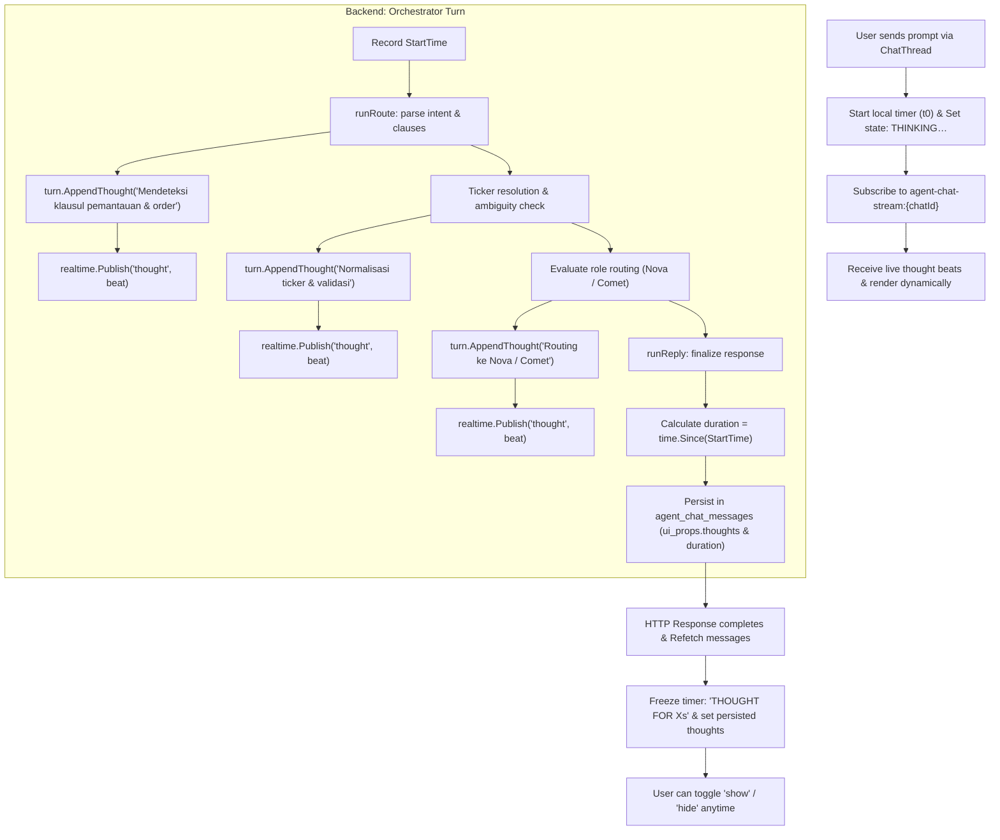

# Agent Thoughts & Reasoning Trace

| | |
|---|---|
| **Version** | 1.0 |
| **Status** | Draft |
| **Date Created** | 2026-09-13 |
| **Last Updated** | 2026-09-13 |

---

## 1. Problem Statement

In the current Quasar trading agent interface (`/portfolio`), when a user submits an instruction (e.g. `"Pantau berita soal MSCI. Kalau terjadi sentimen buruk, langsung jual 20% BRPT ku"`), the UI shows either a brief "Quasar is thinking…" skeleton or raw subtask progress rows. 

The user cannot inspect the end-to-end reasoning and orchestration logic of the LLM:
- Why and how the prompt was classified into trigger conditions and trade actions.
- How ambiguities (e.g., subjective sentiment words without explicit metrics) were evaluated and handled.
- How the orchestrator resolved token tickers and routed execution across roles (`analyzer` vs. `executor`).
- How safety guardrails, budget caps, and on-chain allowance prerequisites were checked before touching smart contracts.

The design prototype (`Agent Chat.dc.html`, lines 328–343 & 1327–1332) specifies a designated, collapsible **"Thoughts"** component displaying:
- A compact header bar: `THOUGHT FOR <duration>S` (or `THINKING…` while processing) with a toggle button `show` / `hide`.
- An expandable list of italicized thought beats annotated with bullet points (`·` or `›`) that details the orchestrator's decision trail ("where to go, what to check, what needs to be done next").

This capability must be implemented in both live streaming (realtime timer & dynamic beats) and persisted message history (stored in message metadata so historical turns remain inspectable on reload).

---

## 2. Definition of Done

1. **Visual Parity with Design Reference & Screenshot**:
   - The Thoughts bar renders immediately under the user message bubble (or directly above the assistant's Plan / answer card).
   - In collapsed state, it displays `THOUGHT FOR <duration>S` on the left in uppercase with `0.14em` letter-spacing, and `show` on the right in monospace font.
   - When toggled to `show`, it expands with a clean transition displaying the list of thought beats with bullet marks (`·` for completed beats, `›` for the active/final beat) and italicized prose (`13px`, `var(--ink)` / `var(--body)`).
   - In expanded state, the toggle label switches to `hide`.
2. **Live Execution Mode (Realtime)**:
   - When the user sends a message, the card appears with `THINKING…` and live elapsed seconds updating every 100ms.
   - Realtime thought beats stream or populate dynamically as the orchestrator progresses through route, analyze, execute, and reply stages.
   - When generation finishes, the timer freezes at the final measured elapsed duration (e.g. `THOUGHT FOR 2.1S`), collapses by default (or respects user toggle), and persists.
3. **Persisted History Mode**:
   - The thoughts list and duration are stored in the assistant chat message record (`ui_props.thoughts` and `ui_props.thought_duration_secs`).
   - Reloading `/portfolio` or navigating between chats retains the `THOUGHT FOR <duration>S` bar with full expand/collapse capability.
4. **Zero Tolerance & Project Constraint Adherence**:
   - Production code only in `backend/src/` and `frontend/components/agent/`.
   - Tests placed exclusively in `backend/test/` or `frontend/__tests__/`.
   - Chat prose in thought beats adheres 100% to the User's Language (Bahasa Indonesia when the prompt is in Bahasa Indonesia).
   - No breaking changes to existing `PlanCard`, `TradeLedger`, or `ArmPanel` components.

---

## 3. Feature Description

### 3.1 Backend Architecture

1. **Orchestrator Thought Collector**:
   - `orchestratorTurn` in `backend/src/service/agent/orchestrator_service.go` gains a `Thoughts []string` slice and a `StartTime time.Time`.
   - As `runRoute`, `runAnalyze`, `runExecute`, and `runReply` execute in `orchestrator_nodes.go`, each node appends human-readable, user-language thought beats into `turn.Thoughts`:
     - **Route Beat**: Prompt decomposition (e.g., `"Mendeteksi dua klausul: pemantauan sentimen berita dan eksekusi penjualan kondisional."`).
     - **Ambiguity / Ticker Gate Beat**: Ticker normalization and criteria review (e.g., `"Ticker BRPT dinormalisasi ke token terdaftar BRPTP; klausul sentimen buruk memerlukan data pasar."`).
     - **Role Routing Beat**: Delegation justification (e.g., `"Mengarahkan pencarian berita ke Nova (Analyzer) untuk analisis sentimen terkini."`).
     - **Safety / Policy Beat**: Custody and allowance rule (e.g., `"Menyiapkan kartu otorisasi on-chain — aset IDRX tetap di dompet sampai user menyetujui allowance."`).
   - Thought events are broadcast live via WebSocket using the existing `realtime` hub:
     - Event: `{ "type": "thought", "data": { "beat": string, "index": int } }`.
2. **Persistence in `AgentChatMessage`**:
   - In `backend/src/service/agent/chat_service.go`, when saving the supervisor reply in `s.ChatMessages.Create`:
     - Populate `ui_props` JSON with:
       ```json
       {
         "thoughts": [
           "Mendeteksi dua klausul: pemantauan sentimen berita dan eksekusi penjualan kondisional.",
           "Ticker BRPT dinormalisasi ke token BRPTP; klausul sentimen buruk memerlukan verifikasi data.",
           "Mengarahkan pencarian berita ke Nova (Analyzer) untuk pemantauan sentimen terkini.",
           "Menyiapkan kartu otorisasi on-chain — transaksi memerlukan persetujuan allowance dompet."
         ],
         "thought_duration_secs": 2.1
       }
       ```
     - For turns where `ui_props` already holds chart or news data (e.g. `content_type: "chart"` or `"news"`), `thoughts` and `thought_duration_secs` are safely merged into the `ui_props` map.

### 3.2 Frontend Architecture

1. **New Component: `ThoughtsCard.tsx` (`frontend/components/agent/ThoughtsCard.tsx`)**:
   - Props:
     ```typescript
     interface ThoughtsCardProps {
       thoughts: string[];
       durationSecs?: number;
       isLive?: boolean;
       liveElapsedSecs?: number;
     }
     ```
   - Matches the prototype styling:
     - Container: `border: 1px solid var(--hairline); background: var(--canvas); margin-bottom: 10px;`
     - Header button: `display: flex; align-items: center; gap: 9px; padding: 11px 13px;`
     - Title: `font: 700 9.5px/1 var(--font-sans); letter-spacing: .14em; text-transform: uppercase; color: var(--body);`
       - Displays `THINKING…` (while `isLive`) or `THOUGHT FOR <duration>S` (when settled).
     - Toggle: `font-family: var(--font-mono); font-size: 10.5px; color: var(--ticker);` (`show` / `hide`).
     - Body list: `padding: 0 13px 12px; display: flex; flex-direction: column; gap: 8px;`
     - Thought rows:
       - Mark: `font-family: var(--font-mono); font-size: 11px; color: var(--ticker);` (`·` or `›`).
       - Text: `font-size: 13px; line-height: 1.5; font-style: italic; color: var(--ink-soft);`.
2. **Integration into `ChatThread.tsx`**:
   - Sits right above assistant message bubbles and `PlanCard`.
   - Handles live incoming `thought` events during streaming, tracking a running timer (`performance.now()`).
   - Automatically reads persisted `ui_props.thoughts` and `ui_props.thought_duration_secs` from `AgentChatMessage` for historical messages.

---

## 4. Impacted Files

| Layer | File | Action | Purpose |
|---|---|---|---|
| Backend | `backend/src/service/agent/orchestrator_service.go` | `[MODIFY]` | Add `Thoughts []string`, `StartTime time.Time` to `orchestratorTurn` and `OrchestratorResult`. |
| Backend | `backend/src/service/agent/orchestrator_nodes.go` | `[MODIFY]` | Collect thought beats in `runRoute`, `runAnalyze`, `runExecute`, and `runReply`; emit realtime thought events. |
| Backend | `backend/src/service/agent/chat_service.go` | `[MODIFY]` | Merge `thoughts` and `thought_duration_secs` into `ui_props` before saving `AgentChatMessage`. |
| Backend | `backend/src/http/handlers/agent/chats.go` | `[MODIFY]` | Register `OnThought` callback to publish `{ type: "thought", data: ... }` on WebSocket. |
| Frontend | `frontend/components/agent/ThoughtsCard.tsx` | `[NEW]` | Reusable Thought card with expand/collapse, timer, and bulleted reasoning trace. |
| Frontend | `frontend/components/agent/ChatThread.tsx` | `[MODIFY]` | Render `ThoughtsCard` for live streaming turns and historical persisted messages. |
| Frontend | `frontend/http/agent/chatApi.ts` | `[MODIFY]` | Add `thought` event type to `ChatStreamEvent`. |
| Backend Test | `backend/test/service/agent/thoughts_trace_test.go` | `[NEW]` | Automated test verifying thought beat collection and duration calculation. |

---

## 5. UI/UX Changes (Lo-Fi)

```text
+-------------------------------------------------------------------------+
| User Bubble (var(--merah-soft)):                                        |
| "Pantau berita soal MSCI. Kalau terjadi sentimen buruk,                 |
|  langsung jual 20% BRPT ku."                                            |
+-------------------------------------------------------------------------+

+-------------------------------------------------------------------------+
| [COLLAPSED STATE]                                                       |
| THOUGHT FOR 2.1S                                                   show |
+-------------------------------------------------------------------------+

+-------------------------------------------------------------------------+
| [EXPANDED STATE (after clicking 'show')]                                |
| THOUGHT FOR 2.1S                                                   hide |
|                                                                         |
|   · Mendeteksi dua klausul: pemantauan sentimen dan penjualan bersyarat.|
|   · Ticker BRPT dinormalisasi ke token pasar BRPTP.                     |
|   · Parameter "sentimen buruk" membutuhkan pemantauan berita via Nova.  |
|   › Menyiapkan otorisasi on-chain; aset IDRX aman dan tetap di dompet.   |
+-------------------------------------------------------------------------+

+-------------------------------------------------------------------------+
| TASK T-0142   5 of 5 sub tasks                               full route |
| 01  Recognize Request                       Quasar             DONE     |
| 02  Scan MSCI News Sentiment                Nova               DONE     |
| ...                                                                     |
+-------------------------------------------------------------------------+
```

---

## 6. Flowchart



---

## 7. Verification Plan

### Automated Tests
1. **Backend Test (`backend/test/service/agent/thoughts_trace_test.go`)**:
   - Run via `go test ./test/service/agent/... -v`.
   - Verify that an orchestrator run records valid thought beats across each stage (route, ticker gate, role dispatch).
   - Verify that thought duration is positive, reasonable ($>0$ ms), and stored into `ui_props`.
2. **Frontend Typecheck & Build**:
   - Run `npx tsc --noEmit` inside `frontend/`.
   - Verify zero TypeScript or lint errors.

### Manual Checks
1. **Interactive Chat in `/portfolio`**:
   - Open Quasar chat panel on `/portfolio`.
   - Send: `"Pantau berita soal MSCI. Kalau terjadi sentimen buruk, langsung jual 20% BRPT ku."`.
   - Check that `THINKING…` appears immediately below the user bubble with live running timer.
   - Check that once finished, it transforms into `THOUGHT FOR Xs` with a `show` button.
   - Click `show` and verify thought beats appear in italic prose with bullets.
   - Click `hide` and verify it collapses.
2. **Persistence & Refresh**:
   - Refresh the page (`F5` / reload) or switch chat tabs.
   - Verify that the previous message still displays the `THOUGHT FOR Xs` [show] bar with all thought items intact.
