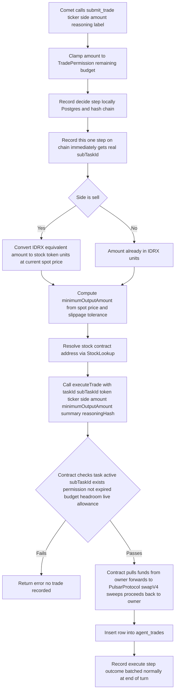

# Agent Trade Execution

| | |
|---|---|
| **Version** | 1.7 |
| **Status** | Implemented (End-to-End Chat Execution Pipeline) |
| **Date Created** | 2026-09-08 |
| **Last Updated** | 2026-09-12 |

## 0. Implementation Status (v1.7)

Gaps A, B, and C are implemented and compiling clean (`go build`/`go vet`/`gofmt`). **End-to-end execution pipeline completed in v1.7**: Comet is now invoked post-arm/post-approval through `TaskService.ExecuteTask` and `POST /api/v1/agent/tasks/:id/execute`.

| Item | Status |
|---|---|
| Gap A — `executor.TaskExecutor.ExecuteTrade` gains `subTaskID`, `token`, `minimumOutputAmount`, `summary` | Done |
| Gap B — chain-first Sub Task recording (subTaskID guaranteed to exist before `executeTrade`) | Done — via `agent-orchestration-graph-rebuild.md` v2.14's general rule, not a trade-specific fix |
| Gap C — Sell-side amount unit conversion (IDRX-equivalent → stock-token raw units) | Done — `convertTradeAmounts` in `executor/tools_service.go`, using the on-chain pool spot price (`SpotPriceReader`/`GetOnchainPriceV4`), not an off-chain quote |
| `minimumOutputAmount` slippage calculation | Done — fixed 1.0% default (no per-user risk profile exists to make this configurable) |
| `Client.ExecuteTrade` real implementation | Done — parses `TradeExecuted` from the receipt for the real `tradeId` |
| `agent_trades` writer | Done — `submit_trade` inserts a row on success via `TradeRecorder` |
| `UnimplementedTaskExecutor` retirement | Done — file deleted, `agent_registry.go` wires the real `Client` directly |
| `ArmTask`'s redundant `Chain.CreateTask` call (found while implementing this plan) | **Done, v1.6** — see below |
| Re-invocation of Comet after arming & wallet approval | **Done, v1.7** — `TaskService.ExecuteTask` + `POST /tasks/:id/execute` + `ArmPanel` auto-trigger |
| Lifecycle cards in chat thread | **Done, v1.7** — `PlanCard.tsx` renders `ArmPanel` and `TradeLedger` in thread |

**Post-Arm Execution Trigger (v1.7).** Previously, Comet was executed only during the initial chat message turn before the Task was armed (when budget was 0), and arming was a detached action on a different screen with no follow-up execution. In v1.7:
1. `TaskService.ExecuteTask(ctx, taskID, wallet)` loads the task, gathers Nova's market intelligence findings from subtasks, constructs `RunContext` with `SubTaskRecorder`, and invokes Comet (`s.Executor`) with live on-chain spot pricing and IDRX balances.
2. Comet executes `submit_trade`, calling `AgentTaskManager.executeTrade` on Arbitrum Sepolia, swapping tokens on Uniswap V4.
3. On success, `agent_trades` records the fill, and `agent_tasks.status` transitions to `executed`.
4. Exposed via `POST /api/v1/agent/tasks/:id/execute`, called automatically by `ArmPanel.tsx` after the user's ERC20 `approve()` confirmation in wallet.
5. All 7 backend tests pass (`TestTaskService_ExecuteTaskValidation` added); `npm run build` compiles with 0 errors.

**`ArmTask` fix (v1.6).** `TaskService.ArmTask` used to call `Chain.CreateTask` itself, unconditionally — a leftover from before the orchestrator rebuild moved `createTask` into `runRoute` (v2.0/v2.1), from back when this endpoint was the *only* place `createTask` ever ran. Since every Task now gets its on-chain id immediately on recognition, this call was opening a second, orphaned on-chain Task and overwriting Postgres's `on_chain_task_id` to point at it — any Sub Task already recorded against the real id would've become disconnected. Fixed: `ArmTask` now reads the Task's already-set `OnChainTaskID` (erroring loudly if somehow nil, rather than silently creating a new one), calls only `GrantTradePermission` against that existing id, and no longer calls `SetOnChainTaskID` at all (nothing new to set). Its Sub Task catch-up logic (`recordSubTasksBatch`, reading `!row.RecordedOnChain` rows) is untouched — still a defensive safety net, now largely moot under v2.14's chain-first rule, same as `SubTaskRetryService`. `go build`/`go vet`/`gofmt` clean, existing tests still pass.

## 1. Problem Statement

Comet (Executor) can already decide to trade — `executor/tools_service.go`'s `submit_trade` tool validates the ticker, clamps the amount to the Task's remaining `TradePermission` budget, records a "decide" step, and calls `executor.TaskExecutor.ExecuteTrade(ctx, onChainTaskID, intent, reasoningHash)` end to end. It has never once succeeded against the real chain: `UnimplementedTaskExecutor` (the only implementation wired in `agent_registry.go`) deliberately fails with `ErrTradeExecutionNotImplemented`, because `executor.TaskExecutor`'s interface and `agent.TradeIntent` are missing everything `AgentTaskManager.executeTrade` actually requires.

Reading `AgentTaskManager.sol` directly (not assumed) surfaces two separate gaps, not one:

**Gap A — missing fields (already suspected, now confirmed exact).** `executeTrade`'s real signature is:
```solidity
function executeTrade(
    uint256 taskId, uint256 subTaskId, address token, string calldata ticker,
    TradeSide side, uint256 amount, uint256 minimumOutputAmount,
    string calldata summary, bytes32 reasoningHash
) external onlyRole(AGENT_ROLE) nonReentrant returns (uint256 tradeId)
```
`executor.TaskExecutor.ExecuteTrade` only carries `(ctx, onChainTaskID, intent{Ticker,Side,Amount}, reasoningHash)` — no `subTaskId`, `token`, `minimumOutputAmount`, or `summary`.

**Gap B — a real sequencing conflict, not just a data gap.** `executeTrade` checks `subTaskId < subTaskCount` and `subTasks[subTaskId].taskId == taskId` — the "decide" Sub Task must already exist **on-chain** at call time. This gap is now resolved at the design level by `agent-orchestration-graph-rebuild.md` v2.13: end-of-turn Sub Task batching is dropped entirely — every Sub Task, not just `decide`, is recorded on-chain immediately, one `Chain.RecordSubTasks` call per row, the instant it's written. `submit_trade`'s "decide" row is therefore already on-chain, with a real `subTaskId`, by the time `executeTrade` needs one — no trade-specific special case required.

**Gap C — found while tracing this, not in the original suspected list: a unit mismatch in `amount` itself.** `agent.TradeIntent.Amount` is documented as "IDRX-equivalent" for both sides (it's clamped against `TradePermission`'s IDRX-denominated budget). But the contract's own `amount` parameter means different things per side — confirmed from the contract body:
```solidity
if (side == TradeSide.Sell) {
    IERC20(token).safeTransferFrom(task.owner, address(this), amount); // amount = stock-token units (18 decimals)
    ...
} else {
    idrx.safeTransferFrom(task.owner, address(this), amount); // amount = IDRX units (2 decimals)
    ...
}
```
For a **Sell**, `amount` must already be in stock-token units, not IDRX — Comet's IDRX-equivalent decision has to be converted through the current spot price before it can be passed as `executeTrade`'s `amount` at all. This is separate from `minimumOutputAmount` (Gap A) and would silently break every real Sell if missed.

## 2. Definition of Done

> [!IMPORTANT]
> **Governed by `agent-orchestration-graph-rebuild.md` v2.15's absolute rule, restated here rather than reworded: on-chain first, for Trade exactly as for Task and Sub Task.** A real `executeTrade` call must succeed on-chain **before** any row is inserted into `agent_trades` — no exceptions, no cost-based compromise. If `executeTrade` fails for any reason, the whole turn aborts immediately (no `agent_trades` row, no partial state), and Quasar sends the user an explicit chat message saying the system hit a problem and to resend — never a silent failure, never a generic HTTP error with no chat-level acknowledgment. Gas cost is not a valid reason to defer, batch, or skip this.

- `executor.TaskExecutor.ExecuteTrade` (and whatever calls it) carries every field `AgentTaskManager.executeTrade` requires: `subTaskId`, `token`, `minimumOutputAmount`, `summary`, on top of what already exists.
- The "decide" Sub Task is recorded on-chain (its own `RecordSubTasks` call) before `executeTrade` is called with its `subTaskId` — never deferred to the end-of-turn batch for a trade that actually executes.
- For a Sell, the amount passed to `executeTrade` is in the stock token's own units (18 decimals), correctly converted from Comet's IDRX-equivalent decision at the current spot price — not passed through as IDRX units.
- `minimumOutputAmount` is computed from a real, current spot price with an explicit slippage tolerance — never `0` (which would accept any output, defeating the protection) and never a hardcoded guess.
- A real trade, once executed, is recorded in `agent_trades` (currently has zero writers anywhere in the codebase) so `GET /agent/tasks/:id/trades` actually returns it.
- `UnimplementedTaskExecutor` is retired once a real implementation exists — no path should silently keep using the failing stub after this ships.

## 3. Feature Description

### 3.1 Field mapping (Gap A)

| `executeTrade` param | Source |
|---|---|
| `taskId` | Already known (`onChainTaskID`) |
| `subTaskId` | **New** — the on-chain id returned by the immediate `RecordSubTasks` call for the "decide" step (§3.2) |
| `token` | **New** — `Stock.ContractAddress`, looked up via the already-used `StockLookup.FindByTicker` (the interface already resolves this for validation; it just isn't threaded through to the trade call) |
| `ticker` | Already known (`intent.Ticker`) |
| `side` | Already known (`intent.Side`) |
| `amount` | Already known for a Buy (IDRX); **must be converted** for a Sell (§3.3, Gap C) |
| `minimumOutputAmount` | **New** — computed from a current spot-price quote plus a slippage tolerance (§3.4) |
| `summary` | **New** — `intent`'s own `Label` field, already collected by the tool's input schema, currently dropped on the floor |
| `reasoningHash` | Already known (the "decide" step's own `DecisionHash`) |

### 3.2 On-chain sequencing (Gap B, resolved by the general chain-first rule)

Per `agent-orchestration-graph-rebuild.md` v2.14, `SubTaskRecorder.Record` is chain-first for every Sub Task, not just trade-related ones: it calls `Chain.RecordSubTasks` for this one row *before* writing to Postgres, captures the real on-chain-assigned id from the contract's `SubTaskRecorded` event (not just a tx hash — v2.14 also fixes `Client.RecordSubTasks`, which discards this today), and persists it in the new `agent_sub_tasks.on_chain_sub_task_id` column. `submit_trade`'s "decide" record therefore already has a real, persisted on-chain `subTaskId` by the time `ExecuteTrade` is called — nothing trade-specific to build here beyond reading that column and passing it through as `executeTrade`'s own `subTaskId` argument.

### 3.3 Sell-side amount conversion (Gap C)

For `side == sell`, the IDRX-equivalent amount Comet decided on must be converted to a stock-token quantity at the current spot price before being passed to `executeTrade`. This needs the same current-price lookup as §3.4's slippage calculation — the two should share one quote call, not fetch price twice.

### 3.4 `minimumOutputAmount` (Gap A, the part with no existing code at all)

No code anywhere in the repo computes this today (confirmed by grep — only doc-comment mentions of the gap exist). Needed: fetch the ticker's current spot price (reusing whatever price source `analyzer`'s chart tools already call — `publicsvc.PriceService`/`ChartDataReader`, not a new integration), compute the expected output amount at that price for the given `amount`/side, then apply an explicit slippage tolerance to get a floor. Decimals must be handled correctly per direction: IDRX has 2 decimals, `PulsarStock` has 18 (per `AGENT.md` §6) — a Buy's `minimumOutputAmount` is in stock-token (18-decimal) units, a Sell's is in IDRX (2-decimal) units.

## 4. Impacted Files

| File | Change |
|---|---|
| `backend/src/service/agent/executor/index.go` | `TaskExecutor.ExecuteTrade`'s signature gains `subTaskId`, `token`, `minimumOutputAmount`, `summary` |
| `backend/src/service/agent/state_service.go` | `TradeIntent` likely needs the resolved token address and/or the converted amount attached, depending on where the conversion (§3.3) happens |
| `backend/src/service/agent/executor/tools_service.go` | `submit_trade` gains the immediate on-chain `RecordSubTasks` call (§3.2) before calling `ExecuteTrade`, and the price-quote + amount-conversion + slippage calculation (§3.3/§3.4) |
| `backend/src/onchain/agenttaskmanager/client_service.go` | `Client.ExecuteTrade` implemented for real against the deployed contract, replacing its current always-errors body |
| `backend/src/service/agent/executor/stub_service.go` | `UnimplementedTaskExecutor` retired once the real implementation lands (Definition of Done) |
| `backend/src/repository` (`AgentTradeRepository`) | Needs an actual caller — zero writers exist today; a real `executeTrade` success should insert into `agent_trades` |
| `frontend/components/agent/ArmPanel.tsx` | `[MODIFY]` — presentation upgrade to the "Confirm and arm" state (§5): custody explanation copy, per-step chain status, custody facts grid |
| `frontend/components/agent/ChatThread.tsx` (or a new sibling component) | `[NEW/MODIFY]` — "Armed" ledger, "Trigger satisfied/executing" card, "Trade order details" table, "Decided" card, "Disarm" two-step status (§5) |
| `frontend/components/agent` — new Activity Log view | `[NEW]` — filterable list (All/Executions/Decisions/Quarantine/Evaluations), no export button |

## 5. UI/UX Changes (Lo-Fi)

Superseded from "N/A" — a full reference mockup was reviewed (`Agent Chat.dc.html`, a standalone prototype, not wired to any real backend) and its trade-lifecycle screens are adopted as the Lo-Fi target for this plan, with one piece explicitly dropped: **no "Export OJK report" button** — out of scope, not needed.

Each state below is a distinct card in the chat thread, appearing in sequence as a Task with `is_actionable: true` moves through its life. All of them are new frontend work except where noted "exists."

| State | What it shows | Notes |
|---|---|---|
| **Thinking** | A collapsible block, right after the user's message and before the Task card — title toggles "Thinking…" → "Thought for Ns" once done, default open, short italicized lines revealed as they arrive. | Tracked separately (this session's `OnThinking`/`thinking` WS event already exists) — same block applies to trade turns as to any other. |
| **Confirm and arm** | Explains custody in plain language (funds never leave the owner's wallet; the contract pulls via allowance at execution, capped, revocable). Lists the exact on-chain calls about to happen (`createTask`, `approve`) each with live status (Ready → Signing → Done). A small facts grid: spender address, how it pulls (`transferFrom`, once per Task), allowance amount, how to revoke. A single acknowledgment checkbox gates the arm button. | `ArmPanel.tsx` already does the two real signatures correctly (backend `createTask`+`grantTradePermission`, then the owner's own `approve`) — this is a presentation upgrade over what it shows today, not a new signing flow. |
| **Armed** | Confirms the on-chain Task id and current allowance remaining. An expandable ledger lists every Trade under this Task (status, capped amount, tx reference) — this is the first real consumer of `GET /agent/tasks/:id/trades` once `agent_trades` actually gets rows (§2). | Ledger UI is new; the read endpoint already exists. |
| **Trigger satisfied / executing** | A live card the moment Comet decides to act: what fired and why, a countdown since the trigger, an expandable "why it fired" panel listing the specific evidence with source labels — including which sources (if any) were dropped as prompt-injection-shaped before scoring. | Evidence content already exists as Nova's own tool output (`analyzer`'s news tools); this is new presentation, not new backend data. |
| **Trade order details** | Before/while `executeTrade` is in flight: side, ticker, size, estimated value, estimated slippage vs. the cap, position weight before/after, and whether the size is under the permission cap. | Needs the real `minimumOutputAmount`/spot-price quote from §3.4 to be genuinely accurate, not illustrative. |
| **Decided** | Once the trade settles: a short summary of what happened (amount, price, resulting weight change) with a link into the Activity Log for the full trail. | |
| **Disarm** | A two-step chain animation mirroring arm's own shape (cancelling the on-chain Task, then revoking the allowance to zero), then a confirmation card. | Backend already has `cancelTask`/allowance-zero as separate real calls — this is sequencing their status in the UI, not new chain logic. |
| **Paused** (standing instructions only) | States plainly that evaluation has stopped, sources are still logged but not scored, and no proposal can reach the user until resumed — distinct from disarm. | Depends on the still-undesigned standing-instruction loop (`agent-orchestration-graph-rebuild.md` §12) — not buildable until that lands. |
| **Activity log** | A filterable list (All / Executions / Decisions / Quarantine / Evaluations) of every event for a Task — timestamp, kind, what happened, tx/hash reference, actor. **No export button of any kind.** | New view; the underlying data (Sub Task rows, Trade rows, on-chain refs) already exists once §2's chain-first rule and Gaps A–C are closed. |

**Explicitly not in scope for this plan**: the reference's Risk Profile screen (editable per-user limits like max-per-event, concentration cap, cooling-off period) — there is no backend concept of a user-configurable risk profile today, only a per-Task `TradePermission` budget. Building that is a separate, undesigned feature, not a UI-only change.

## 6. Flowchart



## 7. Verification Plan

**Automated tests (not yet written):**
- Unit test the amount-unit conversion (§3.3) for a Sell against a few known spot prices — assert the value passed to `executeTrade` is in stock-token units, not IDRX.
- Unit test `minimumOutputAmount`'s slippage math for both Buy and Sell, confirming correct decimal handling (2 for IDRX, 18 for stock tokens).

**Manual verification (not yet run):**
- Trigger a real Sell with a small amount against a funded `AGENT_WALLET` and an owner wallet that has already approved `AgentTaskManager`, confirm the transaction succeeds on Arbiscan/`cast call`, and confirm `TradeExecuted` was emitted with the expected `ticker`/`side`/`amount`.
- Confirm the resulting row appears in `agent_trades` and is returned by `GET /agent/tasks/:id/trades`.
- Cross-check the on-chain `subTasks[subTaskId]` (via `cast call`) matches the "decide" row that was supposedly recorded immediately, confirming Gap B's fix actually holds.
