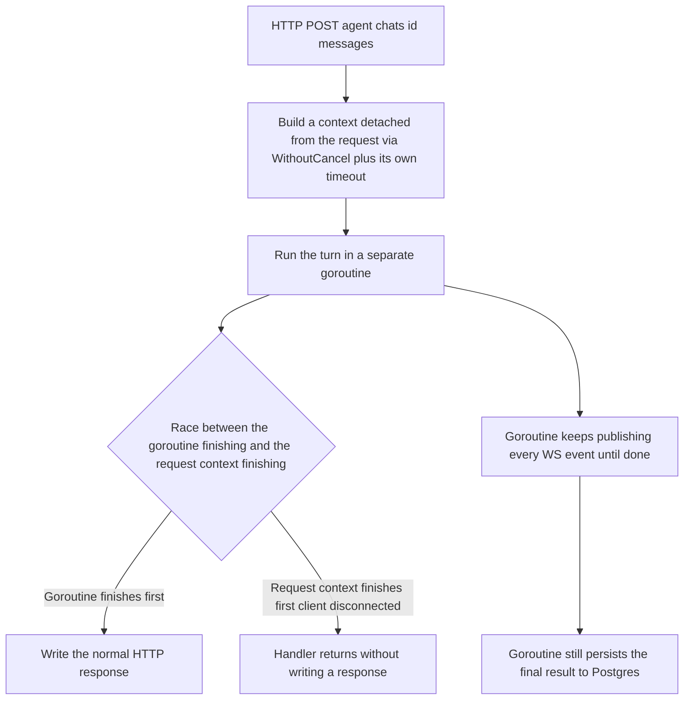

# Agent Turn Background Execution

| | |
|---|---|
| **Version** | 1.0 |
| **Status** | Draft |
| **Date Created** | 2026-09-08 |
| **Last Updated** | 2026-09-08 |

## 1. Problem Statement

`chats.go`'s `runAgentOverSocket` calls `run(...)`, which in both callers (`PostChatMessageHandler`/`RetryLastMessageHandler`) wraps `taskSvc.HandleChatMessage(c.Request.Context(), ...)` / `RetryLastMessage(c.Request.Context(), ...)` — using the HTTP request's own context, not an independent one.

Found live: the user switched to a different menu item while a turn was running, and the chat immediately showed "failed" — yet retrying produced a result quickly, indicating the backend turn was actually still running and got killed the moment the triggering HTTP connection dropped (SPA navigation cancels the still-pending fetch). That cancelled context flows into every call beneath it — `RouteModel.Generate`, Nova's/Comet's own ReAct loop, tool HTTP calls, even the on-chain call — all sharing the same context, all cancelled together.

If left unfixed, every menu switch, tab close, or brief network blip during a running turn kills it outright and forces a full retry, including cases where an on-chain `createTask` already succeeded but the Sub Task work that followed got cut off mid-flight.

## 2. Definition of Done

- A turn continues running to completion and correctly persists its Sub Tasks and final reply even when the triggering HTTP connection drops mid-turn (client navigates away, closes the tab, or hits a transient network drop).
- A client that stays connected for the whole turn receives the exact same HTTP response as today — no behavior change for the normal case.
- No two turns can run concurrently for the same chat as a result of a retry issued while the original turn is still running in the background.
- A single hung LLM/tool call cannot keep a background turn running indefinitely — it is bounded by an explicit timeout.

## 3. Feature Description

`runAgentOverSocket` runs `run(...)` in a separate goroutine, using a context detached from `c.Request.Context()` via `context.WithoutCancel(...)` and wrapped in its own `context.WithTimeout(...)` (candidate: 3 minutes, pending confirmation — see Open Decision below). The handler races the goroutine's result against `c.Request.Context().Done()`:

- Goroutine finishes first → the normal HTTP response is written.
- Request context finishes first (client disconnected) → the handler returns without writing a response; the goroutine keeps running to completion regardless, since its own context was never tied to the request's.

`run`'s signature changes to take `ctx context.Context` as an explicit parameter instead of a closure that silently captures `c.Request.Context()`, so `runAgentOverSocket` can inject the detached context.

**Alternatives considered:**

| Option | Description | Verdict |
|---|---|---|
| **Chosen** — goroutine + detached context, handler still waits when it can | As above. | Minimal change, keeps the existing response contract (`WorkflowCard` in the HTTP body), degrades gracefully once the client is already gone. |
| Fire-and-forget — HTTP returns 202 immediately, everything else via WS | No blocking wait at all. | Rejected: requires changing `sendChatMessage`/`retryLastMessage`'s contract on the frontend, larger scope than needed. |
| Separate job queue/worker | Turn becomes a resumable job, survives a backend restart. | Rejected for this pass: overkill for the hackathon timeline, no explicit requirement to survive a backend process restart. |

**Open decision (needs confirmation before implementing):**
1. Exact timeout value for the detached context.
2. Whether `RetryLastMessageHandler` should reject a retry while a turn is already active for that chat (needs an in-memory lock keyed by `chatID`), or allow it and accept a race on the final message.

## 4. Impacted Files

| File | Change |
|---|---|
| `backend/src/http/handlers/agent/chats.go` | `runAgentOverSocket` runs `run` in a goroutine with a detached, timeout-bounded context; `run`'s signature gains an explicit `ctx context.Context` parameter |
| `backend/src/service/agent/task_service.go` | Possible adjustment to `HandleChatMessage`/`RetryLastMessage` if the per-chat lock (§3, open decision 2) is approved |

## 5. UI/UX Changes (Lo-Fi)

N/A — backend execution-lifetime fix only. No visual or interaction change; the frontend already renders all progress via the existing WebSocket topic regardless of this fix.

## 6. Flowchart

## 7. Verification Plan

**Automated tests (not yet written):**
- Cancel the request context mid-call to `run(...)` in a test and confirm the goroutine still completes the turn and still publishes the `final` event.

**Manual verification (not yet run):**
- Start a chat with a request that needs several tool calls, switch to a different menu right after sending, wait, then come back — every Sub Task should reach `DONE` and the final reply should be present, not a failed or stuck-`IN PROGRESS` state.
- Repeat closing the tab/browser entirely instead of switching menus — the final result should still be there on reopen.
