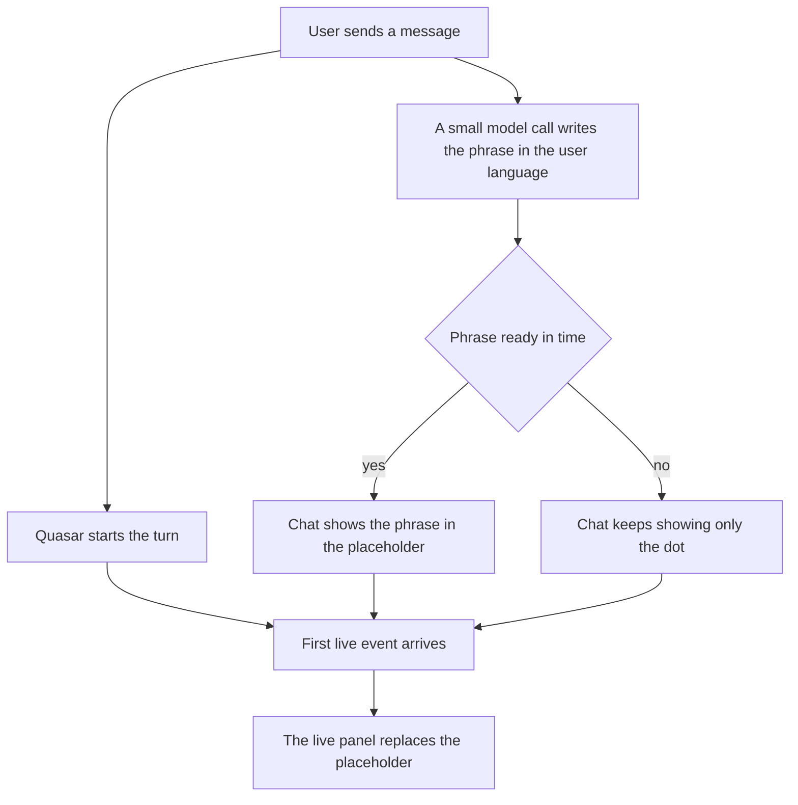

# Chat Status Line in the User's Language

| | |
|---|---|
| **Version** | 1.1 |
| **Status** | Approved |
| **Date Created** | 2026-10-05 |
| **Last Updated** | 2026-10-05 |

| Version | Date | Change |
|---|---|---|
| 1.1 | 2026-10-05 | **Implemented and verified.** Backend: `Orchestrator.Send` starts `announceStatus` beside the turn (`orchestrator_service.go`, `orchestrator_stream_service.go`); frontend: `status` event type, `statusText` state reset on every send and retry, and the placeholder shows it instead of the English sentence (`chatApi.ts`, `ChatThread.tsx`); `tsc --noEmit` is clean. Offline tests (`chat_status_test.go`, with `-race`): the phrase is the model's output trimmed, the prompt carries the user's message and names no language, a failing model and a missing model leave the turn untouched. Live, real DeepSeek: a Japanese greeting produced "クエーサーは考え中...", an Indonesian one "Quasar lagi berpikir...", a Turkish one "Quasar düşünüyor...", exactly one status event each. Not checked: the placeholder itself in a browser (the frontend typechecks, nothing was rendered). |
| 1.0 | 2026-10-05 | Initial draft, approved by the maintainer in the same exchange (option "a"). Scope: only the placeholder shown before the first live event; the other panel labels ("Working", "Composing reply", "sub tasks so far", "IN PROGRESS") are the same problem and are left for a later plan. |

> [!IMPORTANT]
> **No language is written in code.** The words the user sees while Quasar starts working are produced by the model in the language of the user's own message (AGENTS.md §3). Until they arrive, the placeholder shows only the pulsing dot, never a stand-in sentence.

---

## 1. Problem Statement

While a turn starts, the chat shows a placeholder, "Quasar is thinking…". It is written in English in the frontend (`ChatThread.tsx`), so a user chatting in Japanese, Indonesian or Turkish sees English at the moment the product should feel most like it is talking to them. AGENTS.md §3 forbids hardcoded language in anything the chat says; a translation table in the frontend would break that rule for every language not in the table.

| Finding | Implication |
|---|---|
| The placeholder is shown while the live sub-task list is empty and nothing has streamed (`isStreaming && liveSubTasks.length === 0 && !streamingReplyText`) | It covers exactly the gap before the first model output |
| The model's first output cannot fill that gap: waiting for it is the gap | A separate, tiny, parallel model call is the only way to have words early |
| `ChatService.generateCancellationReply` already asks the model for one sentence in the user's language, via `Orchestrator.ReplyModel` | The pattern, and the model, already exist |

---

## 2. Definition of Done

| # | Criterion | How it is checked |
|---|---|---|
| 1 | When a turn starts (a new message, or the answer to a questions card), the backend asks the model for a short "thinking" phrase in the language of the user's message and publishes it as a `status` event on the chat topic. | Test with a recording model: the user's message is in the prompt, the model's output is the event text |
| 2 | The frontend shows that text in the placeholder, and shows only the pulsing dot until it arrives or if it never does. No English sentence remains in the placeholder. | Frontend diff; manual check with a non-English message |
| 3 | A failure, a timeout or a missing model never fails or slows the turn: the status call runs beside it with its own short timeout and its errors are logged only. | Test: a failing model, the turn still completes |
| 4 | No language is written in code: no translation table, no per-language branch. | Review |
| 5 | The existing event contract is otherwise unchanged; `status` is the one new event type. | Frontend type union diff |

---

## 3. Feature Description

When the user sends a message, Quasar starts working immediately, and in parallel a small, fast model call writes a few words that mean "Quasar is thinking" in the user's language. Those words replace the empty placeholder as soon as they arrive, usually within a second. A user writing in Japanese sees Japanese.

<details>
<summary>Technical summary</summary>

`Orchestrator.Send` starts one goroutine before it runs the turn: it calls `ReplyModel.Generate` with a short system prompt and the user's message, with a 4 second timeout, and publishes `{"type":"status","data":{"text":"..."}}` on `agent-chat-stream:<chat id>` through the existing `PublishChatEvent`. The frontend adds `status` to `ChatStreamEvent`, keeps `statusText` in `ChatThread`, resets it on send, and renders it in the placeholder.

</details>

---

## 4. Impacted Files

Paths are under `backend/src/` and `frontend/`. Reuse check: no new file; every change is in a file that already owns the behavior.

| Layer | Change | File | Reuse check |
|---|---|---|---|
| Backend | [MODIFY] | `service/agent/orchestrator_service.go` | `Send` already receives the message and the chat id; `ReplyModel` is already a field |
| Backend | [MODIFY] | `service/agent/orchestrator_stream_service.go` | Owns the chat event publishing (`PublishChatEvent`) |
| Frontend | [MODIFY] | `http/agent/chatApi.ts` | Owns the `ChatStreamEvent` union |
| Frontend | [MODIFY] | `components/agent/ChatThread.tsx` | Owns the placeholder and the event handler |
| Tests | [NEW] | `backend/test/service/agent/chat_status_test.go` | No test covers a turn's first event; uses the in-memory pieces of the existing flow tests |

Not touched: migrations, contracts, the agents, the other panel labels.

---

## 5. Code Shape

```go
// orchestrator_service.go [MODIFY] — Send, first lines
func (o *Orchestrator) Send(ctx context.Context, in OrchestratorInput) (OrchestratorResult, error) {
    go o.announceStatus(ctx, in.ChatID, in.RawPrompt)
    // ... unchanged
}
```

```go
// orchestrator_stream_service.go [MODIFY] — new method, replaces nothing
const statusTimeout = 4 * time.Second

func (o *Orchestrator) announceStatus(ctx context.Context, chatID uuid.UUID, userMessage string) {
    if o.ReplyModel == nil || strings.TrimSpace(userMessage) == "" {
        return
    }
    ctx, cancel := context.WithTimeout(context.WithoutCancel(ctx), statusTimeout)
    defer cancel()
    reply, err := o.ReplyModel.Generate(ctx, []*schema.Message{
        schema.SystemMessage(statusInstructions),
        schema.UserMessage(userMessage),
    })
    if err != nil || reply == nil || strings.TrimSpace(reply.Content) == "" {
        return // logged at debug; the dot stays, the turn is unaffected
    }
    PublishChatEvent(chatID, "status", map[string]any{"text": strings.TrimSpace(reply.Content)})
}
```

`statusInstructions` states the task only: write at most four words meaning "Quasar is thinking" in the same language as the user's message, no quotes, no punctuation other than a trailing ellipsis. It names no language.

```ts
// chatApi.ts [MODIFY]
| { type: 'status'; data: { text: string } }

// ChatThread.tsx [MODIFY]
const [statusText, setStatusText] = useState('');
// in the realtime handler:
if (event.type === 'status') setStatusText(event.data.text);
// in handleSend: setStatusText('');
// placeholder: <span className="pulsar" />{statusText && <span ...>{statusText}</span>}
```

Call flow: `Send` starts the status goroutine and the turn together; the first one to have something to say publishes; the frontend shows the status text while no live sub-task, no reply text and no thinking exists, then the existing live panel takes over.

Deleted: the literal "Quasar is thinking…" in `ChatThread.tsx`.

---

## 6. UI/UX Changes (Lo-Fi)

Before:

```
[ (•)  Quasar is thinking…           ]   English for every user
```

After, for a Japanese message:

```
[ (•)                                ]   first moment, dot only
[ (•)  Quasarが考えています…            ]   about a second later, the model's words
```

Then the live panel replaces it, exactly as today.

---

## 7. Flowchart



---

## 8. Verification Plan

### Automated tests

| Test | Verifies |
|---|---|
| Recording model, Japanese message | The prompt contains the user's message and no language name; the published `status` text equals the model's output (DoD 1, 4) |
| Failing model | The turn still returns its normal result and no `status` event is published (DoD 3) |
| Missing model | `Send` works with `ReplyModel` unset (DoD 3) |
| `go test -race` | The goroutine and the turn do not race on the hub |

### Manual verification

1. In the app, send a message in Japanese and in Indonesian: the placeholder words match the language.
2. Send a message and confirm the first reply still arrives as fast as before.
3. Confirm the typed check passes (`tsc --noEmit` in `frontend/`).
