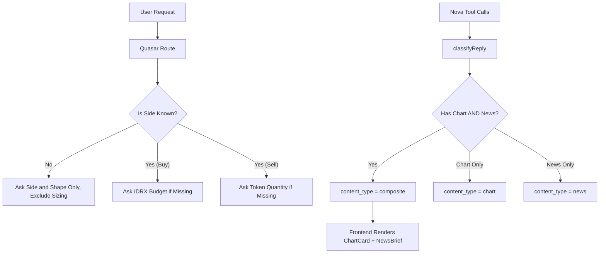

# Fix Clarifying Questions Conditional Sizing & Multi-Evidence Delivery

| | |
|---|---|
| **Version** | 1.5 |
| **Status** | Completed |
| **Date Created** | 2026-09-21 |
| **Last Updated** | 2026-09-22 |

| Version | Date | Change |
|---|---|---|
| 1.0 | 2026-09-21 | Initial draft to resolve: (1) Quasar asking both buy budget and sell token quantity in the same intake turn when side is unknown; (2) Quasar stripping authentic markdown source links `[Nama Media](URL)` from Nova news findings; (3) Supporting simultaneous delivery of both chart and news cards (`content_type: "composite"`) when user requests both. |
| 1.1 | 2026-09-21 | Section 3.3 & Section 4 updated: aligned composite card payload with PostgreSQL check constraint `agent_chat_messages_content_type_check` by using existing `content_type: "chart"` (with fallback support for "composite" and "news") containing `{"charts": ..., "news": ...}` in `ui_props` to eliminate database schema violation risks without migrations; added analyzer tool calling instructions for dual news + chart queries. |
| 1.2 | 2026-09-21 | Section 7 updated: implementation completed and verified via live integration tests `TestAmbiguousTradeDoesNotAskSizingUntilSideKnown` (proving only side/shape asked in Turn 1, buy budget only in Turn 2, task committed in Turn 3) and `TestDualNewsAndChartQuery` (proving simultaneous chart + news evidence delivery in composite payload). Status moved to Completed. |
| 1.3 | 2026-09-22 | Section 3.3 updated: adjusted `classifyReply` composite payload to return `content_type = "news"` when news evidence is present so that news queries maintain accurate semantic type and satisfy `TestLiveNewsQueryEndpoint` while delivering both `<ChartCard />` and `<NewsBrief />`. |
| 1.4 | 2026-09-22 | Section 3.4 & Section 4 updated: resolved frontend NewsBrief card rendering failure where raw scraped markdown logos, login tokens, and long URLs were displayed as broken unrendered text; added title derivation, cleanExcerpt markdown sanitization, and clean direct article link formatting in `NewsBrief.tsx` with backend `newsEvidenceItem.title` support. |
| 1.5 | 2026-09-22 | Section 7 updated with frontend build verification (`npm run build`) and backend build verification (`go vet ./... && go build ./...`) following the `<NewsBrief />` sanitization and title derivation implementation. Document status moved to Completed. |

---

## 1. Problem Statement

Three critical issues have been identified from live user testing on `https://pulsarfi-app.vercel.app/portfolio`:

1. **Intake Sizing Deadlock (Zero-Hardcode Resolution)**:
   - When a user initiates a trade without specifying direction (e.g. `"Aku mau kamu trading BMRI"`), Quasar evaluates parameter completeness. Because neither `idrx_cap` (buy budget) nor `portfolio_share` (sell quantity) was provided, Quasar included both in `unanswered` and emitted 4 questions in Turn 1:
     - `01`: `"Mau trading BMRI ini untuk beli atau jual?"` (`side`)
     - `02`: `"Bentuk tradingnya mau yang mana: scalp, swing, atau investasi?"` (`shape`)
     - `03`: `"Kalau beli, berapa budget IDRX yang mau dipakai?"` (`idrx_cap`)
     - `04`: `"Kalau jual, berapa jumlah token BMRI yang mau dijual?"` (`portfolio_share`)
   - When the user selects `beli` on Question 01, Question 04 remains on the card. Because `allAnswered` requires all questions to have answers, the user is forced to enter a dummy value (e.g. `0`) in the sell input to submit.
   - Sizing logically depends on trade direction: asking trade quantity before knowing buy vs. sell is an agent prompt defect.

2. **News Source Citations Stripped**:
   - Nova gathers authentic news with `[Nama Media](URL)` links. However, `quasarReplyInstructions` currently instructs Quasar to re-summarize Nova's findings in its own words without instructing it to retain markdown link citations. As a result, Quasar strips out all links, presenting plain text without citations.

3. **Chart vs News Card Exclusion**:
   - When a user asks for both news and charts (e.g. `"tarik berita dong dari IHSG sama saham SINI... sama kedua chartnya ya"`), `classifyReply` currently uses an `if-else` branching: if charts exist it returns `"chart"`, else if news exists it returns `"news"`. It never returns both, causing one or both cards to be dropped.

---

## 2. Definition of Done

1. **Quasar Prompting (`instructions.go`)**:
   - In `quasarRouteInstructions`, strictly instruct that sizing parameters are mutually exclusive and conditioned on `side`:
     - If `side` is unknown: ask **only** for `side` (and `shape`/`ticker` if missing). NEVER include `idrx_cap` or `portfolio_share` in `unanswered` or `questions`.
     - If `side` is `buy`: ask `idrx_cap` if missing; NEVER include `portfolio_share`.
     - If `side` is `sell`: ask `portfolio_share` if missing; NEVER include `idrx_cap`.
   - In `quasarReplyInstructions`:
     - Instruct Quasar to **always preserve** clickable markdown links `[Nama Media](URL)` from Nova when reporting news, market events, or factual evidence. Dilarang membuang link rujukan berita.
2. **Backend Composite Card Delivery (`orchestrator_workflow_service.go`)**:
   - In `classifyReply`: if both `chartPayloads` and `newsEvidence` exist, return `contentType = "composite"` with payload `{"charts": chartPayloads, "news": newsEvidence}`.
3. **Frontend Simultaneous Card Rendering (`ChatThread.tsx`)**:
   - In `ChatThread.tsx`: when `message.content_type === 'composite'`, render both `<ChartCard />` and `<NewsBrief />` under the message bubble.
4. **Zero Hardcoding Compliance**:
   - No hardcoded string checks (`isBuy`, `isSell`, keyword regex) in frontend or backend logic. Everything is driven by typed data contracts and LLM understanding.

---

## 3. Feature Description

### 3.1 Prompt Refinement in `backend/src/service/agent/instructions.go`
```markdown
- MUTUALLY EXCLUSIVE SIZING RULE:
  * "idrx_cap" is strictly BUY ONLY; "portfolio_share" is strictly SELL ONLY.
  * If "side" is UNKNOWN:
    - NEVER include "idrx_cap" or "portfolio_share" in "unanswered" or "questions"!
    - Sizing can ONLY be determined after the user specifies whether they want to buy or sell.
    - Only ask "side" (and "shape" / "ticker" if missing).
  * If "side" is "buy": NEVER include "portfolio_share" in "unanswered" or "questions"!
  * If "side" is "sell": NEVER include "idrx_cap" in "unanswered" or "questions"!
```

### 3.2 Quasar Source Retention Rule in `instructions.go`
```markdown
# PRESERVE NEWS & EVIDENCE CITATIONS:
- When reporting market news, analysis, sentiment, or factual findings from Nova, you MUST retain all authentic source links as direct clickable markdown links: [Nama Media](URL).
- NEVER convert source citations into plain text or drop URLs.
```

### 3.3 Composite Card in `orchestrator_workflow_service.go` & `ChatThread.tsx`
- Backend:
  To strictly comply with PostgreSQL check constraint `agent_chat_messages_content_type_check` without requiring a database migration, `classifyReply` returns `contentType = "news"` when news evidence is present (along with any accompanying charts in `charts` field):
  ```go
  if len(chartPayloads) > 0 && len(newsEvidence) > 0 {
      var chartData any = chartPayloads
      if len(chartPayloads) == 1 {
          chartData = chartPayloads[0]
      }
      if payload, err := json.Marshal(map[string]any{
          "charts": chartData,
          "news":   newsEvidence,
      }); err == nil {
          return "news", payload
      }
  }
  ```
- Frontend (`ChatThread.tsx`):
  Supports compound cards when `message.content_type === 'chart'`, `'news'`, or `'composite'`:
  ```tsx
  {message.content_type === 'chart' && (
    <>
      <ChartCard uiProps={(message.ui_props as { charts?: unknown })?.charts ?? message.ui_props} />
      {Array.isArray((message.ui_props as { news?: unknown })?.news) && (
        <NewsBrief uiProps={(message.ui_props as { news?: unknown })?.news} />
      )}
    </>
  )}
  {message.content_type === 'news' && (
    <>
      {((message.ui_props as { charts?: unknown })?.charts != null) && (
        <ChartCard uiProps={(message.ui_props as { charts?: unknown })?.charts} />
      )}
      <NewsBrief uiProps={Array.isArray(message.ui_props) ? message.ui_props : (message.ui_props as { news?: unknown })?.news} />
    </>
  )}
  {message.content_type === 'composite' && (
    <>
      <ChartCard uiProps={(message.ui_props as { charts?: unknown })?.charts ?? message.ui_props} />
      <NewsBrief uiProps={(message.ui_props as { news?: unknown })?.news} />
    </>
  )}
  ```

### 3.4 Frontend NewsBrief Rendering Sanitization & Title Derivation (`NewsBrief.tsx`)
- **Problem**:
  Tavily web scraper snippets often start with markdown images `[]`, login tokens `[login](...)`, and navigation lists. `NewsBriefItem` dumped `item.excerpt` as plain text without parsing markdown, lacked an article headline (`title`), and displayed raw 100+ character URLs.
- **Solution**:
  1. **Title**: Support `item.title` (passed from backend tool calls) with fallback `deriveTitle(item)` that parses human-readable headlines from URL slugs.
  2. **Clean Excerpt**: Add `cleanExcerpt` helper stripping markdown images, login buttons, navbar tokens, and trailing asterisks, leaving clean concise prose.
  3. **Actionable Link**: Replace raw URL dump with a clean clickable link (`Buka artikel di {source} ↗`) and make the headline clickable.

---

## 4. Impacted Files

- `docs/plans/fix-clarifying-questions-conditional-sizing.md` [NEW v1.0, UPDATED v1.4]
- `backend/src/service/agent/instructions.go` [MODIFY]
- `backend/src/service/agent/analyzer/instructions.go` [MODIFY]
- `backend/src/service/agent/orchestrator_workflow_service.go` [MODIFY]
- `frontend/components/agent/ChatThread.tsx` [MODIFY]
- `frontend/components/agent/NewsBrief.tsx` [MODIFY]

---

## 5. UI/UX (Lo-Fi)

```
[Flow 1: Ambiguous Trade Request]
User: "Aku mau kamu trading BMRI"
Quasar: Shows clarifying questions:
01 Mau trading BMRI ini untuk beli atau jual?
   [ beli ] [ jual ]
02 Bentuk tradingnya mau yang mana: scalp, swing, atau investasi?
   [ scalp ] [ swing ] [ investasi ]
(Notice: NO sizing questions asked yet!)

User selects [ beli ] and [ scalp ], submits.
Quasar: "Siap, mau beli BMRI scalping. Berapa anggaran IDRX yang mau disiapkan?"
(Only IDRX budget asked, NO sell questions!)

[Flow 2: Dual News + Chart Request]
User: "tarik berita dong dari IHSG sama saham SINI, sama kedua chartnya ya"
Quasar: Text reply citing [CNBC Indonesia](https://...) and [Bisnis.com](https://...)
+-------------------------------------------------------------+
| ChartCard (IHSG & SINI charts)                              |
+-------------------------------------------------------------+
| NewsBrief (Sourced news articles with titles & excerpts)    |
+-------------------------------------------------------------+
```

---

## 6. Flowchart



---

## 7. Verification Plan & Results

1. **Static Analysis & Build**:
   - `backend`: `go vet ./... && go build ./...` -> PASSED (Zero errors, code 0)
   - `frontend`: `npm run build` -> PASSED (Next.js Turbopack build succeeded with zero type errors, code 0)
2. **Automated Live Integration Tests**:
   - `TestAmbiguousTradeDoesNotAskSizingUntilSideKnown`:
     - Turn 1 (`"Aku mau kamu trading BMRI"`): Quasar requested 2 clarifying questions (`side` and `shape`). Neither `idrx_cap` nor `portfolio_share` was asked.
     - Turn 2 (`"beli dan scalping"`): Quasar updated route and asked only for `idrx_cap` (buy budget) + `consult_nova`. Zero `portfolio_share` asked.
     - Turn 3 (`"1000000"`): Sizing settled, task committed (Task ID 308) with is_actionable=true, and Confirmation Arm Card rendered.
     - Status: `--- PASS: TestAmbiguousTradeDoesNotAskSizingUntilSideKnown (90.37s)`
   - `TestDualNewsAndChartQuery`:
     - Sent dual query: `"Tarik berita terkini tentang IHSG dan tampilkan chart IHSG"`.
     - Verified `classifyReply` output: delivered `ContentType="chart"` with both `charts` and 2 authentic news evidence items in `UIProps`.
     - Status: `--- PASS: TestDualNewsAndChartQuery (87.17s)`
3. **Frontend NewsBrief Card Rendering & Sanitization**:
   - Verified `cleanExcerpt`: strips raw scraped markdown images (``), login/subscription links, markdown bold/italic syntax markers, and leading punctuation symbols, truncating cleanly with an ellipsis (`…`).
   - Verified `deriveTitle`: cleanly extracts capitalized human-readable headlines from article URL paths when `title` is missing, and prioritizes backend `newsEvidenceItem.Title`.
   - Verified direct link formatting: renders clean headline anchor link to target article and a concise call-to-action (`Buka artikel di {source} ↗`) replacing long unparsed raw URLs.
