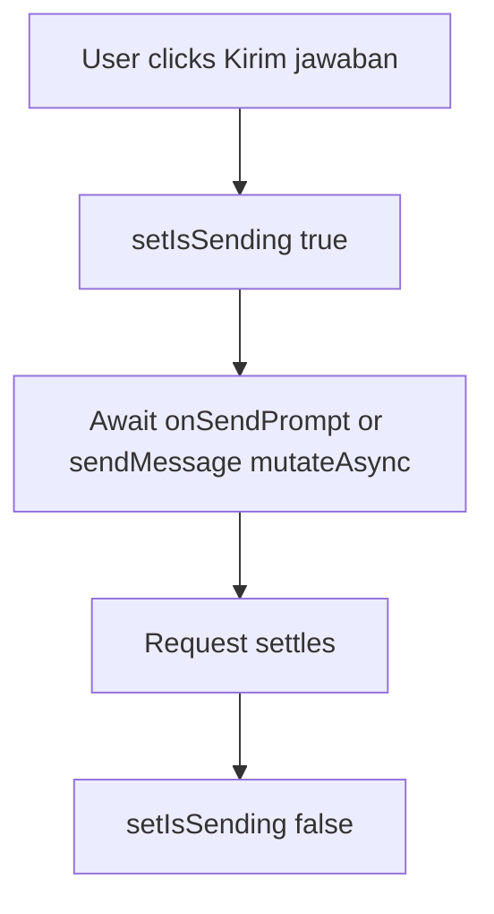

# Fix: Clarifying Questions Button Has No Sending State

| | |
|---|---|
| **Version** | 1.1 |
| **Status** | Implemented |
| **Date Created** | 2026-09-17 |
| **Last Updated** | 2026-09-17 |

| Version | Date | Change |
|---|---|---|
| 1.1 | 2026-09-17 | Status updated to Implemented — `isSending` state, async `send()`/`cancelPlan()`, and the widened `onSendPrompt` type shipped in `ClarifyingQuestions.tsx`. `tsc`/`eslint` clean. Also fixed, in the same file, a pre-existing unrelated rules-of-hooks violation (`isCancelled`'s `useState` was called after an early return) — flagged live during verification, not part of this fix's original scope. |
| 1.0 | 2026-09-17 | Initial draft |

## Problem Statement

### Root Cause Analysis

`ClarifyingQuestions.tsx`'s `send()`/`cancelPlan()` route through the `onSendPrompt` prop (`ChatThread.handleSend`) whenever it is provided — which it always is in current usage — instead of calling the local `sendMessage` mutation (`useSendChatMessage`). This routing was introduced in commit `53fb24b` so the optimistic bubble and streaming indicator work correctly.

The button's `disabled` state and label (lines 348, 360–361, 369) still read `sendMessage.isPending`. Because `sendMessage.mutate`/`mutateAsync` is never called on the `onSendPrompt` path, `sendMessage.isPending` never becomes `true`, so the "Kirim jawaban"/"Batal" buttons never visually disable and never show a sending label while the request is in flight — the user has no feedback that their answer was registered, and nothing stops a rapid double-click at the UI level (a synchronous `isSendingRef` guard exists but does not affect what is rendered).

## Definition of Done

- [ ] Clicking "Kirim jawaban" or "Batal" immediately disables both buttons and shows a sending label, regardless of whether the request goes through `onSendPrompt` or the local `sendMessage` mutation.
- [ ] The disabled/loading state clears once the request settles, success or failure.
- [ ] No change to the optimistic bubble/streaming behavior already working via `onSendPrompt`.

## Feature Description

Add a local `isSending` state (`useState`) to `ClarifyingQuestions`. Make `send()` and `cancelPlan()` async, set `isSending` to `true` before dispatching, `await` either `onSendPrompt(body)` or `sendMessage.mutateAsync(body)`, and clear `isSending` in a `finally` block — the same pattern `HorizonNoticeCard.tsx` already uses correctly with its own local `isPending` state. Every render-time reference to `sendMessage.isPending` in this component is replaced with `isSending`. `ClarifyingQuestionsProps.onSendPrompt`'s type widens from `(text: string) => void` to `(text: string) => void | Promise<void>` since `ChatThread.handleSend` is async.

## Impacted Files

| File | Change |
|---|---|
| `frontend/components/agent/ClarifyingQuestions.tsx` | `[MODIFY]` Add local `isSending` state; make `send()`/`cancelPlan()` async and await the dispatch; replace `sendMessage.isPending` references with `isSending`; widen `onSendPrompt` prop type |

## UI/UX Changes (Lo-Fi)

```
Before: click Kirim jawaban -> button stays red/enabled, label unchanged, no feedback
After:  click Kirim jawaban -> button greys out immediately, label -> sending text,
        re-enables only if the request fails
```

## Flowchart



## Verification Plan

**Automated tests**: none — pure UI state, no existing test harness covers this component.

**Manual verification**: answer all clarifying questions for a scalp sell, click "Kirim jawaban", confirm the button disables instantly and shows a sending label until the reply streams in. Repeat for "Batal".
