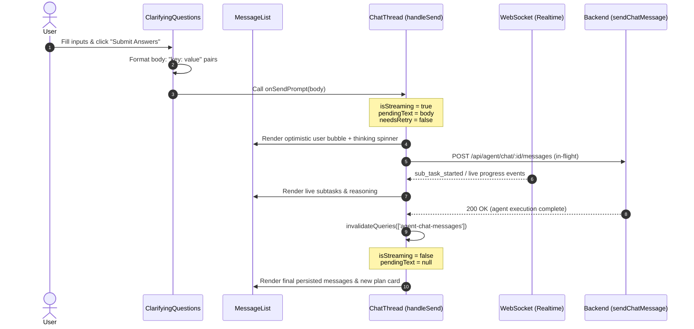

# Fix: Clarifying Questions Streaming Indicator and Answer Bubble Format

| | |
|---|---|
| **Version** | 1.1 |
| **Status** | Implemented |
| **Date Created** | 2026-09-16 |
| **Last Updated** | 2026-09-16 |

| Version | Date | Change |
|---|---|---|
| 1.0 | 2026-09-16 | Initial draft |
| 1.1 | 2026-09-16 | Status updated to Implemented — `onSendPrompt` prop added to `ClarifyingQuestions`; `send()` and `cancelPlan()` route through `ChatThread.handleSend`; body format changed to `key: value` |

---

## Problem Statement

When a user interacts with the `ClarifyingQuestions` card (rendered when the agent needs clarification or missing parameters such as budget or sizing), three interrelated issues degrade the UX:

### Bug A — Missing Streaming Indicator and Subtask Progress on Clarifying Questions Submission
- In [`ClarifyingQuestions.tsx`](file:///Users/hafidlh/Documents/project-web/pulsarfi/frontend/components/agent/ClarifyingQuestions.tsx#L102-L111), the `send()` function directly calls `sendMessage.mutate(body, ...)` via `useSendChatMessage(chatId)`.
- This bypasses [`ChatThread.tsx`](file:///Users/hafidlh/Documents/project-web/pulsarfi/frontend/components/agent/ChatThread.tsx#L417-L452)'s centralized `handleSend(overrideText?)`, which is responsible for setting `isStreaming = true`, setting `pendingText`, resetting subtasks/thinking state, and triggering the live streaming lifecycle.
- While the WebSocket topic `chatStreamTopic(chatId)` is active in `ChatThread`, the UI indicator components (`LiveSubTasks`, `ChartSkeletonCard`, `streamingReplyText`, or "Quasar is thinking…") are conditioned on `{isStreaming && ...}` in `MessageList`. Because `isStreaming` remains `false`, no loading indicator or live reasoning steps are displayed while the agent processes the user's answers. The user is left in the dark about whether their submission was received.

### Bug B — False Error State: "No reply received for this message yet." and Retry Button Flash
- In [`ChatThread.tsx`](file:///Users/hafidlh/Documents/project-web/pulsarfi/frontend/components/agent/ChatThread.tsx#L282-L285):
  ```typescript
  const isLast = index === messages.length - 1;
  const needsRetry = isLast && message.sender === 'user' && !isStreaming && !pendingText;
  const retryDescription = needsRetry && failedMessage?.text === message.content ? failedMessage.description : 'No reply received for this message yet.';
  ```
- Because `ClarifyingQuestions.tsx` directly calls `sendMessage.mutate` without setting `isStreaming = true` or `pendingText`, the conditions for `needsRetry` are immediately met if a query invalidation or cache update fetches the persisted user message while the backend agent pipeline is still executing (a blocking POST that typically runs for 5–30 seconds).
- As a result, the user's newly submitted message bubble turns red with a failure border and displays *"No reply received for this message yet."* alongside a **Retry** button, causing false panic even though the agent is processing normally.

### Bug C — Verbose and Cluttered User Answer Bubble Format
- In [`ClarifyingQuestions.tsx`](file:///Users/hafidlh/Documents/project-web/pulsarfi/frontend/components/agent/ClarifyingQuestions.tsx#L105):
  ```typescript
  const body = questions.map((q) => `${q.question}: ${draft[q.key].trim()}`).join('\n');
  ```
- This concatenates the entire question sentence with the answer value (e.g. `Berapa alokasi budget IDRX yang ingin Anda gunakan untuk DCA?: 500,000`).
- This produces redundant, excessively long chat bubbles that repeat questions already visible on the card above, degrading chat readability.

---

## Definition of Done

1. **Streaming & Progress Activation (Bug A):**
   - Submitting answers from `ClarifyingQuestions` activates `isStreaming = true` in `ChatThread`.
   - Realtime WebSocket subtask updates, reasoning steps, tool calls, and fallback "Quasar is thinking…" spinners render immediately in the chat thread.
2. **False Retry Suppression (Bug B):**
   - `needsRetry` remains `false` throughout the in-flight response window because `isStreaming` is active and `pendingText` is populated.
   - The false warning *"No reply received for this message yet."* and the **Retry** button do not appear during normal processing.
3. **Concise Message Formatting (Bug C):**
   - The user message sent to the chat thread formats answers as concise `key: value` pairs (e.g. `budget: 500,000` or `token_amount: 20`) rather than echoing the full question text.
4. **Cancellation Consistency:**
   - Cancelling via `cancelPlan` in `ClarifyingQuestions` also routes through `onSendPrompt` (with fallback to mutate), ensuring cancellations display streaming indicators without false retry flashes.
5. **No Regression:**
   - Existing chat inputs via the text area, retry mechanism, and other cards (such as `HorizonNoticeCard` and `PlanCard`) remain fully functional.

---

## Feature Description

### Architecture & Prop Passing

`ChatThread` already implements an `onSendPrompt` callback pattern for interactive cards:
- In [`ChatThread.tsx`](file:///Users/hafidlh/Documents/project-web/pulsarfi/frontend/components/agent/ChatThread.tsx#L259), `MessageListProps` already defines `onSendPrompt?: (text: string) => void;`.
- At [`ChatThread.tsx` L499](file:///Users/hafidlh/Documents/project-web/pulsarfi/frontend/components/agent/ChatThread.tsx#L499), `ChatThread` passes `onSendPrompt={handleSend}` into `MessageList`.
- At [`ChatThread.tsx` L317](file:///Users/hafidlh/Documents/project-web/pulsarfi/frontend/components/agent/ChatThread.tsx#L317), `HorizonNoticeCard` already accepts `onSendPrompt={onSendPrompt}`.
- However, at [`ChatThread.tsx` L311](file:///Users/hafidlh/Documents/project-web/pulsarfi/frontend/components/agent/ChatThread.tsx#L311), `ClarifyingQuestions` is rendered without `onSendPrompt`:
  ```tsx
  {message.ui_component === 'clarifying_questions' && (
    <ClarifyingQuestions uiProps={message.ui_props} chatId={chatId} />
  )}
  ```

### Planned Modifications

1. **Pass `onSendPrompt` to `ClarifyingQuestions` in `ChatThread.tsx`:**
   ```tsx
   {message.ui_component === 'clarifying_questions' && (
     <ClarifyingQuestions uiProps={message.ui_props} chatId={chatId} onSendPrompt={onSendPrompt} />
   )}
   ```

2. **Update `ClarifyingQuestions.tsx` Component Props & Submission Handler:**
   - Extend `ClarifyingQuestionsProps` with optional `onSendPrompt?: (text: string) => void;`.
   - Update `send()`:
     - Format concise key-value body:
       ```typescript
       const body = questions.map((q) => `${q.key}: ${draft[q.key].trim()}`).join('\n');
       ```
     - Delegate to `onSendPrompt` if provided:
       ```typescript
       if (onSendPrompt) {
         onSendPrompt(body);
       } else {
         isSendingRef.current = true;
         sendMessage.mutate(body, {
           onSettled: () => {
             isSendingRef.current = false;
           },
         });
       }
       ```
   - Update `cancelPlan()`:
     - Similarly route cancellation text through `onSendPrompt(cancelText)` when available, ensuring cancellation also sets streaming state.

---

## Impacted Files

| File | Changes |
|---|---|
| [`frontend/components/agent/ChatThread.tsx`](file:///Users/hafidlh/Documents/project-web/pulsarfi/frontend/components/agent/ChatThread.tsx) | Pass `onSendPrompt={onSendPrompt}` to `<ClarifyingQuestions />` in `MessageList`. |
| [`frontend/components/agent/ClarifyingQuestions.tsx`](file:///Users/hafidlh/Documents/project-web/pulsarfi/frontend/components/agent/ClarifyingQuestions.tsx) | Accept `onSendPrompt` in `ClarifyingQuestionsProps`; change `send()` to format `key: value` pairs and call `onSendPrompt(body)`; update `cancelPlan()` to leverage `onSendPrompt`. |

---

## UI/UX Changes (Lo-Fi)

### Before Fix:
```
+--------------------------------------------------------------------+
| Clarifying Questions Card                                          |
| [1] Berapa alokasi budget IDRX?                                    |
| [ 1,000,000 ] IDRX                                                 |
| [ Submit Answers ]                                                 |
+--------------------------------------------------------------------+
              | (User clicks Submit)
              v
+--------------------------------------------------------------------+
| User Bubble (Red border / Error highlight):                        |
| Berapa alokasi budget IDRX yang ingin Anda gunakan untuk DCA?:     |
| 1,000,000                                                          |
|                                                                    |
| [!] No reply received for this message yet.               [Retry]  |
+--------------------------------------------------------------------+
| (No spinner, no live subtask progress, appears broken/frozen)      |
+--------------------------------------------------------------------+
```

### After Fix:
```
+--------------------------------------------------------------------+
| Clarifying Questions Card                                          |
| [1] Berapa alokasi budget IDRX?                                    |
| [ 1,000,000 ] IDRX                                                 |
| [ Submit Answers ]                                                 |
+--------------------------------------------------------------------+
              | (User clicks Submit)
              v
+--------------------------------------------------------------------+
| User Bubble (Clean, normal styling, concise format):               |
| budget: 1,000,000                                                  |
+--------------------------------------------------------------------+
| Live Streaming / Subtasks (Active progress):                       |
| [*] Quasar is thinking...                                          |
|  -> Nova · Technical Analysis (IN PROGRESS)                        |
+--------------------------------------------------------------------+
```

---

## Flowchart



---

## Verification Plan

### Automated / Build Verification
1. Run frontend lint and type-check:
   ```bash
   cd /Users/hafidlh/Documents/project-web/pulsarfi/frontend && npm run lint
   ```
2. Ensure TypeScript compilation passes with zero type errors for props and handlers:
   ```bash
   cd /Users/hafidlh/Documents/project-web/pulsarfi/frontend && npx tsc --noEmit
   ```

### Manual & Functional Verification
1. **Clarifying Questions Flow (Bug A & Bug C Verification):**
   - In chat, prompt an ambiguous order needing clarification (e.g., *"Beli BRPTP"* without specifying budget).
   - Verify agent responds with `ClarifyingQuestions` card.
   - Enter values in the card inputs and click submit.
   - **Check C:** Confirm the user bubble text sent is formatted concisely as `key: value` (e.g. `budget: 1,000,000`) instead of the full question text.
   - **Check A:** Confirm that immediately upon clicking submit, the chat thread displays the thinking indicator (`Quasar is thinking…` or live subtask reasoning), reflecting `isStreaming = true`.
2. **Suppression of False Retry (Bug B Verification):**
   - During the 5–30 second window while the agent is executing the answer, verify that:
     - The user bubble does **NOT** turn red with an error border.
     - The text *"No reply received for this message yet."* does **NOT** appear.
     - The **Retry** button does **NOT** appear.
3. **Cancellation Flow Verification:**
   - Trigger a clarifying questions card, fill partial answers or click "Batalkan rencana".
   - Confirm cancellation triggers `onSendPrompt`, showing appropriate loading/streaming state without flashing the false retry error.
4. **Standard Chat Input Regression Check:**
   - Send regular text messages via the main textarea input at the bottom of `ChatThread`.
   - Verify standard messages continue to stream and settle normally.
