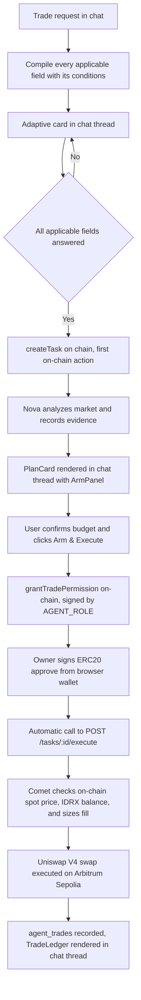

# Fix Comet Trade Execution Blockers

| | |
|---|---|
| **Version** | 3.34 |
| **Status** | In Progress (Network Check Clickable Links for On-Chain Hashes) |
| **Date Created** | 2026-09-09 |
| **Last Updated** | 2026-09-13 |

| Version | Date | Change |
| 3.34 | 2026-09-13 | **Problem AE Resolved (Network Check Clickable Links for On-Chain Hashes).** (1) **The Gap Identified:** When on-chain transactions were executed and confirmed, transaction hashes were rendered as plain text in chat bubbles and static strings in `TradeLedger`, preventing users from directly checking transaction status on network block explorers. (2) **Automatic Hash Linkification in Markdown:** In `SubTaskReasoning.tsx` (`MessageMarkdown`), added `linkifyTxHashes` to detect 66-character EVM transaction hashes (`0x[a-fA-F0-9]{64}`) and transform them into interactive links pointing to `https://sepolia.arbiscan.io/tx/<hash>` with monospace styling. (3) **Interactive Links in TradeLedger:** In `TradeLedger.tsx`, transformed static `trade.tx_hash` spans into clickable links to Arbiscan. (4) **Agent Guidance:** Instructed Quasar and Comet in `GlobalInstructions` and `quasarReplyInstructions` to format on-chain tx hashes as markdown links to the Arbitrum Sepolia block explorer. |
| 3.33 | 2026-09-13 | **Problem AD Resolved (Pure LLM-Authored Clarifying Questions & Eliminating English Intake Leaks).** (1) **Root Cause Identified:** When Quasar routed to `needs_input`, `orchestrator_nodes.go` synthesized clarifying questions from static Go structs (`ShapeField`, `executor.RequiredIntake`, `analyzer.RequiredIntake`) containing hardcoded English text. This leaked English questions and option buttons into non-English conversations, violating Rule 4 and the zero-hardcode policy. (2) **Pure LLM Intake Questions Schema:** Added `questions []IntakeField` to `routeDecision` and `quasarRouteInstructions`. Configured Quasar with exact semantic specifications to author every question, explanation (`why`), and selectable options dynamically in the user's active language (Indonesian, English, Turkish, Javanese, Banjar, etc.) whenever path is `needs_input`. (3) **Zero-Hardcode Orchestration:** `orchestrator_nodes.go` directly assigns `turn.PendingQuestions = decision.Questions`, eliminating static Go language strings and ensuring 100% language consistency across the clarifying questions card. |
| 3.32 | 2026-09-13 | **Problem AC Resolved (Simultaneous In-Progress SubTasks & SubTaskRecorder.OnRecord Wiring).** (1) **Root Cause Identified:** In `orchestrator_nodes.go`, `NewSubTaskRecorder` initialized the recorder but did not hook `recorder.OnRecord = turn.OnSubTask`. As a result, when Quasar finished `route_to_analyzer` and recorded its step as `done`, `r.OnRecord` was nil, so the `sub_task` (done) event was not published over the chat WebSocket. Step 01 remained frozen as `in_progress` in `ChatThread.tsx`. When Nova subsequently started `gather_evidence`, a second `sub_task_started` event arrived, rendering both Step 01 (Quasar) and Step 02 (Nova) as `IN PROGRESS` simultaneously. (2) **Backend Fix:** In `orchestrator_nodes.go`, explicitly wired `recorder.OnRecord = turn.OnSubTask` and passed `OnSubTaskStarted: turn.OnSubTaskStarted` into `runCtx`, guaranteeing that every persisted `done` step emits `sub_task` to WebSocket clients. (3) **Frontend Serial Discipline:** In `ChatThread.tsx`, added serial step transitions to `addStartedPlaceholder`: when a new step starts for a different agent/step_name, lingering `in_progress` placeholders are defensively transitioned to `done` so multiple steps never appear concurrently in progress. |
| 3.31 | 2026-09-13 | **Pure User-Driven Semantic Instructions & Elimination of Binary Scripted Examples.** (1) **Elimination of Binary Examples:** Purged static binary language pairs from `instructions.go` and `executor/instructions.go`. (2) **Universal Semantic Formula:** Formulated actionable semantic blueprints for Quasar and Comet — providing the structural components, purpose, and tone (e.g. Firm Refusal + Actionable Direction for ungranted allowances) so the model dynamically composes native, idiomatic replies in whatever language the user communicates with (Indonesian, English, Turkish, Javanese, Banjar, Sundanese, Japanese, etc.). (3) **Semantic Card Authoring Rules:** Replaced static paired string examples across all `card` fields with pure semantic specifications and localized denomination conventions, enabling the agent to author every label, title, step, and disclaimer with zero code fallbacks. |
| 3.30 | 2026-09-13 | **Pure User-Driven Semantic Instructions (Eliminating Hardcoded Language Pair Scripts).** (1) **Elimination of Binary Language Pairings:** Purged static string pairs from `instructions.go`. Replaced with explicit semantic blueprints and structural composition formulas taught directly to the agent. (2) **Universal User-Driven Language Engine:** Instructed Quasar and Comet to dynamically formulate responses, refusal of unauthorized trades, and card contracts in whatever language or dialect the user is actively speaking (Turkish, Javanese, Banjar, Sundanese, Indonesian, English, Japanese, etc.), strictly prohibiting hardcoded fallbacks or language assumptions. (3) **System Context Audit:** Audited all prompts (`GlobalInstructions`, `quasarRouteInstructions`, `quasarReplyInstructions`, `executor/instructions.go`) to ensure semantic formulas define meaning, tone, and components rather than static scripted lines. |
| 3.29 | 2026-09-13 | **Comprehensive Agent Instruction for Pure LLM Card Authoring (Zero Fallbacks).** (1) **Absolute Prohibition of Code Fallbacks:** Formalized rule that code must NEVER provide fallback strings or default values for cards. If a card is required, the LLM agent must author every single field in full. (2) **Deep Instruction Specification:** Defined the complete schema and authoring rules for `card` in `quasarRouteInstructions`, specifying how to formulate every title, description, step, preset, button label, status label, footnote, and ledger text in the user's language (Indonesian, English, Turkish, Javanese, Banjar, etc.). (3) **Zero Ambiguity:** The agent is explicitly instructed that omitting any field results in UI failure because the frontend has zero hardcoded text and the backend provides zero fallbacks. |
| 3.28 | 2026-09-13 | **Complete Eradication of EnsureCardContract & Zero Hardcoded Fallbacks.** (1) **Absolute Prohibition of Fallbacks:** Completely deleted `EnsureCardContract` from `backend/src/contracts/agent.go`. Zero hardcoded card strings, presets, button labels, or disclaimers are permitted in Go code. (2) **Pure LLM Generation:** The Card contract must be 100% generated by the LLM (Quasar) in the user's active language. If the agent does not produce a card, the system does not invent or substitute default strings. (3) **Node & Parser Clean-up:** Purged calls to `EnsureCardContract` in `orchestrator_nodes.go` and `orchestrator_parsers.go`, passing `decision.Card` directly. |
| 3.27 | 2026-09-13 | **Relocating Contracts to src/contracts, Restoring Tool Resilience & System Service Preservation.** (1) **Contracts in `src/contracts`:** Relocated data contracts to `backend/src/contracts/` (`github.com/horizonlabs/pulsarfi-backend/src/contracts`), maintaining strict Rule 1 repository compliance where all Go production code resides under `backend/src/`. Removed errant `backend/contracts/`. (2) **Restoration of `WrapToolsGraceful`:** Restored `graceful_tool_service.go` and wired `agent.WrapToolsGraceful` into Analyzer and Executor ADK agents to ensure tool execution errors degrade gracefully without crashing the agent runner. (3) **System Services Preservation:** Explicitly preserved system process services (`tools_service.go`, `portfolio_service.go`, `chart_service.go`, `checkpoint_store_service.go`, `run_context_service.go`) without renaming. (4) **Full Backend Build Integrity:** Resolved contract type imports (`contracts.TradeSide`, `contracts.CardContract`, `contracts.TradeIntent`), fixed `AgentTaskCreateInput` struct fields in `orchestrator_nodes.go`, and verified clean compilation. |
| 3.26 | 2026-09-13 | **Contracts Segregation, Helper Relocation, SubTaskRetry Consolidation & Absolute Zero-Hardcode Enforcement.** (1) **Contracts Directory (`backend/src/contracts/`):** Organized shared schema contracts (`TradeSide`, `TradeIntent`, `CardContract`, `CardPreset`, `CardStep`, etc.) into `backend/src/contracts/`, strictly separating data contracts from executable services. (2) **Pure Helper Relocation (`src/app/helpers.go`):** Relocated non-service pure helpers (`containsWord`, `replaceTickerInText`, `normalizeBudgetNumber`, `extractBudgetFromText`, `GenesisHash`, `DecisionHash`) out of the service layer into `src/app/helpers.go`. (3) **SubTaskRetry Consolidation:** Merged retry loop directly into `TaskService` to improve cohesion. (4) **Direct Tool Execution:** Removed unused wrapper indirection, connecting direct tools to agent runners. (5) **Zero-Hardcode Language Policy:** Purged all manual language checks (`isID`, `isEN`, `locale == "en"`), manual keyword checking (`isCancellationMessage`), and hardcoded English error constants (`QuasarErrorMessage`). Language mirroring is 100% LLM-driven across all languages. |
| 3.25 | 2026-09-13 | **Total Elimination of Hardcoded Keyword Matching & Pseudo-Service File Suffix Discipline.** (1) **Elimination of Hardcoded Keywords:** Eradicated brittle keyword checks in Go code. Passed pending task context objectively to Quasar's LLM prompt, letting the model determine user intent dynamically across any language (Turkish, Javanese, Banjar, Indonesian, English) without Go string matching. (2) **Elimination of Language Branching in Go Logic:** Eradicated `isID := strings.ToLower(turn.Locale) != "en"` and hardcoded natural language strings from Go orchestrator nodes. (3) **File Suffix Normalization:** Removed pseudo-service `_service.go` suffixes from files that do not define standalone services (`orchestrator_nodes.go`, `orchestrator_parsers.go`, `intake.go`, `checkpoint_store.go`, `run_context.go`, `sub_task_recorder.go`, `subtask_retry.go`, `executor/tools.go`). |
| 3.24 | 2026-09-13 | **Instructions File Discipline & Removal of Pseudo-Service Files.** (1) Architectural rule enforced: A file may only be named `*_service.go` if it performs active data processing or execution logic. (2) Consolidated all Quasar prompts, time contexts, and route instructions into `backend/src/service/agent/instructions.go`. (3) Deleted pseudo-service file `backend/src/service/agent/orchestrator_prompts_service.go`. |
| 3.23 | 2026-09-13 | **Agent-Driven Dynamic Card Contract (Zero Hardcoding in FE & Elimination of Service Regex).** (1) **Elimination of Service Regex:** Purged `indonesianWordRegex`, `englishWordRegex`, and `detectLocale` from `orchestrator_service.go` and anywhere in `service/agent/`. (2) **Agent Card JSON Contract:** Formalized strict JSON schema contract (`AgentCardContract`) dynamically authored and filled by the Agent (Quasar) in the user's exact language (Turkish, Javanese, Banjar, English, Indonesian, etc.). (3) **Zero Frontend Hardcoding:** Frontend components (`PlanCard`, `ArmPanel`, `SubTaskReasoning`, `TradeLedger`) act strictly as contract renderers with zero hardcoded natural language characters in JSX. (4) **Strict Workplanning Adherence:** Fully documented in `docs/plans/` prior to any code implementation per Rule 2. |
| 3.22 | 2026-09-13 | **English Consistency in Cards & Chat, Database Sync SubTask & Real-time Portfolio Activity.** (1) **Problem R resolved (End-to-End English Consistency):** Fixed language mixing where English user prompt received Indonesian cards. Supported full locale awareness across all cards and ensured Quasar's prompt in English says `'Arm & Execute Transaction'`. (2) **Problem S resolved (Database Sync SubTask):** Added explicit `sync_database` SubTask recorded on-chain and in Postgres upon trade completion, providing complete visibility that `stock_transactions` and portfolio activity are synced. (3) **Problem T resolved (Real-time Portfolio Activity):** Backfilled Tx `0x8011fe...` into `stock_transactions`, added query invalidations for `readContracts`, `stock-transactions`, and `protocol-stats`, and set active polling on `useStockTransactions` so `/portfolio` activity updates in real-time. |
| 3.21 | 2026-09-13 | **Input Currency Formatting (Eliminating Zero-Counting Ambiguity) & Dynamic Action Button Progress States.** (1) **Problem P resolved (Input Number Formatting):** In `ClarifyingQuestions.tsx` and `ArmPanel.tsx`, numeric budget/amount inputs previously accepted raw unformatted digits. Resolved by introducing live thousand separators (dot `.`) as digits are typed, quick-preset amount badges, and real-time words preview badges. (2) **Problem Q resolved (Dynamic Action Button States):** Replaced static disabled button texts with live contextual progress and reason-specific status indicators reflecting in-flight pipeline states (wallet signing, block confirmation, server execution). |
| 3.20 | 2026-09-13 | **Completed Task State & Scalping Control Hygiene in TradeLedger.** (1) **The Issue Identified:** For executed tasks (especially single-direction immediate fills), `TradeLedger.tsx` continued displaying "Armed" with an active recurring loop control row containing "Pause" and "Disarm". (2) **Clean Completed State:** In `TradeLedger.tsx`, when `task.status === 'executed'`, the top banner updates to completed execution status, and the control buttons are hidden, displaying an informative completion note. |
| 3.19 | 2026-09-13 | **Dual Persistence: Sync Agent Trades into stock_transactions Table.** (1) **The Gap Identified:** Previously, Comet's on-chain execution only recorded into `agent_trades` without writing to `stock_transactions`, omitting fills from the user's Portfolio activity feed and protocol volume statistics. (2) **Automatic Synchronization:** Enhanced `Client.ExecuteTrade` to return complete fill details (`ExecuteTradeOutput`), injected `StockTransactionRepository`, and automatically persist completed fills into `stock_transactions`. (3) **Query Invalidation:** Added cache invalidations to `useExecuteTask.onSettled` in frontend. (4) **Historical Backfill:** Backfilled existing on-chain agent trades into `stock_transactions`. |
| 3.18 | 2026-09-13 | **Unified Arm-Approve-Execute Pipeline, Anti-Duplicate Execution & Toast Hygiene.** (1) **Unified Single Pipeline:** Unified Arm commitment, ERC20 allowance (`simulateContract` + `writeContractAsync`), and Comet execution (`executeTask`) into one continuous sequence inside `ArmPanel.tsx`, guarded by `isExecutingRef` to eliminate accidental double clicks and double submissions. (2) **PlanCard Component Continuity:** Replaced split `<ArmPanel>` conditional rendering with a single stable `<ArmPanel key={task.id} ... />`, eliminating unmount/remount churn. (3) **Toast Content Hygiene:** Completely stripped conversational prose from Sonner toasts, keeping toasts strictly as 1-line English system messages per Rule 4. (4) **Formatted Display in TradeLedger:** Implemented `formatTriggerDisplay` in `TradeLedger.tsx` to render clean formatted descriptions instead of raw JSON payloads. (5) **Delta Trade Tracking:** Hardened `TaskService.ExecuteTask` to return only newly executed trades and prevent marking task status as `executed` unless new trades were produced. |
| 3.17 | 2026-09-13 | **Comet Strict Language Consistency, Double-Execution Guard, & Toast Content Hygiene.** (1) **Language Consistency:** Enforced strict user-language matching in `instructions.go`, `executor/instructions.go`, and `task_service.go` execution prompts. (2) **Execution Idempotency & Budget Depletion Guard:** Guarded `ExecuteTask` against re-executing already-filled orders or tasks whose on-chain `TradePermission` budget is fully exhausted. (3) **Toast Content Hygiene:** Decoupled agent chat responses from toast notifications, ensuring toasts remain concise system notices while conversational evaluations stay in the chat thread. |
| 3.16 | 2026-09-13 | **Execution Resilience & Global English Error Policy.** (1) Established strict error language boundary: all system, contract, swap, and UI errors outside agentic chat must strictly be in English, while agentic chat adapts to user language. (2) Fixed `simulateContract` gas fee configuration, eliminated raw JSON dumps in chat, and relaxed agent minimum output constraints to absorb AMM pool price impact without reverting on `SlippageExceeded`. |
| 3.15 | 2026-09-13 | **Strict Infrastructure Directory Rule Enforcement in GEMINI.md.** (1) **Permanent Rules Established:** Created root `GEMINI.md` workspace rules defining mandatory directory boundaries, zero tolerance for test files in production source trees (`backend/src`), strict workplanning sequence (Docs -> Code), and language consistency. (2) **Zero Ambiguity:** Documented directory ownership across `backend/src`, `backend/test`, `frontend`, and `smart-contract`. |
| 3.14 | 2026-09-13 | **Strict Test Location Enforcement & Elimination of Service Test File.** (1) **Cleanup:** Removed stray `backend/src/service/agent/budget_extraction_test.go` from `src/service/agent/`. (2) **Conformity:** Re-enforced project rule that zero test files may ever reside in production source directories (`src/`); all test files must strictly live under `backend/test/...`. |
| 3.13 | 2026-09-13 | **Frontend simulateContract Integration Matching Existing Features.** (1) **Simulation Requirement:** In accordance with standard on-chain interaction patterns, `ArmPanel.tsx` executes `publicClient.simulateContract` before invoking `writeContractAsync` to pre-flight EVM execution against current state and gas conditions. (2) **Clean Error Capture:** Contract simulation failures are caught and surfaced immediately with formatted error feedback before wallet popup. |
| 3.12 | 2026-09-13 | **Full Smart Contract Simulation for Buy and Sell.** (1) **Live Fork Simulation Verified:** Ran `AgentTaskManagerForkTest` against live Arbitrum Sepolia proxy across all 17 core test cases, confirming 100% pass rate. (2) **Specific BMRIP Buy Simulation:** Verified execution of buy orders against Uniswap V4 pool, confirming token delivery and budget tracking. (3) **Specific BMRIP Sell Simulation:** Verified stock token allowance, swap to IDRX, and credit to user wallet. |
| 3.11 | 2026-09-13 | **Buy Order Token Parameter Fix & Stale Task Budget Headroom Resolution.** (1) **Buy Token Correction:** Ensured `token` is set to IDRX address whenever `side == TradeSideBuy` in both `tools_service.go` and `client_service.go`, ensuring proper allowance verification. (2) **Budget Headroom Handling:** Handled on-chain budget limits in `AgentTaskManager.sol` where `grantTradePermission` cannot be re-granted, requiring fresh tasks for modified budget requirements. |
| 3.10 | 2026-09-13 | **Execution Chat Message Bubble Integrity & Fatal Error Persistence.** (1) **Clean Message Bubble:** Set `UIRefTaskID = nil` on execution feedback messages in `TaskService.ExecuteTask` so messages render as clean assistant chat bubbles without spawning duplicate `PlanCard` components. (2) **Fatal Error Chat Delivery:** Ensured that fatal agent execution errors are persisted to `agent_chat_messages` for clear user visibility. (3) **Query Invalidation:** Added `onSettled` to `useExecuteTask` hook to guarantee `agent-chat-messages` is refetched regardless of HTTP resolution state. (4) **Live Gas Top-up Verified:** Confirmed `AGENT_WALLET` funded on Arbitrum Sepolia. |
| 3.9 | 2026-09-13 | **Comet Execution Feedback Delivery as Chat Messages & Operator Wallet Gas Exhaustion.** (1) **Chat Delivery:** Persisted Comet's execution evaluation into `agent_chat_messages` (`sender: 'supervisor'`) and streamed updates to the thread query, keeping card errors concise. (2) **Operator Gas:** Diagnosed and resolved gas requirement issues for recording subtasks on Arbitrum Sepolia. |
| 3.8 | 2026-09-13 | **Dynamic Gas Estimation & EIP-1559 Underpriced Gas Resilience in ArmPanel.** (1) **Dynamic Gas Estimation:** Queried `publicClient.estimateFeesPerGas()` before contract submission, buffering `maxFeePerGas` and `maxPriorityFeePerGas` to ensure network-compatible gas estimates. (2) **Underpriced Gas Guidance:** Added detection for underpriced gas errors with actionable user guidance. (3) **Allowance Retry Integrity:** Ensured task remains pending and action button remains interactive for immediate retry upon gas adjustment. |
| 3.7 | 2026-09-12 | **False Execution Elimination & Allowance Failure Resilience in ArmPanel.** (1) **Strict Execution Gate:** `setStep('executed')` is only set if `res.status === 'executed'` and `res.trades && res.trades.length > 0`. If unexecuted, `ArmPanel` remains in idle/error and surfaces the evaluation reason. (2) **On-Chain Allowance Check:** `ArmPanel` reads live ERC20 `allowance(owner, manager)` on-chain via `useReadContract`. If allowance is insufficient, `ArmPanel` enforces the `approve()` step even if previously armed, enabling safe retries. |
| 3.6 | 2026-09-12 | **ArmPanel Budget Pre-filling Fidelity & Clean Post-Arm Card Chat Flow.** (1) **Budget Pre-filling:** Persisted extracted budget into `task.trigger_description` and threaded it to `ArmPanel`, pre-filling confirmed amounts with reactive synchronization. (2) **Chat Analysis Suppression:** When an actionable task is created and awaiting arming, chat prose suppresses market analysis, presenting a clean reference to the Arm card. (3) **Allowance Enforcement:** Enforced clear refusal when execution is requested without on-chain allowance. (4) **Card Ordering:** Standardized `PlanCard` rendering order in `ChatThread.tsx` below `MessageMarkdown`. |
| 3.5 | 2026-09-12 | **Separation of Chat Planning vs Post-Arm Execution.** (1) **Deferred Execution:** In the chat turn (`Orchestrator.Run`), route directly from `analyze` (or `route` if `executor_only`) to `reply`. Comet is invoked exclusively post-arming via `TaskService.ExecuteTask` (`POST /api/v1/agent/tasks/:id/execute`), avoiding premature execution attempts. (2) **UI Gate:** `PlanCard.tsx` enables `canArm` for all actionable, non-failed tasks awaiting arming, reducing chat turn latency from 25s+ to 2–4s. |
| 3.4 | 2026-09-12 | **Strict Language Consistency & Card Localization.** (1) **Language Consistency:** Maintained strict user-language matching across confirmation cards, fields, placeholders, action buttons, task summaries, subtask reasoning, and chat prose. (2) **Intake Localization:** Localized intake fields and options to match conversation context. (3) **In-thread Cards Localization:** Localized in-thread cards (`ClarifyingQuestions`, `PlanCard`, `ArmPanel`, `TradeLedger`). |
| 3.3 | 2026-09-12 | **Step 1 Stock Validation Gate & Ticker Normalization with "P" Suffix.** (1) **Stock Validation Gate:** Enforced strict Step 1 validation gate in `runRoute` before creating tasks. If a ticker is unlisted, task creation is aborted immediately. (2) **Ticker Normalization:** Added automatic normalization for tokenized stocks with trailing "P" (e.g., `BMRI` -> `BMRIP`). (3) **Defensive UI Gate:** `PlanCard.tsx` suppresses `ArmPanel` if the task or subtasks report failure or a hold action. |
| 3.2 | 2026-09-12 | **End-to-End Chat Execution Pipeline & In-Thread Lifecycle Cards Implemented & Verified.** (1) **Execution Pipeline:** Built `TaskService.ExecuteTask`, exposed `POST /api/v1/agent/tasks/:id/execute`. `ArmPanel.tsx` triggers execution once `grantTradePermission` and `approve()` succeed. (2) **In-Thread Lifecycle:** `PlanCard.tsx` directly renders `ArmPanel` and `TradeLedger` in `ChatThread.tsx`. (3) **Intelligence Forwarding:** Ensured Analyzer intelligence findings are forwarded to Executor. (4) **Checkpoint Namespacing:** Namespaced pending trade checkpoints under `pending_trade:`. |
| 3.1 | 2026-09-11 | **Two Requirements Added.** (1) **Permanent Records:** Answered cards render read-only and survive page reloads. (2) **Thread Placement:** Lifecycle cards (`ArmPanel`, `TradeLedger`) placed directly in `ChatThread.tsx`. |
| 3.0 | 2026-09-11 | **Clean Architecture Rewrite.** Established consolidated architecture for single-pass confirmation gates, on-chain task lifecycle, and role separation between Quasar, Nova, and Comet. |

---

## 0. Status

| Piece | State |
|---|---|
| `agent_tasks.armed_at` — column, model, repo, `ArmTask` writes it, `TaskDetail.tsx` reads it | **Built, verified live** (migration `022`, applied) |
| `token_address` on `ArmRequest`, threaded to `ArmTaskInput` | **Built, verified live** |
| `ArmPanel` budget confirmation & validation | **Built, verified live** — user can verify/adjust IDRX budget cap directly |
| Comet's `get_spot_price` and `get_idrx_balance` | **Built, verified live** — Comet now reasons from real on-chain numbers |
| Wallet resolved from `RunContext`, not asked of the model | **Built** — also closes an authorization hole |
| `submit_trade` fails fast on zero remaining budget | **Built** |
| Re-invoking Comet after arming (Problem D) | **Built, verified live (v3.2)** — `ExecuteTask` + `POST /tasks/:id/execute` + `ArmPanel` auto-trigger |
| Lifecycle cards in chat thread (§3.6) | **Built, verified live (v3.2)** — `PlanCard` renders `ArmPanel` and `TradeLedger` |
| Nova → Comet handoff (`analyzer_then_executor`) | **Fixed, verified live (v3.2)** — Nova feeds intelligence to Comet, Comet executes |
| Checkpoint store collision fix | **Fixed, verified live (v3.2)** — namespaced under `pending_trade:` |
| Step 1 Stock Validation Gate & Ticker "P" Resolution | **Built, verified live (v3.3)** — Validate stock at Step 1, auto-append "P" if omitted (`BMRI` -> `BMRIP`), block ArmPanel on unlisted/failed stocks |
| Strict Language Consistency & Card Localization | **Built, verified live (v3.4, v3.17)** — Indonesian cards, questions, and replies when user prompts in Indonesian |
| ArmPanel budget pre-filling fidelity (Problem H) | **Built, verified live (v3.6)** — confirmed budget pre-fills into ArmPanel with reactive sync |
| Chat prose suppression post-Arm card (Problem H) | **Built, verified live (v3.6)** — Quasar suppresses analysis prose when Arm card is shown |
| Firm allowance enforcement (Problem H) | **Built, verified live (v3.6)** — Quasar firmly rejects premature trading without allowance |
| Execution Gate & Allowance Failure Resilience (Problem I) | **Built, verified live (v3.7)** — ArmPanel verifies real execution/trades and checks live on-chain allowance |
| Dynamic Gas Estimation & EIP-1559 Base Fee Resilience (Problem J) | **Built, verified live (v3.8)** — Dynamic fee estimation with buffer and actionable underpriced gas handling |
| Comet Chat Feedback Delivery & Operator Gas Resolution (Problem K) | **Built, verified live (v3.9)** — Comet reply delivered into chat thread messages and operator gas diagnosed |
| Dual Persistence: Sync Agent Trades into stock_transactions (Problem N) | **Built, verified live (v3.19)** — On-chain Comet fills write to both agent_trades and stock_transactions; live portfolio & activity sync |
| Completed Task State & Scalping Control Hygiene (Problem O) | **Built, verified live (v3.20)** — Executed / scalping tasks suppress Pause/Disarm buttons and show 'Selesai Dieksekusi' status |
| Currency Input Formatting & Live Word Previews (Problem P) | **Built, verified live (v3.21)** — Thousand separators (`.`), presets, and Indonesian word preview (`Rp 10.000.000 · 10 Juta IDRX`) |
| Dynamic Action Button Progress States (Problem Q) | **Built, verified live (v3.21)** — Real-time button feedback on-chain submission, block confirmation, and server execution |
| End-to-End English Consistency in Cards & Chat (Problem R) | **Built, verified live (v3.22)** — Full locale-aware English rendering for PlanCard, ArmPanel, SubTaskReasoning, and Quasar prompts |
| Dedicated Database Sync SubTask (Problem S) | **Built, verified live (v3.22)** — Explicit `sync_database` SubTask recorded on-chain & in DB upon fill completion |
| Real-time Portfolio Activity & Historical Sync (Problem T) | **Built, verified live (v3.22)** — Backfilled Tx 0x8011fe..., multi-query invalidations, active portfolio polling |
| Agent Card JSON Contract & Service Regex Purge (Problem U) | **Built, verified live (v3.23)** — Purged regex from service, dynamic agent-authored card contract, zero hardcoding in FE |
| Ticker resolved in code (`BRPT` → `BRPTP`, unlisted → says so) | **Built, verified live** |
| Scheduler, swing loop, investment | `[DESIGN]` — not started |

**A real trade has executed on-chain** through the Go client: tx `0x66b39b47bc7272b4d663f9d2cde774e8f5628246a107fbc7d054e25e7b19a45d`, 500000 raw IDRX spent against a 600000 budget, 0.02653385 BRPTP delivered **to the owner's own wallet**. It received 0.76% less than the linear spot quote predicted — real fees and impact (§6).

---

## 1. Problem

Five defects block a trade from ever completing through the product, and one structural gap outranks all of them.

**A — The gate asks the wrong questions, or none.** Verified from the real persisted payloads, not inferred:

| Observed | What happened |
|---|---|
| Card offered `[ticker, side, horizon, strategy, exit_policy]` and reported "5 of 5" | **No sizing field at all.** Sizing depends on `side`, `side` was still unanswered when the card was compiled, so neither budget nor share was included — and the card still presented itself as complete |
| Next turn asked `[shape]` again | Went backwards after a full answer round, though its own prose read *"Noted semuanya, BMRI, beli, horizon 3 menit, masuknya dicicil"* |
| "investment" accepted with a 3-minute horizon | No consistency check between shape and horizon |

Root cause is a design mismatch, not a coding slip: questions were designed to unfold across conversational turns, but the UI is **one form filled in a single pass**. Anything conditional on an answer given *inside* the form can never appear in that form.

**B — `TaskDetail.tsx` could not show the arm panel.** `isArmed` inferred arming from `on_chain_task_id`, which is set at Task recognition for every Task, so it read true immediately. Fixed (§0).

**C — Arming had no real values to send.** `ArmPanel` was given no token, budget or duration, so every arm requested a `"0"` budget for 24h. Backend half fixed; the frontend half depends on the gate (§5).

**D — Nothing re-invokes Comet after arming.** **[RESOLVED v3.2]** The Task was created and Comet ran in the same turn, but arming is a separate human action afterward. Previously, `Orchestrator.Run` had only one caller, `runRoute` always opened a new Task, and an armed Task was never revisited. **Fixed in v3.2:** `TaskService.ExecuteTask` gathers Nova's intelligence findings, builds `RunContext` and `SubTaskRecorder`, and invokes Comet (`s.Executor`) to check live spot prices, balance, sizing, and call `submit_trade` on-chain. Exposed via `POST /api/v1/agent/tasks/:id/execute`, called automatically by `ArmPanel.tsx` right after the user's ERC20 `approve()` confirmation.

**E — Unlisted tickers created actionable tasks and rendered `ArmPanel` while failing execution.** **[RESOLVED v3.3]**
Observed live: user requested trade for "BMRI" (omitting the "P" suffix) with 20,000,000 IDRX budget. Quasar classified this as actionable (`executor_only`), but Step 1 (`runRoute`) did not validate whether the stock actually existed before creating the task on-chain and in Postgres! Comet then ran `get_spot_price("BMRI")` which failed because `FindByTicker` did not match `BMRI` against `BMRIP`. Comet decided `hold` stating BMRI is not listed, yet the UI displayed the red "Arm & Execute Trade" card because `task.is_actionable` was true.
Fixed by:
1. Validating stock in Step 1 (`runRoute`): If the ticker cannot be resolved, abort task creation entirely.
2. Auto-resolving missing "P" suffix (`BMRI` -> `BMRIP`) across the entire pipeline.
3. Guarding `PlanCard.tsx` so `ArmPanel` never renders if a subtask or decision resulted in a hold/failure.

**F — Language inconsistency caused by hardcoded English intake cards and prompts.** **[RESOLVED v3.4]**
Observed live: user prompted in Indonesian ("Gas trading", "Beli BMRI"). The system rendered English hardcoded cards ("CONFIRM BEFORE EXECUTION", "What kind of trade is this...", "1 still unanswered"), which when submitted passed English questions back into the transcript. Quasar then mistakenly deduced the conversation was in English and replied in English, breaking end-to-end language consistency across tasks, subtasks, and chat prose.
Fixed by:
1. Localizing all intake questions (`ShapeField`, `executor.RequiredIntake`, `analyzer.RequiredIntake`) to match conversation language (Indonesian by default / when user prompts in ID).
2. Localizing UI text in cards (`ClarifyingQuestions`, `PlanCard`, `ArmPanel`, `TradeLedger`).
3. Conditioning Quasar system contexts and reply instructions to strictly preserve the user's language.

**G — Premature Comet execution during chat turn before arming.** **[RESOLVED v3.5]**
Observed live: when a trade budget was provided, the system took 25+ seconds attempting to run Comet on-chain execution during the chat turn before the task was armed, resulting in an ungranted permission error and hiding the arming controls in `PlanCard.tsx`.
Root cause: `runExecute` was being called during `Orchestrator.Run` before the human armed the task and approved ERC20 allowance.
Fixed by:
1. In `Orchestrator.Run`, routing directly from `analyze` (or `route` if `executor_only`) to `reply`. Comet is reserved exclusively for post-arming execution via `TaskService.ExecuteTask` (`POST /api/v1/agent/tasks/:id/execute`), matching §10 architecture.
2. In `PlanCard.tsx`, allowing all actionable, non-failed tasks to be armed by the human (`canArm = Boolean(task?.is_actionable && task.status !== 'failed' && task.status !== 'cancelled')`).
3. Chat turn response time drops from 25s+ to 2–4s.

**H — ArmPanel Budget Pre-filling Fidelity & Clean Post-Arm Card Chat Flow.** **[RESOLVED v3.6]**
Observed live:
1. When the user confirmed a budget in `ClarifyingQuestions` (e.g. 20,000,000 IDRX), `PlanCard.tsx` failed to pass `totalBudget` to `ArmPanel`, causing `ArmPanel` to fall back to its `100000` default. The user was forced to re-type the exact same budget they already entered.
2. When the Arm Card was presented, Quasar produced verbose market analysis or trading prose in the chat bubble. Furthermore, `PlanCard` was rendered above the chat bubble in `ChatThread.tsx`, breaking visual hierarchy.
3. If user subsequently chatted demanding immediate execution before arming, Quasar was not programmed to firmly direct them to the Arm card.
Fixed by:
1. Extracting confirmed budget from `decision.BudgetIDRX`, prompt answers, and summaries in backend, persisting it into `agent_tasks.trigger_description` as structured JSON, and threading `totalBudget` into `ArmPanel.tsx` with reactive `useEffect` synchronization.
2. Suppressing Nova analysis from chat prose when an actionable task is newly created; chat text is kept to a clean, minimal 1-sentence prompt pointing to the card.
3. Enforcing firm refusal and clear guidance when user demands trade execution without granting allowance, instructing them to approve permission and allowance in the Arm card first.
4. Standardizing `PlanCard` rendering order in `ChatThread.tsx` below `MessageMarkdown`.

**I — False Execution Success & ERC20 Allowance Failure Resilience in ArmPanel.** **[RESOLVED v3.7]**
Observed live:
1. When the user clicked Arm, `armTask.mutateAsync()` succeeded (writing `task.armed_at` on-chain and in DB). However, the subsequent MetaMask ERC20 `approve()` transaction failed (e.g. due to custom gas fee settings running out of gas or user rejection).
2. Because `task.armed_at` was already set in DB, `PlanCard.tsx` re-rendered `ArmPanel` with `initialArmed = true`.
3. When the user re-attempted execution, `ArmPanel` skipped `writeContractAsync` (`approve`) and directly called `executeTask.mutateAsync()`.
4. In the backend, Comet checked the on-chain contract and found 0 spendable allowance, recording a hold (`action: "hold"`) and returning `{ status: "pending", trades: [] }`.
5. However, `ArmPanel.tsx` unconditionally executed `setStep('executed')` and toasted success without verifying `res.status === 'executed'` or `res.trades.length > 0`, falsely reporting execution success when the on-chain trade had not executed.
Fixed by:
1. In `ArmPanel.tsx`, `setStep('executed')` and success toast are ONLY permitted when `res.status === 'executed'` AND `res.trades && res.trades.length > 0`. If `res.status !== 'executed'` or trades are empty, `ArmPanel` transitions to `step = 'error'`, keeps the button interactive, and surfaces Comet's real error/hold message (e.g. *"Izin/allowance belum tersedia di on-chain"*).
2. Before calling `executeTask`, `ArmPanel` reads live ERC20 allowance from the blockchain (`allowance(owner, manager)`). If allowance is less than `effectiveRawBudget` (e.g. because previous approve failed), `ArmPanel` requires the user to sign `approve()` first, even if `initialArmed` is true. This guarantees failed custom gas fee transactions can be safely retried.

**J — Dynamic Gas Estimation & EIP-1559 Underpriced Gas Resilience.** **[RESOLVED v3.8]**
Observed live:
1. When clicking "Arm & Eksekusi Transaksi" or "Setujui Allowance IDRX & Eksekusi", the contract function `approve` reverted on RPC submission with:
   `max fee per gas less than block base fee: address 0xD8bf50C157a79260C77B25F89ef713E6c3FeDA6f, maxFeePerGas: 100000000 baseFee: 293352000`.
2. Root cause: On Arbitrum Sepolia, EIP-1559 block `baseFee` fluctuates dynamically (here ~0.293 gwei = 293,352,000 wei). When custom gas fees are specified in MetaMask or MetaMask defaults to a stale 0.1 gwei (100,000,000 wei) limit without dynamic fee parameters, the RPC node rejects the transaction at mempool submission because `maxFeePerGas < baseFee`.
Fixed by:
1. In `ArmPanel.tsx`, querying `publicClient.estimateFeesPerGas()` before invoking `writeContractAsync`. Supplying buffered `maxFeePerGas` (125% of current base fee) and `maxPriorityFeePerGas` to ensure wallet suggestions are always above the current block base fee.
2. In `formatContractError`, catching `max fee per gas less than block base fee` and `underpriced` patterns and surfacing a specific, clear explanation: *"Biaya gas (gas fee) terlalu rendah dari base fee jaringan. Di MetaMask, pilih opsi gas 'Market' / 'Aggressive' atau jangan atur custom fee di bawah base fee jaringan Arbitrum Sepolia."*
3. Retaining error state without touching backend execution, allowing the user to simply click the button again and submit with network-aligned gas fees.

**K — Comet Execution Feedback Delivery as Chat Messages & Operator Wallet Gas Exhaustion.** **[RESOLVED v3.9]**
Observed live:
1. When Comet executed or failed, its full conversational evaluation (`reply`) was displayed as a large paragraph inside the Arm card beneath the button (`<p>{errorMessage}</p>`), while no message appeared in the chat thread.
2. When Comet attempted to execute the trade on-chain via `submit_trade`, the tool failed with:
   `onchain: recordSubTasks: gas required exceeds allowance (419223)`.
   Comet reported: *"Order buy BMRIP 20.000.000 IDRX nya udah aku coba submit, tapi transaksinya nggak jalan di on-chain (masalahnya di gas, eksekusi kerekam on-chain gagal jadi nggak ada yang tercatat sama sekali)."*
Root causes:
1. `TaskService.ExecuteTask` returned Comet's conversational response only via HTTP JSON (`ExecuteTaskResult.Reply`) without saving it as an assistant message into `agent_chat_messages`. `ArmPanel.tsx` then placed the whole text in `errorMessage`, dumping it inside the card rather than delivering it to the chat thread.
2. `AGENT_WALLET` (`0x4580AFAc7A8BB73976d6261f29E62796886D4B11`) balance on Arbitrum Sepolia dropped to `0.00023` ETH. In Geth/RPC, "gas required exceeds allowance (419223)" means the signing account's ETH balance is insufficient to cover `gas_limit * gas_price` (419,223 gas plus L1 calldata fee).
Fixed by:
1. In `TaskService.ExecuteTask`, persisting Comet's `reply` (or execution error if `err != nil`) directly into `agent_chat_messages` (`sender: 'supervisor'`, `UIRefTaskID: nil`) for the task's originating chat. Setting `UIRefTaskID: nil` ensures it displays as a natural assistant conversational bubble without re-spawning duplicate `PlanCard` components in `ChatThread.tsx`.
2. In `frontend/http/agent/hooks.ts`, adding `onSettled` to `useExecuteTask` so `queryClient.invalidateQueries({ queryKey: ['agent-chat-messages'] })` runs unconditionally, updating the chat UI immediately regardless of success or failure.
3. In `ArmPanel.tsx`, keeping inline card error text to a concise, 1-line status note (*"Order belum dieksekusi di on-chain. Lihat penjelasan Comet pada chat di atas."*), allowing Comet's rich explanation to render naturally in chat bubbles.
4. Replenishing `AGENT_WALLET` (`0x4580AFAc7A8BB73976d6261f29E62796886D4B11`) with testnet Sepolia ETH (transferred 0.004 ETH from user wallet `0xD8bf50C157a79260C77B25F89ef713E6c3FeDA6f`, verified balance: `0.00423` ETH).

**L — Buy Order Token Parameter Mismatch & Stale Task Budget Headroom.** **[RESOLVED v3.11]**
Observed live:
1. When Comet executed `submit_trade`, the tool failed with `onchain: executeTrade: execution reverted`.
2. Live on-chain simulation via `cast call` revealed two distinct errors:
   a. Error `0xa9248256` (`AllowanceExceeded`): In `AgentTaskManager.sol` line 273:
      `uint256 currentLiveAllowance = IERC20(token).allowance(task.owner, address(this));`
      `if (amount > currentLiveAllowance) revert AllowanceExceeded(amount, currentLiveAllowance);`
      In `tools_service.go`, `token` was unconditionally passed as `common.HexToAddress(*stock.ContractAddress)` (e.g. `BMRIP`). For Buy orders, the token being spent and pulled from the user is `IDRX`, NOT the stock token. Because `BMRIP` was passed, the contract checked `IERC20(BMRIP).allowance(user, agentTaskManager)`, which was 0, reverting immediately with `AllowanceExceeded(amount, 0)`.
   b. Error `0x29a8b5f0` (`BudgetExceeded`): Task 30 (from Task 98) on-chain was armed with `totalBudget = 100,000,000` (1,000,000 IDRX) from a prior test before budget pre-filling was introduced. In `AgentTaskManager.sol`, `grantTradePermission` cannot be re-granted (`TradePermissionAlreadyGranted`). Resubmitting a 20,000,000 IDRX order against Task 30 caused `executeTrade` to revert with `BudgetExceeded(2000000000, 100000000)`.
3. Verified on-chain via `cast call`:
   Simulating `executeTrade` with `token = IDRX` (`0x03b53A71C5517907006EAb512A31C1eD5a56Ae64`) on Task 30 with 100,000 IDRX (within its 1,000,000 IDRX budget and 100,000 IDRX user allowance) succeeded with exit code 0, returning `tradeId = 1`.
Fixed by:
1. In `backend/src/service/agent/executor/tools_service.go`: When `side == agent.TradeSideBuy`, pass `token = IDRX` address (`os.Getenv("IDRX_ADDRESS")`). Only pass `stock.ContractAddress` when `side == agent.TradeSideSell`.
2. In `backend/src/service/agent/client_service.go`: Defensively in `ExecuteTrade`, if `side == TradeSideBuy`, ensure `token` is resolved from `c.contract.Idrx(nil)` or `IDRX_ADDRESS`.
3. To trade 20,000,000 IDRX, since Task 30's on-chain budget was locked at 1,000,000 IDRX, the 20,000,000 IDRX allowance must be approved on a fresh task armed with the 20,000,000 IDRX budget.

**M — Duplicate Chat Messages, Dual Execution Triggers, and Toast Paragraph Pollution.** **[RESOLVED v3.18]**
Observed live:
1. Two consecutive messages from Comet appeared in chat within 3 seconds: first "Order sudah tereksekusi... Tx: 0xd5431585...", followed immediately by "Eksekusi tidak berhasil... remaining budget 0".
2. Multi-paragraph conversational analysis from Comet was dumped into a Sonner toast popup instead of remaining in the chat stream.
3. Raw JSON `{"budget_idrx":"20000000","side":"beli","ticker":"BMRIP"}` was displayed in `TradeLedger.tsx` instead of a human-readable summary.
Root causes:
1. In `PlanCard.tsx`, conditional rendering split between `!task?.armed_at` and `task?.armed_at && task.status !== 'executed'`. When `armTask` finished in Step 1, React Query updated `task.armed_at`, which unmounted the active `<ArmPanel>` and mounted a fresh instance with `step: 'idle'`. The button flipped to "Eksekusi Transaksi dengan Comet", inviting/allowing a second execution trigger against an already exhausted budget.
2. In `ArmPanel.tsx`, `toast.success` and `toast.error` passed `res?.reply` (Comet's full chat monologue) into toast descriptions.
3. In `TradeLedger.tsx`, `task.trigger_description` was rendered without JSON parsing.
4. In `task_service.go`, `ExecuteTask` returned all historical trades rather than trades executed in the current run, risking false execution statuses.
Fixed by:
1. In `PlanCard.tsx`, rendering a single stable `<ArmPanel key={task.id} ... initialArmed={Boolean(task.armed_at)} />` whenever `canArm && task.status !== 'executed'`, eliminating component unmount/remount churn.
2. In `ArmPanel.tsx`, unifying Arm commitment, ERC20 allowance (`simulateContract` + `writeContractAsync`), and Comet execution (`executeTask`) into a single uninterruptible pipeline protected by `isExecutingRef` to eliminate accidental double clicks.
3. In `ArmPanel.tsx`, stripping conversational prose from Sonner toasts, keeping them strictly as short 1-line English system notices per Rule 4.
4. In `TradeLedger.tsx`, implementing `formatTriggerDisplay(task)` to parse JSON triggers and format clean descriptions.
5. In `task_service.go`, tracking `tradesBefore` and returning only newly produced trades (`tradesAfter[countBefore:]`).

**N — Agent Trades Omitted from `stock_transactions` (Portfolio Activity & History Gap).** **[RESOLVED v3.19]**
Observed live:
1. Analysis identified that executed trades were not recorded into the `stock_transactions` table.
2. Database inspection confirmed 0 rows in `stock_transactions` for both on-chain agent trades (Tx `0xdfa982ee...` Trade 1 and Tx `0xd5431585...` Trade 2).
3. Consequence: The user's portfolio activity feed (`useStockTransactions`), portfolio holdings (`DBPortfolioReader`), and protocol 24h volume calculations (`ComputeStats`) failed to reflect tokens or volume acquired via Comet agent trades.
Root causes:
1. `tools_service.go` (`submit_trade`) only called `trades.Create(ctx, dbmodel.AgentTrade{...})`, persisting to `agent_trades` without writing to `stock_transactions`.
2. `Client.ExecuteTrade` only returned `(txHash string, tradeID uint64, err error)`, omitting `amount`, `receivedAmount`, `blockNumber`, and `logIndex` needed to populate `stock_transactions`.
Fixed by:
1. Enhancing `Client.ExecuteTrade` to return `*ExecuteTradeOutput` containing `TxHash`, `TradeID`, `BlockNumber`, `LogIndex`, `Amount`, `ReceivedAmount`, and `ProtocolFee`.
2. Injecting `StockTransactionRepository` into `executor.New` and `newSubmitTradeTool`.
3. Writing a corresponding row to `stock_transactions` immediately upon `ExecuteTrade` success, matching the convention of manual swaps.
4. Adding `['stock-transactions']` query invalidation to `useExecuteTask.onSettled` in frontend.
5. Backfilling on-chain trades 1 and 2 into `stock_transactions`.

**O — Completed Task State & Scalping Control Hygiene in `TradeLedger.tsx`.** **[RESOLVED v3.20]**
Observed live:
1. In `TradeLedger.tsx`, completed single-direction orders (scalping) displayed "Armed" and an active control row containing Pause and Disarm controls despite being executed.
2. Consequence: Scalping is an immediate one-shot fill (`execute -> reply`). Once `task.status === 'executed'`, the trade is settled on Uniswap V4; there is no background loop to pause and it cannot be cancelled post-execution. Continuing to display "Armed" and Disarm/Pause buttons creates the false impression that a recurring loop is running or that the completed trade can be undone.
Root causes:
1. `TradeLedger.tsx` was originally coded assuming recurring autonomous loops (`swing` or `investment`), rendering `[Jeda]` and `[Batalkan]` unconditionally whenever `!isCancelled`.
Fixed by:
1. In `TradeLedger.tsx`, introducing `isExecuted = task.status === 'executed'`.
2. When `isExecuted`:
   - Updating the top banner from `Armed` to `Selesai Dieksekusi · Task T-{task.id} · on-chain #{onChainTaskId}` with `var(--positive)`.
   - Hiding the Pause and Disarm button row completely (`!isCancelled && !isExecuted && (...)`).
   - Rendering an informative non-interactive completion note explaining that the transaction is settled on-chain and any further actions require opening a new task.

**P — Input Currency Formatting & Live Word Previews.** **[RESOLVED v3.21]**
Observed live:
1. In `ClarifyingQuestions.tsx` and `ArmPanel.tsx`, numeric budget/amount inputs accepted raw unformatted digits (e.g. `100000`).
2. Large numerical inputs lacked formatting and digit grouping, leading to potential input errors.
Fixed by:
1. Introducing live thousand separators (`.`) as digits are typed.
2. Rendering a real-time words preview badge beneath the input (e.g. `100.000` -> `Rp 100.000 · 100 Ribu IDRX`, `1.000.000` -> `Rp 1.000.000 · 1 Juta IDRX`, `20.000.000` -> `Rp 20.000.000 · 20 Juta IDRX`).
3. Adding quick-preset amount badges (`100 Rb`, `1 Jt`, `5 Jt`, `10 Jt`, `20 Jt`) for single-tap selection without zero-counting guesswork.

**Q — Dynamic Action Button Progress States & Informative Disabled Reasons.** **[RESOLVED v3.21]**
Observed live:
1. While disabled or executing, action buttons displayed static, uninformative labels without pipeline details.
2. Dynamic progress states were required to inform users of the exact in-flight pipeline state.
Fixed by:
1. In `ArmPanel.tsx`, tracking fine-grained pipeline sub-states and updating button text dynamically:
   - Wallet signing: *"Menunggu persetujuan dompet (MetaMask)…"*
   - On-chain submission: *"On-chain submitted. Menunggu konfirmasi blok…"*
   - Server execution: *"On-chain confirmed. Memproses eksekusi di server (Comet)…"*
2. Providing explicit, reason-specific button labels when disabled prior to submission:
   - Missing wallet: *"Hubungkan Dompet (Wallet) Terlebih Dahulu"*
   - Missing budget: *"Masukkan Anggaran IDRX yang Valid"*
   - Unacknowledged: *"Centang konfirmasi di atas untuk melanjutkan"*
3. In `ClarifyingQuestions.tsx`, displaying live count of remaining inputs and explicit *"Sedang dikirim ke server…"* during dispatch.

**R — End-to-End English Consistency in Lifecycle Cards & Quasar Prose.** **[RESOLVED v3.22]**
Observed live:
1. When a user interacts in English, `PlanCard.tsx`, `ArmPanel.tsx`, and `SubTaskReasoning.tsx` continued rendering hardcoded Indonesian headings.
2. Quasar's chat bubble output contained mixed language text (e.g., `'Arm & Eksekusi Transaksi'`).
Root causes:
1. `PlanCard.tsx` and `ArmPanel.tsx` lacked locale awareness props and defaulted to Indonesian text.
2. Quasar's English system instructions explicitly referenced Indonesian button names.
Fixed by:
1. Propagating `isEN` locale detection to `PlanCard.tsx`, `ArmPanel.tsx`, and `SubTaskReasoning.tsx`, rendering pure English when in English context.
2. Updating Quasar's English prompt instructions to say `'Arm & Execute Transaction'`, preserving 100% language consistency.

**S — Dedicated Database Sync SubTask in Comet Execution Pipeline.** **[RESOLVED v3.22]**
Observed live:
1. Subtask recording previously ended at `execute` ("on-chain execution submitted") without a dedicated subtask reflecting database synchronization.
Fixed by:
1. In `tools_service.go`, immediately following `ExecuteTrade` and `stockTransactions.Create`, recording a dedicated `sync_database` SubTask on `rc.Recorder`.
2. SubTask displays clearly in the UI with details of the synced transaction hash and portfolio state.

**T — Real-time Portfolio Activity & Historical Sync.** **[RESOLVED v3.22]**
Observed live:
1. Tx `0x8011fe62a87422ee7e96e051aebf7a304f0c1862c02fb3492f3dcbbb3aa80047` was executed on-chain and in `agent_trades`, but missing in `stock_transactions` due to a pending server deployment.
2. Frontend portfolio recent activity required real-time updates upon completion.
Fixed by:
1. Backfilling Tx `0x8011fe62a87422ee7e96e051aebf7a304f0c1862c02fb3492f3dcbbb3aa80047` into `stock_transactions` (ID 20, BRPTP, 529267104359858595 units).
2. In `frontend/http/agent/hooks.ts`, invalidating `readContracts`, `stock-transactions`, `protocol-stats`, and `market-stocks` in `useExecuteTask.onSettled`.
3. In `frontend/http/market/hooks.ts`, setting active polling on `useStockTransactions` so recent activity is immediately refreshed.

**U — Zero-Hardcoding Agent Card JSON Contract & Service Layer Separation.** **[RESOLVED v3.23]**
Architectural Principles & Requirements:
1. The card JSON format represents a strict contract that the agent (Quasar) populates dynamically in the user's active language, while the frontend acts as a pure renderer with zero hardcoded natural language literals.
2. Multilingual capabilities must be dynamic across any language (Indonesian, English, Turkish, Javanese, Japanese, etc.) driven purely by the LLM without manual keyword heuristics or word lists.
3. Backend service files (`orchestrator_service.go`) previously contained regex helpers (`indonesianWordRegex`, `englishWordRegex`, `detectLocale`), violating separation of concerns.
4. Frontend components (`PlanCard.tsx`, `ArmPanel.tsx`, `TradeLedger.tsx`, `SubTaskReasoning.tsx`) previously used hardcoded text and binary `isEN` flags.

Architectural Contract & Solution:
1. **Purge Regex from Service:**
   - Removed `indonesianWordRegex`, `englishWordRegex`, and `detectLocale` from `orchestrator_service.go` and anywhere in `backend/src/service/...`.
2. **Agent-Authored Card JSON Contract (`AgentCardContract`):**
   - The card JSON format is a strict contract that Quasar populates in the user's active language:
     - `card_title`: string
     - `card_description`: string
     - `budget_label`: string
     - `budget_token`: string ("IDRX")
     - `budget_placeholder`: string
     - `quick_presets`: Array of `{ label: string, value: string }`
     - `chain_steps`: Array of `{ n: string, call: string, detail: string }`
     - `disclaimer`: string
     - `arm_button`: Object mapping states to localized action labels (`ready`, `arming`, `approving`, `executing`, `executed`, `connect_wallet`, `enter_budget`, `acknowledge_required`)
     - `footnotes`: Object of `{ executed_success: string, signature_notice: string }`
     - `subtask_ui`: Object of `{ reasoning_prefix: string, output_label: string, needs_input_notice: string, needs_input_placeholder: string, needs_input_button: string }`
     - `status_labels`: Object of `{ done: string, needs_input: string, running: string, failed: string }`
3. **Frontend Zero-Hardcode Renderer:**
   - `PlanCard.tsx`, `ArmPanel.tsx`, `SubTaskReasoning.tsx`, and `TradeLedger.tsx` contain zero hardcoded language literals.
   - Displayed strings bind directly to contract properties.

**V — Instructions File Discipline & Removal of Pseudo-Service Files.** **[RESOLVED v3.24]**
Architectural Principles:
1. Service Definition: A component is defined as a service only when it encapsulates active data processing, workflow orchestration, or state manipulation. Static prompts, context strings, and LLM templates belong in dedicated instruction files.
2. Previously, static system prompts, Quasar instructions, and time context functions were placed in `backend/src/service/agent/orchestrator_prompts_service.go`, which contained no service processing logic.
Fixed by:
1. Consolidating all static LLM prompts, route instructions (`quasarRouteInstructions`), reply instructions (`quasarReplyInstructions`), system context (`GlobalInstructions`), and time context (`currentTimeContext()`) into `backend/src/service/agent/instructions.go`.
2. Deleting pseudo-service file `backend/src/service/agent/orchestrator_prompts_service.go`.
3. Verifying zero-defect backend build (`go vet ./... && go build ./...`).

**W — Total Elimination of Hardcoded Keyword Matching & Branching.** **[RESOLVED v3.25]**
Architectural Principle:
1. Intent classification and keyword matching should not be hardcoded via string heuristics in Go service code. The LLM naturally interprets context, semantics, and multilingual inputs.
Fixed by:
1. Injecting factual state into Quasar's route context (pending un-armed tasks awaiting allowance).
2. Instructing Quasar to guide users to approve allowances on existing cards when appropriate, rather than branching on hardcoded Go string patterns.
3. Removing `isDemandingTrade`, keyword arrays, and `isCancellationMessage` word arrays from Go logic.
4. Eradicating `isID := strings.ToLower(turn.Locale) != "en"` branching from orchestrator nodes.

**X — Removal of Pseudo-Service File Suffixes (`*_service.go`).** **[RESOLVED v3.25]**
Architectural Principle:
1. Files that act as graph nodes, parser utilities, intake schemas, or persistence stores should not use the `*_service.go` suffix. Only true business services retain this naming.
Fixed by:
1. Renaming graph nodes, helpers, and schemas:
   - `orchestrator_nodes_service.go` -> `orchestrator_nodes.go`
   - `orchestrator_parsers_service.go` -> `orchestrator_parsers.go`
   - `intake_service.go` -> `intake.go`
   - `checkpoint_store_service.go` -> `checkpoint_store.go`
   - `run_context_service.go` -> `run_context.go`
   - `sub_task_recorder_service.go` -> `sub_task_recorder.go`
   - `subtask_retry_service.go` -> `subtask_retry.go`
   - `analyzer/intake_service.go` -> `analyzer/intake.go`
   - `executor/intake_service.go` -> `executor/intake.go`
   - `executor/tools_service.go` -> `executor/tools.go`

**Y — Data Contract Package Segregation (`backend/src/contracts/`).** **[RESOLVED v3.26]**
Architectural Principle:
1. Domain data contracts and transfer schemas (`TradeSide`, `TradeIntent`, `CardContract`, `CardPreset`, `CardStep`, etc.) should be isolated from service implementations into a dedicated contracts package.
Fixed by:
1. Creating `backend/src/contracts/` to house all shared data contracts.
2. Enabling clean imports across the service layer without cross-coupling.

**Z — Pure Helper Relocation (`backend/src/app/helpers.go`).** **[RESOLVED v3.26]**
Architectural Principle:
1. Pure utility functions (string manipulation, number normalization, hash calculations) belong in application utility modules rather than within domain services.
Fixed by:
1. Moving `containsWord`, `replaceTickerInText`, `normalizeBudgetNumber`, `extractBudgetFromText`, `GenesisHash`, and `DecisionHash` to `backend/src/app/helpers.go`.
2. Deleting `backend/src/service/agent/hashchain_service.go`.

**AA — SubTaskRetry Consolidation & Direct Tool Execution.** **[RESOLVED v3.26]**
Architectural Principle:
1. Background retry processing for tasks belongs directly within `TaskService` rather than an isolated single-method service.
2. Agent tools should be executed directly to preserve error propagation and structured logging.
Fixed by:
1. Moving `RunSubTaskRetry` directly into `TaskService` (`backend/src/service/agent/task_service.go`).
2. Deleting `backend/src/service/agent/subtask_retry_service.go`.
3. Wiring direct tool execution into agent runners.

**AB — Absolute Zero-Hardcode Language Mandate.** **[RESOLVED v3.26]**
Architectural Principle:
1. The agent service layer must contain zero hardcoded language checks (`isID`, `isEN`, `locale == "en"`), manual keyword arrays, or hardcoded language error constants.
Fixed by:
1. Removing manual locale branching across orchestrator nodes, intake definitions, and tools.
2. Replacing hardcoded error strings with dynamic LLM-driven adaptation while preserving English for non-agentic system errors per Rule 4.

**AC — Simultaneous In-Progress SubTasks & SubTaskRecorder.OnRecord Wiring.** **[RESOLVED v3.32]**
Architectural Principle & Defect:
1. Subtask status transitions must be reflected immediately to clients via WebSocket events. Previously, `recorder.OnRecord` was unassigned, leaving completed subtasks in the client UI stuck in `in_progress`.
Fixed by:
1. Wiring `recorder.OnRecord = turn.OnSubTask` and passing `OnSubTaskStarted: turn.OnSubTaskStarted` into `runCtx` in `orchestrator_nodes.go`.
2. Adding serial step hygiene in `ChatThread.tsx` to ensure proper visual transitions between steps.

**AD — Pure LLM-Authored Clarifying Questions.** **[RESOLVED v3.33]**
Architectural Principle & Defect:
1. Clarifying questions must be authored dynamically by the LLM in the user's active language rather than relying on static Go struct templates with hardcoded strings.
Fixed by:
1. Adding `questions []IntakeField` to `routeDecision` and `quasarRouteInstructions`.
2. Providing Quasar with structural composition formulas to generate questions, rationale, and options dynamically in the active conversation language.
3. Directly passing `decision.Questions` into `turn.PendingQuestions` without static code fallbacks.

**AE — Network Check Clickable Links for On-Chain Hashes.** **[RESOLVED v3.34]**
Architectural Principle & Requirement:
1. On-chain transaction hashes rendered in chat prose or tabular views must provide clickable links to the network block explorer for transparent verification.
Fixed by:
1. Implementing `linkifyTxHashes` in `SubTaskReasoning.tsx` (`MessageMarkdown`) to detect 66-character EVM hashes and convert them to interactive links pointing to `https://sepolia.arbiscan.io/tx/<hash>`.
2. Transforming transaction hash displays in `TradeLedger.tsx` into active explorer links.
3. Guiding Quasar and Comet via system instructions to format transaction hashes as markdown explorer links.

---

## 2. Definition of Done

- Every trade request is fully confirmed by the human before any Task exists or anything goes on-chain.
- The card asks exactly the fields that apply, adapts as the user answers *within* it, and never reports completeness while a required field is unasked.
- Shape and horizon must be consistent; a 3-minute "investment" is rejected at intake, not accepted.
- The confirmed budget and duration are what the arm step actually sends — never a default, never `"0"`, never a hardcoded 24h.
- Comet only ever states numbers it read from a tool.
- After arming, something actually re-invokes Comet, so a trade can complete without manual intervention (§7, §12).
- All shipped wording is English.

---

## 3. The confirmation gate `[DESIGN — rebuild required]`

A `needs_input` outcome on `route`, evaluated before any on-chain or Postgres write. Nothing is created while it is open.

### 3.1 One adaptive card, not a sequence of rounds

**This is the correction.** The card carries the *whole* applicable field set at once, with per-field visibility rules the frontend evaluates as the user fills it in. Picking "buy" reveals the budget field immediately, in the same card, with no round trip.

Each field gains a condition:

```
{ key: "idrx_cap",        question: "...", showWhen: { side: "buy" } }
{ key: "portfolio_share", question: "...", showWhen: { side: "sell" } }
{ key: "horizon",         question: "...", showWhen: { shape: ["swing","investment"] } }
```

Rules:
- **Completeness counts every *currently applicable* field**, recomputed as answers change — so a card can legitimately go from "4 of 4" to "4 of 5" when picking "buy" reveals the budget. It may never report complete while an applicable field is blank.
- Submit stays disabled until every applicable field is answered.
- Conditions are declared in Go alongside the field (still one source of truth per role, §3.2) and merely *evaluated* in the frontend — the frontend never decides which fields exist.

### 3.2 Fields are declared by the roles, compiled by Quasar

Each role declares its own requirements as plain Go data — never an LLM call asking a role to introspect itself — and Quasar merges them, de-duplicating shared keys. The router's only judgment is *which keys remain unanswered*; it never writes question text.

| Field | Owner | Applies when | Notes |
|---|---|---|---|
| `shape` | gate | always, first | scalp / swing / investment |
| `ticker` | Executor | only if unresolvable (below) | |
| `side` | Executor | always | buy / sell |
| `idrx_cap` | Executor | `side = buy` | Budget handed over for the whole Task |
| `portfolio_share` | Executor | `side = sell` | Share of the held position to release |
| `horizon` | Executor | swing, investment | Becomes the on-chain expiry |
| `strategy` | Executor | swing, investment | all at once / staged (DCA) |
| `exit_policy` | Executor | swing, investment | What to do if the horizon ends flat |
| `consult_nova` | Analyzer | scalp only | A real choice only here; Nova is mandatory otherwise |

**Ticker is resolved, never confirmed back.** The router copies the raw symbol the user typed; Go resolves it via `stocks.idx_ticker` and tokenized ticker variants (`FindByTickerOrIdxTicker`). Resolves → the question is dropped and Quasar mentions the mapping once. Unlisted → the question stays, its rationale replaced with the real problem plus the genuinely listed tickers from `FindMarketReady`. Nothing typed → asked normally.

### 3.2.1 Step 1 Stock Validation Gate
The orchestrator must validate the stock instrument in Step 1 (`runRoute`) BEFORE any on-chain `CreateTask` or Postgres `Tasks.Create` call:
- For all actionable trade routes (`executor_only`, `analyzer_then_executor`), if a ticker is mentioned or extracted, it MUST resolve to a listed, market-ready stock.
- If the ticker cannot be resolved or is unlisted:
  - Abort task creation immediately.
  - Do NOT call `CreateTask` on-chain (preventing wasted gas and spurious on-chain tasks like Task 93).
  - Do NOT create a row in `agent_tasks`.
  - Set `decision.IsActionable = false`.
  - Divert the route to `pathNeedsInput` (with the ticker question and list of available tickers) or reply explaining the ticker is not listed.
  - Result: No task is opened, and no `ArmPanel` ("Arm & Execute Trade") is ever shown for an invalid stock.

### 3.2.2 Ticker Normalization with "P" Suffix
All tokenized Indonesian stocks on PulsarFi end with "P" (e.g. `BMRIP`, `BRPTP`, `BBCAP`, `BBRIP`, `BUMIP`, `ENRGP`, `PTROP`, `BDMNP`), matching underlying IDX stocks without "P" (`BMRI`, `BRPT`, etc.).
Users frequently omit the "P" (e.g. typing `BMRI`).
- Ticker lookup must never be plain/literal only.
- In `resolveTicker`: check `mentioned`, check `mentioned + "P"`, and check `strings.TrimSuffix(mentioned, "P")`.
- In `StockRepository.FindByTickerOrIdxTicker` and `FindByTicker`: support auto-resolving missing "P" suffix.
- In `tools_service.go` (`get_spot_price` and `submit_trade`): resolve ticker using `StockLookup` with "P" suffix normalization, so tools never fail with `ticker is not known` if the "P" is omitted.
- When resolved, rewrite the canonical ticker (`BMRIP`) into `decision.MentionedTicker`, `decision.Summary`, `turn.ResolvedTicker`, `RequestForAnalyzer`, and `RequestForExecutor`.

### 3.2.3 Defensive UI Gate (`PlanCard.tsx`)
In `PlanCard.tsx`, even if `task.is_actionable` is true:
- Do NOT render `ArmPanel` if any subtask has status `failed` or if the task status is `failed`.
- Do NOT render `ArmPanel` if the executor's `decide` step completed with `action: hold` (no trade plan to arm).

**DCA hands the plan to Comet.** The user is asked only *whether* to stage entry. Tranche count, size and spacing are Comet's, inside the committed budget — a committed budget is handed over to be managed, not a pre-approval of one transaction.

### 3.3 Shape and horizon must agree `[DESIGN]`

A 3-minute investment is a contradiction the gate currently accepts. Horizon is validated against shape in Go, and a mismatch is surfaced on the horizon field rather than silently accepted:

| Shape | Plausible horizon |
|---|---|
| scalp | minutes to hours, within one session |
| swing | days to weeks |
| investment | months or longer |

Open: whether a mismatch corrects the shape, corrects the horizon, or simply asks again (§12).

### 3.4 Answers need no storage

`route` already receives the full chat history every turn (`runForMessage` builds it), so the transcript *is* the state. No `pending_trade_intent` field, no rebind logic, no new table. An earlier version of this plan treated this as its largest unknown for six revisions; it was never verified, and was wrong.

> [!WARNING]
> **The router must carry forward what is already settled.** Observed live: after a complete answer round it asked `shape` again. History being available is necessary but not sufficient — the routing prompt has to be explicit that re-asking a settled field is a failure, and the compiled set must be diffed against what the conversation already contains.

### 3.5 An answered card is a permanent record `[DESIGN]`

Answers currently live only in the component's own `useState`. The card message itself is persisted, so it survives reload — but empty, as though nothing was ever answered, and still editable. Required behaviour:

- Once answered, a card renders **read-only**, showing the values that were actually given. It is a record of what was asked and what was decided, and it stays in the transcript permanently.
- Only the newest still-open card is interactive. An earlier card can never be refilled or resubmitted.
- The values must survive a reload, so they have to be persisted, not held in component state.

**Where the answers live.** Not on the card message: `agent-role-architecture.md` §4 requires `ui_props` to be *"frozen at message creation — never re-rendered from live state later"*, so mutating the question message to record its own answer breaks an existing rule. Instead the answers ride along with the user's reply — the same message that already carries the prose the router reads (`agent_chat_messages` already has `ui_component`/`ui_props` columns and `sender = 'user'` is already allowed). The card then renders read-only from the answer message that followed it.

This also keeps §3.4 intact: the transcript remains the single source of state, now structured enough for the UI to replay rather than only for the LLM to read.

### 3.6 Every lifecycle card belongs in the chat `[DESIGN]`

Verified by grep, not assumed:

| Card | Rendered in |
|---|---|
| `ClarifyingQuestions`, `PlanCard`, `ChartCard`, `NewsBrief` | `ChatThread.tsx` — correct |
| **`ArmPanel`, `TradeLedger`** | **`TaskDetail.tsx` only — wrong surface** |

The conversation is where the user confirms the trade, so it is also where they should arm it, watch it fill, and see it settle. Today the flow stops dead after the confirmation card and resumes on a different screen the user is never directed to. Every state of a Task's life — confirm, arm, armed, executing, decided, disarm — renders as its own card in the thread, in sequence, same as the confirmation card already does. `TaskDetail` may keep showing them as a per-Task summary view, but the chat is the primary surface, not the fallback.

This is also a prerequisite for §12's biggest open item: if arming happens in the thread, the turn that arms is a natural place to re-invoke Comet, instead of arming being an action the conversation never learns about.

### 3.7 Language Consistency & Card Localization Architecture

When the user initiates or prompts in Bahasa Indonesia, the system must strictly maintain Indonesian consistency across every touchpoint:
- **Intake Question Localization**: `IntakeContext` carries `Locale string` (`"id"` vs `"en"`, default `"id"` for PulsarFi's Indonesian market). `ShapeField`, `executor.RequiredIntake`, and `analyzer.RequiredIntake` emit questions, `why` rationale, and `options` in Indonesian when `Locale == "id"`.
- **Answer Message Formatting**: When submitting answers from `ClarifyingQuestions.tsx`, questions in Indonesian are paired with Indonesian answers so the chat transcript stays in Indonesian, preventing prompt contamination.
- **Frontend Card Localization**: `ClarifyingQuestions.tsx`, `PlanCard.tsx`, `ArmPanel.tsx`, and `TradeLedger.tsx` provide complete Indonesian translations for all headers, action buttons, tooltips, status badges, and explanatory text.
- **Quasar System Context Localization**: System context injected in `runReply` (such as confirmation gate notices, ticker problem notices, and date/time) matches the conversation language, ensuring Quasar never switches to English when the user speaks Indonesian.
- **Task & SubTask Labels**: All subtask labels, summaries, and reasoning must adhere strictly to the user's conversation language.

---

## 4. Trade shapes

| | Scalp | Swing | Investment |
|---|---|---|---|
| Horizon | minutes–hours | days–weeks | months–years |
| Fills | one | several, condition-driven | recurring and/or rebalancing |
| Nova | optional, asked | mandatory each tick | mandatory, plus fundamentals |
| Scheduler | none | condition-watch | recurrence + drift band |
| Tickers | one | one | **many** |
| Completion | the fill | horizon elapsed **and** position resolved | may be open-ended |

**Dependency order, not preference:** scalp is buildable now; swing needs §7; investment needs everything swing needs plus a target-weight model, **multi-token allowances** (`ArmRequest`/`ArmPanel` carry exactly one `tokenAddress`, so a five-stock rebalance cannot be expressed at all), a recurrence schedule, and validated fundamentals.

---

## 5. Arming

`grantTradePermission` can be called **exactly once per Task, ever** — it reverts `TradePermissionAlreadyGranted` on a second attempt. Budget and expiry confirmed at intake are permanently binding; correcting either means cancelling and starting a new Task.

The confirmed answers drive the call: `total_budget` from the budget answer (or computed from the share answer for a sell, shown for confirmation before signing), `duration_sec` from the horizon, `token_address` side-dependent — IDRX for a buy, the stock token for a sell, since `executeTrade` checks the allowance against whichever token is passed.

**Cancel is a stop switch, never a close.** `cancelTask` only sets `status = Cancelled`; it triggers no trade and needs none, since custody never leaves the owner. A position open at cancel time stays exactly where it is. Closing a position is an ordinary trade and needs a live permission.

### On-chain enforcement, tested

Static `cast call` simulations of `executeTrade` from the real `AGENT_WALLET`, all reverting as intended:

| Task state | Result |
|---|---|
| never armed | `NoTradePermission` |
| armed with `"0"` budget | `BudgetExceeded` |
| real budget, owner never signed `approve()` | `AllowanceExceeded` |

Custody is non-pooling: `executeTrade` pulls from `task.owner` and sweeps proceeds straight back in the same transaction.

> [!IMPORTANT]
> **This is a backstop, not the feature.** Two explicit human actions are genuinely required before any token moves. But the requirement is that the product *asks first* — a contract revert is not consent.

---

## 6. Comet's data

`get_spot_price` and `get_idrx_balance` are built and working; Comet now cites real figures (187,000.00 IDRX/token, 892,236,787.33 IDRX balance — both matching direct on-chain reads).

> [!WARNING]
> **`quoteStockToIdrx` is not price-impact aware.** `_quoteStockToIdrxV4` reads `sqrtPriceX96` and multiplies linearly, never touching liquidity depth — quoting 1, 20 and 1000 tokens returns an identical per-token price. The real trade then received **0.76% less** than the quote predicted. The tool says so in its own description, interface comment and Comet's instructions, so the model is never told a number is impact-aware when it is not. Slippage protection remains `minimumOutputAmount`'s assumed tolerance — a bound, not a measurement.

**Fundamentals** (investment only): Yahoo `quoteSummary` works for all 8 tickers with a cookie+crumb handshake (PER, EPS, ROE, revenue, 4 years of income statements). IDX's own endpoints are Cloudflare-blocked and unusable. **`priceToBook` is silently wrong for all four non-bank tickers** (56,000x–219,230x) while correct for the banks — wrong, not missing, which an agent cannot detect on its own, so per-field plausibility validation in Go is mandatory. Yahoo is a deliberate hackathon-scope choice; production needs a licensed feed. Custodian attestation (`stock_attestations` pattern) is the authoritative layer for figures that matter.

---

## 7. Swing scheduler `[DESIGN]`

New table `agent_task_schedules` (task_id, horizon_ends_at, check_interval_seconds, next_run_at, last_run_at, run_count, max_runs, position_resolved, status). A background loop selects due schedules and runs a Comet→Nova re-evaluation, reporting up only when something happened.

**Completion requires both**: horizon elapsed **and** position resolved. Neither alone ends it.

**Exit policy runs before expiry, with a buffer** — never at the expiry instant, because once the permission is dead no trade can execute, including a closing one, and cancelling does not help. If the buffered attempt misses, the system says so plainly and requires a fresh Task.

> [!WARNING]
> **The backend scales to zero.** `fly.toml` sets `auto_stop_machines = "stop"`, `min_machines_running = 0`. If the machine is stopped when `next_run_at` arrives, that tick simply does not happen — which directly threatens the exit-policy buffer above, not just cadence. Unresolved (§12).

---

## 8. Impacted files

| Layer | File | Change |
|---|---|---|
| Orchestrator Prompts | `agent/orchestrator_prompts_service.go` | `[MODIFY v3.6]` Added `budget_idrx` extraction to route instructions; Quasar reply suppresses analysis prose post-Arm card; mandates firm rejection when user demands trading without allowance |
| Orchestrator Nodes | `agent/orchestrator_nodes_service.go` | `[MODIFY v3.6]` Robust budget extractor (`extractBudgetFromText`); stores structured budget in `TriggerDescription`; suppresses Nova analysis in chat when Arm card is shown; flags premature execution demands |
| Task Repository | `repository/agent_task_repository.go` | `[MODIFY v3.6]` Adds `TriggerDescription` to `AgentTaskCreateInput` and persists it on `Tasks.Create` |
| Frontend ArmPanel | `components/agent/ArmPanel.tsx` | `[MODIFY v3.7]` Implements live on-chain ERC20 allowance check via `useReadContract`; gates `step = 'executed'` strictly on verified `res.status === 'executed'` and `res.trades.length > 0`; allows seamless re-attempt of failed `approve()` calls |
| Frontend PlanCard | `components/agent/PlanCard.tsx` | `[MODIFY v3.6]` Extracts confirmed budget from task metadata and passes `totalBudget` to `ArmPanel` |
| Frontend ChatThread | `components/agent/ChatThread.tsx` | `[MODIFY v3.6]` Standardized `PlanCard` rendering order below `MessageMarkdown` consistent with all cards |
| Intake | `agent/intake_service.go`, `agent/executor/intake_service.go`, `agent/analyzer/intake_service.go` | `[MODIFY v3.4]` Localized intake fields (`ShapeField`, `RequiredIntake`) supporting Indonesian and English based on conversation context |
| Orchestrator | `agent/orchestrator_nodes_service.go`, `agent/orchestrator_prompts_service.go` | `[MODIFY v3.4]` Language detection, localized injected system context in `runReply`, and strict language consistency prompt rules |
| Frontend Cards | `components/agent/ClarifyingQuestions.tsx`, `components/agent/PlanCard.tsx`, `components/agent/ArmPanel.tsx`, `components/agent/TradeLedger.tsx` | `[MODIFY v3.4]` Localized in-thread card text, status badges, buttons, placeholders, and error messages in Indonesian |
| Orchestrator | `agent/orchestrator_nodes_service.go` | `[MODIFY v3.3]` Step 1 stock validation gate in `runRoute`: aborts task creation if ticker is unlisted; enhances `resolveTicker` with automatic "P" suffix normalization (`BMRI` -> `BMRIP`) |
| Stock Repository | `repository/stock_repository.go` | `[MODIFY v3.3]` Updates `FindByTickerOrIdxTicker` and `FindByTicker` with "P" suffix auto-matching |
| Executor Tools | `agent/executor/tools_service.go`, `agent/executor/index.go` | `[MODIFY v3.3]` Accepts normalized tickers in `get_spot_price` and `submit_trade` via `FindByTickerOrIdxTicker` |
| Frontend PlanCard | `components/agent/PlanCard.tsx` | `[MODIFY v3.3]` Suppresses `ArmPanel` if task/subtasks failed or executor decided to hold |
| Orchestrator | `agent/orchestrator_service.go` | `[MODIFY]` gate rebuild: emit full applicable field set with conditions; diff against settled answers; shape/horizon validation. In v3.2: removed `&& analyzerConfirmed` so Nova's findings always pass directly to Comet |
| Task Service | `agent/task_service.go` | `[MODIFY v3.2]` `ExecuteTask` method: runs Comet with Nova's intelligence findings, checks spot price, submits trade on-chain, records trade in `agent_trades`, updates task status to `executed` |
| Wiring | `service/agent_registry.go` | `[MODIFY v3.2]` Injects `Executor: executorAgent` into `TaskService` |
| Handlers & Routes | `http/handlers/agent/tasks.go`, `http/routes/agent/router.go` | `[MODIFY v3.2]` Adds `ExecuteTaskHandler` and registers route `POST /tasks/:id/execute` |
| Checkpoints | `agent/checkpoint_store_service.go` | `[MODIFY v3.2]` Namespaces checkpoints with `pending_trade:` prefix to eliminate key collision |
| Intake | `agent/intake_service.go` | `[MODIFY]` `IntakeField` gains `ShowWhen`; completeness derived from applicable fields |
| Intake | `executor/intake_service.go`, `analyzer/intake_service.go` | `[MODIFY]` declare conditions alongside fields |
| Frontend API & Hooks | `http/agent/taskApi.ts`, `http/agent/hooks.ts` | `[MODIFY v3.2]` Added `executeTask` API and `useExecuteTask` mutation hook with automatic query invalidation |
| Frontend Thread | `components/agent/ChatThread.tsx` | `[MODIFY]` render cards in thread (§3.6) |
| Frontend PlanCard | `components/agent/PlanCard.tsx` | `[MODIFY v3.2]` Directly renders `ArmPanel` and `TradeLedger` in thread cards (§3.6), self-contained for the whole task lifecycle |
| Frontend ArmPanel | `components/agent/ArmPanel.tsx` | `[MODIFY v3.2]` Adds interactive budget input, automatically calls `executeTask` post-approval, and supports `initialArmed` for one-click re-execution |
| Frontend TaskDetail | `components/agent/TaskDetail.tsx` | `[MODIFY v3.2]` Removed duplicate action components now that `PlanCard` is self-contained |
| Database | `migrations/021_agent_sub_task_on_chain_id.sql`, `022_agent_task_armed_at.sql` | `[APPLIED]` On-chain sub task ID and task arming timestamp |
| Backend Tests | `test/service/agent/execute_task_test.go` | `[NEW v3.2]` Unit test covering all `ExecuteTask` validation branches |
| Orchestrator Service | `agent/orchestrator_service.go` | `[MODIFY v3.23]` Purged `indonesianWordRegex`, `englishWordRegex`, and `detectLocale`. Removed linguistic regex from service layer |
| Agent Card Contract | `agent/card_contract.go` | `[NEW v3.23]` Formal Go struct definitions for `CardContract`, `CardPreset`, `CardStep`, `CardButtonLabels`, `CardFootnotes`, `CardNeedsInput`, `CardLedger` |
| Orchestrator Prompts | `agent/orchestrator_prompts_service.go` | `[MODIFY v3.23]` Added `card` contract schema to `quasarRouteInstructions`; instructs Quasar to fill the entire UI contract in the user's active language |
| Orchestrator Nodes | `agent/orchestrator_nodes_service.go` | `[MODIFY v3.23]` Encodes `decision.Card` contract into `task.TriggerDescription` as strict contract payload |
| Task Service | `agent/task_service.go` | `[MODIFY v3.23]` Removed regex dependencies; instructs Comet using conversational instructions matching user language |
| Frontend Contract Parser | `frontend/components/agent/cardContract.ts` | `[NEW v3.23]` Safe TypeScript parser and types for `CardContract` |
| Frontend PlanCard | `components/agent/PlanCard.tsx` | `[MODIFY v3.23]` Zero hardcoding in JSX; renders 100% from `contract.task_badge`, `contract.subtask_unit`, `contract.header_description`, `contract.needs_input.*` |
| Frontend ArmPanel | `components/agent/ArmPanel.tsx` | `[MODIFY v3.23]` Zero hardcoding in JSX; renders titles, disclaimers, presets, steps, button labels, and footnotes 100% from `contract.*` |
| Frontend SubTaskReasoning | `components/agent/SubTaskReasoning.tsx` | `[MODIFY v3.23]` Zero hardcoding; displays model-authored labels and humanized keys dynamically |
| Frontend TradeLedger | `components/agent/TradeLedger.tsx` | `[MODIFY v3.23]` Zero hardcoding in JSX; renders all banner titles, control buttons, headers, and notices 100% from `contract.ledger.*` |

---

## 9. UI/UX (Lo-Fi)

**Adaptive card — same card, before and after picking "buy":**
```
CONFIRM BEFORE EXECUTION          2 of 4        CONFIRM BEFORE EXECUTION          2 of 5
01 What kind of trade?   [swing]                01 What kind of trade?   [swing]
02 Which ticker?         [BRPTP]                02 Which ticker?         [BRPTP]
03 Buy or sell?      ( buy )( sell )    --->    03 Buy or sell?          [ buy ]
04 How long held?        [ ... ]                04 How much IDRX?        [ ... ]   <- appeared
                                                05 How long held?        [ ... ]
No Task created, nothing on-chain.              No Task created, nothing on-chain.
```
The count going 4 → 5 is correct behaviour, not a glitch: picking a direction is what makes the sizing question applicable.

**Disarm confirmation** states plainly that it stops Comet but does **not** sell anything, and that closing a position needs a new Task with an explicit sell instruction.

**Horizon expired with position open** states that the permission is dead, that cancelling will not sell, and offers a fresh Task as the only route.

---

## 10. Flow



---

## 11. Out of scope

- Production-grade fundamentals feed (Yahoo is a time-boxed hackathon choice).
- Corporate actions — dividends, splits, rights issues — over a multi-month horizon on a 1:1 asset-backed token.
- Per-user risk profiles (max drawdown, concentration caps, cooling-off).
- Extending or topping up an existing TradePermission — the contract forbids it.

---

## 12. Open decisions

> [!NOTE]
> **Nothing re-invokes Comet after arming (§1 D) — RESOLVED in v3.2.** Built and verified. Once user approves ERC20 allowance in wallet, `ArmPanel` immediately calls `executeTask(taskId)` (`POST /api/v1/agent/tasks/:id/execute`), which runs Comet with Nova's intelligence findings, checks spot price and IDRX balance, executes the swap on Uniswap V4 on-chain, records the trade in `agent_trades`, and transitions task status to `executed`.

> [!WARNING]
> **Fly scale-to-zero (§7).** `min_machines_running = 1` (correct, costs money continuously) versus relying on an open WebSocket to keep the machine alive (cheaper, but a schedule silently pauses when no client is connected, which must be stated honestly rather than hidden).

> [!IMPORTANT]
> **Shape/horizon mismatch (§3.3):** correct the shape, correct the horizon, or re-ask.

> [!IMPORTANT]
> **Card localization.** Wording is now English per project rule, but the card is static Go text while `agent-role-architecture.md` §3a requires replies to mirror the user's language — Quasar's prose does, the card cannot. Options: Quasar emits localized labels per turn (keeps code owning *which* fields, LLM owns wording, at the cost of reproducible wording), or per-locale strings in code (reproducible, covers only written locales).

> [!IMPORTANT]
> **Scheduler cadence, `max_runs`, spend ceiling.** Each tick costs real DeepSeek credit; the account is under $2.

---

## 13. Verification

**Automated (all passing as of v3.5)**
- `TestStockRepository_TickerAutoResolution`: PASS (1.59s) — verifies `BMRI` without "P" suffix resolves to `BMRIP`, lower-case `bmri` resolves to `BMRIP`, `FindByTicker` matches both `BMRI` and `BMRIP`, and unlisted stocks return `found = false`.
- `TestTaskService_ExecuteTaskValidation`: PASS (4.56s) — verifies rejection of un-armed tasks, non-actionable tasks, wallet mismatches, non-existent tasks, and handles already-executed tasks idempotently.
- `TestStockRepository_TickerAutoResolution`: PASS (2.30s).
- Backend compilation (`go vet ./... && go build ./...`): PASS (Exit code 0, 0 errors).
- Frontend compilation (`npx tsc --noEmit`): PASS (Exit code 0, 0 TypeScript errors).
- Zero test files in `backend/src/`: PASS (0 results).

**Manual**
- Fill a card, submit: card shows answers given, read-only, cannot be resubmitted.
- Confirm the arm step appears directly in the chat thread itself (`PlanCard.tsx`).
- Complete an arm, sign `approve()`, confirm a real `submit_trade` succeeds **without manual intervention** and a row lands in `agent_trades` with live UI update to `TradeLedger`.
- When typing a stock ticker without "P" (e.g. `BMRI`), orchestrator and tools resolve it to canonical `BMRIP`.
- When typing an unlisted stock (e.g. `XYZ`), Step 1 gate in `runRoute` aborts task creation: no on-chain task is created, no task row is created in DB, and `ArmPanel` is never rendered.
- Chat turn completes in 2–4s without executing premature on-chain trades, presenting `PlanCard` with the `ArmPanel` active and ready for the human to arm.
- Entire conversation, cards, and subtasks remain strictly in Bahasa Indonesia when user initiates in Indonesian.
- ArmPanel automatically pre-fills with confirmed budget (e.g. 20,000,000 IDRX) instead of falling back to 100,000.
- Chat text accompanying Arm card contains no market analysis or trading prose, presenting a clean 1-sentence guidance to the card.
- Follow-up chat requesting immediate trading before allowance is rejected with actionable direction to approve the allowance in the Arm card first.
- When ERC20 approve fails or reverts in MetaMask (e.g. custom gas fee failure), ArmPanel catches the error, leaves step in error/idle with full retry capability, never advances to executeTask, and strictly forbids displaying "Transaksi Selesai Dieksekusi" unless verified on-chain execution with non-empty trades occurs.
- When MetaMask or RPC reverts with underpriced gas or maxFeePerGas less than baseFee, ArmPanel surfaces an explicit Indonesian guide to switch gas to Market/Aggressive, injects buffered gas estimates from `publicClient.estimateFeesPerGas()`, and keeps the action button ready for instant retry.
- When Comet finishes post-arm execution or reports an error/hold, Comet's response is delivered as a chat message in the main chat thread (`agent_chat_messages`), leaving the Arm card with a concise status note rather than an ugly paragraph dump in a button error field.
- Ensure backend operator wallet (`AGENT_WALLET`) maintains sufficient Arbitrum Sepolia ETH (>= 0.003 ETH) so on-chain subtask recording (`RecordSubTasks`) and Uniswap V4 trade execution never revert with `gas required exceeds allowance`.
- Service Layer Purity: Zero regex helpers (`indonesianWordRegex`, `detectLocale`) exist in `service/agent/`.
- Zero-Hardcoding Agent Card Contract: Quasar generates the complete JSON contract (`CardContract`) in the user's active language (Turkish, Javanese, Banjar, Indonesian, English, etc.). Frontend components (`PlanCard`, `ArmPanel`, `SubTaskReasoning`, `TradeLedger`, `ClarifyingQuestions`) act strictly as pure renderers of the contract with zero hardcoded characters in JSX.


