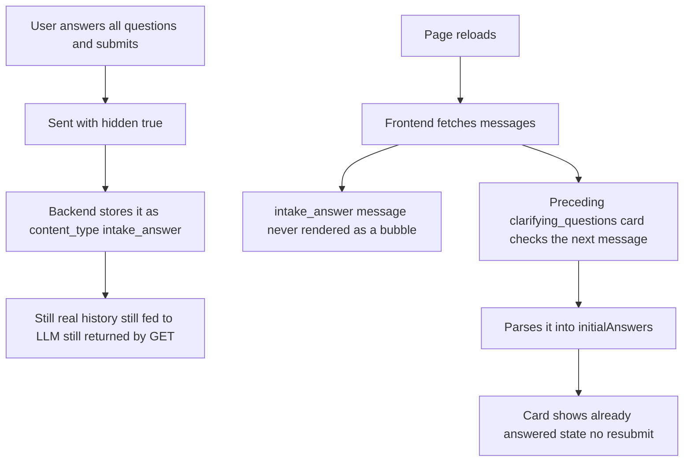

# Fix: Hide Clarifying-Questions Answer From Chat UI Without Losing It From History

| | |
|---|---|
| **Version** | 1.0 |
| **Status** | Implemented |
| **Date Created** | 2026-09-17 |
| **Last Updated** | 2026-09-17 |

| Version | Date | Change |
|---|---|---|
| 1.0 | 2026-09-17 | Initial draft, implemented same session. |

## Problem Statement

### Root Cause Analysis

`ClarifyingQuestions.send()` compiles the user's answers into a plain "key: value" string (e.g. `shape: scalp\nportfolio_share: 10\nconsult_nova: langsung eksekusi`) and sends it exactly like any organic user message. It renders as a raw, technical-looking bubble in the chat — flagged live as unwanted. Separately, since that answer previously had nowhere durable to live except as this same visible bubble, a page refresh reset the originating `clarifying_questions` card back to a blank, unanswered state, since `ClarifyingQuestions`'s own `draft` is local component state with no persistence of its own.

The two problems share one correct fix: the answer must remain a real, persisted chat message (full history, fed to the LLM as context, returned by every read) — it must only be hidden from rendering, never removed from the data. Removing it from history entirely (considered and rejected mid-session) would have broken the second half of the requirement, since there would be nothing left to restore the card's answered state from after a reload.

## Definition of Done

- [x] The compiled answer never renders as a bubble, live or after a reload.
- [x] The answer is still a normal, persisted `agent_chat_messages` row — full chat history, still fed to the LLM as context, still returned by `GET /agent/chats/:id/messages`.
- [x] After a reload, a `clarifying_questions` card that has already been answered shows its given answers instead of resetting to blank, and no longer offers to resubmit.

## Feature Description

`POST /agent/chats/:id/messages` accepts `hidden: boolean`. When true, `ChatService.HandleChatMessage` persists the user message with `content_type: "intake_answer"` instead of `"text"` — the existing column, no migration, no new field. Nothing else about how the message is stored, read, or fed into orchestrator context changes.

Frontend: `ChatThread.tsx`'s `MessageList` skips rendering any message with `content_type === 'intake_answer'` (`return null` for it), and `handleSend` skips setting the optimistic `pendingText` bubble when `hidden` is true, so it never appears even momentarily while in flight. For the *originating* `clarifying_questions` card, `MessageList` checks the very next message in the array (a reply always immediately follows the question it answers, nothing else can occur between them) — if it is an `intake_answer`, its content is parsed back into the same key/value shape `ClarifyingQuestions` built it from and passed down as `initialAnswers`. `ClarifyingQuestions` hydrates its `draft` state from `initialAnswers` on mount and hides its Kirim jawaban/Batal buttons entirely once already answered — nothing left to resubmit.

## Impacted Files

| File | Change |
|---|---|
| `backend/src/http/request/agent/chat/message_request.go` | `[MODIFY]` `MessageRequest` gains `Hidden bool` |
| `backend/src/http/handlers/agent/chats.go` | `[MODIFY]` `PostChatMessageHandler` passes `messageRequest.Hidden` through |
| `backend/src/service/agent/chat_service.go` | `[MODIFY]` `HandleChatMessage` gains a `hidden bool` param; persists `content_type: "intake_answer"` when true |
| `backend/test/service/agent/*.go` | `[MODIFY]` Updated call sites for the new parameter |
| `frontend/http/agent/chatApi.ts` | `[MODIFY]` `AgentChatMessage.content_type` allows `'intake_answer'`; `sendChatMessage` accepts an optional `hidden` argument |
| `frontend/components/agent/ChatThread.tsx` | `[MODIFY]` `MessageList` skips rendering `intake_answer` messages and parses the next message into `initialAnswers` for the preceding `clarifying_questions` card; `handleSend` accepts and threads through `hidden` |
| `frontend/components/agent/ClarifyingQuestions.tsx` | `[MODIFY]` Accepts `initialAnswers`; hydrates `draft` from it; hides the send/cancel row once already answered; `send()` calls `onSendPrompt(body, true)` |

## Flowchart

## Verification Plan

**Automated tests**: `go build`/`go vet`/`gofmt` clean; `tsc`/`eslint` clean.

**Manual verification**: answer a clarifying-questions card fully, confirm no raw "key: value" bubble ever appears (live or after refresh). Refresh the page while the card is still the latest message and confirm it shows the given answers with no send/cancel buttons, instead of resetting to 0/N unanswered.
