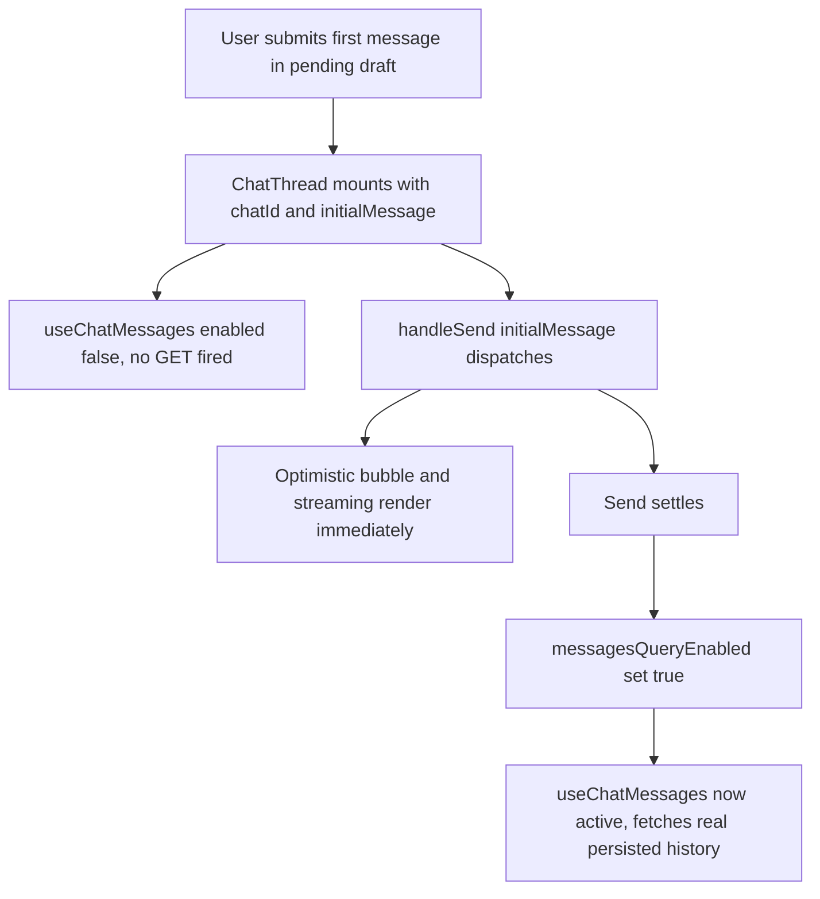

# Fix: New Chat First Message Shows an Unnecessary Loading Flash

| | |
|---|---|
| **Version** | 1.1 |
| **Status** | Implemented |
| **Date Created** | 2026-09-17 |
| **Last Updated** | 2026-09-17 |

| Version | Date | Change |
|---|---|---|
| 1.1 | 2026-09-17 | Status updated to Implemented — `useChatMessages` accepts an `{ enabled }` override (`hooks.ts`); `ChatThread.tsx` tracks `messagesQueryEnabled` (defaulting to `!initialMessage`), flipped to `true` right after the initial `sendChatMessage` call succeeds. `tsc` clean. |
| 1.0 | 2026-09-17 | Initial draft |

## Problem Statement

### Root Cause Analysis

`docs/plans/fix-new-chat-lazy-mount.md` (Implemented) stopped `ChatThread` from mounting until the user sends their first message from `QuasarPanel`'s pending-chat textarea. Once the user does send it, `ChatThread` mounts with a freshly-generated `chatId` and `initialMessage` set.

On mount, `useChatMessages(chatId)` (`frontend/http/agent/hooks.ts:28-34`) fires unconditionally whenever `chatId` is truthy (`enabled: !!chatId`) — including for this brand-new `chatId`, which has no row in the database yet (a chat row is only created via `ChatService.FindOrCreate` once the first `POST /agent/chats/:id/messages` lands). This fires a `GET /agent/chats/<UUID>/messages` for a chat that does not exist yet, and `MessageList` shows its loading skeleton (`{isLoading && <div className="skeleton" .../>}`) while that request is in flight — a visible loading flash between submitting the first message and the optimistic bubble/streaming actually appearing, even though the outcome of this fetch is already known in advance (empty, since nothing is persisted yet).

## Definition of Done

- [ ] Submitting the first message of a freshly-promoted new chat shows the optimistic bubble and streaming indicators immediately, with no loading skeleton flash beforehand.
- [ ] No `GET /agent/chats/:id/messages` request fires for a `chatId` that has not been sent to yet.
- [ ] Existing chat loading (switching to a chat from history, reloading the page) is unaffected — that path already has real data to fetch and must keep working exactly as today.

## Feature Description

`useChatMessages` gains an optional `enabled` override, defaulting to `true` so all existing callers are unaffected:

```ts
export function useChatMessages(chatId?: string, options?: { enabled?: boolean }) {
  return useQuery({
    queryKey: ['agent-chat-messages', chatId],
    queryFn: () => chatApi.getChatMessages(chatId!),
    enabled: !!chatId && (options?.enabled ?? true),
  });
}
```

`ChatThread` tracks a local `messagesQueryEnabled` state, initialized to `!initialMessage` (so an existing/history chat, which never receives an `initialMessage`, is unaffected and fetches immediately). Once the initial `handleSend(initialMessage)` call settles — the same point where `queryClient.invalidateQueries({ queryKey: ['agent-chat-messages', chatId] })` already runs — `messagesQueryEnabled` flips to `true`, so the query becomes active exactly when there is real data worth fetching, and the invalidate call actually triggers a fetch instead of being a no-op against a disabled query.

## Impacted Files

| File | Change |
|---|---|
| `frontend/http/agent/hooks.ts` | `[MODIFY]` `useChatMessages` accepts an optional `{ enabled }` override |
| `frontend/components/agent/ChatThread.tsx` | `[MODIFY]` Track `messagesQueryEnabled` local state, defaulting to `!initialMessage`; flip to `true` once the initial send settles |

## Flowchart



## Verification Plan

**Automated tests**: extend the existing build check (`npm run build`) to confirm no type errors from the new `useChatMessages` option.

**Manual verification**: with the Network tab open, click "+ new chat", type a message, and send it. Confirm no `GET /agent/chats/:id/messages` fires until after the `POST` for that same message completes, and confirm no loading skeleton appears before the optimistic bubble. Then switch to a chat from history and confirm it still loads its messages immediately as before.
