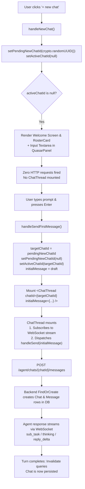

# Fix: New Chat Lazy Mount in QuasarPanel

| | |
|---|---|
| **Version** | 1.1 |
| **Status** | Implemented |
| **Date Created** | 2026-09-16 |
| **Last Updated** | 2026-09-16 |

| Version | Date | Change |
|---|---|---|
| 1.0 | 2026-09-16 | Initial draft |
| 1.1 | 2026-09-16 | Status updated to Implemented — `pendingNewChatId` + `pendingDraft` + `initialMessage` prop shipped in `QuasarPanel.tsx` and `ChatThread.tsx` |

---

## Problem Statement

When a user clicks the **`+ new chat`** button in `QuasarPanel`, a new chat session is initiated eagerly by generating a client UUID and immediately mounting `<ChatThread chatId={activeChatId} />`.

### Root Cause Analysis

1. In `QuasarPanel.tsx` (lines 38–42):
   ```typescript
   function handleNewChat() {
     setActiveChatId(crypto.randomUUID());
     setActiveTaskId(null);
     setDestination('chat');
   }
   ```
2. Setting `activeChatId` immediately causes the JSX branch `{activeChatId && <ChatThread chatId={activeChatId} />}` (line 240) to mount `ChatThread` with this fresh, unpersisted UUID.
3. Inside `ChatThread.tsx` (line 351), the component immediately invokes:
   ```typescript
   const { data: messages = [], isLoading } = useChatMessages(chatId);
   ```
   This triggers an HTTP query: `GET /agent/chats/<UUID>/messages`.
4. On the backend, `ChatService.GetChatMessages` calls `Chats.FindByID(ctx, chatID)`. Because the user has not sent any message yet, no database row exists for this UUID (chat rows are only created when `ChatService.HandleChatMessage` receives the first user message via `FindOrCreate`).
5. Consequently, the backend returns `ErrChatNotFound`, resulting in an HTTP 500 error (`failed to fetch chat messages`) logged in the backend and console:
   ```
   GET /agent/chats/b02c813a-xxxx-xxxx-xxxx-xxxxxxxxxxxx/messages -> 500 Internal Server Error
   ```
6. If the user clicks `+ new chat` multiple times or opens a new chat without sending a message, wasted network round-trips and error responses occur for resources that do not exist yet.

### Failure Chain

```
User clicks "+ new chat"
  │
  ├─ handleNewChat(): setActiveChatId(crypto.randomUUID())
  │
  ├─ <ChatThread chatId={UUID} /> mounts eagerly
  │     │
  │     ├─ useChatMessages(UUID) fires immediately
  │     │     └─ GET /agent/chats/<UUID>/messages
  │     │           └─ Backend: Chats.FindByID -> not found -> ErrChatNotFound
  │     │           └─ Returns 500 Internal Server Error
  │     │
  │     └─ useRealtimeTopic(`agent-chat-stream:${UUID}`) subscribes
  │
  └─ Result: Wasted network calls & server errors before first message is even drafted
```

---

## Definition of Done

1. Clicking `+ new chat` does **not** mount `ChatThread` and does **not** trigger any network request to `GET /agent/chats/<UUID>/messages`.
2. Clicking `+ new chat` stores a `pendingNewChatId` (a client-generated UUID) and renders the welcome view with an active command textarea directly in `QuasarPanel`.
3. The automatic chat selection `useEffect` in `QuasarPanel` does not overwrite `pendingNewChatId` with `chats[0].id`.
4. When the user submits the first message from the pending textarea:
   - `pendingNewChatId` is promoted to `activeChatId`.
   - `ChatThread` is mounted with this `chatId`.
   - The first message is dispatched, triggering the standard WebSocket streaming and backend persistence.
5. All streaming indicators (`LiveSubTasks`, `Thinking`, `reply_delta` text streaming) function identically on the first message as on subsequent turns.
6. Existing chat switching from history or tab navigation remains 100% unaffected.
7. Existing trade execution, buy/sell confirmations, and `PlanCard` workflows remain 100% unaffected.

---

## Feature Description

### 1. Lazy Mount Architecture

Instead of immediately setting `activeChatId` upon clicking `+ new chat`, `QuasarPanel` will track an uncommitted chat state:
- `pendingNewChatId: string | null` — holds the generated UUID for a chat that has been prepared but not yet persisted.
- `pendingDraft: string` — holds the draft input text while the user is composing the first message in the pending chat state.

### 2. State Transitions in `QuasarPanel.tsx`

1. **Initial load / auto-select guard:**
   The existing auto-select effect:
   ```typescript
   useEffect(() => {
     if (activeChatId || pendingNewChatId || chats.length === 0) return;
     setActiveChatId(chats[0].id);
   }, [chats, activeChatId, pendingNewChatId]);
   ```
   Adding `pendingNewChatId` ensures that when a user requests a new chat, the component will not automatically revert to the most recent historical chat.

2. **`handleNewChat` handler:**
   ```typescript
   function handleNewChat() {
     setPendingNewChatId(crypto.randomUUID());
     setPendingDraft('');
     setActiveChatId(null);
     setActiveTaskId(null);
     setDestination('chat');
   }
   ```

3. **Switching to historical chat:**
   When the user selects an existing chat from the `history` destination:
   ```typescript
   setActiveChatId(chat.id);
   setPendingNewChatId(null);
   setPendingDraft('');
   setDestination('chat');
   ```

### 3. Rendering the Pending Chat Input

When `!activeChatId` (whether `pendingNewChatId` is active or no chats exist yet), `QuasarPanel` renders:
- The Quasar welcome text banner.
- `<RosterCard />`.
- An inline command textarea and **Send** button styled identically to `ChatThread`'s input container:
  - Supports Enter to send (Shift+Enter for newline).
  - Disabled when `pendingDraft.trim()` is empty.
  - Subtext: `"only this box is treated as a command"`.

### 4. Promotion on First Send

When the user submits the first message:
1. `QuasarPanel` captures `trimmed = pendingDraft.trim()`.
2. Determines the `targetChatId = pendingNewChatId ?? crypto.randomUUID()`.
3. Promotes `targetChatId` to `activeChatId`.
4. Clears `pendingNewChatId` and `pendingDraft`.
5. Passes `initialMessage={trimmed}` to `<ChatThread chatId={targetChatId} initialMessage={trimmed} />`.
6. Inside `ChatThread`:
   - An optional `initialMessage?: string` prop is accepted in `ChatThreadProps`.
   - On initial mount, if `initialMessage` is provided, `ChatThread` immediately triggers `handleSend(initialMessage)` via a `useRef` guard to avoid duplicate executions.
   - Because `ChatThread` is now mounted:
     - `useRealtimeTopic` connects to the WebSocket stream topic.
     - Optimistic message bubble appears immediately.
     - `sendChatMessage(chatId, trimmed)` sends the `POST /agent/chats/<id>/messages` request.
     - The backend invokes `Chats.FindOrCreate`, persisting the chat row and first message in the database.
     - Live subtasks, thinking traces, and text deltas stream to the UI.
     - Query invalidation for `['agent-chat-messages', chatId]` and `['agent-tasks']` executes smoothly upon completion.

---

## Impacted Files

| File | Change |
|---|---|
| `frontend/components/agent/QuasarPanel.tsx` | Add `pendingNewChatId` and `pendingDraft` state; update `handleNewChat` to avoid eager `activeChatId` assignment; update auto-select `useEffect` guard; render command textarea in pending/empty state; handle promotion to `activeChatId` and pass `initialMessage` on first submit |
| `frontend/components/agent/ChatThread.tsx` | Add optional `initialMessage?: string` prop to `ChatThreadProps`; trigger `handleSend(initialMessage)` on mount when provided using a ref guard |

---

## UI/UX Changes (Lo-Fi)

### Before (Eager Mount)

```
[Quasar Header: + new chat | menu | -]
────────────────────────────────────────
(Instantly mounts ChatThread with unpersisted UUID)
-> GET /agent/chats/<UUID>/messages fires -> 500 ERROR in DevTools
-> MessageList displays empty area
────────────────────────────────────────
[ Textarea: Ask or instruct Quasar... ] [ Send ]
only this box is treated as a command
```

### After (Lazy Mount)

```
User clicks "+ new chat":
[Quasar Header: + new chat | menu | -]
────────────────────────────────────────
┌──────────────────────────────────────┐
│ I am Quasar. Write the instruction   │
│ in your own words — a fast trade...  │
└──────────────────────────────────────┘
[ RosterCard: Quasar / Nova / Comet    ]

(No network request made, ChatThread unmounted)
────────────────────────────────────────
[ Textarea: Ask or instruct Quasar... ] [ Send ]
only this box is treated as a command
```

```
User types "Beli BUMIP 100rb" and presses Enter:
[Quasar Header: + new chat | menu | -]
────────────────────────────────────────
(ChatThread mounts with UUID)
(WebSocket connects -> POST /agent/chats/<UUID>/messages)
┌──────────────────────────────────────┐
│ Beli BUMIP 100rb                     │ (User bubble)
└──────────────────────────────────────┘
* Quasar is thinking...                │ (Live subtask reasoning)
────────────────────────────────────────
[ Textarea: Ask or instruct Quasar... ] [ Send ]
```

---

## Flowchart



---

## Verification Plan

### Automated / Lint Verification
1. Run Next.js lint and TypeScript build checks:
   ```bash
   cd frontend && npm run build
   ```
   Ensure no type errors in `QuasarPanel.tsx` or `ChatThread.tsx`.

### Manual Browser Verification
1. Open the application in the browser with Chrome DevTools open on the **Network** tab (filtered to `messages`).
2. Open the Quasar drawer.
3. Click the **`+ new chat`** button in the header.
4. **Verify:**
   - No request to `GET /agent/chats/<UUID>/messages` appears in the Network tab.
   - The welcome banner, `RosterCard`, and bottom command input are visible.
5. Click **`+ new chat`** several more times.
   - **Verify:** Still zero network requests fired; no errors logged in browser console or backend terminal.
6. Type a prompt into the input box: `"Beli BUMIP 50000"` and press `Enter`.
7. **Verify:**
   - The UI transitions smoothly into `ChatThread`.
   - The user message bubble appears immediately.
   - `POST /agent/chats/<UUID>/messages` is sent and returns `200 OK`.
   - Streaming reasoning and agent steps appear in real time over WebSocket.
   - The confirmation card / workflow reply is rendered correctly.
8. Click **menu** -> **History** -> select a previous chat.
   - **Verify:** Previous chat loads its persisted message history without error.
9. Click **`+ new chat`** again, but navigate to **Tasks** or close the drawer without sending.
   - **Verify:** No phantom/empty chat row appears in the chat history.
