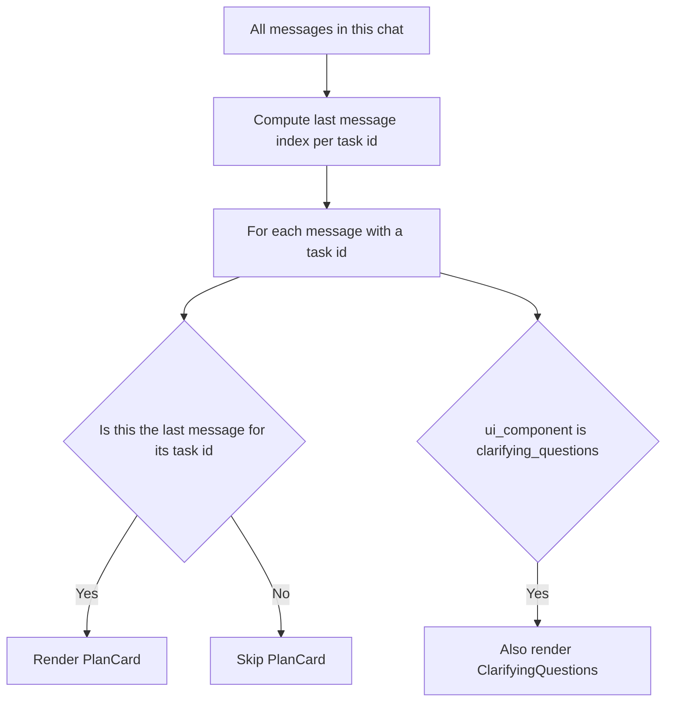

# Fix: PlanCard and Clarifying Questions Render Simultaneously

| | |
|---|---|
| **Version** | 1.2 |
| **Status** | Implemented |
| **Date Created** | 2026-09-17 |
| **Last Updated** | 2026-09-17 |

| Version | Date | Change |
|---|---|---|
| 1.2 | 2026-09-17 | **v1.1's fix was wrong, found live.** Excluding `PlanCard` for every `clarifying_questions` message was too broad — it also hid the legitimate Sub Task list (`understand_request`/`route_decision`, real recorded rows) during an active, still-open intake, since `PlanCard` was suppressed entirely rather than just its `ArmPanel` portion. The real root cause: `PlanCard` re-renders once per *message* that carries a given `ui_ref_task_id`, but it always reads the Task's own current live state — so multiple messages referencing the same Task each rendered their own independent copy, and once the Task became actionable, an *old* message could still show a now-stale `ArmPanel` alongside a newer message's own. Corrected fix: render `PlanCard` only for the *last* message referencing a given task (`lastPlanCardIndexByTaskId`, computed once via `useMemo` over the message list) — the `clarifying_questions` exclusion is removed entirely, since "last message wins" already prevents the original duplication while correctly letting the Sub Task list show during an in-progress intake. `tsc`/`eslint` clean. |
| 1.1 | 2026-09-17 | Status updated to Implemented — `ChatThread.tsx`'s `PlanCard` render condition now excludes `clarifying_questions` alongside the existing `HorizonNoticeCard`/`horizon_notice` exclusions. `tsc` clean. **Superseded by v1.2 above — this approach was wrong.** |
| 1.0 | 2026-09-17 | Initial draft |

## Problem Statement

### Root Cause Analysis

`ChatThread.tsx`'s `MessageList` renders each message's UI blocks as independent `&&` conditions rather than a mutually exclusive set:

```tsx
{message.ui_ref_task_id != null && message.ui_component !== 'HorizonNoticeCard' && message.content_type !== 'horizon_notice' && <PlanCard taskId={message.ui_ref_task_id} chatId={chatId} />}
...
{message.ui_component === 'clarifying_questions' && <ClarifyingQuestions uiProps={message.ui_props} chatId={chatId} onSendPrompt={onSendPrompt} />}
```

`PlanCard` is already excluded for `HorizonNoticeCard`/`horizon_notice` messages, but the same exclusion was never added for `clarifying_questions`. `PlanCard` reads the Task's *current* live state via `useAgentTasks()`/`useTaskReasoning()` (React Query), independent of the specific message it is attached to — so once the underlying Task becomes `is_actionable` (ready to arm), `PlanCard` renders its embedded `ArmPanel` (its own "01/02/03" on-chain step list) for any message carrying that `ui_ref_task_id`, including a message whose `ui_component` is still `clarifying_questions` from when it was first created. The result: the same message renders both the on-chain arm step list (from `PlanCard`/`ArmPanel`) and, immediately after it, a full standalone "3/3 answered" `ClarifyingQuestions` card for the same already-resolved intake — confirmed against the reported screenshots, where an `ArmPanel`-style step list is immediately followed by a re-rendered "INFORMASI TAMBAHAN DIPERLUKAN 3/3" card.

## Definition of Done

- [x] A Task's `ArmPanel`/on-chain step list never appears more than once across the conversation for the same Task.
- [x] The Sub Task list (`understand_request`/`route_decision`/etc.) still shows via `PlanCard` while a Task is genuinely still mid-intake (needs_input, not yet actionable) — a `clarifying_questions` message is not treated as mutually exclusive with `PlanCard`.
- [x] No regression to the normal arm flow once a Task becomes actionable via a later message.

## Feature Description

`MessageList` computes `lastPlanCardIndexByTaskId`, a `Map<taskId, messageIndex>` built once per `messages` change via `useMemo`, recording the index of the *last* message referencing each Task (excluding horizon-notice messages, which never render `PlanCard` at all). `PlanCard` then only renders when the current message's index matches that map's entry for its `ui_ref_task_id`:

```tsx
{message.ui_ref_task_id != null
  && message.ui_component !== 'HorizonNoticeCard'
  && message.content_type !== 'horizon_notice'
  && lastPlanCardIndexByTaskId.get(message.ui_ref_task_id) === index
  && <PlanCard taskId={message.ui_ref_task_id} chatId={chatId} />}
```

`ClarifyingQuestions` keeps its own independent, unrelated condition (`ui_component === 'clarifying_questions'`) — so the *current* message correctly shows both the Sub Task list (via `PlanCard`) and the needs_input Q&A card side by side, while any *earlier* message referencing the same Task no longer renders its own now-redundant `PlanCard` copy.

## Impacted Files

| File | Change |
|---|---|
| `frontend/components/agent/ChatThread.tsx` | `[MODIFY]` `MessageList` computes `lastPlanCardIndexByTaskId` via `useMemo`; `PlanCard`'s render condition keys off it instead of `ui_component` |

## Flowchart



## Verification Plan

**Automated tests**: none — no existing frontend test harness for `ChatThread.tsx`.

**Manual verification**: start a scalp sell, confirm the Sub Task list (`understand_request`/`route_decision`) shows alongside the clarifying-questions card while still mid-intake. Answer through to arm-ready and confirm only the newest message shows `PlanCard`/`ArmPanel` — the earlier intake message no longer shows its own copy. Repeat for a swing/investment horizon notice to confirm no regression there.
