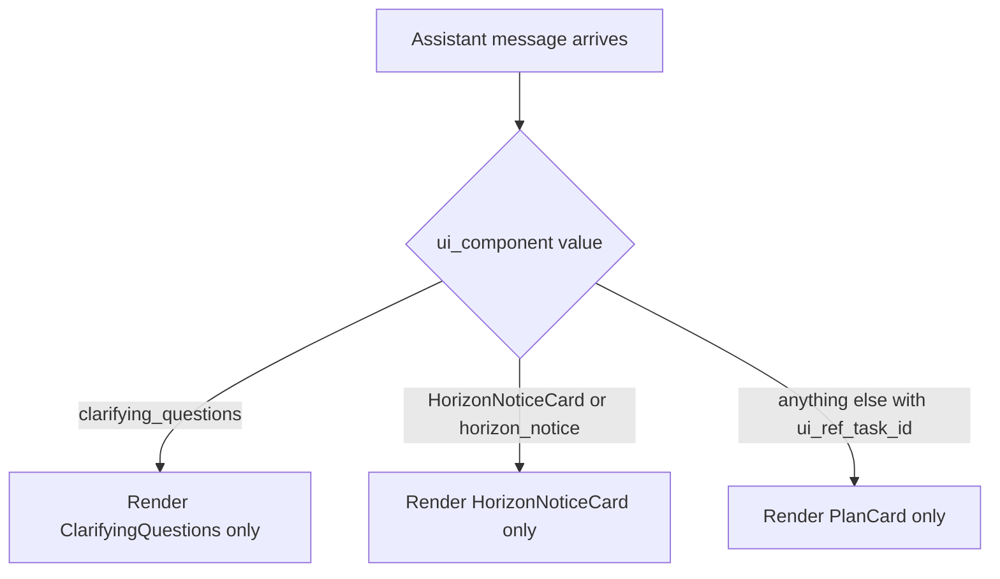

# Fix: PlanCard and Clarifying Questions Render Simultaneously

| | |
|---|---|
| **Version** | 1.1 |
| **Status** | Implemented |
| **Date Created** | 2026-09-17 |
| **Last Updated** | 2026-09-17 |

| Version | Date | Change |
|---|---|---|
| 1.1 | 2026-09-17 | Status updated to Implemented — `ChatThread.tsx`'s `PlanCard` render condition now excludes `clarifying_questions` alongside the existing `HorizonNoticeCard`/`horizon_notice` exclusions. `tsc` clean. |
| 1.0 | 2026-09-17 | Initial draft |

## Problem Statement

### Root Cause Analysis

`ChatThread.tsx`'s `MessageList` renders each message's UI blocks as independent `&&` conditions rather than a mutually exclusive set:

```tsx
{message.ui_ref_task_id != null && message.ui_component !== 'HorizonNoticeCard' && message.content_type !== 'horizon_notice' && <PlanCard taskId={message.ui_ref_task_id} chatId={chatId} />}
...
{message.ui_component === 'clarifying_questions' && <ClarifyingQuestions uiProps={message.ui_props} chatId={chatId} onSendPrompt={onSendPrompt} />}
```

`PlanCard` is already excluded for `HorizonNoticeCard`/`horizon_notice` messages, but the same exclusion was never added for `clarifying_questions`. `PlanCard` reads the Task's *current* live state via `useAgentTasks()`/`useTaskReasoning()` (React Query), independent of the specific message it is attached to — so once the underlying Task becomes `is_actionable` (ready to arm), `PlanCard` renders its embedded `ArmPanel` (its own "01/02/03" on-chain step list) for any message carrying that `ui_ref_task_id`, including a message whose `ui_component` is still `clarifying_questions` from when it was first created. The result: the same message renders both the on-chain arm step list (from `PlanCard`/`ArmPanel`) and, immediately after it, a full standalone "3/3 answered" `ClarifyingQuestions` card for the same already-resolved intake — confirmed against the reported screenshots, where an `ArmPanel`-style step list is immediately followed by a re-rendered "INFORMASI TAMBAHAN DIPERLUKAN 3/3" card.

## Definition of Done

- [ ] A single message never renders both `PlanCard` and `ClarifyingQuestions` at the same time.
- [ ] `PlanCard`'s exclusion condition covers `clarifying_questions` the same way it already covers `HorizonNoticeCard`/`horizon_notice`.
- [ ] No regression to the normal arm flow once a Task becomes actionable via a *different*, later message (the reply/Arm Card invitation).

## Feature Description

One additional exclusion clause on `PlanCard`'s render condition:

```tsx
{message.ui_ref_task_id != null
  && message.ui_component !== 'HorizonNoticeCard'
  && message.content_type !== 'horizon_notice'
  && message.ui_component !== 'clarifying_questions'
  && <PlanCard taskId={message.ui_ref_task_id} chatId={chatId} />}
```

## Impacted Files

| File | Change |
|---|---|
| `frontend/components/agent/ChatThread.tsx` | `[MODIFY]` Add `message.ui_component !== 'clarifying_questions'` to `PlanCard`'s render condition in `MessageList` |

## Flowchart



## Verification Plan

**Automated tests**: none — no existing frontend test harness for `ChatThread.tsx`.

**Manual verification**: run a scalp sell flow through full clarifying-questions intake to arm-ready. Confirm the intake message shows only `ClarifyingQuestions` (never `PlanCard`/`ArmPanel` alongside it), and the follow-up message once the Task is actionable shows only `PlanCard`/`ArmPanel`. Repeat for a swing/investment horizon notice to confirm no regression there.
