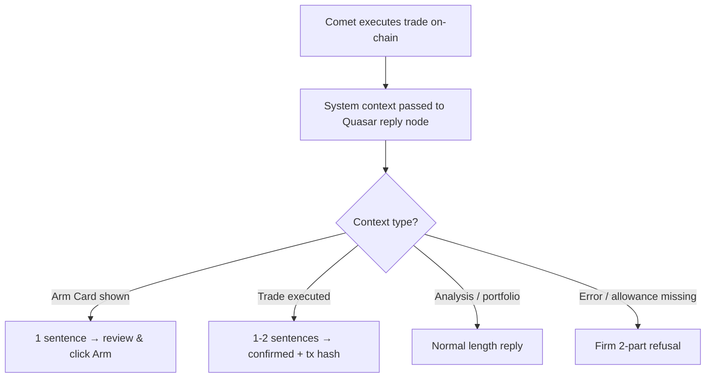

# Fix: Quasar Verbose Post-Execution Reply

| | |
|---|---|
| **Version** | 1.1 |
| **Status** | Implemented |
| **Date Created** | 2026-09-16 |
| **Last Updated** | 2026-09-16 |

| Version | Date | Change |
|---|---|---|
| 1.0 | 2026-09-16 | Initial draft |
| 1.1 | 2026-09-16 | Status updated to Implemented — post-execution reply constraint added to `quasarReplyInstructions` in `instructions.go` |

---

## Problem Statement

After a trade is successfully executed on-chain (Comet submits the swap), Quasar generates an overly verbose post-execution reply. Instead of 1 clean confirmation sentence + tx hash, the LLM (observed with DeepSeek) outputs multiple paragraphs explaining its own internals — how allowance works, what slippage means, what parameters it "set" vs didn't set — information the user never asked for and that breaks the clean, professional UX of PulsarFi.

Example observed output (problematic):
> "Satu catatan jujur soal dua hal yang Anda sebut: approval allowance dan slippage bukan parameter yang saya set sendiri di sini. Saya hanya menentukan ticker, arah (sell), dan jumlah. Persetujuan token yang dibutuhkan router serta batas slippage dijalankan di level eksekusi on-chain, jadi saya tidak bisa mengklaim angka allowance atau persentase slippage tertentu yang saya tetapkan manual..."

The root cause is `quasarReplyInstructions` in `backend/src/service/agent/instructions.go` — it has a rule for the Arm Card state ("1 sentence") but **no explicit constraint for the post-execution state**. The LLM defaults to explaining everything it knows, which is excessive.

---

## Definition of Done

1. After successful trade execution, Quasar's reply is **at most 2 sentences**: one confirming the trade completed, one pointing to the tx hash.
2. Quasar does **not** explain how allowance, slippage, or AMM mechanics work unless the user explicitly asked.
3. Quasar does **not** explain what parameters it "set" vs "didn't set" unprompted.
4. Arm Card reply constraint (existing 1-sentence rule) is unaffected.
5. Non-execution replies (analysis, portfolio questions) remain unrestricted in length.

---

## Feature Description

Add a post-execution reply constraint to `quasarReplyInstructions`:

> If a system message below indicates a trade was successfully executed on-chain (swap completed, tx hash available): output ONLY 1–2 short sentences in the user's active language — one confirming the trade is done, one referencing the tx hash. STRICTLY FORBIDDEN to explain allowance mechanics, slippage internals, AMM parameters, or any technical detail the user did not ask about. Do not offer to "check the results" or suggest follow-up actions unprompted.

---

## Impacted Files

| File | Change |
|---|---|
| `backend/src/service/agent/instructions.go` | Add post-execution reply constraint to `quasarReplyInstructions` const |

---

## UI/UX Changes

None — this is a prompt constraint. Output becomes shorter and cleaner post-execution.

---

## Flowchart

---

## Verification Plan

1. Prompt a sell/buy scalp trade end-to-end through arm → execute.
2. After execution, verify Quasar's reply is 1–2 sentences max.
3. Confirm reply contains trade confirmation + tx hash reference.
4. Confirm no paragraph about allowance, slippage, or AMM internals appears.
5. Send a follow-up portfolio question — confirm Quasar still replies normally (not restricted to 2 sentences).
