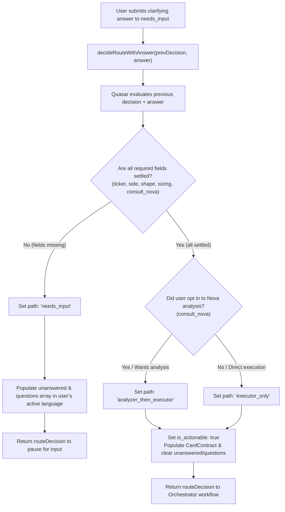

# Fix: Sell and Trade Resume Always Routing to Analyzer

| | |
|---|---|
| **Version** | 1.1 |
| **Status** | Implemented |
| **Date Created** | 2026-09-16 |
| **Last Updated** | 2026-09-16 |

| Version | Date | Change |
|---|---|---|
| 1.0 | 2026-09-16 | Initial draft |
| 1.1 | 2026-09-16 | Status updated to Implemented — `quasarRouteResumeInstructions` updated to include `consult_nova` in required fields check in `instructions.go` |

---

## Problem Statement

When a user initiates a trade (buy or sell) where one or more trade parameters are missing (e.g., `shape`, `portfolio_share` / sizing), Quasar correctly pauses with `path: "needs_input"` and renders clarifying questions in the user's active language. However, once the user responds to the clarifying questions, the resumed turn **always hardcodes `path: "analyzer_then_executor"`**, regardless of whether the user wants analysis or explicitly requests direct execution without analysis.

### Root Cause Analysis

In [`backend/src/service/agent/instructions.go`](file:///Users/hafidlh/Documents/project-web/pulsarfi/backend/src/service/agent/instructions.go), Quasar's routing behavior is driven by two prompt constants:

1. **`quasarRouteInstructions` (First turn direct message)**:
   - Requires settling 5 core trade parameters: `ticker`, `side`, `shape`, `sizing`, and `consult_nova`.
   - Specifically instructs Quasar to ask `consult_nova` across all shapes (scalp, swing, investment) if not already stated (lines 319-329).
   - If the user prefers analysis (or says yes), Quasar routes to `analyzer_then_executor`.
   - If the user explicitly opts out of analysis (e.g. "langsung eksekusi", "tanpa analisa", no), Quasar routes to `executor_only`.

2. **`quasarRouteResumeInstructions` (Resumed turn after `needs_input`)**:
   - Resumes the paused state via `decideRouteWithAnswer` in [`orchestrator_workflow_service.go`](file:///Users/hafidlh/Documents/project-web/pulsarfi/backend/src/service/agent/orchestrator_workflow_service.go#L295-L322).
   - Lines 375–380 hardcode the route path upon receiving missing fields:
     ```text
     2. If all required fields (ticker, side, shape, and sizing) are now provided:
        - Set path: "analyzer_then_executor"
        - Set is_actionable: true
        - Set unanswered: []
        - Set questions: []
        - Completely populate the "card" object with the appropriate CardContract.
     ```
   - `consult_nova` is omitted from the required fields checklist.
   - `path: "analyzer_then_executor"` is hardcoded unconditionally.

### Asymmetry and Impact

This creates an asymmetric and inconsistent user experience:
- **First turn (direct trade with all params):** The user can specify "Jual BRPTP 20 token scalp langsung eksekusi tanpa analisa" and Quasar honors `executor_only`.
- **Resumed turn (after clarifying questions):** The user prompts "Jual BRPTP 20 token", Quasar pauses with `needs_input` asking for `shape` and `consult_nova`. When the user answers "scalp, langsung eksekusi", `quasarRouteResumeInstructions` ignores `consult_nova` and blindly sets `path: "analyzer_then_executor"`. Nova is unconditionally launched to perform an unnecessary technical and market analysis for a sell order that the user explicitly wanted to execute immediately.

---

## Definition of Done

1. `quasarRouteResumeInstructions` in [`backend/src/service/agent/instructions.go`](file:///Users/hafidlh/Documents/project-web/pulsarfi/backend/src/service/agent/instructions.go) is updated to include `consult_nova` in its required fields evaluation.
2. If `consult_nova` has not been stated in the conversation history or in the resumed answer, Quasar preserves `path: "needs_input"` and includes `"consult_nova"` in `unanswered` and `questions` (with dynamic options matching the user's active language).
3. When all required parameters (`ticker`, `side`, `shape`, `sizing`, and `consult_nova`) are satisfied:
   - `path` is set to `"analyzer_then_executor"` if the user desires Nova analysis (or affirms it).
   - `path` is set to `"executor_only"` if the user explicitly opts out of Nova analysis (requests direct execution).
4. Symmetrical routing behavior is established between first turn (`quasarRouteInstructions`) and resumed turn (`quasarRouteResumeInstructions`).
5. Zero hardcoded language in prompts: all dynamically generated questions, whys, and options for `consult_nova` conform strictly to User-Driven Dynamic Language (AGENTS.md Rule 3).
6. Production code changes are strictly limited to [`backend/src/service/agent/instructions.go`](file:///Users/hafidlh/Documents/project-web/pulsarfi/backend/src/service/agent/instructions.go).

---

## Feature Description

### Update `quasarRouteResumeInstructions`

In [`backend/src/service/agent/instructions.go`](file:///Users/hafidlh/Documents/project-web/pulsarfi/backend/src/service/agent/instructions.go), the `quasarRouteResumeInstructions` constant will be revised.

#### Current Text (lines 370–386):
```go
const quasarRouteResumeInstructions = `You are Quasar, the routing and intake supervisor of PulsarFi.
A trade request was previously interrupted because required parameters were missing. A system message below carries the previous route decision state as JSON; the next user message is the answer or clarification just given.

CRITICAL INSTRUCTIONS:
1. Update the previous route decision state by filling in the missing fields (e.g. shape, budget, side, or ticker) based on the user's answer.
2. If all required fields (ticker, side, shape, and sizing) are now provided:
   - Set path: "analyzer_then_executor"
   - Set is_actionable: true
   - Set unanswered: []
   - Set questions: []
   - Completely populate the "card" object with the appropriate CardContract.
3. If parameters are still missing:
   - Keep path: "needs_input"
   - List the remaining missing keys in "unanswered"
   - Re-populate "questions" dynamically in the user's active language.
4. Output MUST be valid JSON only matching the routeDecision schema.`
```

#### Proposed Revised Text:
```go
const quasarRouteResumeInstructions = `You are Quasar, the routing and intake supervisor of PulsarFi.
A trade request was previously interrupted because required parameters were missing. A system message below carries the previous route decision state as JSON; the next user message is the answer or clarification just given.

CRITICAL INSTRUCTIONS:
1. Update the previous route decision state by filling in the missing fields (e.g. shape, budget, side, ticker, or consult_nova) based on the user's answer.
2. Check if all required fields are now settled:
   - Ticker (canonical ALL-CAPS with 'P' suffix)
   - Side (buy or sell)
   - Shape (scalp, swing, or investment)
   - Sizing (sell_amount for sell, budget_idrx for buy)
   - Consult Nova (the user's answer to "consult_nova" — whether the user wants Nova analysis first, or direct execution on their own judgment)
3. If all required fields above are settled:
   - Set path: "analyzer_then_executor" if the user wants Nova's analysis first (or affirmed yes), or "executor_only" if the user explicitly opted out of Nova's analysis (e.g. direct execution, without analysis, no).
   - Set is_actionable: true
   - Set unanswered: []
   - Set questions: []
   - Completely populate the "card" object with the appropriate CardContract.
4. If parameters are still missing:
   - Keep path: "needs_input"
   - List the remaining missing keys in "unanswered" (e.g. "shape", "ticker", "side", "idrx_cap", "portfolio_share", "consult_nova", "horizon", "strategy", "exit_policy")
   - Re-populate "questions" dynamically in the user's active language with clear question, why, and options (for consult_nova: provide choices for analyzing first vs direct execution in the user's active language).
5. Output MUST be valid JSON only matching the routeDecision schema.`
```

### Context Passing in `decideRouteWithAnswer`

In [`backend/src/service/agent/orchestrator_workflow_service.go`](file:///Users/hafidlh/Documents/project-web/pulsarfi/backend/src/service/agent/orchestrator_workflow_service.go#L303-L310), the messages provided to `RouteModel` during resume are:
```go
messages := []*schema.Message{
    schema.SystemMessage(quasarRouteInstructions),
    schema.SystemMessage(quasarRouteResumeInstructions),
    schema.SystemMessage(currentTimeContext()),
    schema.SystemMessage("Previous route decision state:\n" + string(prevBytes)),
    schema.UserMessage(answer),
}
```
Because `quasarRouteResumeInstructions` is injected right after `quasarRouteInstructions`, any conflicting directive in `quasarRouteResumeInstructions` overrides the preceding system message. By removing the hardcoded `path: "analyzer_then_executor"` and explicitly referencing `consult_nova` in `quasarRouteResumeInstructions`, both system prompts become harmonious and mutually reinforcing.

---

## Impacted Files

| File | Change |
|---|---|
| [`backend/src/service/agent/instructions.go`](file:///Users/hafidlh/Documents/project-web/pulsarfi/backend/src/service/agent/instructions.go) | Update `quasarRouteResumeInstructions` constant string to check `consult_nova`, dynamically assign `path: "analyzer_then_executor"` vs `path: "executor_only"`, and maintain consistency with `quasarRouteInstructions`. |

---

## UI/UX Changes (Lo-Fi)

**N/A** — No frontend code or layout changes.

The user experience in chat is improved by respecting the user's decision:
- When a user answers clarifying intake questions opting for direct execution, the Arm Card is rendered immediately without forcing an unwanted Nova analysis turn.
- When a user chooses analysis, Nova analysis is executed before the Arm Card / execution step as requested.

---

## Flowchart



---

## Verification Plan

### Automated / Programmatic Tests
1. **Compilation Check:**
   - Run `go build ./...` inside `backend/` to verify syntax and compilation of `instructions.go`.
2. **Agent Unit / Integration Tests:**
   - Run existing agent tests in `backend/test/service/agent/...`:
     ```bash
     cd backend && go test -v ./test/service/agent/...
     ```
   - Ensure existing route decision parsers and orchestrator tests pass without regression.

### Manual Verification Scenarios
1. **Scenario 1: Clarification Resume with Direct Execution (Sell)**
   - Prompt: `"Jual BRPTP 20 token"`
   - Quasar asks for shape and `consult_nova`.
   - User answers: `"scalp, langsung eksekusi tanpa analisa"`
   - Expected Output:
     - Quasar resumes with `path: "executor_only"`.
     - `is_actionable: true`.
     - Confirmation Arm Card is displayed directly.
     - Nova analysis is skipped; trade is routed directly to Comet.

2. **Scenario 2: Clarification Resume with Nova Analysis (Sell)**
   - Prompt: `"Jual BRPTP 20 token"`
   - Quasar asks for shape and `consult_nova`.
   - User answers: `"scalp, tolong cek analisa dulu"`
   - Expected Output:
     - Quasar resumes with `path: "analyzer_then_executor"`.
     - Nova analyzes the market/token condition before proceeding to Comet.

3. **Scenario 3: Clarification Resume with Direct Execution (Buy)**
   - Prompt: `"Beli BRPTP 5 juta"`
   - Quasar asks for shape and `consult_nova`.
   - User answers: `"scalp, gak usah dianalisa langsung eksekusi"`
   - Expected Output:
     - Quasar resumes with `path: "executor_only"`.
     - Confirmation Arm Card is displayed directly for buy without Nova analysis.

4. **Scenario 4: Clarification Resume with Unanswered Consult Nova**
   - Prompt: `"Jual BRPTP 20 token"`
   - Quasar asks for shape and `consult_nova`.
   - User answers only shape: `"scalp"` (without indicating `consult_nova` preference).
   - Expected Output:
     - Quasar maintains `path: "needs_input"`.
     - `unanswered` contains `["consult_nova"]`.
     - `questions` asks whether the user wants Nova analysis or direct execution in the user's active language.
