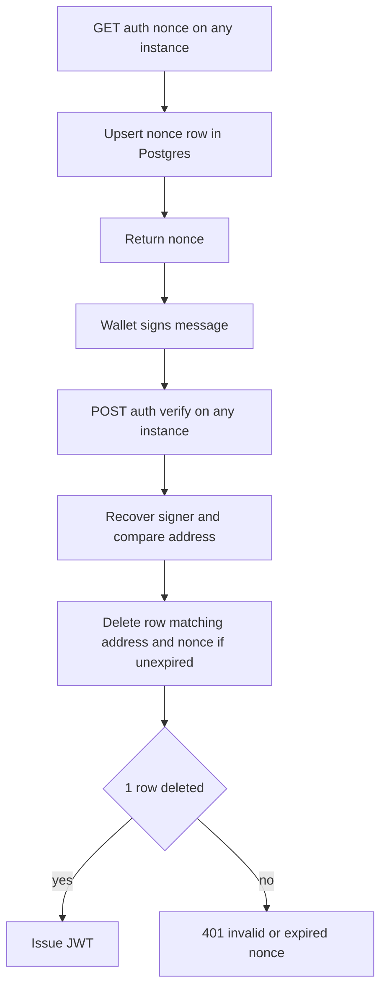

# Fix SIWE Nonce Lost Across Multiple Instances

| | |
|---|---|
| **Version** | 1.4 |
| **Status** | Implemented |
| **Date Created** | 2026-09-30 |
| **Last Updated** | 2026-09-30 |

| Version | Date | Change |
|---|---|---|
| 1.4 | 2026-09-30 | Header: Status changed from Approved to Implemented. Migration 026 applied to production and deployed as Fly release v29; Verification Plan executed on Fly with the retail wallet 0xD8bf (12 of 12 sign-ins, 8 of 8 forced cross-machine nonce/verify pairs in both directions via `fly-force-instance-id`, replay 401, malformed address 400, expired nonce 401 after 310s, expired rows cleaned on next issue). No content change to other sections. |
| 1.3 | 2026-09-30 | Feature Description: `GET /auth/nonce` now rejects a non-hex `address` with 400, because the address becomes a bounded DB key (`VARCHAR(42)`) instead of an unbounded in-memory map key. Impacted Files: handler row mentions the validation. Verification Plan: added a malformed-address check. |
| 1.2 | 2026-09-30 | Header: Status changed from Draft to Approved after review; no content change |
| 1.1 | 2026-09-30 | Feature Description: dropped the `NonceStore` interface; `AuthService` calls `SiweNonceRepository` directly (service to repository only), random nonce generation and TTL decision move into `AuthService`. Impacted Files: `src/auth/nonce.go` is now `[DELETE]`, `bootstrap.go` and `service/index.go` just drop the store wiring. Definition of Done: added layering bullet. |
| 1.0 | 2026-09-30 | Initial draft |

## Problem Statement

Wallet sign-in fails with `401 invalid or expired nonce` roughly half the time in production.

`auth.NonceStore` keeps nonces in an in-process map, and `pulsarfi-api` runs 2 Fly machines. `GET /auth/nonce` and `POST /auth/verify` are load-balanced independently, so the nonce is often issued on machine A and consumed on machine B.

Production logs on 2026-09-30 show 5 of 5 failed attempts crossed machines. The signature check passed in all of them, so only the nonce lookup fails.

## Definition of Done

- A nonce issued by any instance can be consumed by any other instance.
- A nonce stays one-time-use and expires after 5 minutes; one active nonce per wallet (re-issue overwrites).
- A DB failure while issuing or consuming returns a server error, never a silent "invalid or expired nonce".
- The in-memory `NonceStore` and its cleanup goroutine are removed.
- Database access for nonces goes only through `AuthService` to `SiweNonceRepository`; nothing else touches the table.
- No frontend change; sign-in works reliably on Fly with 2 machines running.

## Feature Description

Store nonces in a new `siwe_nonces` table (PK `address`, lowercase).

Layering is service to repository only. `AuthService` holds `SiweNonces *repository.SiweNonceRepository`, the same way it already holds `Custodians`.

- **Issue (`AuthService.Nonce`):** the service generates the random nonce and computes `expiresAt = now + 5m`, then calls the repository to upsert `(address, nonce, expires_at)` and to delete rows already expired.
- **Consume (`AuthService.Verify`):** the service passes `address`, `nonce` and the current time; the repository runs `DELETE ... WHERE address = ? AND nonce = ? AND expires_at > ?` and reports whether exactly 1 row was deleted. The delete is atomic, so a nonce cannot be replayed across instances.

`NonceHandler` rejects an `address` that is not a valid hex address with 400 before touching the service, since the address is now a bounded DB key.

The repository holds queries only, no TTL or generation logic. `src/auth/nonce.go` has no remaining role (store and cleanup goroutine are replaced by the table, generation moves into the service) and is deleted; `bootstrap.go` no longer builds a store.

| Option | Verdict |
|---|---|
| Postgres table (chosen) | Survives restart and scale-out, no new infra |
| `fly scale count 1` | Stopgap only, breaks again on scale-out |
| fly-replay / sticky routing | Fragile, couples auth to routing |

## Out of Scope

| Item | Note |
|---|---|
| `nonce` request field vs nonce inside the signed `message` | `Verify` does not cross-check them; not the cause of this 401, tracked as follow-up |
| `RateLimit(100, time.Minute)` middleware | Likely per-process as well; not verified, tracked as follow-up |
| Automated tests | Verification is done against the real Fly deployment (see Verification Plan) |

## Impacted Files

| File | Change |
|---|---|
| `backend/migrations/026_create_siwe_nonces.sql` | [NEW] table plus index on `expires_at` |
| `backend/src/model/siwe_nonce.go` | [NEW] GORM model |
| `backend/src/repository/siwe_nonce_repository.go` | [NEW] upsert, consume (delete if unexpired), delete expired |
| `backend/src/repository/index.go` | [MODIFY] register `SiweNonce` in the registry |
| `backend/src/auth/nonce.go` | [DELETE] in-memory store replaced by the table; no caller remains |
| `backend/src/service/auth/auth_service.go` | [MODIFY] hold `SiweNonces` repository, generate nonce and decide TTL, pass `ctx`, handle errors |
| `backend/src/service/index.go` | [MODIFY] remove `NonceStore` from `Config`, give `AuthService` `repos.SiweNonce` |
| `backend/src/app/bootstrap.go` | [MODIFY] drop `auth.NewNonceStore()` and the `NonceStore` config field |
| `backend/src/http/handlers/auth/handler.go` | [MODIFY] `NonceHandler` validates address (400) and handles store error (500); `VerifyHandler` separates 401 from 500 |

## UI/UX Changes (Lo-Fi)

None. Users see the existing SIWE flow succeed reliably.

## Flowchart

## Rollout

1. Apply migration `026` to the production database first (no in-code migration runner exists; migrations are applied manually).
2. `fly deploy`.

During the rolling restart, old and new machines briefly disagree on where nonces live; a failed sign-in in that window is retryable.

## Verification Plan

All verification runs against the real Fly deployment (`pulsarfi-api`), since the bug only exists with more than one instance.

| Step | Expected |
|---|---|
| `fly status -a pulsarfi-api` | Both machines `started` |
| Connect a wallet on the production frontend and sign in, repeat at least 10 times (disconnect between attempts) | Every attempt succeeds |
| `fly logs -a pulsarfi-api --no-tail` filtered on `verify` | No `invalid or expired nonce`; attempts show `nonce` and `verify` served by different machines and still `verify: ok` |
| Reuse the same nonce and signature a second time (replay) | `401 invalid or expired nonce` |
| Wait over 5 minutes between `nonce` and `verify` | `401 invalid or expired nonce` |
| `GET /api/v1/auth/nonce?address=not-an-address` | `400` |
| `SELECT count(*) FROM siwe_nonces WHERE expires_at < now()` after several new issues | Expired rows are cleaned up opportunistically, not accumulating |
