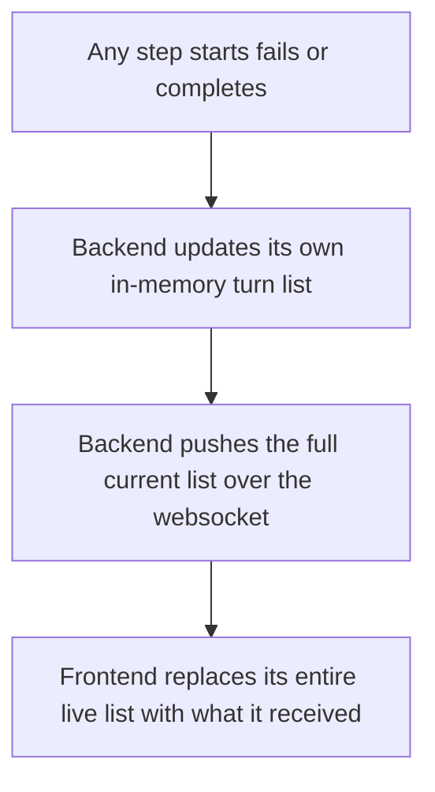

# Fix: Backend Must Own Sub Task Attempt/Retry State, Frontend Only Renders

| | |
|---|---|
| **Version** | 2.1 |
| **Status** | Implemented |
| **Date Created** | 2026-09-17 |
| **Last Updated** | 2026-09-17 |

| Version | Date | Change |
|---|---|---|
| 2.1 | 2026-09-17 | Status updated to Implemented. Backend: `AgentEventCallbacks`/`orchestratorTurn` gained `OnSubTaskFailed`; `RunContext` gained `OnSubTaskFailed`/`CurrentAgent`/`CurrentStepName`, set right before each `runRoleAgent` call in `orchestrator_workflow_service.go`; `graceful_tool_service.go` calls it via `RunContextFrom(ctx)` when it catches a tool error; `chats.go` gained `liveSubTasks` (the turn-scoped accumulator: `started`/`failed`/`done`, each republishing the full list as one `sub_tasks` event) replacing the old per-event `sub_task`/`sub_task_started` publishes. Frontend: `chatApi.ts`'s `ChatStreamEvent` replaces `sub_task`/`sub_task_started` with a single `sub_tasks: LiveSubTask[]` variant; `ChatThread.tsx` deleted `addStartedPlaceholder`/`mergeSubTaskDone`/the placeholder helpers entirely, `LiveSubTasks` now renders `LiveSubTask` directly (array index as key, `row?.reasoning`/`row?.output` once done, `reason` when failed). `go build`/`go vet`/`gofmt` and `tsc` clean. |
| 2.0 | 2026-09-17 | Replaced the `attempt_id` + per-outcome event design (`sub_task_started`/`sub_task_failed`/`sub_task`) with a full-list-snapshot-per-push model — every relevant WebSocket push carries the turn's complete, self-contained sub task list; the frontend does an unconditional state replace, with zero matching, merging, or upserting of any kind. Backend change scoped strictly to what it serializes onto the socket, not to the orchestrator's internal retry/control-flow logic. |
| 1.0 | 2026-09-17 | Initial draft |

## Problem Statement

### Root Cause Analysis

The backend only ever emits granular, per-step events over the WebSocket (`sub_task_started`, `sub_task`). When a tool call inside a step fails, `graceful_tool_service.go`'s `gracefulTool.InvokableRun` (lines 31-59) catches it, logs it, and returns a soft `{"tool_error": ...}` payload for the LLM — but nothing is ever pushed to the frontend saying that attempt ended. If Supervisor then retries the same node (`orchestrator_workflow_service.go`'s `route_to_analyzer`/`gather_evidence` calls, e.g. lines 535/556), the frontend receives a second `sub_task_started` for the same `(agent, step_name)` with no information that this is a retry or that the prior attempt failed.

To cope with this gap, `ChatThread.tsx` currently *infers* the failure client-side (`addStartedPlaceholder`/`mergeSubTaskDone`, matching and relabeling rows by `(agent, step_name)`). This is a decision about what happened, made in the frontend, from incomplete information — the frontend should never need to guess anything; it should only render what the backend already knows and states directly. A real failure is also never shown as a failure today — it is silently relabeled `retried`, a status that exists nowhere in the backend's own vocabulary.

## Definition of Done

- [ ] Every WebSocket push related to a turn's sub task progress carries the **full, current list** of that turn's sub tasks — not a single incremental event — including any attempt that failed, with a real `failed` status and reason.
- [ ] The frontend replaces its entire live sub task list with exactly what it receives on every push (`setLiveSubTasks(payload.sub_tasks)`) — no id lookup, no matching by `(agent, step_name)`, no append, no merge, no upsert of any kind.
- [ ] A failed attempt appears as its own real row with a `FAILED` status and the backend's own reason text — never hidden, never relabeled to a euphemism.
- [ ] A retried attempt appears as its own separate entry within that same full list — no relationship field between attempts (no `attempt_id`, no `supersedes`) is introduced anywhere.
- [ ] The orchestrator's own decision logic for whether/when to retry a node is untouched — only the data it exposes over the WebSocket changes.
- [ ] No regression to the single-attempt, no-failure path (the common case).

## Feature Description

The orchestrator already tracks, internally, which steps have started and finished within a turn (the same information `SubTaskRecorder`/`RunContext`'s callbacks already touch). Instead of firing granular `sub_task_started`/`sub_task` events that the frontend must reconcile against each other, the turn's in-memory list — each entry carrying `agent`, `step_name`, and its real current status (`in_progress` / `done` / `failed`) — is serialized as a whole and pushed as a single payload every time any entry in it changes.

`graceful_tool_service.go`'s `gracefulTool.InvokableRun`, on catching a tool failure, now also marks the enclosing step's entry in the turn's list as `failed` (with the caught error as `reason`) before the updated list is next pushed — this is the one new piece of plumbing needed to connect a tool-level failure back to the turn-level list. The orchestrator's own decision of whether to retry a node afterward (`orchestrator_workflow_service.go`) is not touched by this change at all.

`ChatThread.tsx`'s handling collapses to one line per relevant event: `setLiveSubTasks(payload.sub_tasks)`. `addStartedPlaceholder` and `mergeSubTaskDone` are deleted outright — there is nothing left to reconcile client-side.

## Impacted Files

| File | Change |
|---|---|
| `backend/src/service/agent/run_context_service.go` | `[MODIFY]` Turn-scoped sub task list (`agent`/`step_name`/`status`/`reason`) built up in memory as steps progress, replacing the single-callback-per-event shape |
| `backend/src/service/agent/graceful_tool_service.go` | `[MODIFY]` On catching a tool error, mark the enclosing step's entry in the turn's list as `failed` with the error as `reason`, before the list is next pushed |
| `backend/src/service/agent/orchestrator_workflow_service.go` | `[MODIFY]` Push the full turn list after each step starts, fails, or completes, instead of firing a single-step event. Retry decision logic itself is unchanged |
| `frontend/http/agent/chatApi.ts` | `[MODIFY]` The sub-task-related `ChatStreamEvent` carries `sub_tasks: AgentSubTask[]` (the full list) instead of a single row |
| `frontend/components/agent/ChatThread.tsx` | `[MODIFY]` Delete `addStartedPlaceholder`/`mergeSubTaskDone`; replace all sub-task event handling with `setLiveSubTasks(payload.sub_tasks)` |

## Flowchart

## Verification Plan

**Automated tests**: backend test forcing a tool failure inside a step, asserting the next pushed list contains that step marked `failed` with a real reason, and that a subsequent retry attempt appears as an additional entry in a following pushed list.

**Manual verification**: temporarily break a tool's API key to force a real failure, confirm the live sub task list shows a genuine `FAILED` row with a real reason, followed by a new entry for the retry — no row is ever a client-side guess, and no row gets stuck in `IN PROGRESS` forever.
