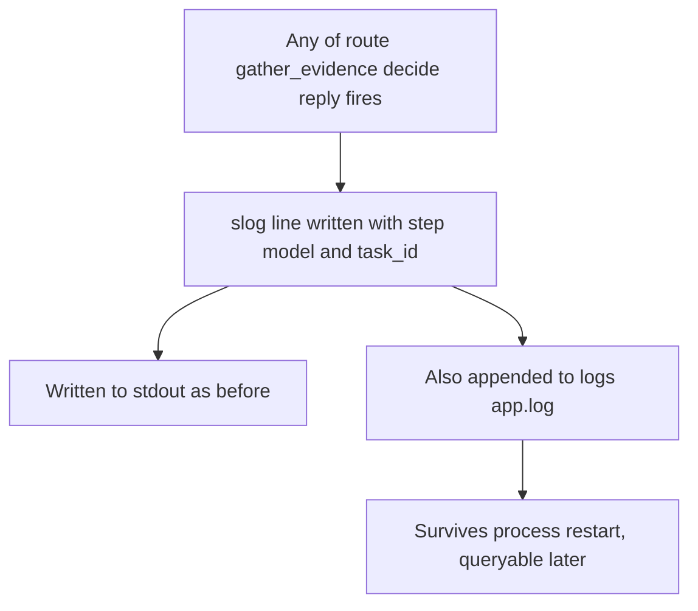

# LLM Call Logging

| | |
|---|---|
| **Version** | 1.0 |
| **Status** | Implemented |
| **Date Created** | 2026-09-10 |
| **Last Updated** | 2026-09-10 |

---

## 1. Problem Statement

Asked which DeepSeek model got called yesterday — the answer was "cannot be known, from any source." Checked two candidates: DeepSeek's own API has no usage-history-by-model endpoint (only `/user/balance` and `GET /models`, confirmed by direct API research); PulsarFi's own logger (`logger.go`) wrote JSON only to stdout, with no file output, so once the local `go run .` process (or its terminal) ended, everything it had logged was gone — not recoverable, not a persistence bug fixable after the fact, since the data was never durable in the first place.

## 2. Definition of Done

- Every real LLM call the orchestrator makes (`route`, `gather_evidence`, `decide`, `reply`) is logged with which model actually served it.
- Log output survives a process restart — durable on disk, not only in a terminal's scrollback.
- Verified live, not assumed: a real chat turn against the running backend produces the expected log lines.

## 3. Feature Description

- `backend/src/logger/logger.go`: writes to both `os.Stdout` (unchanged) and a new append-only `logs/app.log` file (`io.MultiWriter`), created on startup if missing. `logs/` added to `.gitignore` — this is runtime output, not source.
- `backend/src/service/agent/orchestrator_service.go`: `Orchestrator` gains four plain string fields (`RouteModelName`, `ReplyModelName`, `AnalyzerModelName`, `ExecutorModelName`) — display metadata only, never consulted for any routing/behavior decision. A `slog.InfoContext` call is added at each of the four real model-invocation points (`runRoute`, `runAnalyze`, `runExecute`, `runReply`), logging `step`, `model`, and `task_id` where one exists.
- `backend/src/service/agent_registry.go`: populates the four name fields from the same `external.ModelFlash`/`external.ModelPro` constants already used to build the actual model clients (Quasar route/reply and Nova on Flash, Comet on Pro) — the log always reflects what was actually configured, never a separately-maintained guess.

## 4. Impacted Files

| File | Change |
|---|---|
| `backend/src/logger/logger.go` | `[MODIFY]` dual stdout+file output |
| `backend/.gitignore` | `[MODIFY]` ignore `logs/` |
| `backend/src/service/agent/orchestrator_service.go` | `[MODIFY]` model-name fields + log call at each of the 4 LLM invocation points |
| `backend/src/service/agent_registry.go` | `[MODIFY]` populate the new fields at construction |

## 5. UI/UX Changes (Lo-Fi)

N/A — backend observability only.

## 6. Flowchart

## 7. Verification Plan

### Automated

- `go build ./...`, `go vet ./...`, `gofmt -l` — clean on all touched files.

### Manual (done this session, live, not simulated)

- Started the backend (`go run .`), confirmed `logs/app.log` created and receiving the same lines as stdout.
- Authenticated as the demo retail-investor wallet (`0xD8bf50C157a79260C77B25F89ef713E6c3FeDA6f`, real SIWE sign with `DEMO_INVESTOR_RETAIL_PRIVATE_KEY`) via the real `/auth/nonce` + `/auth/verify` endpoints.
- Sent one real, minimal chat turn ("Halo, hari ini hari apa?") — a pure-conversation `path: none` turn, chosen specifically to be the cheapest possible real DeepSeek call. Confirmed `logs/app.log` recorded exactly two lines: `step=route, model=deepseek-v4-flash` and `step=reply, model=deepseek-v4-flash, task_id=0` — matching the code's own wiring exactly, and surviving in the file after the request completed.
- Checked DeepSeek's real `/user/balance` before and after this call: `$1.89` both times — cost too small to register at 2-decimal precision for a single Flash-tier turn, confirming this specific verification was effectively free.
