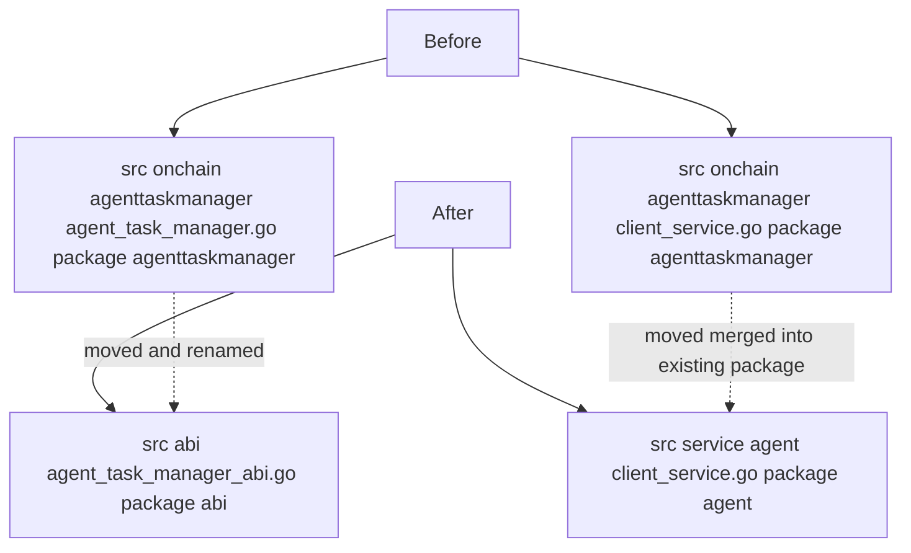

# Onchain Client Relocation

| | |
|---|---|
| **Version** | 1.0 |
| **Status** | Implemented |
| **Date Created** | 2026-09-10 |
| **Last Updated** | 2026-09-10 |

---

## 1. Problem Statement

`backend/src/onchain/agenttaskmanager/` held two files with very different natures under one package: `agent_task_manager.go`, a large (111KB) abigen-generated ABI binding ("Code generated - DO NOT EDIT"), and `client_service.go`, the hand-written `Client` wrapping that binding with a real signer (`AGENT_WALLET_PRIVATE_KEY`) and the actual `CreateTask`/`GrantTradePermission`/`RecordSubTasks`/`CancelTask`/`ExecuteTrade`/`TradePermissionRemaining` calls consumed throughout `service/agent`. Mixing a generated binding with hand-written business logic in the same package makes it easy to mistake one for the other, and there was no dedicated place for other contracts' generated bindings if any are added later. Executed directly per explicit instruction this session, not derived from a prior plan.

## 2. Definition of Done

- Generated ABI bindings live in their own top-level `src/abi` package, separate from any hand-written logic.
- The hand-written on-chain `Client` lives directly inside `service/agent` (the package that actually owns and consumes it), not a separate `onchain` package one level removed.
- `backend/src/onchain/` no longer exists.
- `go build ./...`, `go vet ./...`, `gofmt -l` all clean; no leftover references to the old package path anywhere in the repo.

## 3. Feature Description

- `backend/src/onchain/agenttaskmanager/agent_task_manager.go` → `backend/src/abi/agent_task_manager_abi.go`, package renamed `agenttaskmanager` → `abi`. Content otherwise untouched (still generated, never hand-edited).
- `backend/src/onchain/agenttaskmanager/client_service.go` → `backend/src/service/agent/client_service.go`, package renamed `agenttaskmanager` → `agent` (merged directly into the existing `service/agent` package, alongside `task_service.go`/`orchestrator_service.go`/etc.). Required follow-on changes, since it's now the same package as what it used to import:
  - Dropped the now-self-import of `github.com/horizonlabs/pulsarfi-backend/src/service/agent`.
  - Added an import of the new `github.com/horizonlabs/pulsarfi-backend/src/abi` package; every reference to the generated binding's symbols is now qualified (`*abi.AgentTaskManager`, `abi.NewAgentTaskManager(...)`, `abi.AgentTaskManagerSubTaskRecord{...}`).
  - `agent.TradeSide`/`agent.TradeSideSell` (previously cross-package) became unqualified `TradeSide`/`TradeSideSell`, since `state_service.go` already declares them in the same package this file now belongs to.
  - The file's own top comment, which explained an import-cycle avoidance that no longer applies (the file no longer imports `agent` at all — it *is* `agent` now), was corrected rather than left stale.
- `backend/src/service/agent_registry.go`: dropped the `github.com/horizonlabs/pulsarfi-backend/src/onchain/agenttaskmanager` import; `agenttaskmanager.NewClientFromEnv(ctx)` → `agentsvc.NewClientFromEnv(ctx)` (the package's own existing alias for `service/agent`).
- `backend/src/onchain/` (now empty) deleted entirely.

No other file in the repository imported the old package path (confirmed by grep before and after).

## 4. Impacted Files

| File | Change |
|---|---|
| `backend/src/abi/agent_task_manager_abi.go` | `[NEW, moved]` from `src/onchain/agenttaskmanager/agent_task_manager.go`, package `agenttaskmanager` → `abi` |
| `backend/src/service/agent/client_service.go` | `[NEW, moved]` from `src/onchain/agenttaskmanager/client_service.go`, package `agenttaskmanager` → `agent`; qualified symbols updated, self-import dropped |
| `backend/src/service/agent_registry.go` | `[MODIFY]` import and call site updated to the relocated package |
| `backend/src/onchain/` | `[DELETED]` — empty after the move |

## 5. UI/UX Changes (Lo-Fi)

N/A — backend package reorganization only, no behavior change.

## 6. Flowchart

## 7. Verification Plan

### Automated

- `go build ./...` — clean.
- `go vet ./...` — clean.
- `gofmt -l` on every touched file — clean.
- `grep -rl "onchain/agenttaskmanager\|agenttaskmanager\."` across the repo — zero matches, confirming no leftover reference to the old path or package name.

### Manual

- None required — pure relocation, no behavior change to verify beyond compilation.
