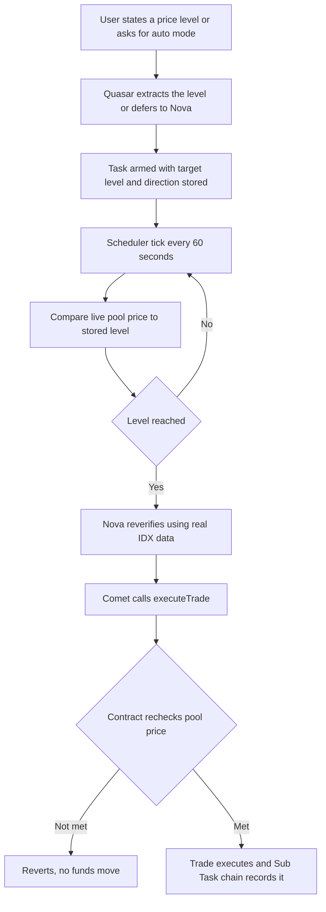

# On-Chain Investing Guardrails, Sell Pipeline, Parallel Tasks & Horizon Expiry Refactor

| | |
|---|---|
| **Version** | 3.24 |
| **Status** | Closed |
| **Date Created** | 2026-09-14 |
| **Last Updated** | 2026-09-15 |

| Version | Date | Change |
|---|---|---|
| 3.24 | 2026-09-15 | Closed. 23 revisions accumulated same-day (2026-09-14/15) describing an ever-more-detailed SRP fix for `runRoute`/`commitTask` that the implementation never caught up to — the doc kept being rewritten instead of the code. Superseded by a smaller, scoped-down plan: `docs/plans/quasar-clean-routing-scalp-refactor.md`, which targets scalp buy/sell only and leaves swing/investment/guardrails/horizon (this doc's §3.1, §3.3, part of §3.2) untouched for a later pass |
| 3.23 | 2026-09-15 | §3.14 extended: `commitTask` has the same SRP problem as `enrichStockInfo`, worse — five unrelated responsibilities (decision normalization, `triggerMap` mapping, Postgres write, on-chain `createTask`, `SubTaskRecorder`/`RunContext` setup) in one function, plus a catalog lookup duplicated twice inside it that is *also* a fully redundant third round-trip to data `verifyTicker` already resolved. Fixed by splitting into five single-purpose functions (`normalizeDecision`, `buildTriggerDescription`, `persistTask`, `armOnChain`, `attachRunContext`) and having `verifyTicker`'s result carry the contract address forward on `turn`, so `commitTask` never touches `o.Stocks` at all |
| 3.22 | 2026-09-15 | §3.14 (second, duplicate-numbered section) rewritten: documented that `enrichStockInfo` still contradicts its own section's SRP goal live in the code (mutates `decision.Path`/`IsActionable` from a DB catalog lookup). Replaced the vague "eliminate it" statement with a concrete mechanism — ticker verification becomes a `verifyTicker` orchestration step mediated by Quasar and delegated to Nova's domain (same shape as §3.11 point 7's Comet<->Nova relay), never inline `o.Stocks` calls in the routing path. Added an absolute, zero-exception ban on `strings.Contains`/keyword-matching for any intent detection in this pipeline (ticker mention, opt-out/negation phrases alike) — flagged as an open item to verify against the current `service/agent/instructions.go`, not yet confirmed clean |
| 3.21 | 2026-09-15 | Single Responsibility Principle (SRP) Enforcement: Purged Stock Catalog Verification (`enrichStockInfo` / `resolveTicker`) from `runRoute`. Quasar's router is strictly scoped to conversational intake and routing. Removed database catalog lookups (`FindByTickerOrIdxTicker`, `FindMarketReady`) from the routing path, delegating stock domain logic to specialized execution context and keeping `runRoute` as a pristine 2-`if` orchestration pipeline. |
| 3.20 | 2026-09-15 | Symmetrical Buy/Sell Token Decoupling & ArmPanel Inversion Fix. Fixed critical bug where buy trades for stock tokens were inverted to sell in PlanCard and ArmPanel due to loose symbol check (isSell was triggered whenever tokenSymbol !== 'IDRX'). Decoupled buy token approval (strictly IDRX, 2 decimals, NEXT_PUBLIC_IDRX_ADDRESS, cash presets) from sell token approval (strictly PulsarStock, 18 decimals, stock_contract_address, token presets). Ensured effectiveSide is determined strictly from trigger_description side parameter without side-inversion. |
| 3.19 | 2026-09-15 | Senior Engineering Architectural Clean-up of runRoute & Zero-Spaghetti Pipeline. Rewrote runRoute to have exactly two if-statements and zero nested branching. Purged all hardcoded string prompt checks, regexes (reSellPct, reSellColon, etc.), N+1 chat message loops, and historical chat message scans that caused shape-latching hallucinations (hallucinating Swing cards when Scalping was requested). Hardened quasarRouteInstructions to handle full NLP parameter extraction, shape classification, and zero-fallback CardContract generation in one clean turn. |
| 3.18 | 2026-09-15 | Senior Engineering Architectural Refactor of runRoute. Purged 450-line procedural megalith, N+1 chat message loops, and all hardcoded string prompt checks in Go. Rewrote runRoute into a clean 2-if orchestration pipeline delegating NLP to hardened prompting (decideRoute -> enrichStockInfo -> [needs_input | commitTask]). Fixed shape latching bug that hallucinated Swing cards from historical chat scans. |
| 3.17 | 2026-09-15 | Unconditional Nova Opt-out & Immediate Allowance Arming Mandate. Enforced absolute rule: when user explicitly states not to call Nova ("tidak usah panggil Nova", "gak usah panggil Nova", "tanpa Nova", "skip Nova", etc.), unconditionally prohibit Nova analysis and calling Nova. Automatically set path: 'executor_only', is_actionable: true, unanswered: [], create Task in Postgres and on-chain, and immediately present the Arm Card confirmation UI for allowance approval and trading execution with zero delays. Strictly forbid conversational filler ("sedang menyiapkan", "tahap penyiapan", "aku teruskan ke Comet") or chatting sok-asik in Supervisor reply. |
| 3.16 | 2026-09-15 | Strictness zero-tolerance trade intake & horizon notification constraint fix. (1) Widened agent_chat_messages check constraints to allow content_type 'horizon_notice' and ui_component 'HorizonNoticeCard' via migration 024, and corrected scheduler_service sender to 'supervisor'. (2) Enforced strict zero-tolerance intake completion: once ticker, side, shape, and sizing (budget or token count) are settled, and the user has not explicitly requested Nova analysis, immediately set path: 'executor_only', is_actionable: true, unanswered: [], create the Task in DB and on-chain, and present the Arm Card confirmation UI. Purged artificial consult_nova blocking on complete trades. |
| 3.15 | 2026-09-15 | Decoupled stock sell sizing UI from IDRX cash budget in ClarifyingQuestions.tsx (allow numeric/percentage/text input without stripping %, replace IDRX suffix with Token/%, show percentage & token presets instead of cash budget). Fixed routing drop to path: 'none' when answering clarifying questions or providing trade parameters: updated quasarRouteInstructions and Active Unarmed Task Notice to recognize intake answers, and fortified runRoute to prevent premature aborts, ensuring clean advancement to consult_nova or Arm Card generation. |
| 3.14 | 2026-09-15 | Restored intact intake flow structure across Scalp, Swing, and Investment shapes without hardcoded language. Universalized `consult_nova` across all shapes when not explicitly opted out or demanded Arm card. Explicitly documented the Quasar-mediated circular relay (Comet -> Quasar -> Nova -> Quasar -> Comet) via `request_nova_analysis` tool in executor, ensuring SubTask hash chain auditability and dynamic user-driven language generation. |
| 3.13 | 2026-09-15 | Purged hallucinated EIP-2612 Permit specification (§3.12) and references across the document. Restored standard ERC-20 approval flow via frontend simulateContract + writeContractAsync per AGENTS.md §4. Removed ERC20Permit from PulsarStock.sol, IDRX.sol, and AgentTaskManager.sol in Impacted Files and wireframes. |
| 3.12 | 2026-09-15 | §3.11 point 7 redesigned: Comet never calls Nova directly. Comet requests analysis via a new `request_nova_analysis` tool whose implementation lives in the orchestrator (Quasar's own code), which runs Nova's full agent turn and hands the parsed conclusion back to Comet — replacing the old graph-level `analyzer_then_executor`/`executor_only` pre-branch. Nova stays a full agent throughout, only the invocation path changes. Point 3 (scheduler) updated to match: wakes Comet directly, Comet's own instructions drive whether it consults Nova. Impacted Files updated (`executor/index.go`, `executor/instructions.go`, `executor/tools_service.go`) |
| 3.11 | 2026-09-15 | New §3.11 point 7: Nova's structured analysis (point 1) is mandatory only when shape is investment, shape is swing, or the user explicitly requests analysis — widening `service/agent/instructions.go:319`'s current "consult_nova: scalp only" rule rather than replacing it. Scalp with no explicit request stays on the existing `executor_only` path (Nova never consulted). Clarified that this is a routing rule, not a hardcoded result — every word Quasar or Nova says, including how the resulting entry/exit/TP/SL levels are offered back to the user as a choice, stays 100% LLM-authored per `AGENTS.md` §3 |
| 3.10 | 2026-09-15 | Fixed wrong file citations throughout (`orchestrator/instructions.go` does not exist — corrected to `service/agent/instructions.go`). §3.11 point 1 rewritten after reading the real code: Nova's `condition_met`/`confidence` contract is described in `analyzer/instructions.go` but never enforced or parsed — Nova is a free-text `adk.ChatModelAgent` with no JSON mandate, `analyzerConfirmed()` (`orchestrator_workflow_service.go:710`) has zero callers, Nova's Sub Task `output` is hardcoded `nil` (`orchestrator_service.go:515`), and Comet receives raw prose (`orchestrator_service.go:541-543`), not structured data. Redesigned the fix as four required changes: JSON mandate in Nova's prompt, a new `parseAnalyzerConclusion` parser, persisting the parsed struct as the Sub Task output, and building Comet's request from parsed fields instead of raw prose |
| 3.9 | 2026-09-15 | §3.12 rewritten after actually reading `task_service.go:124-195` and `ArmPanel.tsx:143-257` directly: confirmed there was already exactly one wallet popup (`approve`, `ArmPanel.tsx:191-230`) before this feature — `grantTradePermission` and `executeTrade` are both backend-submitted (`AGENT_WALLET`), never wallet-facing. Corrected the permit framing from "2 popups to 1" to "same 1 popup, now free instead of paid." Documented a real gap found by reading the code: `ArmPanel.tsx:233-235` unconditionally auto-executes right after arming, which must be skipped for a price-triggered Task; added to §5 wireframe and §4 Impacted Files |
| 3.8 | 2026-09-15 | §3.12/§5: corrected a fabricated second step — `grantTradePermission` is `onlyRole(AGENT_ROLE)`, the user's wallet never calls or confirms it. Redesigned to genuinely one wallet popup (the permit signature only); the backend's `AGENT_WALLET` submits `grantTradePermission` (calling `permit()` internally) with no further user interaction |
| 3.7 | 2026-09-15 | New §3.12: single-step arming via ERC20 permit (EIP-2612) — collapses the approve-then-grantTradePermission two-transaction flow into one signature plus one transaction, for every Arm Card (not just price-triggered ones); updated the §5 wireframe and §4 Impacted Files to match |
| 3.6 | 2026-09-15 | §5: distinguished amount/quantity (how many tokens or how much IDRX) from entry/exit/TP/SL price (when to execute) — these were never the same field; added the missing amount question to the Lo-Fi flow, right before the consult-Nova step |
| 3.5 | 2026-09-15 | §3.11: changed price-level confidence from "worst of four gates" to a weighted percentage score (35% data sufficiency, 35% indicator reproducibility, 15% volatility, 15% freshness), summed to one confidence percentage with `>=70% high` / `50–69% medium` / `<50% low` bands |
| 3.4 | 2026-09-15 | §3.11: defined price-level confidence as four concrete, code-computed factors (data sufficiency, indicator reproducibility against Go's own recomputation, volatility, data freshness) instead of Nova's free-text `confidence` label taken at face value |
| 3.3 | 2026-09-15 | §3.11/§5: added the fallback path for when Nova cannot confidently name a price level (thin history, fresh listing, conflicting signals) — falls back to asking the user for a manual price instead of arming on a guess |
| 3.2 | 2026-09-15 | §5: added the missing ERC20 allowance step to the price-trigger Arm Card flow — allowance must be granted at arm time since execution later fires autonomously with no further wallet signature |
| 3.1 | 2026-09-15 | §5: added the Lo-Fi chat clarifying-question flow (shape -> side -> amount -> consult-Nova -> price target), previously missing entirely from UI/UX Changes; fixed the side (buy/sell) question, which had been incorrectly bundled into the same turn as the consult-Nova question |
| 3.0 | 2026-09-15 | Structural rewrite. Consolidated six previously separate "Version 2.1–2.6 Updates" changelog essays into one topic-organized document. No technical content removed — history preserved below as a compact table plus this changelog; current design lives in §1–§7 |
| 2.6 | 2026-09-15 | Price-Triggered Limit Execution: Nova now names an entry/exit/TP/SL level, a scheduler cycle watches for it, `AgentTaskManager.sol` enforces it on-chain against the live pool price |
| 2.5 | 2026-09-15 | Dual-sided (buy & sell) pipeline made symmetrical across scalp, swing, and investment shapes |
| 2.4 | 2026-09-15 | Restored shape clarification (previously stripped by a sell bypass), shape-aware Arm Card UI, fixed a float-parsing bug in `submit_trade` sizing |
| 2.3 | 2026-09-15 | Fixed a DB check constraint missing `armed`/`settled_held`, added arm idempotency |
| 2.2 | 2026-09-15 | Purged remaining hardcoded reminder/cancellation strings, enforced `src`/`test` boundary policy, merged `AGENT.md` into `AGENTS.md` |
| 2.1 | 2026-09-15 | Fixed missing Arm Card: banned hallucinated limit-order questions, scoped unarmed-task lookups to the current chat, added deterministic sell auto-settling |
| 2.0 | 2026-09-14 | Initial build: on-chain guardrails, sell decimal fix, horizon expiry, parallel tasks, zero-hardcoded intake |

---

## 1. Problem Statement

| # | Problem | Root Cause | Consequence |
|---|---|---|---|
| 1 | No on-chain spend guardrails for standing orders / DCA | `TradePermission` only tracked `totalBudget` and `expiresAt` — no per-tranche cap, no cooldown | Comet could legally spend an entire multi-week budget in a single block from a hallucination, market noise, or prompt injection |
| 2 | Sell orders always reverted | `AgentTaskManager.sol` compared an 18-decimal stock `amount` directly against a 2-decimal IDRX `remainingRecordedBudget`; `ArmPanel.tsx` always requested IDRX approval regardless of side | Any realistic sell (e.g. 10 shares of BMRIP = `10 * 10^18`) instantly exceeded the IDRX-denominated budget and reverted; MetaMask prompted the wrong token |
| 3 | Swing positions could not auto-exit at horizon | Self-custodial wallet only pre-approved IDRX at buy time, never the stock token | A position past its horizon just sat orphaned with no notice to the user |
| 4 | Chat state lost on tab switch | `<ChatThread />` unmounted whenever `destination !== 'chat'` | WebSocket dropped, in-flight streaming and progress state cleared |
| 5 | Only one task at a time, nonce collisions | Router blocked any new task while any unarmed task existed for the wallet, regardless of ticker; no mutex around `AGENT_WALLET` signing | Couldn't trade two tickers in parallel; concurrent chats caused `nonce too low` / `replacement transaction underpriced` |
| 6 | Hardcoded questions and hardcoded language | Static question tables in `intake.go` / `executor/intake.go` / `analyzer/intake.go`; hardcoded Indonesian fallbacks in `ClarifyingQuestions.tsx` | Violated the zero-hardcoded-language mandate (`AGENTS.md` §3); asked redundant questions already answered in the prompt |
| 7 | Arm Card missing on direct sell prompts | LLM hallucinated a "market vs limit order" question (nothing forbade it); the router searched unarmed tasks wallet-wide instead of chat-scoped, so a stale task from another chat blocked the current one | User asked to sell and got a text question instead of an executable Arm Card |
| 8 | Hardcoded reminder / cancellation text | `chat_service.go` concatenated static Indonesian/English strings for pending-trade reminders and cancellations | Broke 100% user-driven language for two specific flows |
| 9 | Arming crashed with HTTP 500 | `agent_tasks` status check constraint predated the `'armed'` / `'settled_held'` values | On-chain permission succeeded but the DB write marking it armed failed, leaving the task stuck |
| 10 | Trading shape (scalp / swing / investment) never asked | A sell-specific bypass forced `pathExecutorOnly` whenever ticker and amount were known, wiping `decision.Shape` and `decision.Questions` | User never got to state or confirm a trading style, even though the schema already supported it |
| 11 | No price level in Nova's answer, no watch loop, no on-chain price guardrail | Nova's conclusion was `condition_met` + `confidence` only; nothing periodically re-checked a pending price condition; nothing enforced a price boundary on-chain | User could not set an entry, exit, take-profit, or stop-loss and walk away — every trade required an immediate decision at whatever the live price was |
| 12 | Broken stock sell sizing UI and disappearing Arm card when answering intake questions | `ClarifyingQuestions.tsx` regex `/how much/i` conflated sell token sizing with IDRX cash budget, stripped `%` and letters via `replace(/\D/g, '')`, forced IDRX suffix and budget presets; Quasar router mistook clarifying answers for "follow-up chatting" on unarmed tasks, dropping to `path: none` without creating a card or advancing to `consult_nova` | User couldn't type `%` or words for stock sales, saw `20 IDRX` instead of tokens, and upon submitting answers Quasar dropped into text reply with no Arm Card or follow-up question |
| 13 | Horizon notice crashed with DB check constraint violation | `agent_chat_messages` table had restrictive check constraints for `content_type` (`text, workflow_card, chart, news`) and `ui_component`, while `scheduler_service.go` inserted `content_type: 'horizon_notice'` and `sender: 'assistant'` | Scheduler failed to persist H-1 horizon notice in chat thread, throwing SQLSTATE 23514 check constraint error |
| 14 | Artificial `consult_nova` gate blocking complete trade confirmation UI | Go code unconditionally injected `consult_nova` into `unanswered` for complete trades even when user gave exact sizing, preventing `executor_only` activation and Arm Card display | User confirmed sizing but never received the on-chain confirmation Arm Card, instead receiving a confusing text message asking to arm via a non-existent card |
| 15 | RunRoute procedural code bloat, shape latching hallucinations, and multi-IF nested branching | `runRoute` had grown to >500 lines containing N+1 DB loops, fragile regexes, and historical chat scans (e.g. scanning past messages for "swing" and clobbering the user's explicit current "scalp" request). It also ran multiple LLM calls and dozens of manual string checks. | Hallucinating a Swing card when Scalp was requested, flaky routing, unmaintainable spaghetti code ("menggumpal layaknya sampah"). |
| 16 | Buy order inverted to Sell in ArmPanel UI | `PlanCard.tsx` extracted stock ticker as `tokenSymbol` and stock contract address as `tokenAddress` for Buy trades; `ArmPanel.tsx` used loose check `isSell = side === 'sell' || (effectiveTokenSymbol !== 'IDRX' && effectiveTokenSymbol !== '')` which inverted Buy trades into Sell | Buy order (e.g. buy BRPT with 10M IDRX) rendered sell UI ("Batas jumlah saham yang dijual", "10,000,000 BRPTP", sell presets, approving stock token instead of IDRX) |
| 17 | Dual responsibility in `runRoute` (Stock catalog verification mixed with conversational intake) | `runRoute` called `enrichStockInfo` / `resolveTicker` which queried the database catalog (`FindByTickerOrIdxTicker`, `FindMarketReady`), manipulated ticker strings, checked market listing status, and mutated route decisions. | Violates Single Responsibility Principle (SRP). Tied Quasar's conversational router to underlying database tables and stock catalog rules that belong to specialized agents and execution contexts. |

## 2. Definition of Done

- **Guardrails.** `AgentTaskManager.sol` enforces `maxAmountPerTrade`, `cooldownInterval`, and side-aware (IDRX vs. stock decimals) budget accounting on-chain.
- **Sell pipeline.** A sell order sizes, approves, and executes symmetrically to a buy order, with the correct token and decimals at every step.
- **Horizon expiry.** A swing position gets a proactive H-1 (24h-before) notice with an Exit / Keep decision, fully localized to the user's language.
- **Parallel tasks.** Two different tickers can be armed and running at the same time for the same wallet, with zero nonce collisions.
- **Zero hardcoded anything.** Every clarifying question, reminder, cancellation notice, and card label is generated by the LLM in the user's active language — no static string tables anywhere in Go or TSX.
- **Shape-aware trading.** Every trade (buy or sell) resolves a trading shape — scalp, swing, or investment — either from the prompt or by asking, never silently defaulted.
- **Price-triggered limit execution.** A user can set an entry, exit, take-profit, and/or stop-loss, or defer to Nova's own analysis; the system waits and executes automatically when the condition is met, with the final check enforced on-chain so a wrong or compromised backend call still cannot execute outside the boundary the user set.
- **Auditability.** Every step above is recorded in the existing Sub Task hash chain (`agent-role-architecture.md` §8) — nothing here bypasses that trail.

## 3. Feature Description

### 3.1 Smart Contract Guardrails

`AgentTaskManager.sol`'s `TradePermission` struct:

```solidity
struct TradePermission {
    uint256 totalBudget;        // IDRX ceiling for Buy, or Stock Token ceiling for Sell
    uint256 usedBudget;         // Cumulative units consumed so far
    uint256 maxAmountPerTrade;  // Maximum permitted in a single fill
    uint32 cooldownInterval;    // Minimum seconds between successive fills
    uint64 lastExecutedAt;      // Block timestamp of the most recent fill
    uint64 expiresAt;           // Hard expiry timestamp
    TradeSide side;             // Explicitly Buy or Sell to disambiguate token units
}
```

`executeTrade` checks, in order: cooldown elapsed, `amount <= maxAmountPerTrade`, remaining budget in the side-correct unit (IDRX for Buy, stock token for Sell) — reverting with `CooldownActive` / `MaxAmountPerTradeExceeded` / `BudgetExceeded` as appropriate.

### 3.2 Symmetrical Sell Execution Pipeline

1. **Sizing** — `orchestrator_workflow_service.go` persists `side`, `stock_contract_address`, and `stock_ticker` into `trigger_description`; Comet reads verified on-chain holdings via `get_portfolio_holdings` and sizes in 18-decimal stock units.
2. **Approval** — `PlanCard.tsx` passes the resolved token address/symbol to `<ArmPanel />`; `ArmPanel.tsx` requests IDRX approval (2 decimals) for a Buy or the stock token (18 decimals) for a Sell.
3. **Execution** — `executeTrade` pulls the stock token, approves `PulsarProtocol`, calls `swapV4(..., buyStock=false)`, and forwards the received IDRX to the owner.

### 3.3 Horizon Expiry & Proactive H-1 Notification

`agent_tasks` carries `horizon_expires_at`, `horizon_notified_at`, and `exit_policy` (`close_position` / `leave_open` / `undecided`). The scheduler (§3.6) pushes an interactive card into the chat once `now >= horizon_expires_at - 24h`, generated entirely by the LLM in the user's active language (see §6.1 for the sequence).
- **Database Schema & Check Constraint Alignment:**
  - `agent_chat_messages_content_type_check` is widened to `CHECK (content_type IN ('text', 'workflow_card', 'chart', 'news', 'horizon_notice'))`.
  - `agent_chat_messages_ui_component_check` is widened to `CHECK (ui_component IN ('plan_tracker', 'clarifying_questions', 'compiled_rule', 'HorizonNoticeCard'))`.
  - `scheduler_service.go` inserts messages using `sender: "supervisor"` (matching `agent_chat_messages_sender_check`), preventing SQLSTATE 23514 check constraint errors.

### 3.4 Parallel Task Support & Nonce Serialization

- `client_service.go` guards `CreateTask` / `GrantTradePermission` / `RecordSubTasks` / `ExecuteTrade` with a `sync.Mutex` on `AGENT_WALLET`, serializing on-chain submissions.
- The router's unarmed-task check is ticker-specific, not wallet-wide: an unarmed BMRIP task no longer blocks a new BBRI prompt.

### 3.5 Persistent Chat UI Mounting

`QuasarPanel.tsx` keeps `<ChatThread />` permanently mounted, toggling visibility with CSS (`display: destination === 'chat' ? 'flex' : 'none'`) instead of conditionally rendering it — preserving the WebSocket connection and in-flight state across tab navigation.

### 3.6 Background Scheduler

`scheduler_service.go` runs a 60-second tick (`TaskScheduler.runCycle`) with two duties today, plus a third added in §3.7:
1. `processDueRecurringTasks` — executes the next DCA tranche once its cooldown has elapsed.
2. `processHorizonNotices` — dispatches the H-1 card described in §3.3.

### 3.7 Zero Hardcoded Intake, Zero Hardcoded Language

- Deleted `intake.go`, `executor/intake.go`, `analyzer/intake.go` — all clarifying questions (`decision.Questions`) are now generated live by Quasar's route prompt, never from a static table.
- Deleted the duplicate `backend/src/service/agent/helpers.go`; general parsing helpers (`ParseTradeShape`, `ParseTradeSide`, `ExtractBudgetFromText`, etc.) live in `backend/src/app/helpers.go`.
- `chat_service.go`'s `generatePendingTradeReminder` and `generateCancellationReply` replaced hardcoded reminder/cancellation strings — both call the LLM to detect the active language and generate the notice; if the model call fails, nothing is appended (never a silent single-language fallback).
- `ClarifyingQuestions.tsx` renders 100% of its labels (`title`, `notice`, `placeholder`, `button`, `sending_button`, `cancel_button`, `cancelled_title`, `cancelled_desc`) from `contract.needs_input` / `contract.status_labels` — zero hardcoded strings.
- `backend/src/` contains zero test files; all tests live under `backend/test/`, per `AGENTS.md` §1.1.

### 3.8 Arm Card Reliability Fixes

Two bugs previously produced a plain-text question instead of a rendered Arm Card on a direct sell prompt:
- **Hallucinated limit-order question.** Nothing forbade asking about order type, so the LLM sometimes invented a "market vs. limit" question. Fixed by an explicit instruction: PulsarFi executes AMM spot swaps only, on Uniswap V4, and must never ask about limit orders, target prices, or order types (§3.16 below narrows this same rule again for legitimate price-target questions).
- **Cross-chat task contamination.** The router searched `FindByWallet` across the whole database for any unarmed task; a stale task from a different chat, hours old, falsely blocked the current one. Fixed by scoping the lookup to `FindByChatID` — only a task actually visible in the current chat can block a new one.
- **Deterministic sell auto-settling.** `extractTickerFromPrompt` / `extractSellAmount` resolve a ticker and quantity (tokens, percentage, or "all") directly from the prompt or chat history; once resolved, Go code deterministically sets `pathExecutorOnly` with no further questions, guaranteeing the Task and its Arm Card render immediately.

### 3.9 Database Constraint & Arm Idempotency

`agent_tasks_status_check` predated the `'armed'` and `'settled_held'` status values, so a successful on-chain `grantTradePermission` still failed to persist as armed in Postgres (HTTP 500). Fixed by widening the constraint (see `024_add_standing_order_and_horizon_guardrails.sql`) and by making `ArmTask` idempotent: if permission is already active on-chain from a prior partial attempt, it persists the armed status instead of failing.

### 3.10 Shape-Aware Dual-Sided Pipeline & Intact Intake Flow Structure (Scalp / Swing / Investment)

- **Preservation of Intake Flow Structure:**
  - Removing hardcoded strings does NOT mean removing or collapsing the intake questions. The intake questioning sequence is an essential UX requirement for confirming under-specified parameters before arming:
    1. **Shape (`shape`)**: Scalp (spot swap), Swing (horizon tracking), or Investment (DCA/standing orders). Required for both Buy and Sell when not explicitly mentioned.
    2. **Side (`side`)**: Buy or Sell when ambiguous.
    3. **Sizing (`idrx_cap` / `portfolio_share`)**: Separate from price targets. If user provides explicit numbers (e.g. "20 token" or "5M IDRX"), sizing is settled immediately. If missing, Quasar presents a dedicated sizing input.
    4. **Nova Consultation (`consult_nova`)**: Available across **all three shapes (Scalp, Swing, Investment)**. Quasar asks whether the user wants Nova's market intelligence first before execution, or wishes to execute directly. Options are generated dynamically in the user's active language (e.g., `["ya, analisis dulu", "langsung eksekusi"]` or `["analyze first with Nova", "execute directly"]`).
    5. **Price Target / Execution Boundary**: If Nova is consulted, Quasar offers the choice between manual price levels or auto-detection by Nova.
  - **Zero Hardcoded Language Rule (`AGENTS.md` §3):** Every question, reason (`why`), option label (`options`), and Arm card string is generated 100% dynamically by the LLM matching the user's active language. Zero hardcoded single-language string tables in Go or TypeScript.
- **Sizing & Float Safety:**
  - `submit_trade`'s amount schema explicitly distinguishes between IDRX budget for Buys and stock token units (scaled by `10^18`) for Sells.
  - Sizing clamping in Go uses `big.Float` parsing, preventing string-to-int parse truncations on decimal amounts.
- **Clarifying Questions UI Decoupling (`ClarifyingQuestions.tsx`):**
  - Decouple stock token sell sizing (`isStockSellAmountQuestion`) from cash budget (`isCashBudgetQuestion`).
  - Cash budget (`idrx_cap`, `budget_idrx`): uses `formatNumberWithDots`, `formatBudgetHumanReadable`, `IDRX` unit suffix, and IDRX denomination presets (`100K 500K 1M 5M 10M 20M`).
  - Stock sell sizing (`portfolio_share`, `sell_amount`, stock tokens/percentage):
    * Input allows raw numeric, decimal, percentage (`%`), or conversational quantity strings (`all`, `semua`) without stripping `%` (removes `replace(/\D/g, '')`).
    * Unit suffix is `Token / %` instead of `IDRX`.
    * Confirmation badge displays `✓ {value} Tokens` or `✓ {value}` cleanly without `IDRX`.
    * Presets display percentage presets `[ 25% | 50% | 75% | 100% ]` alongside `contract.sell_presets` instead of IDRX cash presets.
- **Intake Continuation & Routing Discipline (`quasarRouteInstructions` & `orchestrator_workflow_service.go`):**
  - Answering a clarifying question (or sending an intake response formatted as `<question>: <answer>` or containing quantities/percentages) is recognized as **Intake Continuation**, not "follow-up chatting on an unarmed task" or demanding execution without allowance.
  - Quasar adopts the answered parameters, settles them in `unanswered`, and either:
    * Asks the next open question (e.g. `consult_nova` when user explicitly requests market intelligence) via `path: "needs_input"` with dynamically generated question/options, OR
    * If all core trade parameters (shape, side, ticker, amount/budget) are settled, proceeds IMMEDIATELY to `path: "executor_only"` / `path: "analyzer_then_executor"` with `is_actionable: true` and generates the complete `card` object to render the Arm Card.
  - **Zero-Tolerance Strictness on Trade Completion & Unconditional Nova Opt-out:**
    * When the user states not to call Nova or to skip Nova (e.g. "tidak usah panggil Nova", "gak usah panggil Nova", "tanpa Nova", "skip Nova", "jangan panggil Nova"), calling Nova or running analysis is UNCONDITIONALLY PROHIBITED. Quasar MUST immediately create the Task for on-chain allowance and execution without debate.
    * Once the user has confirmed or provided core parameters (shape, side, ticker, amount/budget), all execution parameters are 100% complete! Quasar MUST immediately output the Arm Card (`path: "executor_only"`, `is_actionable = true`, `unanswered = []`). Quasar MUST NOT inject artificial `consult_nova` gates, ask redundant questions, or chatter casually ("sedang menyiapkan", "tahap penyiapan").
  - Quasar route model is instructed NEVER to return `path: "none"` for intake answers or trade instructions.
  - `Active Unarmed Task Notice` explicitly notes that intake parameter answers are exempt from the unarmed task refusal gate.
  - `orchestrator_workflow_service.go` guards against premature returns on `pathNone` when intake answers or parameters are detected.
  - `chat_service.go` NEVER appends a "sitting unconfirmed" reminder unless an active Arm Card is actually visible in the chat thread.
- **Shape-Aware Arm Card UI (`ArmPanel.tsx` / `PlanCard.tsx`):**
  - Scalp: 24h validity, spot swap badge, no DCA controls.
  - Swing: Horizon holding duration selection, H-1 proactive notice reminder.
  - Investment: Recurring interval cooldown and tranche limit controls.
  - All UI badges and labels are supplied by the LLM `CardContract` dynamically.

### 3.11 Price-Triggered Limit Execution (Entry, Exit, Take-Profit, Stop-Loss)

Today a user can only trade at whatever the live pool price happens to be at the moment they chat. Nova already computes technical levels from real IDX price/chart data (`get_stock_chart`, backed by `GetYahooIDX` / `GetYahooIDXHistory`), and `analyzer/instructions.go` already *describes* a `condition_met`/`confidence`/`evidence`/`reasoning` contract for Nova's conclusion. Verified directly against the running code, this contract is never actually enforced or read:

- Nova (`analyzer/index.go`) is built as an `adk.NewChatModelAgent` — a free-text, tool-calling conversational agent. Nothing in `analyzer/instructions.go` tells it to respond in strict JSON (unlike Quasar's own route prompt, which opens with "Respond with ONLY a single JSON object, no prose, no markdown fences" — `service/agent/instructions.go:67`). Nova's final answer is therefore whatever prose it last said.
- `analyzerConfirmed(raw string) bool` (`orchestrator_workflow_service.go:710-718`), the one function that would parse `condition_met` from JSON, has **zero callers anywhere in the codebase** — confirmed by grep. It is dead code.
- Nova's Sub Task row is recorded with its structured output hardcoded to `nil`: `turn.runCtx.Recorder.Record(ctx, "analyzer", "gather_evidence", "done", reply, turn.Decision.Label, nil)` (`orchestrator_service.go:515`). Nothing structured is ever persisted.
- What actually reaches Comet is raw prose, string-concatenated: `request = fmt.Sprintf("User instruction:\n%s\n\nNova's findings:\n%s\n\nBased on Nova's findings above, decide and execute the trade.", request, turn.AnalyzerReply)` (`orchestrator_service.go:541-543`).

So today, Nova cannot hand Comet a specific entry/exit level even in principle — there is no field carrying one, structured or otherwise. This is the real root cause behind "Nova has to give Comet a detailed analysis," not merely a missing price field. Separately, nothing re-evaluates a Task's trigger over time: Nova is only invoked reactively inside a single chat turn, and the scheduler (§3.6) only handles recurring DCA and horizon notices.

Uniswap V4 spot pools have no native limit-order primitive, and `AGENTS.md` §6.1's "spot swaps only, no limit orders" is absolute at the AMM level. That does not make limit-order-like behavior unavailable — the "wait for a price, then execute" logic belongs in the agent system and in `AgentTaskManager.sol`'s own guardrails (§3.1), the same place budget/cooldown/expiry are already enforced, never in the Uniswap pool itself.

**Two distinct prices, two distinct roles — never conflated:**

| Price source | Function | Role |
|---|---|---|
| Real IDX price (Yahoo-backed) | `GetYahooIDX`, `GetYahooIDXHistory`, `get_stock_chart` | What Nova analyzes to decide a sensible entry/exit/TP/SL number and to explain why |
| On-chain pool price | `PulsarProtocol.quoteStockToIdrx` (already public, `PulsarProtocol.sol:706` — no change needed there) | The only price used to gate whether an execution is allowed to fire, both in the backend pre-check and in the smart contract itself |

Arbitrage keeps these two converged over time (the token is asset-backed 1:1, `AGENTS.md` §5), but they are not identical at every instant. The pool price always wins as the execution gate because it is the price the user actually receives, and because external oracles are disallowed for price discovery (`AGENTS.md` §5) — Yahoo can never be read on-chain. Nova is never asked to recompute technical analysis from pool history; the pool has no usable history for that and doing so would defeat the point of a real technical read.

Concretely: if a sell target is 1750 and the pool is at 1800 when checked, execution proceeds — the user gets a better fill than requested. If a buy target is 1750 and the pool is at 1800, execution is held even if Yahoo's real price already looks favorable — filling at 1800 would overpay against what the user asked for. The pool is the gate that protects the user's actual fill price; Yahoo is only ever the reasoning input.

**Design:**

1. **Nova's conclusion becomes real, parsed, structured JSON — not prose.** Four changes, all required together, none sufficient alone:
   - `analyzer/instructions.go` gains the same "Respond with ONLY a single JSON object, no prose, no markdown fences" mandate `quasarRouteInstructions` already uses, with the conclusion schema extended: `condition_met`, `confidence`, `evidence`, `reasoning` (already described, now actually enforced) plus new fields `entry_price`, `exit_price`, `take_profit`, `stop_loss`, `direction` (`above`/`below`), and `basis` (the reasoning behind the number, from real IDX data).
   - A new `parseAnalyzerConclusion(raw string)` function (`orchestrator_workflow_service.go`, sibling to the existing `parseRouteDecision`) parses Nova's JSON reply. `analyzerConfirmed` is replaced by this, not kept alongside it — one parser, not two competing ones.
   - `runAnalyze` (`orchestrator_service.go:476-522`) passes the parsed struct as the `output` argument to `Recorder.Record`, replacing the hardcoded `nil` at line 515 — Nova's structured conclusion is now actually persisted on the Sub Task row, not just its prose.
   - `runExecute` (`orchestrator_service.go:524-574`) builds Comet's request from the parsed fields, not the raw `turn.AnalyzerReply` string — Comet receives "Nova's entry price: X, exit price: Y, confidence: Z%, basis: ..." as explicit data, never a paragraph it has to re-read for numbers.
   
   **Nova is not guaranteed to produce a confident level on every request** — thin history, a recent listing, or conflicting signals can leave no defensible number, the same way `condition_met` is already documented (but, per above, never enforced) to require `false` under genuine uncertainty (`analyzer/instructions.go:33`).

   **Price-level confidence is a code-computed weighted score, not Nova's own self-declared label** — the same principle already established for the Reasoning-Depth Gate (`agent-role-architecture.md` §6a: a free-text "quick/deep" claim was rejected as "indefensible under the question how was this decision actually made"). Nova's own `confidence` field is one input, not the final word. Go scores four factors independently (0–100% each), combines them with a fixed weight per factor, and the weighted sum is the final confidence percentage:

   | Factor | Weight | Sub-score (0–100%) |
   |---|---|---|
   | Data sufficiency | 35% | Real IDX history via `GetYahooIDXHistory`: `>= 200` trading days -> 100%; `100–199` days -> 75%; `30–99` days -> 50%; `< 30` days (e.g. a recently tokenized/listed stock) -> 0% |
   | Indicator reproducibility | 35% | Nova names the specific method used (e.g. "50-day MA", "3-month swing low") and the raw data points read; Go independently recomputes the same indicator from the same fetched series (same principle as §7's "computed deterministically in Go, never estimated by an LLM eyeballing a raw price list"). Score = `100% − (deviation_pct × 10)`, floored at 0% — 0% deviation scores 100%, 10%+ deviation scores 0% |
   | Volatility | 15% | Recent volatility (stdev over the last 14–30 days, as a percentage of price) versus the ticker's own historical norm: at or below normal -> 100%, scaling down to 0% at 3x-or-higher-than-normal volatility |
   | Data freshness | 15% | Same IDX market-hours freshness rule as §7 of `agent-role-architecture.md`: same-session fresh close -> 100%; stale (market closed, nothing newer available) -> 50% |

   ```
   confidence% = (0.35 × data_sufficiency) + (0.35 × indicator_reproducibility)
               + (0.15 × volatility) + (0.15 × data_freshness)
   ```

   Bands for the decision: `>= 70%` -> `high`, `50–69%` -> `medium`, `< 50%` -> `low`. Only `medium` or `high` (`>= 50%`) proceeds to the Arm Card with Nova's level; `low` always falls back to asking the user for a manual price, never arms on a guess.
2. **Task stores the level(s)** in `trigger_description`, the same JSON-blob pattern already used for `shape` / `resolved_ticker` / `side` — no new database column.
3. **Scheduler gains a watch cycle**, `processPendingPriceTriggers`, on the existing 60-second tick (§3.6): pull armed Tasks with an unmet price condition, compare the live pool price (`GetOnchainPriceV4` / `QuoteStockToIdrxRaw`, already wired) against the stored level with a plain deterministic Go comparison — no LLM call per tick. Only once crossed does it wake Comet (the same entry point `ExecuteTask` already uses) — Comet then follows its own instructions (point 7): for a `swing`/`investment` Task it must call `request_nova_analysis` (routed through Quasar to Nova and back) before deciding, then decides for itself whether to call `submit_trade` now or hold.
4. **Take-profit / stop-loss (OCO), no new on-chain pairing logic.** TP and SL are armed as two separate Tasks against the same position. Once either Task's `executeTrade` succeeds, the backend calls the existing `cancelTask` on the other Task.
5. **On-chain enforcement in `AgentTaskManager.sol` only — `PulsarProtocol.sol` is not touched**, since `quoteStockToIdrx` already exists there as a public view function:
   - `IPulsarProtocolForAgent` (the interface local to `AgentTaskManager.sol`) gains: `function quoteStockToIdrx(string calldata ticker, uint256 tokenAmount) external view returns (uint256);`
   - `TradePermission` gains: `bool hasPriceGuardrail`, `uint256 triggerPrice` (same raw-IDRX-per-whole-token unit `quoteStockToIdrx` returns), `bool triggerAboveOrEqual`.
   - `grantTradePermission` gains an overload accepting these three fields.
   - `executeTrade` gains one check after the existing budget/cooldown/expiry checks: when `hasPriceGuardrail` is true, call `protocol.quoteStockToIdrx(ticker, 1e18)` and revert with a new `PriceConditionNotMet(uint256 currentPrice, uint256 triggerPrice, bool requiredAboveOrEqual)` error if the live price does not satisfy the stored direction. This makes the guardrail trustless: even if Comet is compromised or Nova is wrong, the contract itself refuses to execute outside the boundary the user set.
6. **Quasar's clarifying question** (`service/agent/instructions.go:275-280`). The current blanket "never ask about price" rule (§3.8) is narrowed, not removed: it still forbids asking about order *type* (market vs. limit — the AMM has none), but now permits asking for `entry_price` / `exit_price` / `take_profit` / `stop_loss` as a wait-condition, always paired with an "auto — let Nova decide" option, phrased 100% dynamically.
7. **Comet requests Nova's analysis mid-reasoning, always mediated by Quasar — Comet never calls Nova directly.** This replaces the graph-level `analyzer_then_executor` vs `executor_only` pre-branch (chosen once, upfront, before either agent runs) with a request Comet's own reasoning makes for itself, at the moment it decides it needs one:
   - **Comet asks Quasar.** Comet (`executor` package) gets a new tool, e.g. `request_nova_analysis`. Its Go implementation lives in the orchestrator (`orchestrator_service.go` / `orchestrator_workflow_service.go` — Quasar's own code), not inside the `executor` package calling `analyzer` directly. Concretely: `executor.New` takes a new narrow interface (e.g. `NovaConsultant` with `RequestAnalysis(ctx, request string) (AnalyzerConclusion, error)`), and the Orchestrator supplies the concrete implementation when it builds Comet's tools — the same `o.Analyzer` reference `runAnalyze` already uses.
   - **Quasar asks Nova.** The tool's implementation runs Nova's full agent turn (same mechanism as today's `runAnalyze` — Nova still gathers evidence with its own tools: `web_search`, `read_article`, `get_stock_chart`) and parses its structured conclusion via `parseAnalyzerConclusion` (§3.11 point 1).
   - **Nova answers back to Quasar, Quasar answers back to Comet.** The parsed conclusion (`condition_met`, `confidence`, `entry_price`, `exit_price`, `take_profit`, `stop_loss`, `basis`, `reasoning`) is returned as the tool's result, straight into Comet's own ongoing reasoning — Comet reads it and decides for itself what happens next (call `submit_trade`, or reply that it is holding off, e.g. "gak jadi beli di sini"). Nova's answer never forces an action.
   - Both legs of this round trip are still recorded on the Task's Sub Task hash chain exactly like `route_to_analyzer` / `gather_evidence` are today — nothing about auditability changes, only who initiates the call.
   - **When this tool call is mandatory, not optional:** `executor/instructions.go` states plainly that Comet must call `request_nova_analysis` before deciding, whenever the Task's shape is `investment` or `swing`, or the user explicitly asked for analysis first. For `scalp` with no explicit request, calling it is Comet's own judgment call, exactly like the existing `consult_nova` answer already lets a scalp trade skip it (`service/agent/instructions.go:319`). This is an instruction shaping Comet's own LLM decision, never a Go-side branch that decides for it.
   - Whenever Nova's analysis runs, its entry/exit/TP/SL levels are surfaced back to the user as a choice (accept Nova's level, or set one manually) through Quasar's reply, never silently applied — and every word of that, like everything else in this system, is authored live by the LLM, never a fixed Go string.

### 3.12 Arm Flow & Frontend simulateContract Enforcement

**What the code actually does today** (verified against the real codebase):

| Step | Code | Wallet-facing? |
|---|---|---|
| 1. Arm | `ArmPanel.tsx:165-172` calls `armTask.mutateAsync(...)` -> backend `TaskService.ArmTask` (`task_service.go:124-178`) -> `s.Chain.GrantTradePermission(...)` (`task_service.go:151`), submitted by the backend's `AGENT_WALLET` since `grantTradePermission` is `onlyRole(AGENT_ROLE)` in `AgentTaskManager.sol` | No — plain backend API call, zero wallet interaction |
| 2. Approve | `ArmPanel.tsx:191-230` calls `publicClient.simulateContract` pre-flight simulation, then `writeContractAsync` for standard ERC-20 `approve` (IDRX for Buy, PulsarStock for Sell) | **Yes — standard ERC-20 approve popup in MetaMask per AGENTS.md §4** |
| 3. Execute | For immediate scalp trades: `ArmPanel.tsx:233-235` calls `executeTask.mutateAsync()` -> backend `TaskService.ExecuteTask` -> `executeTrade`, submitted by `AGENT_WALLET`. For price-triggered / recurring standing orders, stops at step 2 and displays `Armed — Waiting for condition`, leaving execution to the background scheduler | No — plain backend API call |

**Key Execution Rules:**
1. **Standard ERC-20 Approval with Mandatory Pre-Flight Simulation (`simulateContract`):**
   - In accordance with `AGENTS.md` §4, all ERC-20 approvals on Arbitrum Sepolia must execute `publicClient.simulateContract` first before calling `writeContractAsync`.
   - Real IDRX is an existing ERC-20 contract (2 decimals) and `PulsarStock` is a standard ERC-20 (18 decimals). Neither uses non-standard EIP-2612 Permit.
2. **Conditional Execution Gate on Arm Completion:**
   - For an immediate Scalp trade: `handleArm()` triggers `executeTask.mutateAsync()` immediately after approval is mined.
   - For a price-triggered or standing-order Task: `handleArm()` skips immediate execution and updates the UI state to `Armed — Waiting for condition`. Execution will fire autonomously when the background scheduler detects condition satisfaction.

### 3.13 Senior Architectural Clean-up of runRoute & Zero-Spaghetti Pipeline

To eliminate procedural code bloat, fragile prompt string hacks, N+1 chat message loops, and shape latching hallucinations (where scanning old messages for "swing" clobbered explicit "scalp" requests), `runRoute` in `orchestrator_workflow_service.go` is refactored to a minimal, high-clarity 2-`if` pipeline:

```go
func (o *Orchestrator) runRoute(ctx context.Context, turn *orchestratorTurn) (*orchestratorTurn, error) {
	decision, err := o.decideRoute(ctx, turn)
	if err != nil || decision.Path == pathNone {
		turn.Decision = decision
		return turn, err
	}

	o.enrichStockInfo(ctx, turn, &decision)

	if !decision.IsActionable || len(decision.Unanswered) > 0 {
		turn.Decision = decision
		turn.PendingQuestions = decision.Questions
		return turn, nil
	}

	return o.commitTask(ctx, turn, decision)
}
```

**Key Architectural Tenets:**
1. **At most 2 `if` statements in `runRoute`**: No nested if-else branching, no sequential overrides, no spaghetti code.
2. **Zero Hardcoded Prompt String Checks**: All regexes (`reSellPct`, `reSellColon`, `reSellAll`, etc.), string contains checks (`strings.Contains(promptLower, ...)`), and chat history word-scanners are completely purged from Go code.
3. **NLP Delegated 100% to Prompting (`quasarRouteInstructions`)**: The LLM analyzes conversation context, extracts ticker/side/shape/sizing, enforces unconditional Nova opt-outs, and produces dynamic `questions` and `card` in one clean turn.
4. **Zero Shape Latching Across Trades**: The prompt explicitly forbids latching or carrying over shapes from unrelated historical trades.

### 3.14 Symmetrical Buy vs Sell Token Disambiguation in Frontend

To prevent Buy trades from being inverted into Sell in the UI:
1. **`PlanCard.tsx` (`extractTaskTokenDetails`)**:
   - For Buy (`side === 'buy'`): Sets `tokenAddress = NEXT_PUBLIC_IDRX_ADDRESS`, `tokenSymbol = 'IDRX'`.
   - For Sell (`side === 'sell'`): Sets `tokenAddress = stock_contract_address`, `tokenSymbol = stock_ticker`.
2. **`ArmPanel.tsx`**:
   - Computes `effectiveSide` strictly from `side || parsedTrigger?.side`.
   - Determines `isSell = effectiveSide === 'sell'`. Completely eliminates the loose `|| (effectiveTokenSymbol !== 'IDRX')` hack.
   - For Buy: approves IDRX (2 decimals), displays IDRX currency presets, uses `contract.budget_label` and `contract.arm_description`.
   - For Sell: approves PulsarStock (18 decimals), displays stock token quantity presets, uses `contract.sell_budget_label` and `contract.sell_arm_description`.

### 3.14 Quasar Single Responsibility Principle & Nova-Mediated Ticker Verification

**Found live, not just a style complaint:** the current `enrichStockInfo` (`orchestrator_workflow_service.go`) does two unrelated things in one function — it resolves a ticker against the DB catalog, *and* it rewrites `decision.Path`/`decision.IsActionable` based on that lookup's result:

```go
if turn.ResolvedTicker == "" && (decision.Path == pathExecutorOnly || decision.Path == pathAnalyzerThenExecutor) {
    decision.Path = pathNeedsInput   // a routing decision,
    decision.IsActionable = false    // made from stock-catalog state
    ...
}
```

This is a direct, live contradiction of this same section's own stated goal below — "must not mutate routing decisions based on stock catalog state" was declared before this function was actually removed, not after. The "`runRoute` has exactly 2 `if`-statements" framing is also, on its own, a misleading measure of cleanliness: the branching didn't disappear, it moved into `enrichStockInfo` and `commitTask` unchanged, plus `commitTask` still mixes shape/side normalization, `triggerMap` construction (with the same `FindByTickerOrIdxTicker` call duplicated once per branch), the Postgres write, the on-chain `createTask` call, and `SubTaskRecorder` construction — five distinct responsibilities in one function. Counting `if`-statements in `runRoute` alone counts none of this.

**The fix — ticker verification becomes a real orchestration step, mediated by Quasar, delegated to Nova, never inline Go catalog logic in the routing path:**

1. `decideRoute` stays exactly as it is: one pure LLM call, zero DB access, zero mutation. It returns `decision.MentionedTicker` as the raw string the user typed — unresolved, unvalidated.
2. `runRoute` gains one more step between `decideRoute` and `commitTask` — call it `verifyTicker` — that runs only when `decision.MentionedTicker != ""` and the path is stock-relevant (`pathExecutorOnly`, `pathAnalyzerThenExecutor`, `pathAnalyzerOnly`). This step's job belongs to Nova's domain, the same way §3.11 point 7 already put "does Comet need analysis" behind a Quasar-mediated request to Nova, never inline in Comet's own package. Concretely: the catalog lookup (today's `o.Stocks.FindByTickerOrIdxTicker` / `FindMarketReady`) moves under the `analyzer` package as a capability Nova exposes, invoked by the orchestrator on Nova's behalf — not a bare DB call sitting inside the routing pipeline.
3. Nova's answer — found (with the canonical ticker) or not found (with what is actually listed) — comes back to Quasar. Quasar is the only one that acts on it: found continues the already-decided path unchanged; not found sets `path: needs_input` and lets the LLM formulate the clarifying question dynamically (which ticker did you mean, here is what's listed) — never a fixed Go string.
4. `runRoute` after this fix: `decideRoute` -> (`verifyTicker` via Nova, only if a ticker is actually relevant) -> the same 2 existing `if`s -> `commitTask`. No branch inside this chain ever reads `o.Stocks` directly again.

**Absolute, zero exceptions: no `strings.Contains`/keyword-matching for intent detection anywhere in this pipeline** — not for whether a ticker was mentioned (that is `decision.MentionedTicker`, a structured field the LLM already extracted, never Go re-scanning raw text), and not for opt-out/negation phrases either (e.g. the "skip Nova" detection referenced in this document's own v3.17 entry — "tidak usah panggil Nova", "tanpa Nova", etc. — must be the route prompt's own NLP understanding in `service/agent/instructions.go`, never a Go string list matched against the raw prompt). **Open item, not yet verified:** confirm `service/agent/instructions.go` actually carries this as a prompt instruction and that no `strings.Contains` check for these exact phrases was left behind in Go when v3.19's purge happened — this needs a direct read of the current file before being marked Completed.

**Eliminated from the routing pipeline once this ships**: `enrichStockInfo`, `resolveTicker`, `tickerNote`, and any direct `o.Stocks.FindByTickerOrIdxTicker` / `FindMarketReady` call inside `orchestrator_workflow_service.go`'s route/commit path.

**`commitTask` has the same problem, worse — five unrelated responsibilities in one function, plus a second, fully redundant catalog round-trip:**

1. Decision normalization (lowercasing shape/side, `jual`/`beli` -> `sell`/`buy`, defaulting an empty summary) — pure data transformation.
2. `triggerMap` construction — data mapping, including a call to `o.Stocks.FindByTickerOrIdxTicker` to fetch `stock.ContractAddress`, duplicated once in the `side == "sell"` branch and again, near-identically, in the `else` branch.
3. Persisting the Task row in Postgres (`o.Tasks.Create`).
4. Opening the Task on-chain (`o.Chain.CreateTask`, `o.Tasks.SetOnChainTaskID`).
5. Building the `SubTaskRecorder` and `RunContext`.

Step 2's catalog lookup is not only duplicated within `commitTask` — it is a **second full round-trip to data `verifyTicker` (above) already fetched once to confirm the ticker exists.** By the time `commitTask` runs, Nova has already resolved the ticker; there is no reason to ask the catalog about it a second, then a third time. Fixed by having `verifyTicker`'s result (the resolved ticker and its contract address) travel forward on `turn` — `commitTask` never touches `o.Stocks` at all.

**The fix — same shape as `runRoute`: `commitTask` becomes a thin, five-step coordinator, each step doing exactly one thing:**

```go
func (o *Orchestrator) commitTask(ctx context.Context, turn *orchestratorTurn, decision routeDecision) (*orchestratorTurn, error) {
	normalized := normalizeDecision(decision, turn)
	triggerDescription := buildTriggerDescription(turn, normalized)

	task, err := o.persistTask(ctx, turn, normalized, triggerDescription)
	if err != nil {
		return turn, err
	}
	onChainTaskID, err := o.armOnChain(ctx, turn, task, normalized)
	if err != nil {
		return turn, err
	}
	return o.attachRunContext(ctx, turn, task, onChainTaskID, normalized)
}
```

- `normalizeDecision` — pure function, no I/O: shape/side lowercasing, summary defaulting. Testable with a plain unit test, no mocks.
- `buildTriggerDescription` — pure function, no I/O: builds the `triggerMap`/JSON string from `turn` and `normalized` alone — reads the contract address `turn` already carries from `verifyTicker`, never queries `o.Stocks`.
- `persistTask` — the one place that writes to Postgres.
- `armOnChain` — the one place that calls the chain.
- `attachRunContext` — the one place that builds `SubTaskRecorder`/`RunContext`.

Each step is independently testable and has exactly one reason to change, instead of one function that changes for five unrelated reasons.

## 4. Impacted Files

| Area | File Path | Change | Status |
|---|---|---|---|
| Smart Contract | `smart-contract/src/AgentTaskManager.sol` | Guardrails (§3.1), price guardrail fields + `executeTrade` check + new error + `grantTradePermission` overload (§3.11) | Completed / Draft (price guardrail: Draft) |
| Smart Contract | `smart-contract/test/AgentTaskManagerFork.t.sol` | DCA/cooldown/sell tests (Completed); price guardrail tests (Draft) | Completed / Draft |
| Smart Contract | `smart-contract/script/DeployAgentTaskManager.s.sol` | Redeploy (`0x2f4050d3813654F06D720Fe0A36cbE9c43C86857`) | Completed |
| Backend Model | `backend/src/model/agent_task.go` | `is_recurring`, `cooldown_sec`, `max_per_trade`, `next_run_at`, `horizon_expires_at`, `horizon_notified_at`, `exit_policy` | Completed |
| Backend Migration | `backend/migrations/024_add_standing_order_and_horizon_guardrails.sql` | Recurring/horizon columns, status check constraint fix, `agent_chat_messages` content_type and ui_component constraint widening | Completed |
| Backend Contracts | `backend/src/contracts/agent.go` | Centralized `IntakeField`, `TradeShape`, dynamic `CardNeedsInput`; entry/exit/TP/SL card fields | Completed / Draft |
| Backend Helpers | `backend/src/app/helpers.go` | `ParseTradeShape`, `ParseTradeSide`, etc. | Completed |
| Backend On-Chain | `backend/src/onchain/agenttaskmanager/` | ABI binding regeneration | Completed / Draft (price guardrail ABI: Draft) |
| Backend Service | `backend/src/service/agent/client_service.go` | `sync.Mutex` for `AGENT_WALLET` | Completed |
| Backend Service | `backend/src/service/agent/orchestrator_workflow_service.go` | Chat-scoped task lookup, deterministic sell settle, shape extraction, price-trigger field parsing, intake answer route guard, zero-tolerance trade completion, SRP pure 2-if runRoute and stock catalog verification purge (Completed); new `parseAnalyzerConclusion` replacing dead `analyzerConfirmed` (Draft) | Completed / Draft |
| Backend Service | `backend/src/service/agent/orchestrator_service.go` | Remove hardcoded intake fields (Completed); `runAnalyze` persists parsed conclusion as Sub Task output instead of `nil`, `runExecute` builds Comet's request from parsed fields instead of raw prose (Draft) | Completed / Draft |
| Backend Service | `backend/src/service/agent/analyzer/instructions.go` | Add strict JSON-only mandate plus entry/exit/TP/SL/direction/basis to Nova's conclusion contract | Draft |
| Backend Service | `backend/src/service/agent/instructions.go` | Narrow price-question ban, hallucinated limit-order ban, intake continuation mandate, zero-tolerance completion | Completed / Draft |
| Backend Registry | `backend/src/service/agent_registry.go` | Remove `AnalyzerIntake`, `ExecutorIntake` | Completed |
| Backend Checkpoint | `backend/src/service/agent/checkpoint_store_service.go` | Use `contracts.IntakeField` | Completed |
| Backend Dead Files | `intake.go`, `executor/intake.go`, `analyzer/intake.go`, `service/agent/helpers.go` | Deleted | Completed |
| Backend Service | `backend/src/service/agent/instructions.go` | Dynamic `questions` array, `needs_input` specs | Completed |
| Backend Service | `backend/src/service/agent/task_service.go` | Guardrails, standing orders, horizon actions, arm idempotency | Completed |
| Backend Service | `backend/src/service/agent/scheduler_service.go` | Recurring worker, H-1 notifier (supervisor sender & horizon notice content type), `processPendingPriceTriggers` | Completed / Draft |
| Backend Service | `backend/src/service/agent/chat_service.go` | Pending trade reminder safety (never append without visible arm card) | Completed |
| Backend Service | `backend/src/service/agent/executor/tools_service.go` | Sell decimal conversions, `big.Float` clamp parsing (Completed); new `request_nova_analysis` tool (Draft) | Completed / Draft |
| Backend Service | `backend/src/service/agent/executor/index.go` | New `NovaConsultant` interface param to `executor.New`, wired to the new tool | Draft |
| Backend Service | `backend/src/service/agent/executor/instructions.go` | Mandatory `request_nova_analysis` call for swing/investment before deciding | Draft |
| Backend Bootstrap | `backend/src/app/bootstrap.go` | Start background scheduler | Completed |
| Backend Test | `backend/test/service/agent/...` | Checkpoint tests (Completed); price-comparison, OCO-cancellation, conclusion-parsing tests (Draft) | Completed / Draft |
| Frontend | `frontend/components/agent/QuasarPanel.tsx` | Persistent CSS-toggled `ChatThread` | Completed |
| Frontend | `frontend/components/agent/PlanCard.tsx` | Side/token/sell-amount extraction, H-1 card render | Completed |
| Frontend | `frontend/components/agent/ArmPanel.tsx` | Sell token decimals, tranche caps, shape-aware controls (Completed); skip unconditional `executeTask.mutateAsync()` at line 233-235 when Task has unmet price guardrail (§3.11/§3.12, Draft) | Completed / Draft |
| Frontend | `frontend/components/agent/ClarifyingQuestions.tsx` | 100% dynamic labels (Completed); decouple stock sell sizing from IDRX cash budget, remove digit-only sanitization, add Token/% suffix and percentage presets (Completed) | Completed |
| Frontend | `frontend/components/agent/HorizonNoticeCard.tsx` | Interactive H-1 card | Completed |
| Frontend | `frontend/components/agent/cardContract.ts` | `CardNeedsInput` labels | Completed |
| Frontend | Task/Trade card component(s) | Entry/exit/TP/SL rows, "waiting for price" badge | Draft |
| Frontend | `frontend/lib/abi/agent_task_manager_abi.json` / `.ts` | Redeployed ABI | Completed / Draft |
| Environment | `backend/.env`, `frontend/.env.local`, `smart-contract/.env` | `AGENT_TASK_MANAGER_ADDRESS` | Completed |

## 5. UI/UX Changes (Lo-Fi)

**Chat clarifying-question flow (§3.10/§3.11) — every line below is LLM-generated in the user's active language, none is a hardcoded string:**
```text
User:    Mau trading BRPT

Quasar:  Mau scalping, swing, atau investing?
         [ Scalp ]   [ Swing ]   [ Investment ]

User:    Swing

Quasar:  BRPT mau dijual atau dibeli?
         [ Jual ]   [ Beli ]

User:    Jual

Quasar:  Mau jual berapa token BRPT? (atau sebutkan persentase / "semua")
         [ input jumlah ]

User:    20 token

Quasar:  Sebelum jalan, mau nunggu analisa Nova dulu atau langsung?
         [ Analisa Nova dulu ]   [ Langsung saja ]

User:    Analisa Nova dulu

Quasar:  Ada target harga entry/exit tertentu, atau biar Nova yang
         tentuin otomatis?
         [ Set harga manual ]   [ Otomatis, biar Nova yang tentuin ]

User:    Otomatis, biar Nova yang tentuin

Nova:    (reasoning shown in Sub Task chain, not chat prose)
         confidence check on the price level itself:

         IF confidence >= medium:
           entry_price / exit_price / take_profit / stop_loss + basis
           -> proceed to Arm Card below

         IF confidence == low (thin history, fresh listing, no clear level):
           no price fields returned
           -> Quasar: "Nova belum cukup yakin nentuin level buat BRPT
              sekarang. Mau kasih target harga sendiri?"
              [ Set harga manual ]   [ Coba lagi nanti ]

Quasar:  [ presents Arm Card: budget cap, max per trade, target price
           and direction from Nova, expiry ]
         [ ARM TASK ]

User:    (clicks Arm Task)
Wallet:  ONE popup only: standard ERC-20 approve for token allowance (simulated via publicClient.simulateContract) <- MetaMask

Backend: (invisible to the user, AGENT_WALLET submits this, not MetaMask)
         grantTradePermission(...) records guardrails on-chain

Quasar:  Task diarm, allowance sudah diset, nunggu harga BRPT capai
         level yang Nova tentuin. Kamu akan dikabari begitu tereksekusi.
         [ TASK ARMED — WAITING FOR PRICE ]

(unlike a plain immediate scalp trade, handleArm() in ArmPanel.tsx must
 STOP here for a price-triggered Task — it must NOT call
 executeTask.mutateAsync() right away the way it does unconditionally
 today at ArmPanel.tsx:233-235. The scheduler in §3.11 point 3 triggers
 execution later, only once the price condition is actually met — see
 the real-code gap documented in §3.12)
```
- The ERC20 allowance (BRPT for a sell, IDRX for a buy) is set **at arm time**, not at execution time — execution fires autonomously later with no further wallet signature (§3.1's "no per-fill confirmation once armed"), so there is no moment left to prompt for approval once the price condition is actually met. `executeTrade`'s live `allowance()` check (§3.2) depends on this having been set upfront.
- Verified against the real code (§3.12): there is, and always was, exactly **one** wallet popup in this whole flow — `grantTradePermission` is `onlyRole(AGENT_ROLE)` and has no `writeContractAsync` call anywhere in `ArmPanel.tsx`, so the user's wallet never sees it. The user only confirms the standard ERC-20 approve transaction simulated via `publicClient.simulateContract` per `AGENTS.md` §4.
- Every question and every option label is generated per-turn by Quasar's route prompt (`service/agent/instructions.go`) — this wireframe shows one possible resolved conversation, not a fixed script.
- If the user already states shape/ticker/side/price in one prompt (e.g. "Swing sell BRPT, exit di 1750"), Quasar skips straight past the already-answered steps per §3.10/§3.11 — the sequence above only plays out for whatever is still unresolved.
- "Otomatis, biar Nova yang tentuin" is the same option offered at every price-related step (§3.11 point 6) — never a dead end, never forces a manual number.
- **Amount (how many tokens / how much IDRX) and price target (when to execute) are two separate fields, never merged into one question.** Amount reuses the sizing extraction already in §3.10 (`extractSellAmount`, `ExtractBudgetFromText`) — skipped here only because the user already stated "20 token" in this example; if the prompt had left it out, this would be its own dynamic question, asked before the price-target question, not folded into it.

**Arm Card with on-chain guardrails (`ArmPanel.tsx`):**
```text
+---------------------------------------------------------------+
| ARMED · TASK T-102 · DCA RECURRING                            |
+---------------------------------------------------------------+
| Strategy: Dollar-Cost Average (Weekly)                        |
| Token: BMRIP (Buy)                                            |
| Total Budget Cap: 10.000.000 IDRX                              |
| Per-Trade Tranche Limit: 1.000.000 IDRX                        |
| Minimum Cooldown: 7 Days (604.800 seconds)                     |
| On-Chain Expiry: 90 Days                                       |
+---------------------------------------------------------------+
| [ ARM & ACTIVATE DCA SCHEDULE ]                                |
+---------------------------------------------------------------+
```

**H-1 Horizon expiry notice (`HorizonNoticeCard.tsx`):**
```text
+---------------------------------------------------------------+
| HORIZON NOTICE · 24H REMAINING · TASK T-105                   |
+---------------------------------------------------------------+
| Your 14-day swing position in BMRIP reaches horizon tomorrow.  |
| Current Position: 50 BMRIP (~425.000 IDRX estimated value)     |
+---------------------------------------------------------------+
| [ EXIT POSITION (SELL TO IDRX) ]   [ KEEP IN PORTFOLIO ]       |
+---------------------------------------------------------------+
```
All card labels are dynamically generated in the user's active language — nothing above is a literal hardcoded string in the shipped UI.

**Price-triggered limit execution (new, §3.11):**
- Task card gains an Entry / Exit / Take-Profit / Stop-Loss row set, shown only for whichever fields are actually set.
- Badge states: `Waiting for price` -> `Condition met` -> `Executed`.
- Chat clarifying question offers two paths: a manual number, or "Auto — let Nova decide."

## 6. Flowchart

### 6.1 Setup, arming, and horizon monitoring (existing)

```mermaid
flowchart TD
    subgraph Setup ["Setup and On-Chain Arming"]
        User["User: Swing BMRIP for 14 days with 5M IDRX"] --> Router["Quasar Route Decision"]
        Router --> CheckDup{"Unarmed task for same ticker in this chat"}
        CheckDup -- Yes --> BlockDup["Ask user to finish or cancel existing task"]
        CheckDup -- No --> Config["User confirms limits: total, max per trade, horizon"]
        Config --> SC_Arm["grantTradePermission + IDRX approve"]
        SC_Arm --> DB_Armed["Task status set to armed, horizon_expires_at stored"]
    end

    subgraph Horizon ["Horizon Monitoring and H-1 Notice"]
        Worker["Scheduler tick every 60 seconds"] --> CheckTime{"Within 24 hours of horizon_expires_at"}
        CheckTime -- Yes --> PushNotice["Push H-1 card to chat"]
        CheckTime -- No --> Worker
        PushNotice --> UserAction{"User choice"}
        UserAction -- "Exit Position" --> OpenSell["Open Sell Arm Card"]
        UserAction -- "Keep in Portfolio" --> SettleHeld["Mark task settled_held"]
        OpenSell --> UserApprove["User approves stock token"]
        UserApprove --> ExecSell["Comet executes sell swap"]
        ExecSell --> DoneSell["Task executed, IDRX returned"]
    end
```



### 6.2 Price-triggered limit execution (new, §3.11)



## 7. Verification Plan

### 7.1 Automated tests

| Area | Test | Status |
|---|---|---|
| Smart contract | `test_DCA_MultipleTranches_WithCooldown` | Passed |
| Smart contract | `test_DCA_ExceedMaxAmountPerTrade_Reverts` | Passed |
| Smart contract | `test_Sell_StockToken_DecimalSoundness` | Passed |
| Smart contract | `test_ParallelTasks_DifferentTickers` | Passed |
| Smart contract | `executeTrade` reverts `PriceConditionNotMet` when pool price fails the stored direction; succeeds once it passes | Draft |
| Backend | `convertTradeAmounts` for both Buy and Sell | Passed |
| Backend | Scheduler dispatches H-1 card at the 24h threshold | Passed |
| Backend | `sync.Mutex` prevents nonce collision under concurrent `CreateTask` / `ExecuteTrade` | Passed |
| Backend | `processPendingPriceTriggers` price comparison (above/below, boundary-equal) | Draft |
| Backend | OCO mutual-cancellation (TP fires, SL Task auto-cancelled, and vice versa) | Draft |
| Backend | Nova conclusion JSON parsing for `entry_price` / `exit_price` / `take_profit` / `stop_loss` / `direction` / `basis` | Draft |

### 7.2 Manual verification

| Step | Expected result | Status |
|---|---|---|
| Deploy updated `AgentTaskManager.sol` to Arbitrum Sepolia | New address recorded in `.env` files | Passed |
| Start a chat prompt, switch to "tasks" then back to "chat" mid-stream | Streaming and chat thread stay alive, no reset | Passed |
| Create tasks for two different tickers in two chats | Both arm independently, no cross-blocking | Passed |
| Sell 1 BMRIP token | MetaMask requests BMRIP approval (18 decimals), swap executes, IDRX lands in wallet | Passed |
| Simulate a task with horizon expiring within 24 hours | H-1 card renders with dynamic Exit/Keep buttons in the user's language | Passed |
| Arm a Task with a manual sell target above current pool price | Task stays `Waiting for price` | Draft |
| Move the pool price past the target via a test swap | Auto-execution fires with a chat notification, no further user message needed | Draft |
| Arm TP and SL together on one position | Only one fires; the other Task is cancelled | Draft |
| Ask Quasar for a trade without specifying a price | Dynamic question offering "auto — Nova decides", never a hardcoded string | Draft |
