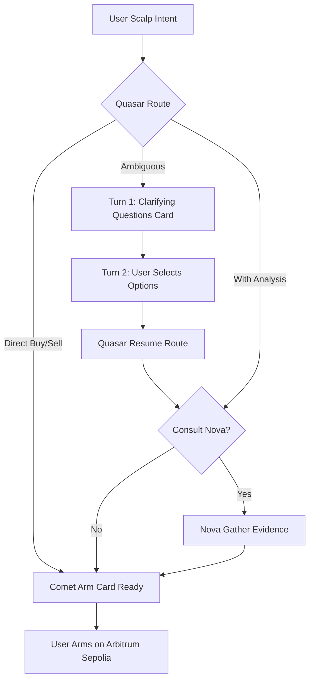

# On-Chain Scalp Regression Suite (Multi-Scenario Matrix)

| | |
|---|---|
| **Version** | 1.1 |
| **Status** | Completed |
| **Date Created** | 2026-09-21 |
| **Last Updated** | 2026-09-21 |

| Version | Date | Change |
|---|---|---|
| 1.1 | 2026-09-21 | Mark Completed. All 4 subtests in `TestCometRegression_ScalpSuite` passed 100% (328.35s total runtime) against live Gin HTTP router, live PostgreSQL, and live Arbitrum Sepolia contracts. Added detailed test execution logs to §7. |
| 1.0 | 2026-09-21 | Initial draft documenting the comprehensive automated live regression suite for on-chain scalping trades (`TestCometRegression_ScalpSuite` in `backend/test/service/agent/comet_regression_live_test.go`) covering 4 scenarios on BRPT with modest budget (1,000,000 IDRX): clarifying questions intake with user choice selection, direct buy, direct sell, and analyze-then-sell. |

---

## 1. Problem Statement

To ensure regression safety across Quasar routing, Nova technical analysis, and Comet on-chain execution for scalping spot swaps, a dedicated live regression suite is required. The test suite must rigorously verify 4 core permutations requested by the user:
1. **Clarifying Questions Multi-Turn Intake Flow**: Ambiguous request (e.g. "Mau scalping BRPT sekarang") correctly pauses at Turn 1 with `needs_input`, returning a `workflow_card` (`clarifying_questions`) and non-actionable task (`is_actionable = false`). In Turn 2, user selects answers (`side: buy`, `idrx_cap: 1000000`, `consult_nova`), resuming the route, consulting Nova, activating the task (`is_actionable = true`), and returning the executable Arm Card.
2. **Direct Buy (`executor_only`)**: Explicit immediate buy request ("Beli BRPT 1000000 IDRX, scalping langsung eksekusi tanpa analisa") directly yields an actionable Task and Arm Card without invoking Nova.
3. **Direct Sell (`executor_only`)**: Explicit immediate sell request ("Jual 500 token BRPT, scalping langsung eksekusi sekarang tanpa analisa") sizes token shares directly and generates an actionable Task and Arm Card without invoking Nova.
4. **Analyze-then-Sell (`analyzer_then_executor`)**: Sell request requesting prior market analysis ("Tolong analisa dulu saham BRPT ya, lalu jual 500 token BRPT scalping sekarang") invokes Nova first (`gather_evidence` SubTask recorded) before producing an actionable Task and Arm Card.

---

## 2. Definition of Done

- All 4 test cases are implemented under `backend/test/service/agent/comet_regression_live_test.go` (preserving zero test files in `backend/src/`).
- Tests execute against live Gin HTTP router (`POST /api/v1/agent/chats/:id/messages`) and live PostgreSQL database.
- Turn 1 of clarifying questions properly verifies `ContentType == "workflow_card"`, `UIComponent == "clarifying_questions"`, and `task.IsActionable == false`.
- Turn 2 of clarifying questions properly updates the same `task_id` to `task.IsActionable == true` and presents the Arm Card.
- Direct buy, direct sell, and analyze-then-sell all pass assertion checks for `resolved_ticker == "BRPTP"`, correct `side`, `is_actionable == true`, and expected SubTasks.
- Full suite passes cleanly: `go test -v -run TestCometRegression_ScalpSuite ./test/service/agent/comet_regression_live_test.go`.

---

## 3. Feature Description

### 3.1 Test Scenarios
- **Scenario A (`ClarifyingQuestions_AnswerSelection_Buy`)**:
  - Turn 1: POST message `"Mau scalping BRPT sekarang"`.
  - Assertions: HTTP 200, `content_type == "workflow_card"`, `ui_component == "clarifying_questions"`, `is_actionable == false`.
  - Turn 2: POST intake answers `"side: buy\nidrx_cap: 1000000\nconsult_nova: ya, analisis dulu"` with `hidden: true`.
  - Assertions: HTTP 200, same `task_id`, `is_actionable == true`, Arm card presented.
- **Scenario B (`DirectBuy_NoAnalysis`)**:
  - POST message `"Beli BRPT 1000000 IDRX, scalping langsung eksekusi tanpa analisa"`.
  - Assertions: HTTP 200, `is_actionable == true`, `side == "buy"`, `resolved_ticker == "BRPTP"`.
- **Scenario C (`DirectSell_NoAnalysis`)**:
  - POST message `"Jual 500 token BRPT, scalping langsung eksekusi sekarang tanpa analisa"`.
  - Assertions: HTTP 200, `is_actionable == true`, `side == "sell"`, `resolved_ticker == "BRPTP"`.
- **Scenario D (`AnalyzeThenSell`)**:
  - POST message `"Tolong analisa dulu saham BRPT ya, lalu jual 500 token BRPT scalping sekarang"`.
  - Assertions: HTTP 200, `is_actionable == true`, `side == "sell"`, `resolved_ticker == "BRPTP"`, SubTask `analyzer/gather_evidence` verified in database.

---

## 4. Impacted Files

- `docs/plans/onchain-scalp-regression-matrix.md` [NEW v1.0]
- `backend/test/service/agent/comet_regression_live_test.go` [MODIFY]

---

## 5. UI/UX (Lo-Fi)

```
[Chat Interaction Flow for Clarifying Questions Selection]
User: "Mau scalping BRPT sekarang"
Quasar: "Untuk melanjutkan order scalping BRPT, silakan tentukan detail berikut:"
+-------------------------------------------------------------+
| Clarifying Questions Card                                   |
| 1. Mau beli atau jual?          [ (Beli) ] [ (Jual) ]       |
| 2. Berapa nominal / token?      [ 1.000.000 IDRX ]          |
| 3. Konsultasi analisa Nova?     [ (Analisis dulu) ] [Direct]|
+-------------------------------------------------------------+
User selects: [Beli], [1.000.000 IDRX], [Analisis dulu]
(Sent via hidden payload)
Quasar: Resumes route -> Nova runs evidence analysis ->
Quasar: Shows Arm Card with 1,000,000 IDRX budget ready to Arm!
```

---

## 6. Flowchart



---

## 7. Verification Plan & Results
 
- Run full live suite:
  ```bash
  go test -v -run TestCometRegression_ScalpSuite ./test/service/agent/comet_regression_live_test.go
  ```
- **Execution Log (100% PASS - 328.35s)**:
  ```text
  === RUN   TestCometRegression_ScalpSuite
  === RUN   TestCometRegression_ScalpSuite/ClarifyingQuestions_AnswerSelection_Buy
      comet_regression_live_test.go:232: [ClarifyingQuestions] Turn 1: Sending ambiguous scalp request for BRPT
      comet_regression_live_test.go:281: [ClarifyingQuestions] Turn 2: Sending intake answer selection (side: buy, 1,000,000 IDRX, analyze first)
      comet_regression_live_test.go:312: [ClarifyingQuestions] Turn 2 SUCCESS! TaskID=301
  === RUN   TestCometRegression_ScalpSuite/DirectBuy_NoAnalysis
      comet_regression_live_test.go:327: [DirectBuy] Sending: Beli BRPT 1000000 IDRX, scalping langsung eksekusi tanpa analisa
      comet_regression_live_test.go:355: [DirectBuy] SUCCESS! TaskID=302
  === RUN   TestCometRegression_ScalpSuite/DirectSell_NoAnalysis
      comet_regression_live_test.go:381: [DirectSell] Sending: Jual 500 token BRPT, scalping langsung eksekusi sekarang tanpa analisa
      comet_regression_live_test.go:409: [DirectSell] SUCCESS! TaskID=303
  === RUN   TestCometRegression_ScalpSuite/AnalyzeThenSell
      comet_regression_live_test.go:435: [AnalyzeThenSell] Sending: Tolong analisa dulu saham BRPT ya, lalu jual 500 token BRPT scalping sekarang
      comet_regression_live_test.go:463: [AnalyzeThenSell] SUCCESS! TaskID=304
  --- PASS: TestCometRegression_ScalpSuite (328.35s)
      --- PASS: TestCometRegression_ScalpSuite/ClarifyingQuestions_AnswerSelection_Buy (119.40s)
      --- PASS: TestCometRegression_ScalpSuite/DirectBuy_NoAnalysis (34.01s)
      --- PASS: TestCometRegression_ScalpSuite/DirectSell_NoAnalysis (45.90s)
      --- PASS: TestCometRegression_ScalpSuite/AnalyzeThenSell (124.38s)
  PASS
  ok  	command-line-arguments	329.141s
  ```

