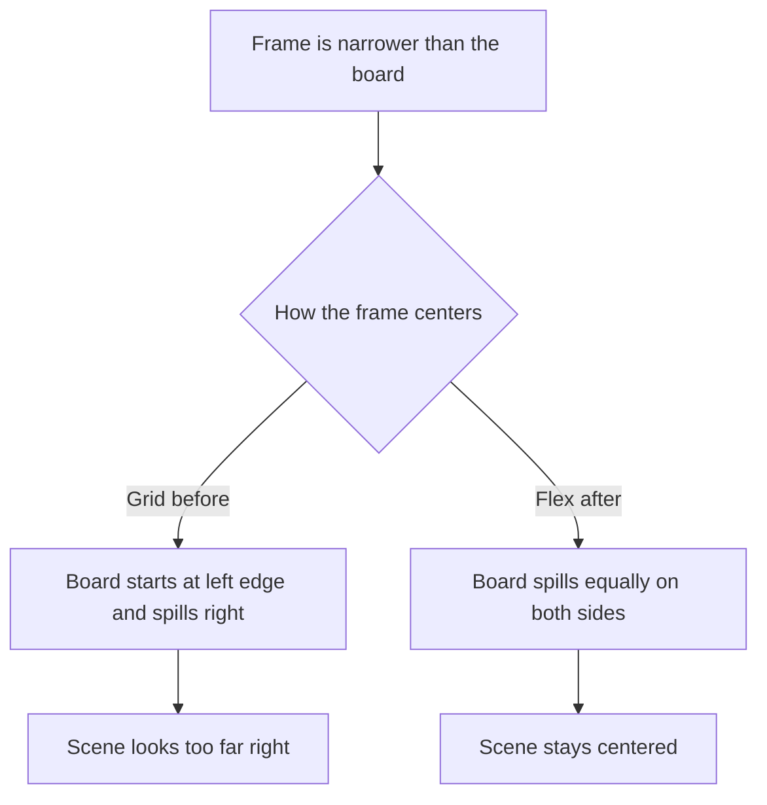

# Paper 3D Home Scene — Centering Hotfix

| | |
|---|---|
| **Version** | 1.0 |
| **Status** | Approved |
| **Date Created** | 2026-10-03 |
| **Last Updated** | 2026-10-03 |

| Version | Date | Change |
|---|---|---|
| 1.0 | 2026-10-03 | Initial plan. Approved by the owner's instruction to hotfix the Home 3D scene that sits too far to the right, Home only. |

> Hotfix to the Home town scene shipped in PR #45. Source: the corrected `PulsarFi Web - Paper 3D.dc.html` in the design export `PulsarFi Arbitrum Pitch Deck (2)`, compared against the export (1) that was implemented. One commit.

---

## 1. Problem Statement

**In plain words.** On Home, the paper town sits too far to the right instead of in the middle of its frame. The part on the right is cut off and the left side is empty.

| Finding | Implication |
|---|---|
| The town is drawn on a 560px wide board and then shrunk with a zoom effect. The zoom does not shrink the space the board takes, so on screens narrower than the board the frame still thinks the board is 560px wide. | The frame places a too-wide board at its left edge (grid centering does not push an oversized item to both sides), so the whole scene shifts right. |
| The design export (2) fixes exactly this: the frame becomes a flex row that centers, and the board refuses to shrink. | An oversized board now overflows equally on both sides, so it stays centered. |

The same change also exists for the Portfolio tray in the export. The owner asked for Home only, so the tray is **not** touched here.

---

## 2. Definition of Done

| # | Criterion |
|---|---|
| 1 | The horizontal center of the Home scene equals the horizontal center of its frame at 1440px and at 390px width. |
| 2 | Looks, motion, drag, Reduce Motion and the caption are unchanged. |
| 3 | No change to data fetching. The Portfolio tray is unchanged. |

---

## 3. Feature Description

| Item | Before | After |
|---|---|---|
| Frame (`TownScene` outer div) | `display: grid`, `placeItems: center` | `display: flex`, `alignItems: center`, `justifyContent: center` |
| Board (scene div) | width 560, can shrink | `flexShrink: 0` added |

---

## 4. Impacted Files

| Layer | File | Action |
|---|---|---|
| Home | `frontend/components/home/CoinStack.tsx` | `[MODIFY]` |
| Docs | `docs/plans/paper-3d-home-scene-centering-hotfix.md` | `[NEW]` (this file) |

---

## 5. UI/UX Changes (Lo-Fi)

```
Before (390px)                     After (390px)
+----------------+                 +----------------+
|                |                 |                |
|      [town---- |  cut off        |  [---town---]  |  centered
|                |                 |                |
+----------------+                 +----------------+
```

---

## 6. Flowchart



---

## 7. Verification Plan

Frontend only. Checked in headless Chrome over the debugging port, measuring the scene and frame positions.

| # | Step | Expected |
|---|---|---|
| 1 | Open Home at 1440px, compare the scene center with the frame center | Centers match within 1px |
| 2 | Same at 390px | Centers match within 1px |
| 3 | Drag the scene, enable Reduce Motion | Same as before the change |
| 4 | `npx tsc --noEmit` and `npx eslint components/home` (from `frontend/`) | No errors from source files |
