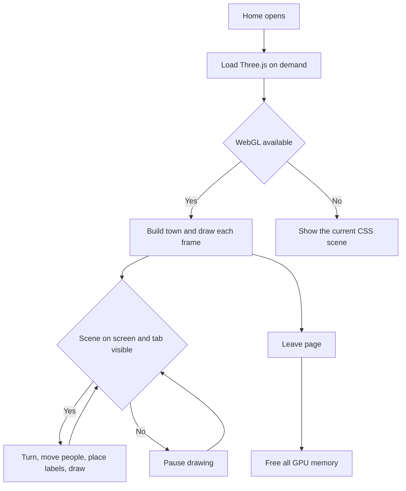

# Paper 3D Home Scene — WebGL Rendering (Lag Fix)

| | |
|---|---|
| **Version** | 1.1 |
| **Status** | Approved |
| **Date Created** | 2026-10-04 |
| **Last Updated** | 2026-10-04 |

| Version | Date | Change |
|---|---|---|
| 1.1 | 2026-10-04 | Section 4: building and people tables move into one shared module so the WebGL scene and the CSS fallback read the same data, instead of keeping two copies. |
| 1.0 | 2026-10-04 | Initial plan. Approved by the owner's instruction to apply the new design export and make the Home 3D scene stop lagging, Home only. |

> Follow-up to PR #45 and PR #46. Source: `PulsarFi Web - Paper 3D.dc.html` in the design export `PulsarFi Arbitrum Pitch Deck (3)`. The export keeps the previous version as `PulsarFi Web - Paper 3D (CSS 3D).dc.html`, which is identical to the scene that is live now. One commit.

---

## 1. Problem Statement

**In plain words.** The Home town scene stutters, most on phones and older laptops. The design team rebuilt the same picture so the graphics card draws it instead of the browser's page layout engine. It looks the same, but it moves smoothly.

| Finding | Implication |
|---|---|
| The live scene is made of hundreds of stacked flat page elements (every coin is four layers, every building has faces and windows, five stacks of up to eight coins) that the browser must re-flatten into 3D on every frame. | This is the lag. It grows with the number of coins and with screen size. |
| Names, labels, speech bubbles and the "+1 buy" tags are page elements that are also re-positioned in 3D on every frame. | They add to the cost. |
| The new design draws the town on a canvas with Three.js, and keeps only the labels, signs, bubbles and tags as ordinary text laid over it. | One draw call set per frame instead of hundreds of 3D page layers. Text stays sharp and selectable-looking as before. |
| The design loads Three.js from a public CDN (`unpkg.com`) at runtime. | Not acceptable for the app: it would depend on a third party being up and could not be pinned or audited. Three.js is added as a normal package instead. |

**This update changes how the scene is drawn, not what it shows or where its data comes from.** The same five stacks (top supply, same change figures), the same buildings, people and speech lines.

---

## 2. Definition of Done

| # | Criterion |
|---|---|
| 1 | The Home scene is drawn with WebGL (Three.js) and matches the new design: orthographic camera, paper-flat shaded boxes with ink outlines, coin stacks with a ring and logo on top, soft ground shadows, the same eight buildings and eight people. |
| 2 | Signs, stack labels, speech bubbles and the "+1 buy" / "swap" tags are text laid over the canvas and follow their 3D position. |
| 3 | Dragging turns the scene with inertia. Auto-rotate runs unless Reduce Motion is on. Touch on the scene still scrolls the page vertically. |
| 4 | The scene stops drawing when off screen or when the tab is hidden, and fully releases GPU memory when it leaves the page. |
| 5 | Reduce Motion: no auto-rotate, people frozen, no bubbles or tags (same rule as today). |
| 6 | If WebGL is not available, the current CSS scene is shown instead, so there is never an empty hole. |
| 7 | Three.js is not downloaded for pages other than Home, and is not loaded on the server. |
| 8 | Smoother than before, measured on the same page (see 8). |
| 9 | Data fetching, the caption line and the Portfolio tray are unchanged. |

---

## 3. Feature Description

| Item | Before | After |
|---|---|---|
| Drawing | Hundreds of CSS 3D layers | One WebGL canvas |
| Camera | CSS `rotateX(60deg) rotateZ(angle)` with page-space scale | Orthographic camera orbiting at 42 degrees elevation, 1500 units away |
| Start angle | -28 degrees | 36 degrees (as in the design) |
| Stage height | 540 scaled | `clamp(420px, 100vw, 640px)` |
| Pixel ratio | Browser default | Capped at 2 on desktop, 1.5 below 720px |
| Text on the scene | 3D page elements | Plain elements moved by 2D transforms |
| Library | None | `three` (npm, pinned `0.160.0`) loaded on demand |

Kept from the live code: data mapping, `% stacks.length` for people, Reduce Motion behaviour, caption.

Fallback: `CoinStack` tries the WebGL scene. If creating the renderer throws, it renders the existing CSS scene.

---

## 4. Impacted Files

| Layer | File | Action |
|---|---|---|
| Home | `frontend/components/home/townData.ts` | `[NEW]` Building, people and skin tone tables and their types, moved out of `CoinStack.tsx` |
| Home | `frontend/components/home/TownScene3D.tsx` | `[NEW]` WebGL scene and overlay text |
| Home | `frontend/components/home/CoinStack.tsx` | `[MODIFY]` Import the tables from `townData.ts`, pass the logo path, render the WebGL scene, keep the CSS scene as fallback |
| Shared | `frontend/components/ui/PStockMark.tsx` | `[MODIFY]` Export a small `getStockIcon(ticker)` so the scene reuses the logo paths |
| Dependency | `frontend/package.json`, `frontend/package-lock.json` | `[MODIFY]` Add `three` and `@types/three` |
| Docs | `docs/plans/paper-3d-home-scene-webgl.md` | `[NEW]` (this file) |

Not touched: `AllocationBars.tsx`, `http/`, `contexts/`, `backend/`, `smart-contract/`.

---

## 5. UI/UX Changes (Lo-Fi)

```
Before                              After
+-----------------------+           +-----------------------+
|  CSS 3D board         |           |  WebGL canvas         |
|  hundreds of layers   |   looks   |  same town, same      |
|  stutters on drag     |   same    |  people, smooth drag  |
+-----------------------+           +-----------------------+
 text = 3D page elements             text = plain overlay
```

| State | Behaviour |
|---|---|
| Loading Three.js | Frame keeps its height, blank until the first draw (a short moment) |
| Running | Auto-rotate, people walk, count and trade |
| Dragging | Follows the pointer with inertia on release |
| Reduce Motion | Static pose, drag still works |
| WebGL unavailable | Current CSS scene |

---

## 6. Flowchart



---

## 7. Impact on Existing Behaviour

| Area | Effect |
|---|---|
| Bundle | Three.js (about 150 KB gzipped) is a separate chunk fetched only on Home |
| Pages other than Home | No change |
| Rotation direction | Drag direction matches the design (dragging right turns the scene the same way as before) |

---

## 8. Verification Plan

Frontend only, with a mock backend for the Home data and headless Chrome over the debugging port.

| # | Step | Expected |
|---|---|---|
| 1 | Home at 1440 and 390 px | Town drawn, five stacks with logo and label, signs on IDX, CUSTODIAN, ARBITRUM, no horizontal overflow |
| 2 | Wait for people to trade | Bubble shows, "+1 buy" or "swap" tag floats over the right stack |
| 3 | Drag the scene | Angle changes, inertia after release, vertical page scroll still works on touch (`touch-action: pan-y`) |
| 4 | Reduce Motion on | Static pose, no bubbles or tags |
| 5 | Scroll off screen, hide the tab | Drawing stops (frame counter stops) |
| 6 | Leave Home | No console errors, canvas removed |
| 7 | Block WebGL in the browser | CSS scene is shown |
| 8 | Frame time of old vs new scene, same data and size | New scene shows lower frame time. Report the numbers, say plainly if headless Chrome without a real GPU makes them unrepresentative |
| 9 | `npx tsc --noEmit`, `npx eslint components/home components/ui/PStockMark.tsx` | No new errors |
| 10 | `npx next build` | Builds, and Three.js sits in its own chunk |
