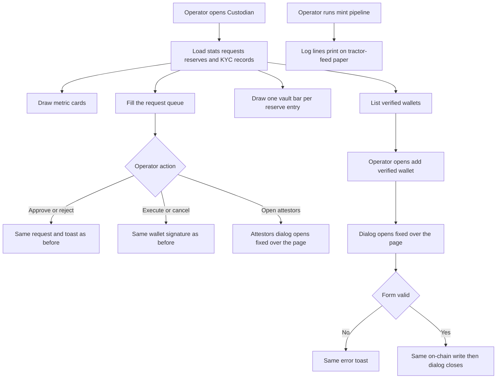

# Paper 3D Redesign — Custodian

| | |
|---|---|
| **Version** | 1.1 |
| **Status** | Approved |
| **Date Created** | 2026-10-02 |
| **Last Updated** | 2026-10-02 |

| Version | Date | Change |
|---|---|---|
| 1.1 | 2026-10-02 | Found by running the page against mock data. Section 3.3: the last queue column is `minmax(max-content, 2fr)` and action text and buttons never wrap, because the busiest state (attestor count, vote text, two buttons) wrapped onto two lines in a 2fr column. Section 3.5: KYC dates use the day-month-year order of the handoff (`28 Sep 2026`) instead of the month-first order the code printed. |
| 1.0 | 2026-10-02 | Initial plan. Approved by the owner's instruction to continue with the remaining pages. |

> Plan 5 of 6 for the "Paper 3D" redesign (handoff: `design_handoff_paper_3d`). Builds on the Home, Markets, Stock detail and Portfolio plans. Delivery is one commit for this page. Quasar has its own plan.

---

## 1. Problem Statement

**In plain words.** The custodian console is the operator's control room. Today it looks like a dark terminal and flat tables. The new design makes it a desk: metric cards stacked like paper, a log that prints on old green-bar tractor-feed paper instead of a black terminal, a 3D "vault" that shows how many shares sit in custody, and tables on stacked sheets. The two pop-ups (attestors and add verified wallet) sit on a pile of sheets.

**Operator actions must not change.** Approve, reject, execute, cancel, the mint pipeline and the KYC form all keep their exact logic, permissions and wording.

| Finding | Implication |
|---|---|
| The handoff has two versions of some blocks. The page version is shorter (for example a Buy/Sell side switch, a ticker button grid and a limit price on the order form, a 7-column queue without notional). The component sheet matches the code that exists today (mint-only form, 8-column queue, 7-column KYC table). | The component sheet is followed for the order form, queue, KYC table and both pop-ups, so no data or action disappears. The page version is followed for page layout, metric cards, the vault and the reserves block. |
| The Side switch and Limit price on the page version have no logic behind them (there is no burn order pipeline). | Not built. |

**This redesign changes presentation only.** Data, hooks, contract calls, permissions and props stay as they are.

---

## 2. Definition of Done

| # | Criterion |
|---|---|
| 1 | Custodian matches the handoff at three widths: desktop, below 1024px, below 720px. |
| 2 | **Every action keeps its logic.** The rules that decide which buttons show (requester, threshold, voted, initiator) are untouched, and so are the handlers, toasts and query invalidation. |
| 3 | **Dialog behaviour is unchanged.** Attestors dialog: portal to `document.body`, `position: fixed`, z-index 9999, backdrop click closes, click inside does not. Add verified wallet dialog: `position: fixed`, z-index 9999, no backdrop-click close (as today), same validation and toasts, closes on success. |
| 4 | With the page scrolled down, both overlays still cover the whole viewport and the dialog is centred in the viewport. |
| 5 | Data fetching does not change: same hooks, endpoints, query keys and polling. No new request. |
| 6 | The log prints on tractor-feed paper, keeps the same lines, levels and timestamps, shows the "running" row with a blinking ink cursor. |
| 7 | The vault is built only from the reserve entries already loaded (`custodian_holdings`). |
| 8 | Tables scroll sideways inside their card on narrow screens, the page itself does not. |
| 9 | Loading skeletons, empty messages, completed-row dimming all still work. |
| 10 | No new dependency, no test file under `frontend/components/` or `frontend/app/`. |

---

## 3. Feature Description

### 3.1 Page frame

| Block | Spec |
|---|---|
| Container | `max-width:1440px`, centred, padding `32px 32px 64px` (mobile `24px 16px 48px`). |
| Header | bottom 1px ink, padding-bottom 18px. Eyebrow merah (existing text), margin-bottom 12px. Title Fraunces 400 `clamp(40px,4.6vw,56px)/1`, tracking -.028em, italic Instrument Serif for "custodian bridge". Paragraph margin-top 12px, max-width 580px, Fraunces 300 17px/1.55, body colour. |
| Metric cards | grid `repeat(auto-fit,minmax(min(100%,220px),1fr))`, gap 24px, margin-top 28px. Card padding 22px, hover `translateY(-4px)` (.3s). Label Inter 600 11px, tracking .16em, uppercase. Value Fraunces 400 32px/1, tracking -.02em, margin-top 8px. Sub 12px, margin-top 8px. |
| Card looks | Ink card: bg and border ink, white text, sub `rgba(255,255,255,.7)`, shadow `0 5px 0 -2px #fbfaf7,0 6px 0 -2px #16110e,0 11px 0 -4px #fbfaf7,0 12px 0 -4px #4a423d,0 24px 30px -16px rgba(22,17,14,.35)`. Merah card: bg and border `#c8102e`, white text, sub `rgba(255,255,255,.75)`, shadow `0 5px 0 -2px #fbfaf7,0 6px 0 -2px #c8102e,0 11px 0 -4px #fbfaf7,0 12px 0 -4px #f0d3cf,0 24px 30px -16px rgba(154,12,36,.35)`. Paper card: bg `#fbfaf7`, border `#e3ddd2`, body sub, shadow `0 5px 0 -2px #fbfaf7,0 6px 0 -2px #e3ddd2,0 11px 0 -4px #fbfaf7,0 12px 0 -4px #e3ddd2,0 24px 30px -16px rgba(22,17,14,.2)`. |
| Section headers | margin-top 56px, flex, wrap, space-between, baseline, gap 8px, bottom 1px ink, padding-bottom 12px. Title Fraunces 400 32px, tracking -.02em. Right label Inter 600 11px, tracking .16em, uppercase, body (existing texts). |

### 3.2 Order form and tractor-feed console

| Block | Spec |
|---|---|
| Grid | `repeat(auto-fit,minmax(min(100%,400px),1fr))`, gap 28px, margin-top 44px, align stretch. |
| Form card | `.paper-stack`, flex column. Header strip: padding 16px 20px, bottom 1px `#e3ddd2`, flex, space-between, wrap, Inter 600 10px, tracking .14em, uppercase, body: "01 · New tokenization order" left, "Mint / burn on fill" right. |
| Fields | padding 20px, gap 18px. Label Inter 600 10px, tracking .14em, uppercase, body, margin-bottom 8px. Select and input: 1px `#bcb2a3`, bg `#fbfaf7`, padding 12px, mono 500 14px (ink border when focused). Same select and quantity input as today. |
| Preview | bg `#f3f0ea`, padding 16px 20px, top and bottom 1px `#e3ddd2`. Title "02 · Order preview" Inter 600 10px, tracking .14em, uppercase, body, margin-bottom 10px. Rows 13px, labels body, values mono. |
| Submit | wrapper padding 20px, margin-top auto. Button full width, padding 16px, Inter 600 15px, merah with lip, executing state `#9a0c24`. Note under it 11px, tracking .04em, body, centred. |
| Console | Outer `position:relative; min-height:480px`. Backing sheet: absolute, left 10px, right -6px, top 14px, bottom -10px, bg `#f3eedf`, 1px `#e3ddd2`, rotate .8deg. Sheet: flex, bg `#fdfbf4`, 1px `#e3ddd2`, shadow `0 22px 30px -16px rgba(22,17,14,.25)`. Perforated margins 22px each side: dashed `#d9d1c4` rule, holes `radial-gradient(circle,#e3ddd2 4px,transparent 4.5px)`, size 22px 26px, position `center 8px`. |
| Console header | padding 12px 16px, bottom 1px ink. Title mono 600 12px, tracking .08em, uppercase "horizon-bridge // ops.go". Right: 6px positive dot and "streaming" mono 11px positive. |
| Console log | padding 0 16px, mono 400 12.5px/26px, colour `#2a231e`, max-height 520px, scrolls. Green-bar stripes `repeating-linear-gradient(#fdfbf4 0 52px,#eef4ec 52px 104px)`, `background-attachment: local`. Row: timestamp `#9a9286`, level 34px wide (OK positive 600, ERR merah 600, INFO and "..." body), text wraps anywhere. Running row: cursor is a 7×13px ink block, blinking. |

### 3.3 Request queue

| Block | Spec |
|---|---|
| Card | `.paper-stack`, margin-top 16px, padding `0 clamp(12px,2vw,20px)`, `overflow-x:auto`. Inner `min-width:980px`. |
| Header row | grid `32px 1fr 1fr 1fr 1fr 1fr 1fr 2fr`, gap 12px, padding 12px 0, bottom 1px ink, Inter 600 10px, tracking .14em, uppercase, body. Labels: blank, ID, Type, Asset, Quantity, IDR notional, Waited, blank. Quantity, notional and waited right aligned. |
| Row | same grid, align centre, padding 14px 0, bottom 1px `#e3ddd2`, opacity .55 when done (transition .3s). The last column is `minmax(max-content, 2fr)` so the busiest action state never wraps. |
| Cells | 32×32 square, merah (mint) or ink (redeem), white arrow glyph ↑ or ↓, shadow `2px 2px 0 #e8b4bd` or `2px 2px 0 #bcb2a3`. ID mono 13px. Type Inter 700 11px, tracking .06em, uppercase (merah for mint, ink otherwise). Asset: 22px logo and ticker 600 13px. Numbers mono 13px right aligned. Waited mono 12px body. |
| Actions | flex, right aligned, gap 8px, centre. Attestor count: white bg, 1px `#bcb2a3`, padding 4px 10px, Inter 600 11px, body, 6px merah dot, hover border and text ink (button, as today, only shown when there are attestors). Vote text mono 11px body. Reject: white, 1px ink, padding 6px 12px, 12px 600. Approve: ink, lip `0 3px 0 -1px #fff,0 4px 0 -1px #16110e`, padding 7px 14px. Execute Mint: merah with lip `0 3px 0 -1px #fff,0 4px 0 -1px #9a0c24`. Execute Redeem and Cancel actions keep their existing roles in ink or white. Disabled variants: opacity .4, border `#e3ddd2`. |
| Done | Status text becomes a stamp: Inter 700 10px, tracking .14em, uppercase, 1px border in the same colour, padding 4px 8px, rotated -3deg. Colour positive for executed and approved, negative for rejected. Text stays the existing wording. |

### 3.4 Vault and reserves

| Block | Spec |
|---|---|
| Layout | grid `repeat(auto-fit,minmax(min(100%,420px),1fr))`, gap 32px, margin-top 20px, align centre. |
| Vault stage | height 320px, centred, `perspective:1300px`, overflow hidden. Scene 340×160, `scale(s) rotateX(58deg) rotateZ(-36deg)`, `preserve-3d`, margin-top 60px, `s = min(1, (vw - 32) / 420)` on mobile. Board: inset -22px, bg `#16110e`, grid lines `#2a231e` every 20px. |
| Vault bars | One per reserve entry. Footprint 60×60, x `(index % 4) × 86`, y `floor(index / 4) × 90`, height `20 + custody / largest × 110`. First bar palette 0 (merah), the rest palette 4 (paper). The top face shows the stock logo, 26px. |
| Table | Compact: Stock, In custody, On-chain, Ratio. Row padding 11px 4px, bottom 1px `#e3ddd2`. Stock: 22px logo and ticker 600 13px. Numbers mono 13px right aligned (existing `formatRawToken`). Ratio: mono 600 12px with a 6px dot, positive when pegged, negative when not (existing `peg_ratio` text and `peg_status`). Off-peg rows are tinted `#fdf3f4`. |
| Dropped | The "Last mint" and "Status" text columns. The last attestation time is already in the section header, and the dot carries the status. |
| States | Loading: flat `#f3f0ea` blocks. Empty: existing message. |

### 3.5 KYC registry and dialogs

| Block | Spec |
|---|---|
| Intro and button | margin-top 14px row: existing text 13px body, "Add verified wallet" ink button with lip `0 3px 0 -1px #fbfaf7,0 4px 0 -1px #16110e`, padding 9px 14px, 600 13px. |
| Table | `.paper-stack` card like the queue, inner `min-width:900px`. Grid `1.2fr 1.4fr 1.4fr .8fr 1fr 1fr 1fr`, gap 14px. Header as the queue's. Rows padding 14px 0, bottom 1px `#e3ddd2`. Wallet mono 12px, name 600 13px, email 13px body, type Inter 600 10px uppercase body, date (day, month, year: `28 Sep 2026`) and tx mono 12px body (right), "View statement" white with 1px ink, padding 6px 12px, 600 12px. |
| Attestors dialog | `.rise .paper-sheaf`, max-width 460px. Header padding 20px 24px, bottom 1px `#e3ddd2`: eyebrow "Multisig attestors", title Fraunces 500 20px "REQ-n · TICKER", close 30×30 ✕. Count strip bg `#f3f0ea`, mono 12px body, approve count positive, reject count merah, "threshold 3/5" right. Threshold bar: 5 segments, height 8px, gap 6px, padding 14px 24px: approved segments positive, the next needed one `#e3ddd2` with a 1px dashed positive outline, the rest `#f3f0ea`. Attestor rows padding 14px 24px: name 600 13px, wallet mono 11px, type Inter 600 10px uppercase (positive or merah), age mono 11px. Close button ink, 700 11px, tracking .08em, uppercase. Backdrop `rgba(22,17,14,.32)`, no blur. |
| Add verified wallet dialog | `.rise .paper-sheaf`, max-width 520px. Header like above with eyebrow "KYC registry", title "Add verified wallet". Body padding 22px 24px, gap 16px. Labels Inter 600 10px uppercase body. Inputs: 1px `#bcb2a3`, bg `#fbfaf7`, padding 12px, 14px (mono for wallet and type). File field becomes a dashed slip: bg `#f3f0ea`, 1px dashed `#bcb2a3`, padding 11px 12px, 12px body, text "Drop PDF / PNG / JPG", showing the file name once chosen. The real file input stays, stretched invisibly over the slip, so click and drag-and-drop both still work. Footer padding 16px 24px, top 1px `#e3ddd2`: Cancel (white, 1px ink) and submit (ink, no lip). Backdrop `rgba(22,17,14,.32)`, no blur. |

---

## 4. Impacted Files

| Layer | File | Action |
|---|---|---|
| UI | `frontend/components/ui/IsoBar.tsx` (optional content on the top face) | `[MODIFY]` |
| Custodian | `frontend/components/custodian/CustodianView.tsx` | `[MODIFY]` |
| Custodian | `frontend/components/custodian/MintOrderForm.tsx` | `[MODIFY]` |
| Custodian | `frontend/components/custodian/RequestQueue.tsx` (look only) | `[MODIFY]` |
| Custodian | `frontend/components/custodian/AttestorsModal.tsx` (look only) | `[MODIFY]` |
| Custodian | `frontend/components/custodian/KYCRegistry.tsx` (look only, includes the add-wallet dialog) | `[MODIFY]` |
| Custodian | `frontend/components/custodian/ReservesTable.tsx` | `[MODIFY]` |
| Custodian | `frontend/components/custodian/VaultBlocks.tsx` | `[NEW]` |
| Styles | `frontend/app/globals.css` (remove `.table-head-desktop`, `.table-row-stack`, `.row-cell*`, `.reserves-table`, `.kyc-table`, `.stat-card`, `.grid-4col` rules once no file uses them) | `[MODIFY]` |
| Docs | `docs/plans/paper-3d-redesign-custodian.md` | `[NEW]` (this file) |

Not touched: `utils.ts`, `lib/`, `http/`, `contexts/`, `backend/`, `smart-contract/`. `QuasarPanel` is not mounted on this page.

---

## 5. UI/UX Changes (Lo-Fi)

### 5.1 Custodian, desktop

```
+------------------------------------------------------------------+
| HORIZON LABS · CUSTODIAN CONSOLE · 0x7a3F…91cE                   |
| The custodian bridge.                                            |
| ================================================================ |
| [AUC ink] [24h mint merah] [Pending paper] [Reserves paper]      |
|                                                                  |
| +-----------------------------+ +------------------------------+ |
| | 01 NEW ORDER     MINT/BURN  | | | horizon-bridge // ops.go  | | |
| | IDX ticker [select]         | | | 14:22 INFO Order received | | |
| | Lots [50000]                | | | 14:22 OK   Filled         | | |
| | 02 PREVIEW                  | | | (green-bar paper)         | | |
| | [ Execute mint pipeline ]   | | |                           | | |
| +-----------------------------+ +------------------------------+ |
|                                                                  |
| Request queue                                  3 pending · …     |
| [↑] REQ-42 mint·ops BUMIP 50,000 Rp… 4m   (2/5) [Reject][Approve]|
|                                                                  |
| Physical vault & proof of reserves             last attestation… |
| [ 3D dark vault with logos ]   STOCK  CUSTODY  ON-CHAIN  RATIO   |
|                                                                  |
| KYC & redemption access                               4 verified |
| text ..............................  [Add verified wallet]       |
| WALLET NAME EMAIL TYPE VERIFIED TX [View statement]              |
+------------------------------------------------------------------+
```

### 5.2 Responsive and states

| Width | Behaviour |
|---|---|
| Below 1024px | Form and console stack once each would be narrower than 400px. Vault and table stack. |
| Below 720px | Padding `24px 16px 48px`. Vault scaled to fit. The queue, KYC table keep their minimum widths and scroll sideways inside their cards. |

| State | Behaviour |
|---|---|
| Loading | Metric values and table rows show flat `#f3f0ea` blocks |
| Empty | Existing messages inside the card |
| Pipeline running | Log shows the blinking ink cursor row, button reads "Executing pipeline…" in `#9a0c24` |
| Request done | Row dims to 55% and shows a tilted stamp |
| Off-peg reserve | Row tinted `#fdf3f4`, red ratio and dot |

### 5.3 Before and after

| Element | Before | After |
|---|---|---|
| Console | Black terminal card | Green-bar tractor-feed paper on a tilted backing sheet |
| Metric cards | Flat boxes | Paper cards with stacked shadows, lift on hover |
| Tables | Hairline rows, stack on phones | Paper cards, scroll sideways on phones |
| Reserves | Six-column table | 3D vault plus compact table |
| Done status | Plain text | Tilted stamp |
| Dialogs | Dark backdrop with blur, flat box | Light backdrop, pile of sheets |

---

## 6. Flowchart



---

## 7. Verification Plan

Frontend only. The page needs operator data and wallet signatures, so interactive checks run through the browser debugging port against a temporary test page that renders the real components with mock props. Anything that needs the real backend or a real signature is reported as not verified.

### 7.1 Static checks

| Check | Command (from `frontend/`) |
|---|---|
| Types | `npx tsc --noEmit` |
| Lint | `npx eslint components/custodian components/ui app` |

### 7.2 Dialog behaviour (must not regress)

| # | Step | Expected |
|---|---|---|
| 1 | Scroll down, open the attestors dialog | Overlay top is 0 and covers the viewport, dialog centred in the viewport |
| 2 | Click the backdrop, click inside | Backdrop closes it, inside does not |
| 3 | Open the add verified wallet dialog, click the backdrop | Stays open (as today) |
| 4 | Submit with an invalid address, then with no file | Same error toasts as before |
| 5 | Pick a file by click | Slip shows the file name |

### 7.3 Visual and data

| # | Step | Expected |
|---|---|---|
| 1 | Open `/custodian` at 1440px, 900px and 390px beside the handoff HTML | Layout, type sizes and spacing match |
| 2 | Compare every queue action state with the component sheet | Same buttons, same visibility rules |
| 3 | Run the mint pipeline log | Lines print, running row shows the cursor |
| 4 | Narrow to 390px | Tables scroll inside their cards, no page-level sideways scroll |

---

## 8. Open Questions and Decisions

| # | Question | Default taken in this plan |
|---|---|---|
| 1 | The page version of the order form has a Buy/Sell switch, a ticker button grid and a limit price. | Not built. The component sheet version (same as today) is used. |
| 2 | The page version of the queue has 7 columns and no IDR notional. | The component sheet version (8 columns, with notional) is used. |
| 3 | The page version of the reserves block has a 4-column table. | Followed. "Last mint" and "Status" columns are dropped, their information is in the section header and the ratio dot. |
| 4 | Attestors and Add wallet dialogs show a blurred dark backdrop today. | Light `rgba(22,17,14,.32)` backdrop with no blur, as in the handoff. |
| 5 | The handoff done stamp says "Approved" or "Executed" only. | Keeps the existing wording ("Executed · tokens minted" and so on), styled as a stamp. |
