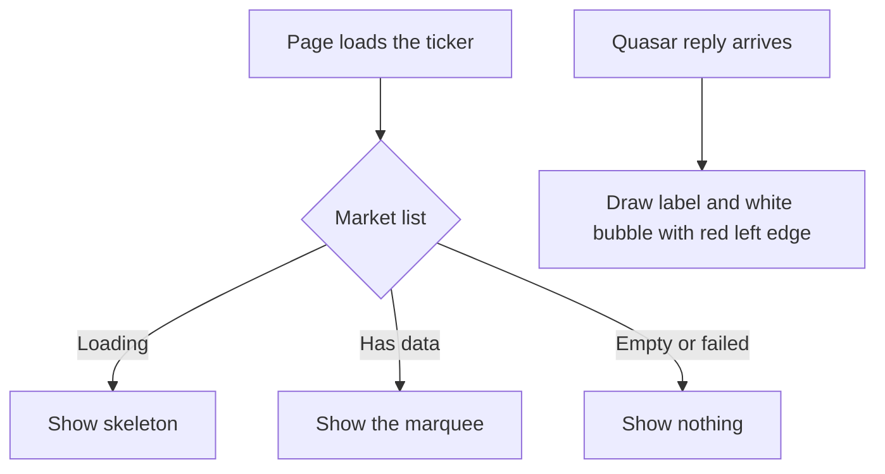

# Paper 3D Redesign — Follow-ups (Quasar message bubble and review findings)

| | |
|---|---|
| **Version** | 1.1 |
| **Status** | Approved |
| **Date Created** | 2026-10-02 |
| **Last Updated** | 2026-10-02 |

| Version | Date | Change |
|---|---|---|
| 1.1 | 2026-10-02 | Correction found while fixing. Section 1 item 4 and 3.4: once the resize listener in `QuasarPanel` was replaced, the linter reported a second "state set inside an effect" in the same file, the one that opens the first saved chat automatically. It was hidden behind the first error. It decides which chat opens, so it is left alone and listed with the `ArmPanel` items. Verification step 7.1 now expects three remaining lint errors, not two. |
| 1.0 | 2026-10-02 | Initial plan. Approved by the owner's instruction to fix the Quasar message bubble together with the findings reported earlier. |

> Follow-up to the six redesign plans (Home, Markets, Stock detail, Portfolio, Custodian, Quasar). One commit.

---

## 1. Problem Statement

**In plain words.** After the redesign, the assistant's replies in Quasar are plain text with no box around them, so they blend into the page and are hard to tell apart from the user's own messages and from the cards. This plan puts the reply in a paper bubble. It also closes the small items that were reported at the end of each page and left open.

| # | Item | Why it matters |
|---|---|---|
| 1 | Quasar replies have no bubble | Hard to tell who said what. Raised by the owner with a screenshot: a label "QUASAR" above a white box with a red left edge. |
| 2 | The price ticker shows made-up prices when the market list is empty or fails to load | It falls back to a hard-coded sample list (`PSTOCKS`), so a visitor can read fake prices as real ones. |
| 3 | A plan step in progress reads `IN_PROGRESS` (with an underscore) | The label is built from the raw status text. |
| 4 | Three lint errors in files touched by the redesign that are safe to fix | An unused variable, a variable that is never reassigned, and a resize listener that sets state straight away (it also hid a fourth error, see 3.4). |
| 5 | Visuals that were written but never seen on screen | Off-peg reserve row, trade ledger, rule card, comparison bars, and the tilted reasoning slip. |

Three lint errors are **not** touched: two in `ArmPanel.tsx` (state synced from a prop inside an effect, and an `any`-typed write request) and one in `QuasarPanel.tsx` (the effect that opens the first saved chat). The arm flow signs transactions with real funds, and the chat effect decides which chat opens, so a safe change needs its own review.

**This follow-up changes presentation only**, apart from item 2, which stops showing sample data as if it were live.

---

## 2. Definition of Done

| # | Criterion |
|---|---|
| 1 | Every Quasar reply, including the live streaming reply and the intro message of a new chat, appears in a bubble that is clearly different from the user's ink bubble. |
| 2 | Markdown inside a reply (lists, bold, links, code, transaction links) renders as before. |
| 3 | With no real market data (empty list or failed request) the ticker row is not shown at all. While loading it still shows the skeleton. With data it is unchanged. |
| 4 | An in-progress plan step reads `IN PROGRESS`. Copy from the card contract is not changed. |
| 5 | `QuasarPanel` reads the screen width through the shared `useViewportWidth` hook. The full-screen breakpoint stays at 700px. |
| 6 | `TaskDetail` no longer declares the unused `isArmed`. `ArmPanel` declares `feeOverrides` with `const`. Behaviour is identical. |
| 7 | The off-peg reserve row, trade ledger, rule card, comparison bars and the tilted reasoning slip are seen on screen and match the handoff, or the difference is reported. |
| 8 | No new dependency, no test file under `frontend/components/` or `frontend/app/`. |

---

## 3. Feature Description

### 3.1 Quasar reply bubble

| Item | Spec |
|---|---|
| Label | Unchanged: "Quasar", Inter 600 10px, tracking .14em, uppercase, merah, margin-bottom 5px. |
| Bubble | bg white, 1px `#e3ddd2`, 3px merah left edge, padding 13px 15px, paper shadow `0 5px 0 -2px #fbfaf7,0 6px 0 -2px #e3ddd2,0 18px 22px -14px rgba(22,17,14,.25)`, max-width 92%. |
| Text | Fraunces, `#2a231e`, same size and markdown as today. |
| Where | Saved replies and the live streaming reply in `ChatThread`, and the intro message in `QuasarPanel`. |
| Not changed | The user bubble (ink) and the cards. |

### 3.2 Price ticker

| Item | Spec |
|---|---|
| Rule | If the market list is loaded and empty, or the request failed, render nothing. If it is still loading, keep the skeleton. If it has data, show it as today. |
| Removed | The fall-back to the sample list `PSTOCKS` and its import. |

### 3.3 Small fixes

| File | Change |
|---|---|
| `PlanCard.tsx`, `QuasarPanel.tsx` | When a status has no label in the card contract, show the raw status in capitals with underscores turned into spaces. |
| `QuasarPanel.tsx` | `isSheet` comes from `useViewportWidth() < 700` instead of a local listener. |
| `TaskDetail.tsx` | Remove the unused `isArmed` and its comment. |
| `ArmPanel.tsx` | `let feeOverrides` becomes `const feeOverrides`. |

### 3.4 Findings noted, not changed

| Finding | Why it is left |
|---|---|
| Markets and Stock detail show the per-share price (for example `175`), while the ticker and Home movers show the per-lot price (for example `17.500`). The handoff shows per-lot prices on both. | Changing it changes the numbers users read. It needs the owner's decision and a check of what the backend sends. |
| Home "Top movers" rows lift on hover (as in the handoff) but are not clickable, while the handoff opens the stock page. | Making them links adds navigation. Waiting for the owner's answer. |
| `ArmPanel` lint errors (state synced inside an effect, `any`-typed write request) and the `QuasarPanel` effect that opens the first saved chat. | They touch the transaction flow and the choice of the open chat, so each needs its own review. |

---

## 4. Impacted Files

| Layer | File | Action |
|---|---|---|
| Quasar | `frontend/components/agent/ChatThread.tsx` | `[MODIFY]` |
| Quasar | `frontend/components/agent/QuasarPanel.tsx` | `[MODIFY]` |
| Quasar | `frontend/components/agent/PlanCard.tsx` | `[MODIFY]` |
| Quasar | `frontend/components/agent/TaskDetail.tsx` | `[MODIFY]` |
| Quasar | `frontend/components/agent/ArmPanel.tsx` (one keyword) | `[MODIFY]` |
| Layout | `frontend/components/layout/PriceTicker.tsx` | `[MODIFY]` |
| Docs | `docs/plans/paper-3d-redesign-followups.md` | `[NEW]` (this file) |

Not touched: `cardContract.ts`, `lib/data.ts` (the sample list stays, it is still used elsewhere), `http/`, `contexts/`, `backend/`, `smart-contract/`.

---

## 5. UI/UX Changes (Lo-Fi)

```
                          +--------------------------------+
                          |                  [ user bubble ]|   ink
                          | QUASAR                         |
                          | |  Oke. Aku siapkan standing   |   white bubble,
                          | |  order beli BUMIP senilai... |   red left edge
                          +--------------------------------+
```

| State | Behaviour |
|---|---|
| Ticker, loading | Skeleton as today |
| Ticker, empty or failed | Row hidden |
| Ticker, data | Marquee as today |

| Element | Before | After |
|---|---|---|
| Quasar reply | Label and bare text | Label and a paper bubble with a red left edge |
| Ticker without data | Sample prices | Nothing |
| In-progress chip | `IN_PROGRESS` | `IN PROGRESS` |

---

## 6. Flowchart



---

## 7. Verification Plan

Frontend only. Interactive checks run through the browser debugging port against a temporary test page with a mock wallet, a self-made session and a primed query cache, so nothing is written to the real backend.

### 7.1 Static checks

| Check | Command (from `frontend/`) |
|---|---|
| Types | `npx tsc --noEmit` |
| Lint | `npx eslint components/agent components/layout` (the three errors listed in 3.4 remain) |

### 7.2 Visual and behaviour

| # | Step | Expected |
|---|---|---|
| 1 | Open Quasar with saved replies | Each reply sits in a white bubble with a red left edge, user messages stay ink |
| 2 | Reply with a list, bold text and a link | Markdown renders inside the bubble |
| 3 | Render the ticker with an empty market list | Nothing is drawn, no sample prices |
| 4 | Render the ticker with data | Marquee as before |
| 5 | Plan card with an in-progress step | Chip reads `IN PROGRESS` |
| 6 | Reserves table with one off-peg entry | Row tinted `#fdf3f4`, red ratio and dot |
| 7 | Trade ledger, rule card, comparison bars, expanded plan row | Match the handoff |
| 8 | Resize across 700px | Panel switches between corner panel and full screen |
