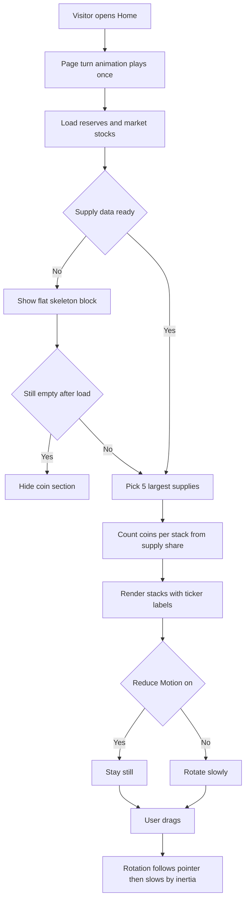

# Paper 3D Redesign — Home (Foundation + Layout Shell + Home)

| | |
|---|---|
| **Version** | 1.3 |
| **Status** | Approved |
| **Date Created** | 2026-10-02 |
| **Last Updated** | 2026-10-02 |

| Version | Date | Change |
|---|---|---|
| 1.3 | 2026-10-02 | Found by comparing screenshots with the handoff. Section 3.5: new "Typography" table (Fraunces optical-size axis, line-height rule). Section 4: `app/layout.tsx` added as `[MODIFY]` (load Fraunces with the `opsz` axis). Section 3.3: swap card title uses line-height normal. |
| 1.2 | 2026-10-02 | Sections 3.6, 4 and 8: Home movers must match the handoff sparkline (88×28, stroke 1.4), so `Sparkline.tsx` gets an optional `strokeWidth` prop (default unchanged at 1.25) and moves from "not touched" to `[MODIFY]`. Open question 3 removed. |
| 1.1 | 2026-10-02 | Status set to Approved. Added section 3.5 (exact 1:1 spec read from both handoff HTML files) and section 3.6 (intentional deviations). Section 3.1: swap card needs a 3-sheet stack shadow, added `.paper-stack-3`. Section 3.3: stats grid, slippage panel background and disclaimer margin corrected to the handoff values. Section 4: added `Sparkline.tsx` as untouched. Section 8: question 3 added. |
| 1.0 | 2026-10-02 | Initial draft |

> This is plan 1 of 6 for the "Paper 3D" redesign (handoff: `design_handoff_paper_3d`). It carries the shared foundation and the layout shell because Home is the first page to need them. Each later page gets its own plan: Markets, Stock detail, Portfolio, Custodian, Quasar. Delivery is one large PR, one commit per page.

---

## 1. Problem Statement

**In plain words.** The app looks flat today: white cards with thin lines. The new design turns every page into stacked sheets of paper, with a printed look for numbers and a 3D coin stack on the first page. Home is the first thing a visitor sees, so it must carry the new look before anything else.

| Today | Target |
|---|---|
| Flat `.card` boxes, hard offset shadow on the swap card | Stacked-sheet cards (`.paper-stack`), small lip under buttons |
| Hero is text only | Hero plus a draggable 3D coin stack sized by tokens in circulation |
| Stats are plain text under a hairline | Stats are paper cards that lift on hover |
| Modals and toasts have a flat border | Modals sit on a small pile of sheets, toasts look like paper slips |

**This redesign changes presentation only.** Data, hooks, contract calls, routing and every prop stay as they are.

---

## 2. Definition of Done

| # | Criterion |
|---|---|
| 1 | Home matches the handoff at three widths: desktop, below 1024px, below 720px. |
| 2 | Swap flow behaves exactly as before: token pick, amount, percent chips, flip, slippage, quote, CTA states, toasts. |
| 3 | Coin stack is built from live data. It shows the 5 pStocks with the largest circulating supply, and coin count follows `max(2, round(supply / maxSupply × 8))`. |
| 4 | Coin stack rotates on drag with inertia. It auto-rotates unless the user has "Reduce Motion" on. Drag still works in that case. |
| 5 | If supply data is loading, a flat skeleton block is shown. If it stays empty, the whole coin section is hidden. |
| 6 | Sticky behaviour is intact: navbar, and the swap card above 1024px. `position: fixed` elements (toasts, modals) are not displaced by the page transition. |
| 7 | Footer is unchanged (stays dark). |
| 8 | No new dependency, no test file under `frontend/components/` or `frontend/app/`, no new hardcoded LLM-facing text. |

---

## 3. Feature Description

### 3.1 Foundation (shared by all pages)

Tokens and utilities added to `app/globals.css`. Existing variable names are kept.

| Item | Change |
|---|---|
| `--sheet-2` | New, `#efebe3` |
| `.paper-stack`, `.paper-slip`, `.paper-sheaf` | New utilities, values copied from the handoff README |
| `.paper-stack-3` | New. The Home swap card uses a deeper 3-sheet shadow than `.paper-stack` (exact value in section 3.5) |
| `.btn-merah`, `.btn-primary` | Add the 1px lip shadow. Hover on merah stays `--merah-deep`. |
| `.skeleton` | Gradient becomes `#f3f0ea → #e9e4dc → #f3f0ea`, 400px, no border radius |
| `.rise` | Becomes opacity 0, `translateY(10px) rotateX(-8deg)` to none in .28s, same easing |
| `.page-turn` | New. Page enter animation, `translateY(18px) rotateX(3deg)` to none in about .3s |

> **Note:** `.page-turn` uses the `perspective()` function inside the keyframes, not the `perspective` property on `<main>`. The property would make `<main>` the containing block for `position: fixed` children and displace them. The animation ends at `transform: none`, so nothing stays transformed afterwards.

Because these are global classes, other pages will pick up the lip, skeleton and `.rise` changes the moment this commit lands. That is intended; their own layouts are restyled in their own plans.

### 3.2 Layout shell

| Component | Change |
|---|---|
| `NavBar` | Keep logic, links, roles, wallet button. Restyle: translucent canvas with blur, ink bottom rule, wallet pill with square status dot, hamburger panel with paper lip below 720px. |
| `PriceTicker` | Restyle only: hairline rule, skeleton uses the new `.skeleton`. Marquee logic unchanged. |
| `Layout` | Wrap `children` in a `.page-turn` container so every page gets the page-turn on mount. |
| `Masthead` | Not mounted anywhere today and not in the Home design. Left untouched. |
| `Footer` | Unchanged. |

### 3.3 Home

| Block | Change |
|---|---|
| Hero | Same copy. Display type per the handoff (70 / 60 / 38px by width). |
| Stats row | 3 `Stat` items become `.paper-stack` cards that lift 4px on hover, in an auto-fit grid (min 150px, gap 18px) with no hairline above it. Same values and loading text. |
| Coin stack (new) | `components/home/CoinStack.tsx`. CSS 3D (`preserve-3d`, `rotateX(60deg)`) driven by `requestAnimationFrame`. A ticker label sits on each stack with 24h change. Caption under it: "Drag to rotate · stack height = tokens in circulation" and "Each coin backed 1:1 in custody". |
| Top movers | Same data and sort. Rows lift 3px on hover and show a paper shadow. |
| Swap card | Becomes a 3-sheet `.paper-stack-3`. Token pills get a paper lip. Slippage panel sits on `#f3f0ea`. Active slippage chip is ink with a lip. Disabled CTA states use `#e3ddd2` / `#6b635c` / border `#bcb2a3`. Executing state uses `#9a0c24`. Sticky `top` goes from 24px to 120px. Disclaimer margin-top goes from 18px to 34px. |
| Accordion | Summary row gets a 1px dashed hairline under it. Detail rows 13px. |
| TokenSelectModal | `.paper-sheaf`, 460px. Group headers on `#f3f0ea`, row hover `#fbfaf7`, 34px logo tile on `#f3f0ea`. |
| Toasts | `.paper-slip` with a 3px top border (positive, merah, ink for success, error, info). Loading toasts get a spinner and no top border. Rotation alternates -.3deg and .25deg. |

### 3.4 Coin stack data

| Input | Source | Note |
|---|---|---|
| Circulating supply per pStock | `useReserves()` → `on_chain_supply` (raw, 18 decimals) | Public endpoint `/public/reserves`. Converted with the existing `rawTokenToNumber`. |
| Ticker label and 24h change | `useMarketStocks()` | Already used on Home. |
| Logo on the top coin | `PStockMark` icon path | Existing assets under `public/logos/`. |

Auto-rotate is off when `prefers-reduced-motion: reduce` matches. The component keeps the handoff's `autoRotate` prop and feeds it from that media query.

### 3.5 Exact spec (read from the handoff HTML files)

Desktop value first, then tablet (below 1024px) and mobile (below 720px) where they differ. Colours are hex from the handoff. "Ink" = `#16110e`, "body" = `#6b635c`.

**Typography**

| Item | Spec |
|---|---|
| Fraunces optical size | The handoff loads Fraunces from Google Fonts with the `opsz` axis (9 to 144), so large display text is drawn tighter and sharper. The repo loads fixed weights only, which draws display text wider. `app/layout.tsx` must load Fraunces with `axes: ['opsz']` (all weights stay available). |
| Line height | The handoff writes most text with the CSS `font:` shorthand, which resets line-height to `normal`. Text that sits in a size-sensitive row (the swap card title) uses `normal`, not the body 1.5. |

**Shadows**

| Name | Value |
|---|---|
| `.paper-stack` | `0 1px 0 #e3ddd2,0 4px 0 -2px #f3f0ea,0 5px 0 -2px #e3ddd2,0 9px 0 -4px #efebe3,0 10px 0 -4px #e3ddd2,0 22px 30px -16px rgba(22,17,14,.25)` |
| `.paper-stack` hover (stats) | `0 1px 0 #e3ddd2,0 6px 0 -2px #f3f0ea,0 7px 0 -2px #e3ddd2,0 13px 0 -4px #efebe3,0 14px 0 -4px #e3ddd2,0 34px 40px -18px rgba(22,17,14,.3)` |
| `.paper-stack-3` (swap card) | `0 1px 0 #e3ddd2,0 5px 0 -2px #f3f0ea,0 6px 0 -2px #e3ddd2,0 11px 0 -4px #efebe3,0 12px 0 -4px #e3ddd2,0 17px 0 -6px #ebe6dc,0 18px 0 -6px #e3ddd2,0 40px 50px -24px rgba(22,17,14,.35)` |
| Mover row hover | `0 4px 0 -2px #f3f0ea,0 5px 0 -2px #e3ddd2,0 18px 24px -14px rgba(22,17,14,.3)` |
| Merah lip | `0 4px 0 -1px #fff,0 5px 0 -1px #9a0c24` |
| Token pill lip (pay / receive) | `0 3px 0 -1px #fff,0 4px 0 -1px #bcb2a3` / `0 3px 0 -1px #fbfaf7,0 4px 0 -1px #bcb2a3` |
| Active slippage chip lip | `0 3px 0 -1px #f3f0ea,0 4px 0 -1px #16110e` |

**NavBar and ticker**

| Element | Spec |
|---|---|
| Bar | sticky top 0, z 100, bg `rgba(251,250,247,.94)` + `blur(8px)`, bottom 1px ink. Padding 14px 24px (mobile 10px 16px). Inner min-height 44px. |
| Tabs | gap 28px, Inter 600 14px, padding 8px 0. Active: ink text + 2px merah underline. Inactive: body text, transparent underline. |
| Centre logo | 62px high (desktop only). Mobile: hamburger 40×40, 1px ink, bg `#fbfaf7`, then 36px mark. |
| Right | "EN · IDR/USD n" Inter 600 11px, tracking .16em, uppercase, body (hidden below 1024px). Wallet pill: 1px ink, padding 10px 14px, 8px square dot `#1f7a4b`, mono 500 12px, hover bg ink / text white. |
| Mobile panel | bg `#fbfaf7`, bottom 1px ink, shadow `0 5px 0 -2px #fbfaf7,0 6px 0 -2px #e3ddd2,0 20px 24px -14px rgba(22,17,14,.3)`. Items padding 16px 24px, Inter 600 18px, bottom 1px `#e3ddd2`, active merah. |
| Ticker | bottom 1px `#e3ddd2`, padding 10px 0, gap 48px, ticker Inter 600 12px, price mono 12px, change mono 11px, marquee 60s. |

**Home layout**

| Element | Spec |
|---|---|
| Grid | `minmax(0,1fr) 480px`, gap 48px, align start, padding 40px 24px (mobile 24px 16px), max-width 1440px centred. Tablet: one column, gap 32px. |
| Headline | Fraunces 400, 70 / 60 / 38px, line-height .96 (mobile 1.04), tracking -.03em. "unbound" in Instrument Serif italic, tracking -.01em. |
| Intro | margin 28px 0 0, max-width 540px, Fraunces 300 18px/1.55, colour `#2a231e`. Italic names in Instrument Serif. |
| Stats | grid `repeat(auto-fit,minmax(150px,1fr))`, gap 18px, margin-top 36px. Card: white, 1px `#e3ddd2`, padding 16px 18px, `.paper-stack`, hover `translateY(-4px)` + hover shadow, transition .3s `cubic-bezier(.2,.7,.3,1)`. Label Inter 600 11px, tracking .16em, uppercase, body. Value Fraunces 400 30px/1, tracking -.02em, margin-top 8px. Sub 12px body, margin-top 6px. |
| Coin area | margin-top 32px. Stage height `round(300 × scale)`, `overflow:hidden`, `scale = min(1, (min(vw,720) - 48) / 480)`. Caption: margin-top 0, top border 1px `#e3ddd2`, padding-top 10px, Inter 600 10px, tracking .16em, uppercase, body, space-between, wrap, gap 8px. |
| Movers | margin-top 36px. Eyebrow Inter 600 11px, tracking .16em, body, margin-bottom 14px. List top border 1px `#e3ddd2`. Row: grid `auto minmax(0,1fr) 88px auto auto` gap 16px (mobile: no sparkline column, gap 10px), padding 14px 10px, bottom 1px `#e3ddd2`, bg `#fbfaf7`, hover `translateY(-3px)` + bg white + mover shadow + z 2, transition .22s. Logo 32px contain. Ticker Inter 600 14px. Sub 12px body, ellipsis. Sparkline 88×28, stroke 1.4. Price mono 400 14px (mobile 12px), right. Change mono 400 13px, right, min-width 62px. |
| Swap column | sticky `top:120px` (static below 1024px), width 100%, max-width 560px below 1024px. |

**Swap card**

| Element | Spec |
|---|---|
| Header | padding 16px 20px, bottom 1px `#e3ddd2`. Title Fraunces 500 22px. Settings button 30×30, 1px border. Closed: white bg, ink icon, `#e3ddd2` border. Open: ink bg, white icon, ink border. |
| Slippage panel | padding 14px 20px, bg `#f3f0ea`, bottom 1px `#e3ddd2`. Label Inter 600 10px, tracking .14em, uppercase, body, margin-bottom 8px. Chips gap 6px, padding 8px 14px, Inter 600 13px. Selected: ink bg, white text, ink border, lip. Unselected: white bg, ink text, `#bcb2a3` border. |
| Pay field | padding 20px 20px 16px, bottom 1px `#e3ddd2`. Label Inter 600 11px, tracking .16em, uppercase, body. Balance mono 12px body. Amount Fraunces 400 36px, tracking -.02em. Pill: 1px ink, bg `#fbfaf7`, padding 8px 12px 8px 8px, gap 10px, logo 26px, ticker Inter 600 14px, caret 10px, lip. Name mono 12px body. Percent chips: 1px `#bcb2a3`, transparent, padding 4px 10px, Inter 600 11px, tracking .08em, uppercase, hover border ink. |
| Flip button | 36×36, absolute, left 50%, top -18px, 1px ink, bg `#fbfaf7`, z 3, rotates 180° per click over .4s `cubic-bezier(.2,.7,.3,1)`, hover bg ink / icon white. |
| Receive field | Same spacing, bg `#fbfaf7`. Amount colour ink when filled, `#bcb2a3` when empty. Pill bg white, lip with `#fbfaf7`. "≈ n IDRX" mono 11px body. |
| Details | Accordion summary: mono 400 13px, padding 12px 0, bottom 1px dashed `#e3ddd2`, caret 11px body. Rows 13px, labels body, values mono 13px, hints Inter 11px body, gap 8px, padding 12px 0. |
| CTA | wrapper padding 0 20px 20px. Button padding 15px 20px, Inter 600 15px, tracking .03em. On: bg `#c8102e`, white text, no border, merah lip, hover `#9a0c24`. Executing: bg `#9a0c24`, lip kept. Off: bg `#e3ddd2`, text body, 1px `#bcb2a3`, no lip, `not-allowed`. Note: margin-top 12px, centred, 11px, tracking .04em, body. |
| Disclaimer | margin-top 34px, Fraunces 400 12px/1.6, body. |

**TokenSelectModal** (`.paper-sheaf`, 460px, max 92vw)

| Element | Spec |
|---|---|
| Sheet | white, 1px ink, shadow `0 30px 50px -20px rgba(22,17,14,.35)`. Backing sheets: `#efebe3` at `translate(8px,8px) rotate(1deg)` and `#f3f0ea` at `translate(4px,4px) rotate(.4deg)`, both 1px `#bcb2a3`. |
| Header | padding 16px 20px 12px. Title Fraunces 500 22px. Close 30×30, 1px `#e3ddd2`, white. |
| Search | wrapper padding 0 20px 14px, bottom 1px ink. Input 1px `#bcb2a3`, bg `#fbfaf7`, padding 11px 12px 11px 34px, 14px. |
| List | max-height 380px. Group header padding 9px 20px, bg `#f3f0ea`, bottom 1px `#e3ddd2`, Inter 600 10px, tracking .14em, uppercase, body. Row padding 12px 20px, gap 14px, bottom 1px `#e3ddd2`, hover `#fbfaf7`. Logo tile 34×34, bg `#f3f0ea`, logo 26px. Ticker Inter 600 14px. Name 12px body. Balance mono 13px. Price mono 11px body. |
| Empty | white, 1px dashed `#bcb2a3`, padding 24px 20px, body, 14px. |

**Toasts** (sonner)

| Element | Spec |
|---|---|
| Slip | white, 1px `#e3ddd2`, padding 12px 14px, gap 12px, `.paper-slip` shadow `0 5px 0 -2px #fbfaf7,0 6px 0 -2px #e3ddd2,0 18px 22px -14px rgba(22,17,14,.3)`. |
| Types | Top border 3px: success `#1f7a4b`, error `#c8102e`, info ink. Loading: no top border, 14px spinner (2px `#bcb2a3`, top ink). Rotation: success -.3deg, error .25deg, others none. Glyphs: ✓ green, ! merah, i ink, weight 700. |
| Text | Title Inter 600 13px. Description mono 400 12px body, margin-top 2px. |

**Coin stack** (ported from the handoff `CoinStage`)

| Element | Spec |
|---|---|
| Stage | scene 440×300, margin-top 40px, `preserve-3d`, transform `scale(s) rotateX(60deg) rotateZ(a deg)`, parent `perspective:1400px`, cursor grab, `touch-action:none`. |
| Motion | start angle -28°. Auto +0.1° per frame. Drag adds `dx × 0.45`, release velocity `dx × 0.08`, decays ×0.94 per frame. |
| Board | 3 layers: `#e3ddd2` at z -10, `#efebe3` + 1px `#e3ddd2` at z -5, `#f8f6f1` + 1px `#e3ddd2` with 24px grid lines `#ebe6dc` at z 0. |
| Slots | `[110,90] [300,80] [210,190] [360,220] [80,230]`, filled in order of supply, largest first. Edge colours `#16110e #c8102e #1f4d8a #9a0c24 #5a4a3a`. |
| Coin | 96px circle, 8 edge layers 1.3px apart (first 2 `#a39988`, every 3rd the slot edge colour, rest `#d6cfc1`), face at `base + 10.5` white, 2px ink border, inset rings `0 0 0 5px #fff` and `0 0 0 6px edge`. `base = coinIndex × 11`. Top coin shows a 50px logo. Soft floor shadow 140px radial `rgba(22,17,14,.22)`. |
| Label | white, 1px ink, padding 5px 8px, lip `0 3px 0 -1px #fbfaf7,0 4px 0 -1px #16110e`. Ticker Inter 700 11px, change mono 500 11px in positive / negative. Counter-rotated so it always faces the viewer. |

### 3.6 Intentional deviations from the handoff

These exist in the code and not in the handoff. They are logic, not presentation, so they stay.

| Item | Decision |
|---|---|
| Custom slippage number input next to the chips | Kept, restyled with the same border and input style |
| "Protocol fee" row when fee is above 0 | Kept |
| "Connect Wallet" button state in navbar and swap CTA | Kept, styled as merah with lip |
| Percent chips shown only when a wallet is connected | Kept |
| Role-based nav items (Portfolio, Custodian) and the CUSTODIAN badge | Kept |
| Accordion detail rows in the swap card | Kept. The Home design shows the rows always open, the Components sheet shows an accordion. Home keeps the accordion and starts open (as today). |
| TokenSelectModal empty state | Rendered inside the list area, not as a separate box below the modal |
| Sparkline stroke 1.25 vs 1.4 | `Sparkline.tsx` is shared with other pages, so it gets an optional `strokeWidth` prop whose default stays 1.25. Home passes 1.4 together with width 88 and height 28. |

---

## 4. Impacted Files

| Layer | File | Action |
|---|---|---|
| Styles | `frontend/app/globals.css` | `[MODIFY]` |
| Fonts | `frontend/app/layout.tsx` (Fraunces `opsz` axis only) | `[MODIFY]` |
| Providers | `frontend/app/providers.tsx` (Toaster) | `[MODIFY]` |
| Layout | `frontend/components/layout/Layout.tsx` | `[MODIFY]` |
| Layout | `frontend/components/layout/NavBar.tsx` | `[MODIFY]` |
| Layout | `frontend/components/layout/PriceTicker.tsx` | `[MODIFY]` |
| Home | `frontend/components/swap/SwapView.tsx` | `[MODIFY]` |
| Home | `frontend/components/home/CoinStack.tsx` | `[NEW]` |
| UI | `frontend/components/ui/Accordion.tsx` | `[MODIFY]` |
| UI | `frontend/components/ui/TokenSelectModal.tsx` | `[MODIFY]` |
| UI | `frontend/components/ui/Sparkline.tsx` (optional `strokeWidth` prop only) | `[MODIFY]` |
| Docs | `docs/plans/paper-3d-redesign-home.md` | `[NEW]` (this file) |

Not touched: `app/home/ui.tsx`, `Footer.tsx`, `Masthead.tsx`, `ui/PStockMark.tsx`, everything under `http/`, `lib/`, `contexts/`, `backend/`, `smart-contract/`.

---

## 5. UI/UX Changes (Lo-Fi)

### 5.1 Home, desktop (above 1024px)

```
+------------------------------------------------------------------+
| Home  Markets  Portfolio        [ LOGO ]     EN-IDR/USD [0x7a..] |  navbar, ink rule
+------------------------------------------------------------------+
| BUMIP 24,100 +1.2%   ENRGP ...   (marquee)                       |  ticker
+------------------------------------------------------------------+
|  Indonesia's market,                        +-----------------+  |
|  unbound                                    | Swap         ⚙  |  |
|  from its trading hours.                    |-----------------|  |
|  intro paragraph                            | You pay         |  |
|                                             | 0.00   [IDRX v] |  |
|  [Volume ] [ TVL ] [Peg dev]  <- paper      |       [⇅]       |  |
|                                             | You receive     |  |
|     (   3D coin stacks, drag to rotate  )   | 0.00   [BUMIP v]|  |
|     Drag to rotate   |  Each coin 1:1       | > rate summary  |  |
|                                             | [ Execute Swap ]|  |
|  Top movers · 24h                           +-----------------+  |
|  [logo] BUMIP  ~spark~  price   +1.2%        sticky, 3 sheets    |
|  ...                                        disclaimer text      |
+------------------------------------------------------------------+
| Footer (dark, unchanged)                                         |
+------------------------------------------------------------------+
```

### 5.2 Home, below 1024px and below 720px

| Width | Behaviour |
|---|---|
| Below 1024px | One column. Swap card is no longer sticky and is capped at 560px. Hero 60px. |
| Below 720px | Hamburger menu, no date band, hero 38px, coin stage scaled to fit width (`min(1, (min(vw,720) - 48) / 480)`), movers hide the sparkline. |

### 5.3 States

| Block | Loading | Empty or error | Reduce Motion |
|---|---|---|---|
| Stats | Value shows `—`, sub shows `loading…` (as today) | Same | n/a |
| Coin stack | Flat `#f3f0ea` skeleton block, same height | Section hidden | No auto-rotate, drag still works |
| Movers | 5 skeleton rows (as today, new skeleton style) | Empty list | n/a |
| Swap CTA | `Executing…` on `#9a0c24` | Disabled variants per section 3.3 | n/a |

### 5.4 Before and after

| Element | Before | After |
|---|---|---|
| Stat | Text under a hairline | Paper card, lifts on hover |
| Swap card | Flat card, hard offset shadow | 3 stacked sheets, soft long shadow |
| Token pill | Flat bordered button | Bordered button with paper lip |
| Merah button | Flat red | Red with white and deep-red lip under it |
| Toast | White box, ink border | Paper slip, coloured top rule, slight tilt |

---

## 6. Flowchart



---

## 7. Verification Plan

Frontend only. No backend or contract behaviour changes, so none is tested here.

### 7.1 Static checks

| Check | Command (run from `frontend/`) |
|---|---|
| Types | `npx tsc --noEmit` |
| Lint | `npm run lint` |

### 7.2 Manual verification

| # | Step | Expected |
|---|---|---|
| 1 | Open `/home` at 1440px, 900px, 390px beside the handoff HTML | Layout, type sizes and spacing match |
| 2 | Pick tokens in both pickers, flip, type an amount, use 25% / 50% / Max | Same behaviour as before the redesign |
| 3 | Open slippage, pick 0.1 / 0.5 / 1.0 | Active chip is ink with a lip |
| 4 | Walk the CTA states: not connected, no amount, insufficient, executing | Colours and text per section 3.3 |
| 5 | Run a swap on testnet | Loading, then success or error toast with the paper style |
| 6 | Drag the coin stack, release | Rotates, then slows down |
| 7 | Turn on OS "Reduce Motion", reload | Stack is still, drag still works |
| 8 | Block `/public/reserves` in devtools | Skeleton, then section hidden, no console error |
| 9 | Scroll on desktop and on 900px | Navbar sticky. Swap card sticky only above 1024px. |
| 10 | Navigate Home → Markets → Home | Page turn plays, toasts and modals are not displaced |
| 11 | Open the mobile menu | Hamburger panel has paper lip, links close it |
| 12 | Check Footer | Still dark and unchanged |

---

## 8. Open Questions

| # | Question | Default taken in this plan |
|---|---|---|
| 1 | The handoff's `--warn-deep` (`#7a5406`) and `--warn-soft` (`#fdf6e6`) differ slightly from the repo's (`#8a5f08`, `#fdf6e8`). | Not touched here. Home does not use them. Decided in the Quasar plan. |
| 2 | `Masthead` is unused today and absent from the Home design. | Left untouched. |