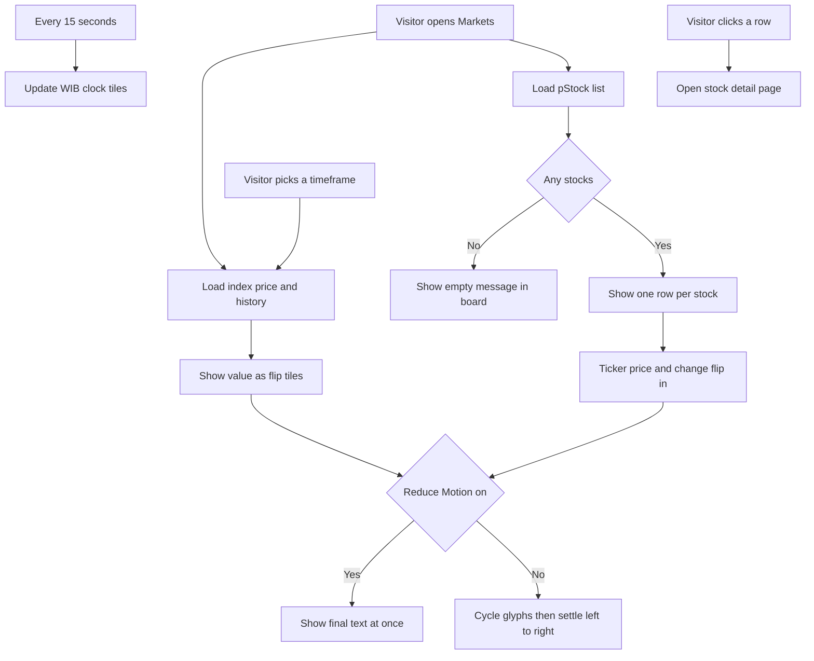

# Paper 3D Redesign — Markets

| | |
|---|---|
| **Version** | 1.7 |
| **Status** | Approved |
| **Date Created** | 2026-10-02 |
| **Last Updated** | 2026-10-02 |

| Version | Date | Change |
|---|---|---|
| 1.7 | 2026-10-02 | Section 4: the viewport-width logic written inside `StocksListView.tsx` moves into a shared hook `lib/useViewportWidth.ts` (also needed by Stock detail). No visible change. |
| 1.6 | 2026-10-02 | Product decision from the owner: the IHSG line must follow direction colour (green when the period is up, red when down), not ink as in the handoff. Sections 1, 2, 3.2, 4, 5.1, 5.3, 7.2 and 8: removed the ink look. `AreaChart` gets an optional `paper` prop (transparent background, solid `#e9e4dc` grid) and keeps its direction colours. |
| 1.5 | 2026-10-02 | Found by comparing mobile screenshots with the handoff. Section 3.2: timeframe pills keep full size on phones (padding 8px 14px, 12px text) through a new `range-pills-full` modifier, because the shared mobile shrink rule in `globals.css` is also used by Stock detail and Portfolio, whose plans decide later. Section 3.3: company and sector text wrap instead of being cut with an ellipsis, as in the handoff. |
| 1.4 | 2026-10-02 | Found by comparing screenshots with the handoff. Section 3.2: index value is formatted with 2 decimals (the handoff shows `8,112.15`; today's code can show 3, for example `6,036.888`), and the IDR/USD line uses line-height normal so the header is not 5px taller than the handoff. |
| 1.3 | 2026-10-02 | Pre-implementation details. Section 4: added `lib/usePrefersReducedMotion.ts` as `[NEW]` (shared hook used by `SplitFlap`). Section 3.2: chart line is 2px, not 1.8px, because `lightweight-charts` only accepts whole line widths; area fill is flat `rgba(22,17,14,.06)`. Section 3.3: clock uses the 24-hour cycle so midnight reads `00:00`. |
| 1.2 | 2026-10-02 | Status set to Approved. Section 2: added criterion 11, data fetching must not change (same hooks, endpoints, query keys, polling). |
| 1.1 | 2026-10-02 | Section 4: removed the "to be confirmed" note, a search shows `.stock-list-row`, `.stock-sector` and `.stock-sparkline` are used only by `StockRow.tsx`, so their rules can be rewritten freely. Section 8: question 1 marked resolved. |
| 1.0 | 2026-10-02 | Initial draft |

> Plan 2 of 6 for the "Paper 3D" redesign (handoff: `design_handoff_paper_3d`). Builds on `paper-3d-redesign-home.md` (v1.3), which already added the paper utilities, `.skeleton`, `.rise` and the layout shell. Delivery is one commit for this page.

---

## 1. Problem Statement

**In plain words.** The Markets page still looks like a plain spreadsheet. The new design makes it feel like a printed price board: the market index and every stock price are shown on little paper tiles that flip like an old railway or airport sign when a number changes, and the chart and the board sit on stacked sheets of paper.

| Today | Target |
|---|---|
| Index value is plain big text | Index value is a row of flip tiles that settle left to right |
| Chart sits in a thin bordered box | Chart sits on a stacked-sheet card (`.paper-stack`), keeps its green or red line by direction |
| Stock list is a table with a sector chip column | One light "board" card with a header strip (live dot and WIB clock), flip tiles for ticker, price and 24h change, sector shown under the company name |
| Table hides columns on phones | Board keeps all columns and scrolls sideways on phones |

**This redesign changes presentation only.** Data, hooks, timeframes, row links and every prop stay as they are.

---

## 2. Definition of Done

| # | Criterion |
|---|---|
| 1 | Markets matches the handoff at three widths: desktop, below 1024px, below 720px. |
| 2 | Timeframe buttons (1D, 1W, 1M, 3M, 1Y) still reload the chart and the index value and change, exactly as today. |
| 3 | Index value, and each row's ticker, price and 24h change, render as flip tiles. Tiles cycle random glyphs every 55ms and settle left to right (character `k` settles at frame `3 + k`). Characters that did not change settle immediately. |
| 4 | With "Reduce Motion" on, flip tiles show the final text immediately, with no cycling. |
| 5 | The WIB clock shows the current Jakarta time (HH:MM) and refreshes every 15 seconds. |
| 6 | Clicking a row still opens `/stocks/[ticker]`. |
| 7 | Loading, empty and error-free states still work: skeleton rows while loading, the existing empty message when no pool is live. |
| 8 | On phones the board keeps a 760px minimum width and scrolls horizontally inside its card. The page itself does not scroll sideways. |
| 9 | `AreaChart` keeps its current look on Stock detail and Portfolio. The new `paper` look (transparent background, solid grid) is opt-in, and the line colour stays green when up and red when down everywhere. |
| 10 | No new dependency, no test file under `frontend/components/` or `frontend/app/`. |
| 11 | Data fetching does not change: the same hooks (`useMarketStocks`, `useStockPrice`, `useStockHistory`), endpoints, query keys and polling as today. Only how the data is displayed changes. |

---

## 3. Feature Description

### 3.1 Split-flap tile (new shared component)

`components/ui/SplitFlap.tsx`, ported from the handoff `Flap`. It is shared, because Custodian and other pages use the same tiles later.

| Item | Spec |
|---|---|
| Props | `text`, `size` (px), `color?` (default ink), `paper?` (default true here) |
| Glyph set | ` 0123456789ABCDEFGHIJKLMNOPQRSTUVWXYZ.,+-%:` |
| Tile | width `round(size × 0.74)`, height `round(size × 1.3)`, gap `max(2, round(size × 0.1))` |
| Paper tile | bg `#f3f0ea`, text ink (or `color`), JetBrains Mono 600 `size`px/1, radius 2px, overflow hidden, shadow `inset 0 -1px 0 #e3ddd2, 0 1px 0 #d9d1c4` |
| Fold line | absolute, left 0, right 0, top 50%, 1px `rgba(22,17,14,.12)` |
| Glyph enter | `flip` keyframes, `scaleY(.1)` and opacity .3 to `scaleY(1)` and opacity 1, .12s ease-out |
| Motion | starts blank. On `text` change it ticks every 55ms. Unchanged characters show at once, the rest show random glyphs until frame `3 + k`. |
| Reduced motion | `prefers-reduced-motion: reduce` shows `text` directly |

Fonts: JetBrains Mono currently loads weights 400, 500, 700. Tiles need 600, so `app/layout.tsx` adds it.

### 3.2 Index header and chart

| Block | Change |
|---|---|
| Container | `max-width:1440px`, centred, padding `32px 32px 64px` (mobile `24px 16px 48px`). Replaces `container pad-x`. |
| Header grid | `repeat(auto-fit,minmax(min(100%,420px),1fr))`, gap 36px, align end. Left: eyebrow, flip value, change. Right: timeframe pills (right aligned, left aligned on mobile). |
| Eyebrow | Same text. Inter 600 11px, tracking .16em, uppercase, body, margin-bottom 10px. |
| Value | Flip tiles, size 34 (mobile 24), text in en-US formatting with exactly 2 decimals. Change beside it: mono 400 18px, positive or negative, same text as today (`+0.00% 1M`). Gap 16px, wrap, align centre. |
| IDR/USD | Moves under the value: mono 400 13px, body, margin-top 10px. Same data. Skeleton stays while loading. |
| Timeframe pills | `.range-pills` already matches on desktop (1px `#bcb2a3`, gap 4px, padding 8px 14px, Inter 600 12px/1, tracking .06em, active ink). Markets adds the modifier `range-pills-full` so the phone shrink rule (6px 10px, 10px text) does not apply here. |
| Chart card | `.paper-stack`, margin-top 16px, padding `12px 16px 0`. Replaces the thin bordered box. |
| Chart drawing | Line and area keep direction colours: green when the period ends higher than it started, red when lower (as `AreaChart` does today). Handoff differences kept on purpose: transparent background so the white card shows, solid horizontal grid `#e9e4dc`. Line width stays 2px (the handoff's 1.8px is not allowed by `lightweight-charts`). |

### 3.3 pStocks board

| Block | Change |
|---|---|
| Section header | margin-top 56px, flex, space-between, baseline, wrap, gap 8px, bottom 1px ink, padding-bottom 12px. Title Fraunces 400 26px. Sub-eyebrow 11px, margin-top 4px (existing text kept). Right label "Live board · updates every few seconds" Inter 600 11px, tracking .16em, uppercase, body. |
| Board card | `.paper-stack`, margin-top 20px, padding `18px clamp(12px,2vw,24px) 10px`, `overflow-x:auto`. Inner wrapper `min-width:760px`. |
| Board strip | flex, space-between, centre, body, Inter 600 11px, tracking .2em, uppercase, padding-bottom 12px, bottom 1px ink. Left: 8px merah dot pulsing (1.6s) and "PulsarFi Board · 24/7". Right: "WIB" and a clock flip (size 14, `HH:MM`, 24-hour cycle). |
| Column header | grid `48px 150px minmax(0,1fr) 200px 150px 80px`, gap 16px, padding 10px 6px, Inter 600 10px, tracking .16em, uppercase, body. Labels: (blank), Ticker, Company · Sector, Price IDRX, 24h, 7d (right aligned). |
| Row | same grid, align centre, padding 9px 6px, top 1px `#efebe3`, pointer, hover bg `#f7f4ee`, transition .15s. |
| Row cells | Logo tile 34×34 `#f3f0ea` with 26px logo. Ticker flip (size 18). Company 14px 600 ink with the leading "Pulsar " removed, sector 12px body below. Both lines wrap when the column is narrow, they are not cut with an ellipsis. Price flip (size 18, number only, right-padded to 7 characters). 24h flip (size 18, positive or negative colour, padded to 7). Sparkline 72×28, stroke 1.4, positive or negative colour, aligned end. |
| Empty | Existing message, shown inside the board card under the column header. |
| Loading | 6 skeleton rows built from flat `#f3f0ea` blocks in the same grid. |

---

## 4. Impacted Files

| Layer | File | Action |
|---|---|---|
| Fonts | `frontend/app/layout.tsx` (JetBrains Mono weight 600 only) | `[MODIFY]` |
| UI | `frontend/components/ui/SplitFlap.tsx` | `[NEW]` |
| Lib | `frontend/lib/usePrefersReducedMotion.ts` | `[NEW]` |
| Lib | `frontend/lib/useViewportWidth.ts` (shared with Stock detail) | `[NEW]` |
| Charts | `frontend/components/charts/AreaChart.tsx` (optional `paper` prop, default unchanged) | `[MODIFY]` |
| Markets | `frontend/components/stocks/StocksListView.tsx` | `[MODIFY]` |
| Markets | `frontend/components/stocks/StockRow.tsx` (row, skeleton row) | `[MODIFY]` |
| Styles | `frontend/app/globals.css` (board row hover, remove `.stock-list-row` mobile hiding, `flip` keyframes, `pulse-dot` reuse) | `[MODIFY]` |
| Docs | `docs/plans/paper-3d-redesign-markets.md` | `[NEW]` (this file) |

Not touched: `ChartSkeleton.tsx` (already shimmers), `Sparkline.tsx` (already has `strokeWidth`), `PStockMark.tsx`, everything under `http/`, `lib/`, `contexts/`, `backend/`, `smart-contract/`.

`.stock-list-row`, `.stock-sector` and `.stock-sparkline` in `globals.css` are used only by `StockRow.tsx`, so their rules (including the mobile hiding rules) are rewritten for the board without affecting other pages.

---

## 5. UI/UX Changes (Lo-Fi)

### 5.1 Markets, desktop

```
+------------------------------------------------------------------+
| INDEKS HARGA SAHAM GABUNGAN · IDX COMPOSITE      [1D 1W 1M 3M 1Y]|
| [7][,][2][8][4][.][5][1]  +1.24% 1M                              |
| IDR/USD 16,142                                                   |
|  +------------------------------------------------------------+  |
|  |  green or red line chart on stacked paper                  |  |
|  +------------------------------------------------------------+  |
|                                                                  |
| pStocks                                   LIVE BOARD · UPDATES.. |
| 8 MARKET-READY EQUITIES · ARBITRUM                               |
| ================================================================ |
|  +------------------------------------------------------------+  |
|  | o PULSARFI BOARD · 24/7                        WIB [1][4][:][0][2] |
|  | ------------------------------------------------------------ |
|  |      TICKER   COMPANY · SECTOR   PRICE IDRX   24H        7D  |
|  | [logo][B][U][M][I][P]  Bumi Resources  [2][4].[5][0][0] [+][4].. ~~ |
|  |                        Energy                                |
|  | ...                                                          |
|  +------------------------------------------------------------+  |
+------------------------------------------------------------------+
```

### 5.2 Responsive and states

| Width | Behaviour |
|---|---|
| Below 1024px | Header grid collapses to one column. Everything else as desktop. |
| Below 720px | Padding `24px 16px 48px`. Index flip size 24. Pills left aligned. Board keeps `min-width:760px` and scrolls sideways inside its card. |

| State | Behaviour |
|---|---|
| Index loading | Existing skeletons (value and IDR/USD), then tiles flip in |
| Chart loading | Existing `ChartSkeleton` inside the paper card |
| Board loading | 6 flat skeleton rows |
| Board empty | "No pStocks have an active liquidity pool yet." inside the board card |
| Reduce Motion | Tiles show final text at once, the live dot stops pulsing |
| Timeframe change | Value and change tiles flip to the new number, chart redraws |

### 5.3 Before and after

| Element | Before | After |
|---|---|---|
| Index value | 42px Fraunces text | Flip tiles, 34px |
| Chart box | Thin border, canvas background | `.paper-stack`, white, direction-coloured line |
| Stock table | Hairline rows, sector chip column | Paper board card, flip tiles, sector under name |
| Row hover | `#f3f0ea` | `#f7f4ee` |
| Phone table | Columns hidden, rows stacked | Same columns, horizontal scroll |

---

## 6. Flowchart



---

## 7. Verification Plan

Frontend only. A mock API is needed to see data locally, because the backend is not running in this environment.

### 7.1 Static checks

| Check | Command (from `frontend/`) |
|---|---|
| Types | `npx tsc --noEmit` |
| Lint | `npx eslint app components` |

### 7.2 Manual verification

| # | Step | Expected |
|---|---|---|
| 1 | Open `/stocks` at 1440px, 900px and 390px beside the handoff HTML | Layout, type sizes and spacing match |
| 2 | Load the page | Index tiles and row tiles flip in, settling left to right |
| 3 | Switch 1D, 1W, 1M, 3M, 1Y | Value and change tiles flip, chart redraws, line green when up and red when down |
| 4 | Turn on OS "Reduce Motion", reload | Tiles show final text at once |
| 5 | Wait 15 seconds | Clock tiles update to the current Jakarta time |
| 6 | Hover and click a row | Hover tint `#f7f4ee`, opens `/stocks/[ticker]` |
| 7 | Narrow to 390px | Board scrolls inside its card, page has no sideways scroll |
| 8 | Block the stock list request | Skeleton rows, then the empty message |
| 9 | Open Stock detail and Portfolio | Their charts still use direction colours |

---

## 8. Open Questions

| # | Question | Default taken in this plan |
|---|---|---|
| 1 | Is `.stock-list-row` (and its mobile rules) used by any page other than Markets? | Resolved in v1.1: no, only `StockRow.tsx` uses it. |
| 2 | The handoff clock is local time but is labelled "WIB". | Shows real Jakarta time (`Asia/Jakarta`), so the label is always correct. |
| 3 | The handoff chart is a static drawing with no axes. The app chart has axes and a crosshair. | Keep the interactive chart (it is logic). The line stays direction-coloured by owner decision, with a transparent background and a solid `#e9e4dc` grid. |
| 4 | Reduce Motion for flip tiles is not in the handoff. | Tiles show the final text at once, same rule as the Home coin stack. |

---

## 9. Decisions Requiring Review

| Decision | Why it needs a look |
|---|---|
| Company name drops the leading "Pulsar " | Follows the handoff, but changes the displayed text of live data. |
| Sector chip column is removed | Sector now appears under the company name, as in the handoff. |
| Mobile table no longer stacks | Follows the handoff (scroll sideways), replacing the current stacked layout. |
