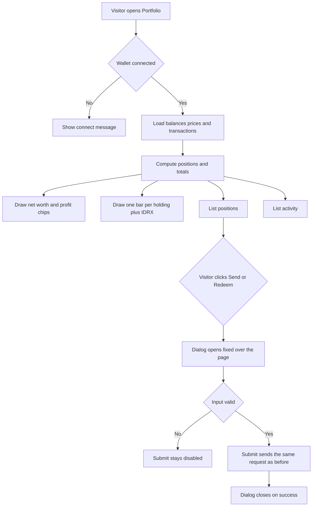

# Paper 3D Redesign — Portfolio (with the Redeem and Send dialogs)

| | |
|---|---|
| **Version** | 1.0 |
| **Status** | Approved |
| **Date Created** | 2026-10-02 |
| **Last Updated** | 2026-10-02 |

| Version | Date | Change |
|---|---|---|
| 1.0 | 2026-10-02 | Initial plan. Approved by the owner's instruction to continue with the next page. |

> Plan 4 of 6 for the "Paper 3D" redesign (handoff: `design_handoff_paper_3d`). Builds on the Home, Markets and Stock detail plans. Delivery is one commit for this page.

---

## 1. Problem Statement

**In plain words.** The Portfolio page is a flat dashboard. The new design shows the wallet as a printed statement: a large net-worth figure, a small 3D bar block that shows where the money sits, a chart on a stacked paper card, a positions table whose rows lift when hovered, and an activity list with coloured tags. The Redeem and Send pop-ups sit on a pile of sheets like the Trade pop-up.

**The pop-ups keep behaving exactly as today.** Same rule as Stock detail: only the look of their content changes.

| Today | Target |
|---|---|
| Donut chart and a red-and-black split bar | One 3D bar block, one bar per holding and one for IDRX, with a legend |
| Flat hairline table, expandable rows | Paper-style table that scrolls sideways on phones, rows lift on hover, expandable rows kept |
| Activity rows with a swap icon | Activity rows with a coloured tag (BUY, SELL, REDEEM, IN) |
| White dialogs with an offset shadow | Dialogs on a pile of sheets, KYC notice as a tilted slip |

**This redesign changes presentation only.** Data, hooks, contract calls, routing and props stay as they are.

---

## 2. Definition of Done

| # | Criterion |
|---|---|
| 1 | Portfolio matches the handoff at three widths: desktop, below 1024px, below 720px. |
| 2 | **Redeem and Send dialog behaviour is unchanged.** Same overlay (`position: fixed`, `inset: 0`, z-index 200, centred, 16px padding), backdrop click closes, click inside does not, Escape behaviour unchanged (there is none), submit is disabled until the existing validation passes, the dialog closes after a successful request. Trade still opens the shared Trade dialog from the Stock detail plan. |
| 3 | With the page scrolled down, each dialog overlay still covers the whole viewport and the dialog is centred in the viewport. |
| 4 | Data fetching does not change: same hooks, endpoints, query keys and polling. No new request. |
| 5 | Totals, P&L, allocation percentages, positions and activity rows show the same numbers as today. |
| 6 | The allocation block is built from the same positions and stable balances already loaded. |
| 7 | Expanding a position row still shows its detail chart and key figures. |
| 8 | Not-connected state, loading skeleton and empty activity message still work. |
| 9 | With "Reduce Motion" on there is no new motion to switch off on this page (the hover lift stays, it is a hover effect). |
| 10 | No new dependency, no test file under `frontend/components/` or `frontend/app/`. |

---

## 3. Feature Description

### 3.1 Shared 3D bar

`components/ui/IsoBar.tsx` takes the bar drawing that was local to `ProofOfReserve.tsx` and shares it, with the five handoff palettes. `ProofOfReserve.tsx` imports it, with no visual change.

| Palette | Top | Front | Side |
|---|---|---|---|
| 0 | `#c8102e` | `#9a0c24` | `#7a0a1d` |
| 1 | `#3a312b` | `#16110e` | `#000` |
| 2 | `#1f4d8a` | `#173a68` | `#102a4c` |
| 3 | `#5a4a3a` | `#45382c` | `#33291f` |
| 4 | `#e3ddd2` | `#bcb2a3` | `#a39988` |

### 3.2 Hero

| Block | Spec |
|---|---|
| Container | `max-width:1440px`, centred, padding `32px 32px 64px` (mobile `24px 16px 48px`). |
| Hero grid | `repeat(auto-fit,minmax(min(100%,420px),1fr))`, gap 48px, align centre. |
| Left | Eyebrow merah "Portfolio · 0x7a3F…91cE", margin-bottom 12px. Label "Total Net Worth" Inter 600 11px, tracking .16em, uppercase, body, margin-bottom 6px. Net worth Fraunces 400 `clamp(44px,5.4vw,72px)/.92`, tracking -.035em. |
| P&L chips | flex, wrap, gap 28px, margin-top 18px. Each: label Inter 600 11px, tracking .16em, uppercase, body. Value mono 400 15px, margin-top 4px, in positive, negative or body colour. Text: `+Rp… · +1.2%` (amount and percentage on one line, as in the handoff). "Cash · stables" shows the amount only, in body colour. |
| Right | Eyebrow "Allocation". Stage height 250px, centred, `perspective:1200px`, overflow hidden. Scene 360×60, `scale(s) rotateX(58deg) rotateZ(-32deg)`, `preserve-3d`, margin-top 80px, `s = min(1, (vw - 32) / 420)` on mobile. Board under the bars: inset -24px, bg `#f3f0ea`, 1px `#e3ddd2`, 18px grid lines `#e3ddd2`. |
| Bars | One per position (largest value first) plus one for IDRX (sum of stable balances). Footprint 46×46, step 74px, y 8, height `value / largest × 150` (minimum 6px), palette `index % 5`. With more bars than fit, the step shrinks to `(360 − 46) / (count − 1)` and the footprint to `min(46, step − 4)`. |
| Legend | grid `repeat(auto-fill,minmax(120px,1fr))`, gap 8px 20px. Each: 10px swatch in the bar's top colour with a 1px `rgba(22,17,14,.15)` outline, ticker 13px 600, share of total net worth mono 12px body, pushed right. |

The Donut allocation section and the pStocks-versus-IDRX split bar are removed; their numbers are now in the legend. `Donut.tsx` stays in the repo, unused, until a later clean-up.

### 3.3 Chart

| Block | Spec |
|---|---|
| Section | top border 1px `#e3ddd2`, margin-top 32px, padding-top 24px. |
| Header | flex, wrap, space-between, centre, gap 12px, margin-bottom 18px. Left: eyebrow "Portfolio value", title Fraunces 400 20px (existing "Today", "Last 1M", "All time" text). Right: the six pills with `range-pills-full`. |
| Card | `.paper-stack`, padding `12px 16px 0`. `AreaChart` height 260, `paper` look, direction colours (owner rule from Markets). Skeleton is not needed here, the series is computed locally. |

### 3.4 Positions

| Block | Spec |
|---|---|
| Section header | margin-top 44px, flex, wrap, space-between, baseline, gap 8px, bottom 1px ink, padding-bottom 10px. Title Fraunces 400 32px, tracking -.02em. Right label Inter 600 11px, tracking .16em, uppercase, body (existing count text). |
| Table | wrapper `overflow-x:auto`, inner `min-width:860px`. Grid `2fr 1fr 1fr 1fr 1fr 1fr 240px`, gap 16px. |
| Column header | padding 12px 8px, bottom 1px `#e3ddd2`, Inter 600 10px, tracking .14em, uppercase, body. Labels: Asset, Balance, Avg buy, Price, Value, Unrealized, (blank). Numeric columns right aligned. |
| Row | padding 18px 8px, bottom 1px `#e3ddd2`, bg `#fbfaf7`, align centre, hover `translateY(-3px)` with bg white, shadow `0 4px 0 -2px #f3f0ea,0 5px 0 -2px #e3ddd2,0 18px 24px -14px rgba(22,17,14,.3)` and z 2, transition .22s `cubic-bezier(.2,.7,.3,1)`. Click toggles the detail as today. |
| Asset cell | 4px × 34px accent bar in the position's palette top colour, 32px logo, ticker 700 14px, name 12px body. |
| Number cells | mono 13px, right aligned. Balance ink, avg buy body, price ink, value 600, unrealized in positive or negative (percentage only, as in the handoff). |
| Actions | gap 8px, right aligned, each padding 7px 12px, Inter 600 12px. Trade: ink fill, white text, hover `#000`. Send: white, 1px `#bcb2a3`, hover border ink. Redeem: transparent, 1px ink, hover ink fill and white text. Disabled buttons use 50% opacity. |
| IDRX row | Same grid. Trade disabled (as today), action button reads "Transfer" and opens the same Send dialog, unrealized shows "—". |
| Detail panel | Kept. Panel bg `#f3f0ea`, chart `paper`, key figures as today. |

### 3.5 Activity

| Block | Spec |
|---|---|
| Header | margin-top 56px, same style as Positions. Right label "wallet swaps" (existing). |
| Row | grid `auto minmax(0,1fr) auto`, gap 16px, align centre, padding 14px 4px, bottom 1px `#e3ddd2`. |
| Tag | min-width 64px, centred, padding 4px 8px, Inter 600 10px, tracking .14em, white text on colour. Text is the existing label in capitals (BUY, SELL, REDEEM REQUEST, REDEEMED, RECEIVED, SENT). Colour: Buy positive, Sell negative, redeem group `#5a4a3a`, received and sent `#1f4d8a`. |
| Body | Description 14px 600: existing amounts joined with " → ". Under it mono 11px body: `{when} · {short hash}`. |
| Right | The existing status text (positive, uppercase, 11px) and the explorer link icon, unchanged. |
| Empty | Existing message. |

### 3.6 Dialogs: what is frozen and what changes

| Frozen (behaviour) | Changes (look only) |
|---|---|
| Overlay element, `fixed`, `inset-0`, z-index 200, flex centring, 16px padding, click closes, click inside is stopped | Backdrop `rgba(22,17,14,.45)` to `.32`. Shell becomes `.rise .paper-sheaf` with `.sheet`, width 440px. |
| Validation: Send needs `/^0x[a-fA-F0-9]{40}$/` and `0 < amount <= balance`, Redeem needs `0 < amount <= balance` | Header: padding 16px 20px, bottom 1px `#e3ddd2`, title Fraunces 500 22px, close 30×30 ✕ with 1px `#e3ddd2`. |
| MAX fills the balance, amount input strips non-numeric characters | Labels Inter 600 10px, tracking .14em, uppercase, body. Inputs: bg `#fbfaf7`, 1px `#bcb2a3` (ink when focused or filled), padding 12px (right 60px), mono 500 15px. MAX chip: bg `#f3f0ea`, 1px `#bcb2a3`, padding 4px 8px, Inter 600 11px. |
| Submit handlers, busy state, texts of buttons and errors | Redeem KYC notice becomes a slip: bg `#fbf6e8`, 1px `#e8d9b0`, padding 14px, rotated -.4deg, shadow `0 8px 14px -10px rgba(22,17,14,.3)`. Send cost-basis note: bg `#f3f0ea`, 1px `#e3ddd2`, padding 10px 12px, 12px/1.45 body. |
| | Submit button: ink with lip `0 4px 0 -1px #fff,0 5px 0 -1px #16110e`. Disabled: bg `#e3ddd2`, text body, 1px `#bcb2a3`, no lip. This is also applied to `.btn-primary:disabled` globally. |

### 3.7 Skeleton and not-connected

`PortfolioSkeleton` becomes flat `#f3f0ea` blocks in the new layout. The not-connected state keeps its text and layout, only the shared paper styles apply.

---

## 4. Impacted Files

| Layer | File | Action |
|---|---|---|
| UI | `frontend/components/ui/IsoBar.tsx` | `[NEW]` |
| Stock detail | `frontend/components/stocks/ProofOfReserve.tsx` (import the shared bar, no visual change) | `[MODIFY]` |
| Portfolio | `frontend/components/portfolio/AllocationBars.tsx` | `[NEW]` |
| Portfolio | `frontend/components/portfolio/PortfolioView.tsx` | `[MODIFY]` |
| Dialogs | `frontend/components/ui/RedeemModal.tsx` (look only) | `[MODIFY]` |
| Dialogs | `frontend/components/ui/TransferModal.tsx` (look only) | `[MODIFY]` |
| Styles | `frontend/app/globals.css` (`.btn-primary:disabled`, remove `.position-row`, `.pos-*`, `.activity-row` rules used only by this page) | `[MODIFY]` |
| Docs | `docs/plans/paper-3d-redesign-portfolio.md` | `[NEW]` (this file) |

Not touched: `Donut.tsx` (kept, unused), `AreaChart.tsx`, `SwapModal.tsx`, `lib/portfolio.ts`, `http/`, `contexts/`, `backend/`, `smart-contract/`. `QuasarPanel` is mounted on this page and has its own plan.

---

## 5. UI/UX Changes (Lo-Fi)

### 5.1 Portfolio, desktop

```
+------------------------------------------------------------------+
| PORTFOLIO · 0x7a3F…91CE                         ALLOCATION       |
| TOTAL NET WORTH                              [ 3D bars on grid ] |
| Rp 120.450.000                               ■ BUMIP 41%  ■ ...  |
| TODAY +Rp… · +1.2%   ALL-TIME …   CASH …                         |
| ---------------------------------------------------------------- |
| PORTFOLIO VALUE  Last 1M                  [1D 1W 1M 3M 1Y ALL]   |
| +------------------------------------------------------------+   |
| |  chart on stacked paper                                    |   |
| +------------------------------------------------------------+   |
| Positions                                      4 STOCKS · 1 STABLE|
| ================================================================ |
| ASSET        BALANCE  AVG BUY  PRICE  VALUE  UNREALIZED          |
| |▌ BUMIP     842      24.000   24.500  20,6M  +2.1%  [Trade][Send][Redeem] |
| |▌ IDRX      ...                                    [Trade][Transfer]    |
| Recent activity                                   WALLET SWAPS   |
| [ BUY ]  1.000 IDRX → 40 BUMIP     0xabc… · 2h        CONFIRMED ↗|
+------------------------------------------------------------------+
```

### 5.2 Responsive and states

| Width | Behaviour |
|---|---|
| Below 1024px | Hero stacks into one column. |
| Below 720px | Padding `24px 16px 48px`. Allocation scene scaled to fit. Positions table keeps `min-width:860px` and scrolls sideways inside its wrapper. |

| State | Behaviour |
|---|---|
| Not connected | Existing message and Connect Wallet button |
| Loading | Flat skeleton page |
| No holdings | Allocation shows only the IDRX bar if any, positions list shows the IDRX row only, as data allows |
| No activity | Existing message |
| Row hover | Lifts 3px with a paper shadow |

### 5.3 Before and after

| Element | Before | After |
|---|---|---|
| Allocation | Donut plus split bar | 3D bars with legend, IDRX included |
| P&L chips | Amount, then percentage below | Amount and percentage on one line |
| Table | Eight columns, stacks on phones | Seven columns, scrolls sideways on phones |
| Row identity | Logo, IDX chip, today's change | Colour bar, logo, ticker, name |
| Activity | Swap icon | Colour tag |
| Dialogs | Offset-shadow box | Pile of sheets |

---

## 6. Flowchart



---

## 7. Verification Plan

Frontend only. Interactive checks are scripted through the browser debugging port against a local dev server. Portfolio needs a connected wallet, so wallet-dependent checks use a mock API and an injected wallet state where possible, and anything that cannot be exercised that way is reported as not verified.

### 7.1 Static checks

| Check | Command (from `frontend/`) |
|---|---|
| Types | `npx tsc --noEmit` |
| Lint | `npx eslint components/portfolio components/ui components/stocks app` |

### 7.2 Dialog behaviour (must not regress)

| # | Step | Expected |
|---|---|---|
| 1 | Scroll down, open Send, then Redeem | Overlay top is 0 and covers the viewport, dialog centred in the viewport |
| 2 | Click the backdrop, click inside | Backdrop closes, inside does not |
| 3 | Type an invalid address, a valid address, an amount above the balance, a valid amount | Submit enabled only when valid, MAX fills the balance |
| 4 | Open Trade from a row | Shared Trade dialog opens (see Stock detail plan) |

### 7.3 Visual and data

| # | Step | Expected |
|---|---|---|
| 1 | Open `/portfolio` at 1440px, 900px and 390px beside the handoff HTML | Layout, type sizes and spacing match |
| 2 | Compare totals, P&L and percentages with the page before the redesign | Same numbers |
| 3 | Expand a row | Detail chart and figures show |
| 4 | Narrow to 390px | Table scrolls inside its wrapper, no page-level sideways scroll |
| 5 | Disconnect the wallet | Connect message |

---

## 8. Open Questions and Decisions

| # | Question | Default taken in this plan |
|---|---|---|
| 1 | The handoff table has no "% Portfolio" column, no IDX chip and no "today" change. | Follows the handoff. The share of net worth is in the allocation legend. |
| 2 | The handoff has no expandable row detail. | Kept (it is behaviour), restyled lightly. |
| 3 | The handoff portfolio chart line is always merah. | Direction colours, the owner rule from Markets. |
| 4 | The handoff activity rows show an IDRX amount on the right, which this page does not compute. | Right side keeps the existing status text and explorer link. |
| 5 | The handoff IDRX row shows an enabled Trade button. | Stays disabled, as today. |
| 6 | `.btn-primary:disabled` changes look globally. | Accepted, the handoff uses the same disabled look in every dialog. |
