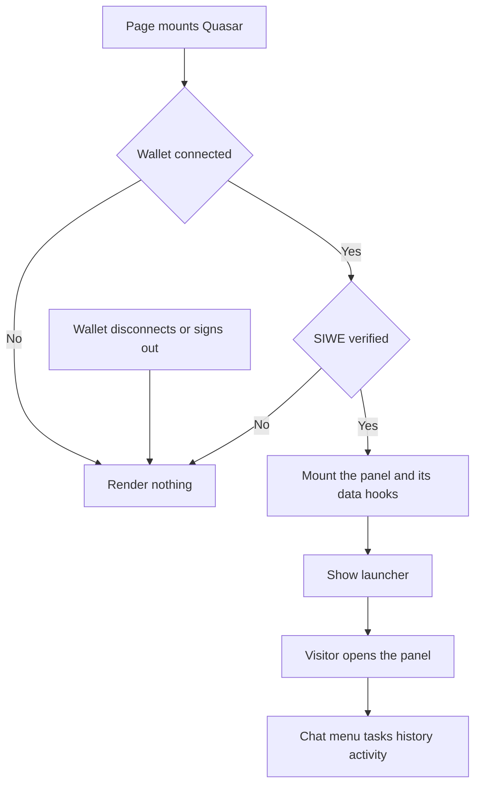

# Paper 3D Redesign — Quasar (floating agent panel and agent cards)

| | |
|---|---|
| **Version** | 1.1 |
| **Status** | Approved |
| **Date Created** | 2026-10-02 |
| **Last Updated** | 2026-10-02 |

| Version | Date | Change |
|---|---|---|
| 1.1 | 2026-10-02 | Section 3.4 and 4: the RUNNING chip must be warn-coloured as in the handoff, but the shared `statusColor` helper in `SubTaskReasoning.tsx` returned the muted grey for in-progress steps. `statusColor` now returns `var(--warn)` for `in_progress` and `running`, which also colours the same chip in the activity list and the live card. `SubTaskReasoning.tsx` moves from "not touched" to `[MODIFY]`, for that one helper only. |
| 1.0 | 2026-10-02 | Initial plan. Approved by the owner's instruction to continue with Quasar. Includes the new visibility rule: Quasar only shows for a connected wallet with a verified SIWE session. |

> Plan 6 of 6 for the "Paper 3D" redesign (handoff: `design_handoff_paper_3d`). Delivery is one commit for the visibility rule and the restyle together, because the rule lives in the same file as the panel shell.

---

## 1. Problem Statement

**In plain words.** Quasar is the assistant panel that floats at the bottom-right of the page. Today it is a flat white box. The new design makes it a small stack of paper sheets with an ink header, chat messages as paper slips, and every agent card (plan, questions, arm, ledger, alerts, news, charts) in the same paper style.

**One new rule, requested by the owner.** Today the Quasar launcher appears on the Portfolio page even when nobody is signed in, and the panel starts fetching agent data that needs a login. From now on Quasar does not appear at all unless the wallet is connected and the wallet owner has verified with SIWE (sign-in with the wallet).

| Finding | Implication |
|---|---|
| `QuasarPanel` is mounted only on the Portfolio page, and it renders its launcher with no check on wallet or session. Its data hooks (chats, tasks, activity) run as soon as it mounts. | The check goes inside `QuasarPanel` so any page that mounts it is covered, and the data hooks do not run while it is hidden. |
| The SIWE context sets `isAuthenticated` to true only when a wallet is connected and a valid session exists for that exact address, and clears it the moment the wallet disconnects. | `isConnected && isAuthenticated` is the correct and sufficient test. |
| The warm "paused" colours in the repo (`--warn-deep #8a5f08`, `--warn-soft #fdf6e8`) differ slightly from the handoff (`#7a5406`, `#fdf6e6`). | Follow the handoff (open question 1 from the Home plan). The tokens are used only by the Quasar ledger. |

**This redesign changes presentation only**, apart from the visibility rule. Chat, streaming, tasks, signing, hooks and props stay as they are.

---

## 2. Definition of Done

| # | Criterion |
|---|---|
| 1 | **Visibility rule.** With no wallet connected: no launcher, no panel. Wallet connected but SIWE not verified (including while the signature is being requested): no launcher, no panel. Wallet connected and SIWE verified: launcher shows. After a disconnect or sign-out, Quasar disappears at once. |
| 2 | While Quasar is hidden none of its data hooks run (no chats, tasks or activity requests, no chat socket subscription). |
| 3 | Once visible, behaviour is exactly as today: open and close, new chat, menu, tasks, history, activity, streaming replies, retry, plan, questions, arm, ledger, alerts. |
| 4 | The panel stays `position: fixed` bottom-right and keeps its size rule: `min(452px, 100vw - 24px)` wide, `min(720px, 100vh - 120px)` high, full screen below 720px. |
| 5 | With the page scrolled, the launcher and panel stay fixed to the viewport. |
| 6 | Every agent card matches the component sheet of the handoff. |
| 7 | Streaming, the memoised message list and the permanent `ChatThread` mount are untouched, so a stream in progress survives switching between chat and the menu. |
| 8 | No copy that comes from the card contract (`cardContract.ts`) is changed. |
| 9 | No new dependency, no test file under `frontend/components/` or `frontend/app/`. |

---

## 3. Feature Description

### 3.1 Visibility rule

| Item | Spec |
|---|---|
| Where | `QuasarPanel.tsx`. The current component body moves into an inner component. The exported `QuasarPanel` checks `useAccount().isConnected` and `useSiweAuth().isAuthenticated` and returns nothing unless both are true. |
| Why a wrapper | The hooks of the inner component only run when it is mounted, so nothing is fetched for a visitor who is not signed in. |
| Edge | While the page loads, both values are false, so there is no flash of the launcher. If the wallet disconnects while the panel is open, it unmounts. |

### 3.2 Panel shell

| Block | Spec |
|---|---|
| Launcher | fixed, right and bottom `clamp(12px,2vw,22px)`, z 300, ink with 1px ink border, padding 14px 18px, gap 11px. Shadow `0 5px 0 -2px #fbfaf7,0 6px 0 -2px #16110e,0 20px 26px -12px rgba(22,17,14,.5)`. Hover lifts 3px (transition .2s). Pulsing merah ring, label Inter 600 12px, tracking .1em, uppercase. |
| Panel wrapper | fixed, right and bottom 22px (0 on a full-screen sheet), z 300, `perspective:1600px`, same size rule as today. |
| Backing sheets | Two absolute sheets behind the panel: `#efebe3` at `translate(10px,10px) rotate(1.2deg)` and `#f3f0ea` at `translate(5px,5px) rotate(.5deg)`, both 1px `#bcb2a3`. Not drawn on a full-screen sheet. |
| Panel | bg `#fbfaf7`, 1px ink, shadow `0 30px 50px -20px rgba(22,17,14,.45)`, rise animation. Header unchanged (ink, pulsar ring, Fraunces "Quasar", buttons with `#4a423d` borders). The "menu" button gets an ink-soft background while the menu is open. |
| Lists | Tasks, history and activity rows: bottom 1px `#e3ddd2`, hover bg `#f3f0ea`, code mono 11px `#7a6f64`, status chip Inter 600 9px with 1px border in its colour. Activity filter chips keep their look. |

### 3.3 Chat

| Block | Spec |
|---|---|
| Thread | padding 14px 13px, gap 12px. |
| User message | right aligned, max-width 84%, bg ink, text `#fbfaf7`, padding 10px 12px, 13.5px/1.5, shadow `0 4px 0 -2px #fbfaf7,0 5px 0 -2px #4a423d`. A failed message keeps its retry row, inside the bubble. |
| Quasar message | No box. Eyebrow "Quasar" Inter 600 10px, tracking .14em, uppercase, merah, margin-bottom 5px, then the markdown text in Fraunces 400 15px/1.5, colour `#2a231e`. Markdown (lists, links, bold, code) keeps working. |
| Typing and "thinking" rows | A flat paper slip with the pulsing ring, as today, in the new colours. |
| Live sub tasks | Same card as the plan card (3.4) with the working label. |
| Composer | top 1px ink, bg white, padding 10px. Textarea: 1px `#bcb2a3`, bg `#fbfaf7`, 13.5px, no outline change. Send button: ink bg, white text, Inter 600 12px, tracking .06em. Both the new-chat composer and the in-thread composer. The handoff's suggestion chips are not built, there is no logic for them. |

### 3.4 Agent cards

| Component | Spec |
|---|---|
| `MenuPanel` | Rows keep their text. Active row: white bg with `inset 3px 0 0 #c8102e`. Hover white. Disabled row: opacity .5 and the "soon" label (`#7a6f64`). |
| `RosterCard` | Frame `#f3f0ea` with 1px `#bcb2a3`. Each agent tag is ink with a 2px offset `#bcb2a3` backing (a second layer behind it). Grid min column 120px, cell padding 12px 11px. |
| `TaskDetail` | Header block on `#fbfaf7` with 1px `#e3ddd2`, padding 16px 14px. |
| `ClarifyingQuestions` | Card: white, 1px merah, shadow `0 5px 0 -2px #fbfaf7,0 6px 0 -2px #e8b4bd,0 11px 0 -4px #fbfaf7,0 12px 0 -4px #e3ddd2,0 20px 24px -14px rgba(22,17,14,.3)`. Merah header as today. Selected option chip: ink with lip `0 3px 0 -1px #fff,0 4px 0 -1px #16110e`. Inputs: 1px `#bcb2a3`, bg `#fbfaf7`. Disabled send: bg `#e3ddd2`, text body, 1px `#bcb2a3`. Cancel: transparent with 1px ink. Cancelled state: bg `#f3f0ea`, 1px `#bcb2a3`, header `#bcb2a3` with white text. |
| `PlanCard` | Ink header, white card with 1px ink and the stack shadow `0 5px 0 -2px #fbfaf7,0 6px 0 -2px #e3ddd2,0 11px 0 -4px #fbfaf7,0 12px 0 -4px #e3ddd2,0 20px 24px -14px rgba(22,17,14,.3)`. Expanded row background `#fbfaf7`. Reasoning sits on a slip: bg `#f3f0ea`, 1px `#e3ddd2`, padding 10px 12px, rotated -.25deg, margin 10px 0 2px 22px (no left rule). A `needs_input` row keeps its 2px merah left rule. Status chips: DONE positive outline, RUNNING warn outline, NEEDS INPUT merah outline, FAILED merah filled with white text. Hover on a row `#fbfaf7`. |
| `ArmPanel` | Same card shell as the plan card. Header ink with a cream badge (`#fbfaf7` bg, ink text). Step numbers 01 to 03 in merah. Inputs 1px `#bcb2a3`, bg `#fbfaf7`. Preset and horizon chips: 1px `#bcb2a3`, selected ink. Checkbox in merah. Arm button: merah with lip `0 4px 0 -1px #fff,0 5px 0 -1px #9a0c24`. While progressing (steps 1 to 3 of 3) the disabled button shows bg `#e3ddd2`, text body, and a merah bar at 14% opacity filling 33%, 66% or 92% of the width. Executed: white bg, 1px positive, positive text. Error text 12px merah. |
| `TradeLedger` | Status slips: white, 1px `#e3ddd2`, 3px left rule (armed and executed positive, disarmed ink), shadow `0 5px 0 -2px #fbfaf7,0 6px 0 -2px #e3ddd2,0 18px 22px -14px rgba(22,17,14,.25)`. Paused slip: bg `#fdf6e6`, 1px warn, title `#7a5406`. Pause and Disarm bar: bg `#f3f0ea`, 1px `#bcb2a3`, buttons white with 1px ink (Disarm in merah). Trades panel keeps the `#f3f0ea` header. |
| `CompiledRuleCard` | Summary slip: white, 1px `#e3ddd2`, 3px ink left rule. The rule card: white, 1px ink, shadow `0 5px 0 -2px #fbfaf7,0 6px 0 -2px #e3ddd2,0 18px 22px -14px rgba(22,17,14,.25)`. |
| `HorizonNoticeCard` | White, 1px merah, shadow `0 5px 0 -2px #fbfaf7,0 6px 0 -2px #e8b4bd,0 18px 22px -14px rgba(22,17,14,.25)`. Ink header, ticker in `#ff8a9a`. Close button merah, keep button white with 1px ink. Settled messages on `#f3f0ea`. |
| `NewsBrief` | Card: white, 1px `#e3ddd2`, 3px left rule removed, shadow `0 5px 0 -2px #fbfaf7,0 6px 0 -2px #e3ddd2,0 18px 22px -14px rgba(22,17,14,.25)`. Thumbnails 64px, on `#f3f0ea` with 1px `#e3ddd2` and shadow `2px 3px 0 #e3ddd2`, rotated in turn -2deg, 1.5deg, 2deg. Source chip, time, title, excerpt and link as today. |
| `PortfolioChart` | Card (`SingleChartCard` in `ChatThread`): same paper shadow as the news card, no left rule. Range chips: 1px `#bcb2a3`, selected ink. Lightweight chart already uses `#fbfaf7` and dashed `#e3ddd2` grid. Bar rows get an inset 3px darker lip (`inset 0 -3px 0 <darker>`), track `#f3f0ea`. |

---

## 4. Impacted Files

| Layer | File | Action |
|---|---|---|
| Styles | `frontend/app/globals.css` (`--warn-deep`, `--warn-soft`) | `[MODIFY]` |
| Panel | `frontend/components/agent/QuasarPanel.tsx` (visibility wrapper and shell) | `[MODIFY]` |
| Chat | `frontend/components/agent/ChatThread.tsx` (messages, composer, live card, chart card) | `[MODIFY]` |
| Cards | `frontend/components/agent/MenuPanel.tsx` | `[MODIFY]` |
| Cards | `frontend/components/agent/RosterCard.tsx` | `[MODIFY]` |
| Cards | `frontend/components/agent/TaskDetail.tsx` | `[MODIFY]` |
| Cards | `frontend/components/agent/ClarifyingQuestions.tsx` | `[MODIFY]` |
| Cards | `frontend/components/agent/PlanCard.tsx` | `[MODIFY]` |
| Cards | `frontend/components/agent/ArmPanel.tsx` | `[MODIFY]` |
| Cards | `frontend/components/agent/TradeLedger.tsx` | `[MODIFY]` |
| Cards | `frontend/components/agent/CompiledRuleCard.tsx` | `[MODIFY]` |
| Cards | `frontend/components/agent/HorizonNoticeCard.tsx` | `[MODIFY]` |
| Cards | `frontend/components/agent/NewsBrief.tsx` | `[MODIFY]` |
| Cards | `frontend/components/agent/PortfolioChart.tsx` (bar lip only) | `[MODIFY]` |
| Cards | `frontend/components/agent/SubTaskReasoning.tsx` (`statusColor` only) | `[MODIFY]` |
| Docs | `docs/plans/paper-3d-redesign-quasar.md` | `[NEW]` (this file) |

Not touched: `cardContract.ts` (all copy), everything under `http/`, `lib/`, `contexts/`, `backend/`, `smart-contract/`. `app/portfolio/ui.tsx` keeps mounting `QuasarPanel` as it does today.

---

## 5. UI/UX Changes (Lo-Fi)

### 5.1 Panel

```
                                  .--------------------------------.
                                 .'  paper sheets behind (tilted)   |
                               +--------------------------------+   |
                               | [o] Quasar  [+ new chat][menu][-]|  |   ink header
                               |--------------------------------|   |
                               |                 [ user bubble ]|   |   ink, right
                               | QUASAR                         |   |
                               | Reply text in serif ...        |   |
                               | +----------------------------+ |   |
                               | | TASK T-12  3 sub task      | |   |   plan card, stacked
                               | | 01 Parse   Quasar    DONE  | |   |
                               | +----------------------------+ |   |
                               |--------------------------------|   |
                               | [ textarea .............][Send]|  /
                               +--------------------------------+-'
                                         [o QUASAR]  launcher
```

### 5.2 Responsive and states

| Width | Behaviour |
|---|---|
| 720px and wider | Panel 452px wide at 22px from the corner, with backing sheets. |
| Below 720px | Full-screen sheet, no backing sheets, no corner offset. |

| State | Behaviour |
|---|---|
| Not connected | Nothing shown |
| Connected, signing in | Nothing shown until the signature is verified |
| Signed in | Launcher shows, opens the panel |
| Sign-out or disconnect | Panel and launcher disappear |
| Streaming | Live card with the pulsing ring, as today |
| Reduce Motion | The pulsing ring is the only motion, as today |

### 5.3 Before and after

| Element | Before | After |
|---|---|---|
| Launcher | Flat ink button | Ink button with a paper edge, lifts on hover |
| Panel | One white box | Panel on two tilted backing sheets |
| User message | Pink slip with red right edge | Ink bubble with a paper edge |
| Quasar message | Boxed with a left rule | Label and serif text, no box |
| Cards | Flat boxes | Paper stacks and slips with tinted shadows |
| Composer | Heavy ink box, red Send | Light inputs, ink Send |

---

## 6. Flowchart



---

## 7. Verification Plan

Frontend only. Interactive checks run through the browser debugging port against a temporary test page. The test page uses a mock wallet, a self-made session token for the "verified" state, and blocks the sign-in requests so nothing is written to the real backend. Agent cards are rendered with mock props or a primed query cache. Anything that needs the live agent backend or a real signature is reported as not verified.

### 7.1 Static checks

| Check | Command (from `frontend/`) |
|---|---|
| Types | `npx tsc --noEmit` |
| Lint | `npx eslint components/agent app` |

### 7.2 Visibility rule

| # | Step | Expected |
|---|---|---|
| 1 | Open the page with no wallet | No launcher, no panel, no agent request |
| 2 | Connect a wallet, block the sign-in requests so the session never verifies | Still no launcher |
| 3 | Provide a valid session for the connected address | Launcher shows |
| 4 | Remove the session or disconnect | Launcher disappears |

### 7.3 Behaviour and visual

| # | Step | Expected |
|---|---|---|
| 1 | Scroll down, open the panel | Panel stays fixed at the bottom-right of the viewport |
| 2 | Open menu, tasks, history, activity and go back | Same screens as before |
| 3 | Compare the panel and each agent card with the component sheet | Matches |
| 4 | Narrow to 390px | Full-screen sheet without backing sheets |

---

## 8. Open Questions and Decisions

| # | Question | Default taken in this plan |
|---|---|---|
| 1 | "Not connected and not verified": should Quasar show when only one of the two is true? | No. It shows only when both are true. A connected wallet without a verified session also hides it. |
| 2 | The handoff chat shows quick-suggestion chips above the input. | Not built, there is no logic behind them. |
| 3 | The handoff composer is a one-line input. The code uses a two-row textarea (Shift+Enter for a new line). | Keep the textarea, restyled. |
| 4 | The handoff Quasar message has no box, the code draws one. | Follows the handoff, because the label and serif text are part of the new look. |
| 5 | The handoff has "Tasks, History, Activity" tabs above the lists, the code opens the menu list instead. | Keep the code's navigation, restyle only. |
| 6 | `--warn-deep` and `--warn-soft` differ slightly from the handoff. | Use the handoff values. |
