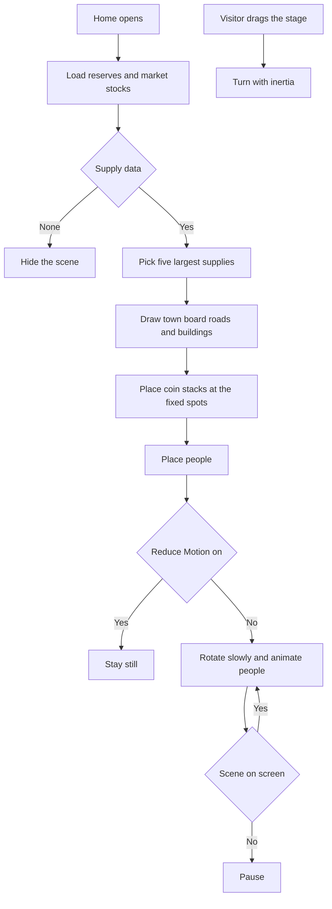

# Paper 3D Redesign — Scene Update (Home town scene and Portfolio coin tray)

| | |
|---|---|
| **Version** | 1.1 |
| **Status** | Approved |
| **Date Created** | 2026-10-03 |
| **Last Updated** | 2026-10-03 |

| Version | Date | Change |
|---|---|---|
| 1.1 | 2026-10-03 | Correction found while checking the scene on screen. Section 2 item 1 and 3.1: three of the eight buildings carry a sign (IDX, CUSTODIAN, ARBITRUM), not four. |
| 1.0 | 2026-10-03 | Initial plan. Approved by the owner's instruction to apply the new 3D changes on Home and Portfolio, and nothing else. |

> Follow-up to the Paper 3D redesign (merged in PR #44). Source: the updated `PulsarFi Web - Paper 3D.dc.html` from the Claude Design export (`PulsarFi Arbitrum Pitch Deck (1)`), compared line by line against the handoff that was implemented. Work is on branch `feat/paper-3d-home-portfolio-update`.

---

## 1. Problem Statement

**In plain words.** Two 3D pictures were redrawn in the design.

| Page | Before | After |
|---|---|---|
| Home | A board with five coin stacks | A small paper town around the same coin stacks: an exchange building, a custodian, an Arbitrum office and more, two roads, and little people who count coins, walk past and trade. When a person "buys", a green "+1 buy" tag floats up from that coin stack. |
| Portfolio | Allocation as 3D bars on a grid | Allocation as coin stacks standing in a paper tray. One stack per holding, taller means more value. The tray can be dragged to turn it. |

**What did not change in the design.** Only these two pictures, one caption line on Home, and a Quasar reply-bubble detail changed in the export. The Quasar detail is not part of this request and is left as it is (see 8).

**This update changes presentation only.** The coin stacks still come from the same reserves and prices, the tray from the same positions and balances. No new request.

---

## 2. Definition of Done

| # | Criterion |
|---|---|
| 1 | Home stage matches the updated handoff: board with two roads, eight buildings (three with signs), five coin stacks at the new positions, floating "+1 buy" tags, eight people (four IDX staff, four Web3 traders). |
| 2 | Coin stacks are still built from live data: the five pStocks with the largest circulating supply, coin count `max(2, round(supply / maxSupply × 8))`, label with ticker and 24h change. |
| 3 | The stage drags and spins with inertia, and auto-rotates slowly. Labels and building signs always face the viewer. |
| 4 | The stage animation stops while it is off screen or the tab is hidden. |
| 5 | With "Reduce Motion" on: no auto-rotation, people stand still with no speech bubbles and no floating tags. Dragging still works. |
| 6 | Stage size follows the width of its container (scale `min(1.05, width / 700)`, height `540 × scale`) and a touch drag on a phone still scrolls the page vertically. |
| 7 | The Home caption reads "Drag to rotate · stack height = tokens in circulation · traders from IDX & on-chain". |
| 8 | Portfolio allocation shows a tray with one coin stack per holding plus one for IDRX, each with a dashed slot and ticker under it. Coins per stack `max(1, round(value / largest × 14))`, the top coin shows the logo. The legend underneath is unchanged. |
| 9 | The tray turns when dragged, keeps its angle after release, and a touch drag still scrolls the page vertically. |
| 10 | If fewer than five coin stacks exist on Home, or more than five items exist in the tray, nothing breaks or overlaps unreadably. |
| 11 | Data fetching does not change. No new dependency, no test file under `frontend/components/` or `frontend/app/`. |

---

## 3. Feature Description

### 3.1 Home stage (`components/home/CoinStack.tsx`)

| Item | Spec |
|---|---|
| Container | The stage fills its wrapper. Wrapper: width 100%, height `round(540 × scale)`, overflow hidden, centred, `perspective:1600px`, cursor grab, `touch-action: pan-y`, no text selection. `scale = min(1.05, wrapperWidth / 700)`, measured with a resize observer. |
| Scene | 560×400, `preserve-3d`, margin-top `round(10 × scale)`, `scale(s) rotateX(60deg) rotateZ(a)`, start angle -28°. Auto-rotation .08° per frame. Drag adds `dx × 0.45`, release velocity `dx × 0.08`, decays ×0.94. |
| Board | Three layers as before (`#e3ddd2` at z -10, `#efebe3` at z -5, `#f8f6f1` with 24px grid), the top layer border is now `#d9d1c4`. Two roads: full width, `#ebe6dc`, dashed `#c9bfae` top and bottom, at top 318 (36px high) and top 44 (28px high), z .3. |
| Buildings | Each building has four window faces, a roof and an optional sign. Faces: 1px ink border, windows drawn with two repeating gradients (7px rows, 16px pitch, 5px glass columns, 11px pitch; dense side faces 5px rows, 12px pitch). Signs face the viewer and sit 18px above the roof. |
| People | 28×52 figures drawn in SVG with a soft shadow. IDX staff: ink jacket, white shirt, red tie, ID badge, dark hair. Web3 traders: coloured hoodie, phone. Skin tones cycle through `#f1d9c0 #d9a77c #b9835a #e8c39e`. They always face the viewer, flip left or right, and show a speech bubble now and then. |
| Stacks | Positions `[200,150] [330,140] [270,240] [390,250] [160,262]`. Four edge layers per coin (2.8px apart, first `#a39988`, third the stack colour, the others `#d6cfc1`), face at `base + 10.5`, 88px wide with a 46px logo on the top coin. Label unchanged. |
| Floating tag | Green `#1f7a4b` tag above each stack, white mono 700 10px. Shows "+1 buy" (or "⇄ swap") for 1.6s and rises 34px when a person standing at that stack "trades". |
| Caption | Updated text (DoD 7). |
| Loading and empty | Skeleton block while loading, section hidden when there is no supply data, as today. |

Building table (x, y, width, depth, height, face, window, roof, sign):

| Id | Values |
|---|---|
| idx | 16, 96, 72, 70, 128, `#fbfaf7`, `#c9d3df`, `#16110e`, sign "IDX" on `#c8102e` |
| cus | 452, 86, 92, 60, 84, `#f3efe7`, `#d6cfc1`, `#e3ddd2`, sign "CUSTODIAN" on `#16110e` |
| arb | 480, 190, 64, 64, 58, `#1f4d8a`, `#9fb8d8`, `#16110e`, sign "ARBITRUM" on `#1f4d8a` |
| ofc | 16, 196, 60, 96, 74, `#efebe3`, `#b9b0a2`, `#d6cfc1`, no sign |
| shp1 | 16, 362, 120, 34, 30, `#fbfaf7`, `#e9b8bf`, `#c8102e`, no sign |
| shp2 | 424, 362, 120, 34, 38, `#f3efe7`, `#d6cfc1`, `#16110e`, no sign |
| tw | 16, 6, 110, 32, 52, `#e3ddd2`, `#fbfaf7`, `#16110e`, no sign |
| tw2 | 440, 6, 104, 32, 64, `#fbfaf7`, `#c9d3df`, `#e3ddd2`, no sign |

People table (kind, position or path, action, stack, phase, speech):

| # | Kind | Where | Action | Stack | Phase | Says |
|---|---|---|---|---|---|---|
| 1 | IDX | 255, 82 | count | 1 | 0 | stack ticker and a counter |
| 2 | IDX | 440, 178 | count | 3 | 1.3 | stack ticker and a counter |
| 3 | IDX | 108, 176 | trade | 0 | .4 | BUY BBCAP, Backed 1:1?, BUY BBCAP |
| 4 | IDX | walks (120,336) to (450,336), speed 26 | walk | n/a | 0 | Checking custody… |
| 5 | Web3 `#1f4d8a` | 330, 322 | trade | 2 | 2.1 | SWAP → IDRX, on-chain ✓, SWAP → BRPT |
| 6 | Web3 `#c8102e` | 445, 104 | trade | 1 | 3.2 | gm, BUY BUMIP, LFG |
| 7 | Web3 `#e7b416` | 498, 272 | count | 3 | .8 | stack ticker and a counter |
| 8 | Web3 `#2a231e` | walks (140,58) to (420,58), speed 20 | walk | n/a | 4 | wen BBRI? |

Rules: a person who counts shows "TICKER · n…" for 4.5 of every 7 seconds. A person who trades speaks for 2.2 of every 5 seconds, and a buy or swap line triggers the floating tag and a small hop. A walker shows a bubble for 2.5 of every 9 seconds and turns around at the ends of the path.

### 3.2 Portfolio tray (`components/portfolio/AllocationBars.tsx`)

| Item | Spec |
|---|---|
| Stage | Container height 270px, centred, `perspective:1200px`, overflow hidden, cursor grab, `touch-action: pan-y`. Scene 376×60, margin-top 70px, `scale(s) rotateX(58deg) rotateZ(a)`, default angle -32°, `s = min(1, (viewportWidth - 32) / 420)` on phones. |
| Tray | Base plate 428×120 at (-26,-30), `#c9bfae`, z -18. Back and front walls (18px high, `#e3ddd2`, 1px ink; the front wall has a 3px merah stripe 5px from its top). Left and right walls (18px, `#d6cfc1`, 1px ink). Floor: ink frame, 7px padding, inner `#f3efe7` with 1px `#5a4a3a`. |
| Slots | Under each stack: a 58px dashed circle (1.5px `#a39988`, fill `#ebe6dc`) and the ticker (Inter 700 8px, tracking .06em, centred under the stack). |
| Stacks | One per item, in the existing order (largest holding first, IDRX last). Step 66px, y 8, footprint 46px. Each coin has an edge of three layers (`#a39988`, palette colour, `#d6cfc1`) and a white face with a 1.5px ink border, an inner ring in the palette colour, and the logo (24px) on the top coin. Coin pitch 8px. Soft floor shadow 70px. |
| Many items | With more than five items the step shrinks to `(330) / (count − 1)` and the coin, slot and logo shrink with it, so everything stays inside the tray. |
| Drag | Pointer drag adds `dx × 0.45` degrees, no inertia. The angle is kept after release. |

### 3.3 Unchanged

Quasar, all other pages, the legend under the tray, the hero numbers, every data hook.

---

## 4. Impacted Files

| Layer | File | Action |
|---|---|---|
| Home | `frontend/components/home/CoinStack.tsx` (new town scene, caption) | `[MODIFY]` |
| Portfolio | `frontend/components/portfolio/AllocationBars.tsx` (tray with coin stacks) | `[MODIFY]` |
| Docs | `docs/plans/paper-3d-redesign-scene-update.md` | `[NEW]` (this file) |

Not touched: `IsoBar.tsx` (still used by Proof of reserve and the vault), `PortfolioView.tsx` (same props), `SwapView.tsx`, every file under `http/`, `lib/`, `contexts/`, `backend/`, `smart-contract/`.

---

## 5. UI/UX Changes (Lo-Fi)

```
Home stage (seen from above, turned 60 degrees)
+------------------------------------------------------+
| [tower]                  road                [tower] |
|  [IDX]        o       [coin]     o       [CUSTODIAN] |
|                    [coin] [coin]                     |
|  [office]   o            [coin]  [coin]  [ARBITRUM]  |
|          o  road  o                                   |
| [shop]                                       [shop]  |
+------------------------------------------------------+
Drag to rotate · stack height = tokens in circulation · traders from IDX & on-chain
```

```
Portfolio tray
+-----------------------------------+
| (o)    (o)   (o)  (o)   (o)       |   dashed slots with stacks
| BUMIP  BBCAP BRPTP ENRGP IDRX     |
+-----------------------------------+
```

| State | Behaviour |
|---|---|
| Home loading | Flat skeleton block |
| Home, no supply data | Section hidden |
| Reduce Motion | Still scene, drag works |
| Stage off screen or tab hidden | Animation paused |
| Portfolio, no holdings | Tray shows only what exists (IDRX if any) |

| Element | Before | After |
|---|---|---|
| Home stage | Board and five coin stacks | Town of paper buildings, roads, people and the same stacks |
| Portfolio allocation | Isometric bars on a grid | Coin stacks in a paper tray, can be turned |

---

## 6. Flowchart



---

## 7. Verification Plan

Frontend only. Home is checked against the running dev server and the design file rendered in a browser. Portfolio is checked with a temporary test page (mock wallet and mock balances), as before.

### 7.1 Static checks

| Check | Command (from `frontend/`) |
|---|---|
| Types | `npx tsc --noEmit` |
| Lint | `npx eslint components/home components/portfolio` |

### 7.2 Visual and behaviour

| # | Step | Expected |
|---|---|---|
| 1 | Open `/home` at 1440px and 390px beside the updated handoff | Buildings, roads, people and stacks match, scene scales with width |
| 2 | Watch for a few seconds | People move, bubbles appear, "+1 buy" tags float up from the right stack |
| 3 | Drag the stage | It spins with inertia, signs and labels keep facing the viewer |
| 4 | Turn on OS "Reduce Motion", reload | No auto-rotation, people still, no bubbles or tags |
| 5 | Scroll the page with a touch drag on the stage | Page scrolls (script check of `touch-action`) |
| 6 | Open `/portfolio` with a connected wallet | Tray with one stack per holding and IDRX, legend unchanged |
| 7 | Drag the tray | Turns and stays at the new angle |
| 8 | Compare the Home and Portfolio screenshots with the updated handoff | Matches, or the difference is reported |

---

## 8. Open Questions and Decisions

| # | Question | Default taken in this plan |
|---|---|---|
| 1 | The people's speech bubbles and the "+1 buy" tags are illustration, they do not show real trades. | Followed as designed, and described as illustration here. Say so if you want them labelled or removed. |
| 2 | Reduce Motion for the people is not in the handoff. | Still scene, same rule as the rest of the redesign. |
| 3 | The handoff has exactly five stacks and five tray items. The app can have fewer or more. | Fewer: people pointing at a missing stack use the nearest existing one. More: the tray stacks shrink to fit. |
| 4 | The updated export also changes the Quasar reply bubble (2px merah left edge, 14.5px text, max 86%, new shadow). The bubble shipped in PR #44 follows the earlier screenshot (3px edge, 15px text, max 92%). | Not changed. Outside the requested scope. |
