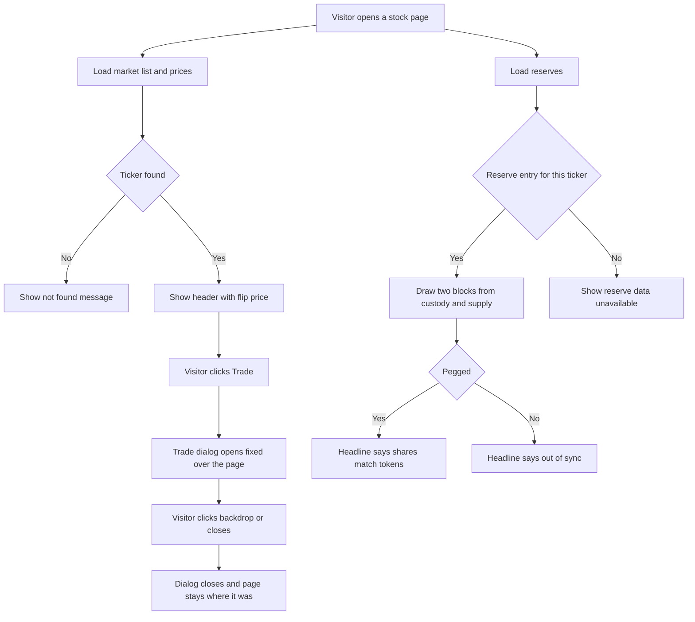

# Paper 3D Redesign — Stock Detail (and the Trade dialog)

| | |
|---|---|
| **Version** | 1.1 |
| **Status** | Approved |
| **Date Created** | 2026-10-02 |
| **Last Updated** | 2026-10-02 |

| Version | Date | Change |
|---|---|---|
| 1.1 | 2026-10-02 | Section 4: shared `lib/useViewportWidth.ts` (created in the Markets plan v1.7) is used for the price tile size and the 3D block scale. |
| 1.0 | 2026-10-02 | Initial plan. Approved by the owner's instruction to proceed with Stock detail. |

> Plan 3 of 6 for the "Paper 3D" redesign (handoff: `design_handoff_paper_3d`). Builds on the Home plan (v1.4) and the Markets plan (v1.6). Delivery is one commit for this page.

---

## 1. Problem Statement

**In plain words.** The stock page and its Trade pop-up still look flat. The new design turns the page into a printed sheet: a big flip-tile price at the top, a chart and stats on paper cards, a "Proof of reserve" card with two 3D blocks that show shares held in custody next to tokens issued, and a Trade pop-up that sits on a small pile of sheets.

**The pop-up must keep behaving exactly as it does today.** Only what is inside it changes its look. This matters because a regression was found while preparing this plan:

| Finding | Implication |
|---|---|
| The page-turn animation added in the Home work left every dialog inside the page scrolling with the page instead of staying fixed (fill-mode `both` kept a `matrix(1,0,0,1,0,0)` transform, which anchors `position: fixed` children). Measured: a fixed element sat at top -1387 after scrolling 1400. | Already fixed in `globals.css` (`.page-turn` and `.rise` now use fill-mode `backwards`, see Home plan v1.4). This plan adds a check that the Trade dialog stays fixed (section 7). |

---

## 2. Definition of Done

| # | Criterion |
|---|---|
| 1 | Stock detail matches the handoff at three widths: desktop, below 1024px, below 720px. |
| 2 | **Trade dialog behaviour is unchanged.** Same overlay (`position: fixed`, `inset: 0`, z-index 300, centred, 16px padding), click on the backdrop closes it, click inside does not, the token picker still opens above it (z-index 400), the dialog closes after a successful swap. Only colours, borders, shadows, fonts and spacing of its content change. |
| 3 | With the page scrolled down, the overlay still covers the whole viewport and the dialog is centred in the viewport. |
| 4 | Swap logic is untouched: token pick, amount, flip, slippage, quote, CTA states, toasts. |
| 5 | Data fetching does not change: the same hooks (`useMarketStocks`, `useStockPrice`, `useStockHistory`, `useReserves`), endpoints, query keys and polling. No new request is added. |
| 6 | The price shows as flip tiles (see `SplitFlap`, Markets plan). With "Reduce Motion" on, the final text shows at once. |
| 7 | The Proof of reserve card is built only from data already loaded on this page (`custodian_holdings`, `on_chain_supply`, `peg_status`, `last_attested_at` from `useReserves`). |
| 8 | Trade button opens the same dialog as before. |
| 9 | Not-found state and loading skeleton still work. |
| 10 | No new dependency, no test file under `frontend/components/` or `frontend/app/`. |

---

## 3. Feature Description

### 3.1 Trade dialog: what is frozen and what changes

| Frozen (behaviour, not touched) | Changes (content look only) |
|---|---|
| Overlay element, `position: fixed`, `inset: 0`, z-index 300, flex centring, 16px padding | Backdrop colour `rgba(22,17,14,.45)` to `rgba(22,17,14,.32)` |
| Click on overlay closes, click on dialog is stopped | Dialog shell: `.rise .paper-sheaf` with `.sheet` (backing sheets, ink border, soft shadow), width 440px, `max-width:100%` |
| Token picker rendered after the dialog at z-index 400 | Header, slippage panel, fields, flip button, details, CTA styling (3.2) |
| All state, hooks, quote, toasts, `onClose` after success | `is-busy` class on the CTA while executing |
| Custom slippage number input, "Holding" and "Amount" labels, "before LP fee" hint | Their look only |

The design overlay also adds `overflow-y: auto` with `margin: auto` so a very tall dialog can scroll on a short window. That is a behaviour change, so it is **not** applied (see section 8).

### 3.2 Trade dialog: exact look

| Element | Spec |
|---|---|
| Header | padding 16px 20px, bottom 1px `#e3ddd2`. Title Fraunces 500 22px, line-height normal. Buttons gap 6px, each 30×30. Settings ⚙ 14px: closed white bg, ink icon, 1px `#e3ddd2`; open ink bg, white icon, ink border. Close ✕ 13px, white bg, 1px `#e3ddd2`. |
| Slippage panel | padding 14px 20px, bg `#f3f0ea`, bottom 1px `#e3ddd2`. Label Inter 600 10px, tracking .14em, uppercase, body, margin-bottom 8px. Chips gap 6px, padding 8px 14px, Inter 600 13px. Selected: ink bg, white text, ink border, lip `0 3px 0 -1px #f3f0ea,0 4px 0 -1px #16110e`. Unselected: white bg, ink text, 1px `#bcb2a3`. |
| Field (pay and receive) | padding 16px 20px 14px, bottom 1px `#e3ddd2`. Label row margin-bottom 10px: label Inter 600 10px, tracking .14em, uppercase, body. Balance mono 12px body. Amount Fraunces 400 32px, tracking -.02em. Receive amount ink when filled, `#bcb2a3` when empty. Hint mono 11px body, margin-top 6px. |
| Token pill | padding 6px 10px 6px 8px, gap 8px, 1px ink, bg `#fbfaf7`, logo 22px, ticker Inter 600 13px, caret ▾ 10px, lip `0 3px 0 -1px #fbfaf7,0 4px 0 -1px #bcb2a3`. |
| Flip button | 36×36, absolute, left 50%, margin-left -18px, top -18px, z 2, bg `#fbfaf7`, 1px ink, lip `0 3px 0 -1px #fff,0 4px 0 -1px #16110e`, ⇅ 14px, rotates 180° per click over .4s `cubic-bezier(.2,.7,.3,1)`. |
| Details | Accordion (already restyled in the Home work), wrapper padding `0 20px`. |
| CTA | wrapper padding 16px 20px 20px. Button padding 15px 20px, Inter 600 15px, tracking .03em. On: `#c8102e`, white, merah lip. Executing: `#9a0c24`. Off: bg `#e3ddd2`, text body, 1px `#bcb2a3`, no lip. |
| Shared picker | `TokenSelectModal` backdrop also goes to `rgba(22,17,14,.32)` so both dialogs match. Nothing else about it changes. |

### 3.3 Page layout

| Block | Spec |
|---|---|
| Container | `max-width:1440px`, centred, padding `32px 32px 64px` (mobile `24px 16px 48px`). Replaces `container pad-x`. |
| Breadcrumb | "← Markets": Inter 600 11px, tracking .16em, uppercase, body, pointer. Still goes to `/stocks`. Replaces "Markets / TICKER". |
| Header | flex, wrap, space-between, align end, gap 24px, margin-top 18px, padding-bottom 20px, bottom 1px ink. |
| Header left | Logo tile 72×72: white, 1px `#e3ddd2`, shadow `0 4px 0 -2px #f3f0ea,0 5px 0 -2px #e3ddd2,0 18px 22px -12px rgba(22,17,14,.3)`, logo 52px. Gap 18px. Ticker Fraunces 400 40px/1, tracking -.02em, then a sector chip (1px `#e3ddd2`, padding 2px 8px, 12px, body). Name Fraunces 300 17px `#2a231e`, margin-top 4px, then ` · ` and italic Instrument Serif "IDX: BUMI". |
| Header right | Right aligned. Price as flip tiles, size 40 (mobile 26), number only. Below: mono 400 15px, positive or negative, margin-top 8px, text `+x.xx% 24h · IDRX`. |
| Columns | grid `repeat(auto-fit,minmax(min(100%,520px),1fr))`, gap 40px, margin-top 28px, align start. Left: chart, stats, news. Right: Proof of reserve card, Trade button. |

### 3.4 Left column

| Block | Spec |
|---|---|
| Chart header | flex, space-between, centre, gap 12px, wrap, margin-bottom 12px. Title Fraunces 400 20px. Timeframe pills (same markup, with `range-pills-full`). The "Total supply" text beside the pills is removed (supply is in the stats and in Proof of reserve). |
| Chart card | `.paper-stack`, padding `12px 16px 0`. `AreaChart` height 260, `paper` look, direction colours as everywhere else. Loading: shimmering `ChartSkeleton`. |
| Stats | grid `repeat(auto-fit,minmax(130px,1fr))`, 1px `#e3ddd2`, white, margin-top 28px. Cell padding 14px 18px, right border 1px `#e3ddd2`. Label Inter 600 9px, tracking .16em, uppercase, body, margin-bottom 5px. Value mono 700 14px, `overflow-wrap:anywhere`. Same five stats and values as today. |
| News header | margin-top 44px, bottom 1px ink, padding-bottom 10px, flex, space-between, baseline. Title Fraunces 400 28px, tracking -.02em. Right label Inter 600 11px, tracking .16em, uppercase, body. |
| News card | `.paper-stack`, margin-top 16px. Row padding 18px 20px, bottom 1px `#e3ddd2`, flex, gap 16px, space-between, align start. Headline Fraunces 400 18px/1.35, margin-bottom 8px. Source Inter 600 9px, tracking .14em, uppercase, body. Time 11px body. Tag chip: 1px `#e3ddd2`, bg `#fbfaf7`, padding 3px 8px, Inter 600 9px, tracking .14em, uppercase, body, rotated in turn 2°, -2°, 1°. |

### 3.5 Right column

| Block | Spec |
|---|---|
| Proof of reserve card | `.paper-stack`, padding 20px. Eyebrow Inter 600 11px, tracking .16em, uppercase, merah: "Proof of reserve". Headline Fraunces 400 22px/1.2, margin-top 6px. |
| Headline text | Pegged: "Shares in custody match *tokens on-chain*." (italic Instrument Serif on the last words). Not pegged or unknown: "Shares in custody and tokens on-chain are *out of sync*." |
| Blocks | Stage height 230px, centred, `perspective:1000px`, margin-top 10px. Scene 220×80, `scale(s) rotateX(58deg) rotateZ(-38deg)`, `preserve-3d`, `s = min(1, (vw - 32) / 420)` on mobile. Two bars, each 60×60 footprint at x 20 and x 120, y 10. Custody bar: ink palette (top `#3a312b`, front `#16110e`, side `#000`). Supply bar: merah palette (top `#c8102e`, front `#9a0c24`, side `#7a0a1d`). Height 130px for the larger value, the other in proportion (minimum 6px). Faces: two front faces and two side faces at `rotateX(90deg)` and `rotateY(-90deg)` with `transform-origin:0 0`, and a top face at `translateZ(h)`. |
| Legend | 2 columns, gap 12px, top border 1px `#e3ddd2`, padding-top 12px. Each: 10px square (ink or merah), Inter 600 10px label ("Shares in custody", "pStock supply"), value mono 600 14px (margin-top 4px). Values from `custodian_holdings` and `on_chain_supply`, formatted with the existing `formatRawToken`. |
| Footer line | mono 400 11px body, margin-top 12px: "Last attested {age}" using the existing `relativeAge(last_attested_at)`. The handoff's "Attested by 3 of 3 custodian signers" is not shown, there is no such data on this page. |
| No reserve data | The whole card shows flat `#f3f0ea` skeleton blocks while reserves load, and a short "Reserve data unavailable" message if the ticker has no reserve entry. |
| Trade button | Full width, padding 16px 20px, bg `#c8102e`, white, Inter 600 15px, tracking .03em, shadow `0 5px 0 -2px #f0d3cf,0 6px 0 -2px #c8102e,0 22px 26px -14px rgba(154,12,36,.45)`, hover `translateY(-2px)` and bg `#9a0c24`, transition .15s. Text "Trade TICKER". Opens the same dialog. |

### 3.6 Skeleton

`StockDetailSkeleton` becomes flat `#f3f0ea` blocks laid out like the new header, chart and right card. `ChartSkeleton` is unchanged (it shimmers).

---

## 4. Impacted Files

| Layer | File | Action |
|---|---|---|
| Dialog | `frontend/components/ui/SwapModal.tsx` (look only) | `[MODIFY]` |
| Dialog | `frontend/components/ui/TokenSelectModal.tsx` (backdrop colour only) | `[MODIFY]` |
| Page | `frontend/components/stocks/StockDetailView.tsx` | `[MODIFY]` |
| Page | `frontend/components/stocks/StockDetailHeader.tsx` | `[MODIFY]` |
| Page | `frontend/components/stocks/StockDetailChart.tsx` | `[MODIFY]` |
| Page | `frontend/components/stocks/StockDetailStats.tsx` | `[MODIFY]` |
| Page | `frontend/components/stocks/StockNewsList.tsx` | `[MODIFY]` |
| Page | `frontend/components/stocks/StockDetailSkeleton.tsx` | `[MODIFY]` |
| Page | `frontend/components/stocks/ProofOfReserve.tsx` | `[NEW]` |
| Styles | `frontend/app/globals.css` (remove `.stock-stats-*`, `.stock-chart-header`, `.stock-supply-info` rules, which only this page uses) | `[MODIFY]` |
| Docs | `docs/plans/paper-3d-redesign-stock-detail.md` | `[NEW]` (this file) |

Not touched: `SplitFlap.tsx`, `AreaChart.tsx`, `lib/`, `http/`, `contexts/`, `backend/`, `smart-contract/`.

---

## 5. UI/UX Changes (Lo-Fi)

### 5.1 Stock detail, desktop

```
+------------------------------------------------------------------+
| <- MARKETS                                                       |
| [logo]  BUMIP [Energy]                          [2][4].[5][0][0] |
|         Bumi Resources · IDX: BUMI           +4.21% 24h · IDRX  |
| ================================================================ |
|  Price                      [1D 1W 1M 3M 1Y] |  +--------------+ |
|  +------------------------------------------+|  | PROOF OF     | |
|  |  green or red line chart on paper        ||  | RESERVE      | |
|  +------------------------------------------+|  | Shares in... | |
|  [IDX][Sector][Supply][Mkt cap][Pool price]  |  |  [ink] [red] | |
|                                              |  |  custody  s. | |
|  News                         IDX · Realtime |  | Last attested| |
|  +------------------------------------------+|  +--------------+ |
|  | headline                      [Earnings] ||  [ Trade BUMIP ]  |
|  +------------------------------------------+|                   |
+------------------------------------------------------------------+
```

### 5.2 Responsive and states

| Width | Behaviour |
|---|---|
| Below 1024px | Columns stack when each would be narrower than 520px. Trade button then sits under the news, as in the handoff. |
| Below 720px | Padding `24px 16px 48px`, price tiles size 26, 3D blocks scaled to fit. |

| State | Behaviour |
|---|---|
| Market list loading | Flat skeleton page |
| Unknown ticker | Existing "Not found" message and back button |
| Chart loading | Shimmering chart skeleton in the paper card |
| Reserves loading | Flat blocks in the Proof of reserve card |
| Reserves missing for this ticker | "Reserve data unavailable" |
| Reduce Motion | Price tiles show final text at once |

### 5.3 Before and after

| Element | Before | After |
|---|---|---|
| Price | 28px bold mono text | Flip tiles, 40px |
| Trade button | In the header | Right column, below Proof of reserve |
| Chart | 340px, thin bordered box | 260px, paper card |
| Stats | 5 fixed columns | Auto-fit grid, 130px minimum |
| News | Bordered list | Paper card, serif headlines, tilted tags |
| Reserves | Only a "Total supply" text | Proof of reserve card with 3D blocks |
| Trade dialog | White box with offset shadow | Pile of sheets, same behaviour |

---

## 6. Flowchart



---

## 7. Verification Plan

Frontend only. Interactive checks are scripted through the browser debugging port against a local dev server, with a mock API where the real backend is not available.

### 7.1 Static checks

| Check | Command (from `frontend/`) |
|---|---|
| Types | `npx tsc --noEmit` |
| Lint | `npx eslint components/stocks components/ui app` |

### 7.2 Dialog behaviour (must not regress)

| # | Step | Expected |
|---|---|---|
| 1 | Scroll the page down 600px, click Trade | Overlay top is 0 and it covers the full viewport. Dialog is centred in the viewport, not in the page. |
| 2 | Click the backdrop | Dialog closes. |
| 3 | Click inside the dialog | Dialog stays open. |
| 4 | Open the token picker from the dialog | Picker appears above the dialog, clicking its backdrop closes only the picker. |
| 5 | Pick a token, type an amount, flip, change slippage | Same quote and CTA states as before the redesign. |
| 6 | Wait for the page-turn animation to finish, then open the dialog | Same result as step 1. |

### 7.3 Visual and data

| # | Step | Expected |
|---|---|---|
| 1 | Open `/stocks/BUMIP` at 1440px, 900px and 390px beside the handoff HTML | Layout, type sizes and spacing match |
| 2 | Change the timeframe | Chart redraws, only the existing request is made |
| 3 | Compare Proof of reserve with a pegged and an off-peg entry | Headline and bar heights follow the data |
| 4 | Turn on OS "Reduce Motion", reload | Price tiles show final text at once |
| 5 | Open an unknown ticker | Not found message |

---

## 8. Open Questions and Decisions

| # | Question | Default taken in this plan |
|---|---|---|
| 1 | The handoff chart draws two lines (pool price and a dashed IDX reference). Today the page loads only the IDX history. Drawing both needs one more request, which breaks "no change to data fetching". | Single line from the same data as today. No dashed line, no legend. |
| 2 | The handoff chart title says "Price · pool vs IDX", which would be wrong with one line. | Title text "Price · IDX" (the data it really shows). |
| 3 | The handoff news header reads "News" and "via Quasar news brief". The page shows fixed sample items, not a Quasar brief. | Title "Market Intelligence" and the existing right label stay, only restyled. |
| 4 | The handoff Proof of reserve always says "match" and "Attested by 3 of 3 signers". | Headline follows `peg_status`. The signers line is dropped. |
| 5 | The handoff modal overlay scrolls vertically on short windows. | Not applied, it would change dialog behaviour. |
| 6 | The Trade button moves from the header to the right column. | Follows the handoff. |
| 7 | "Total supply" text next to the timeframe pills is removed. | Follows the handoff, the value stays in stats and Proof of reserve. |
