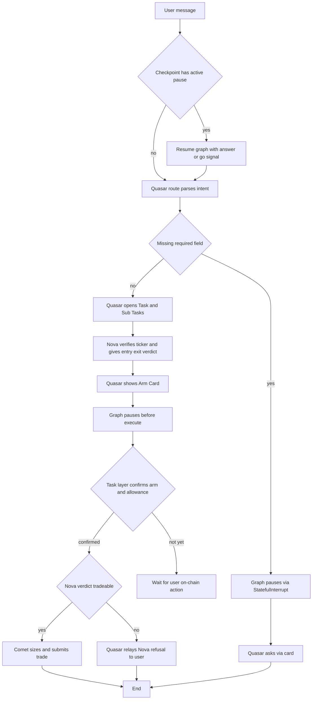

# Quasar Clean Routing — Scalp-Only Refactor

| | |
|---|---|
| **Version** | 2.0 |
| **Status** | Approved |
| **Date Created** | 2026-09-15 |
| **Last Updated** | 2026-09-15 |

| Version | Date | Change |
|---|---|---|
| 2.0 (reset) | 2026-09-15 | An external implementation attempt (v2.1-2.3, not shown here) built on top of this v2.0 architecture, but layered patches instead of implementing it cleanly, and left concrete defects: `consult_nova`/`executor_only` left contradicting the new scalp-mandatory-analysis rule in `instructions.go`, causing a real dead-end route (Arm Card never shown, Task stuck); `runRoute`'s resume branching had no case for "resumed, but the resume target is a later node" (falls through to a fresh, empty-context LLM decision, risking duplicate Task creation or silent misrouting to `reply` instead of `execute`); its own required verification test didn't compile. Per repo owner's direction (hackathon deadline, patch-by-patch fixing abandoned): this file is reset to exactly this v2.0 architecture as the sole basis for a clean reimplementation of `orchestrator_service.go`, `orchestrator_workflow_service.go`, and `instructions.go` — written fresh against this spec, not patched further |
| 2.0 | 2026-09-15 | MAJOR revision — repo owner rejected the v1.4 approach (deleting the `execute` node, letting `TaskService.ExecuteTask` call Comet directly) as a repeat of the same "wrong layer does orchestration" mistake. Corrected architecture: `execute` is kept and given a real Eino interrupt/resume pause (`compose.WithInterruptBeforeNodes`/`StatefulInterrupt`/`ResumeWithData`, confirmed supported in the exact Eino version this repo pins, v0.9.15, via `compose/interrupt.go`, `compose/resume.go`, `compose/checkpoint_test.go:120-172`). Same mechanism is applied to the `needs_input` clarifying-question pause too, for consistency (explicitly mandatory per repo owner) — replacing the hand-rolled `PendingTradeCheckpoint` system (new Finding #8) entirely. `TaskService`/Task-layer handlers are reduced to thin signal-only triggers; all LLM orchestration, including Comet's invocation, stays inside the graph. §1, §2, §3, §4, §6, §7 rewritten |
| 1.4 | 2026-09-15 | Corrected Finding #6 after reading `task_service.go`. The `execute` node/`o.runExecute` in `orchestrator_service.go`'s graph is confirmed DEAD CODE (no caller anywhere but its own registration) — it cannot be the trade-execution path, since a real trade cannot fire until after the user arms and approves on a separate turn. The actual execution trigger is `ExecuteTaskHandler` → `TaskService.ExecuteTask` (`task_service.go:252-399`), a completely separate call path that already invokes Comet directly (`runRoleAgent`, line 364) using raw prose Nova reasoning pulled from a previously-recorded Sub Task row — Comet independently judges whether to trade from that prose, exactly the "re-deciding instead of obeying the verdict" pattern flagged. New Finding #7 records this. §2, §3.1, §3.5, §4, §6, §7 all corrected to move the tradeable gate to `ExecuteTask`, and to delete the dead graph node/function instead of wiring it |
| 1.3 | 2026-09-15 | §3.3 specifies HOW Nova's verdict becomes the typed object §1.2/§3.1 require: Nova appends a fenced ` ```json ` verdict block (`tradeable`, `entry_price`, `exit_price`, `confidence`, `reasoning`) to its existing prose reply, only when `runAnalyze` asks for one (the trade-verification call). This is additive to the existing free-text reply, not a replacement — `analyzer/instructions.go` gains one new section, nothing existing in it is edited, preserving the §2 non-regression requirement. Unparseable/missing verdict fails closed (`tradeable: false`), never defaults to allowing a trade |
| 1.2 | 2026-09-15 | Two absolute constraints added per repo owner: (1) Nova's existing analysis capabilities (chart, news, portfolio) already work well and must not regress — only an additive tool is introduced, §2/§7 updated with an explicit non-regression requirement; (2) `orchestrator_workflow_service.go` is scoped to ONLY the graph node functions (route/analyze/execute/reply) with zero repository/database calls of any kind inside it — domain data enters exclusively as LLM output parsed into a typed Go struct, then passed between node functions as that object, never re-fetched inline. §2 and §3.1 tightened to state this as a hard rule, not just applied to the ticker case |
| 1.1 | 2026-09-15 | §1 new Finding #6: verified the compiled graph in `orchestrator_service.go` has no edge into the `execute` node at all — `routeBranch` only ever returns `analyze`/`reply`, and `analyze` edges straight to `reply`, so Comet is currently unreachable through this graph on any path. Corrected §3.1's earlier claim that `orchestrator_service.go` needs no restructuring — it needs one surgical branch fix. §2 and §4 updated to include this fix |
| 1.0 | 2026-09-15 | Initial draft |

---

## 1. Problem Statement

`docs/plans/onchain-investing-guardrails-and-sell-pipeline.md` accumulated 23 revisions in two days (2026-09-14/15), each describing an increasingly detailed Single Responsibility fix for the same two functions — the document kept getting rewritten while the code never caught up to its own latest diagnosis. That plan is now `Closed`.

The actual, verified root cause: `backend/src/service/agent/orchestrator_workflow_service.go` (~480 lines) mixes LLM prompting, on-chain calls, Postgres writes, and business-logic lookups inside single functions that should each have exactly one job.

Concretely, as read directly from the code (not from the old plan's description of it):

| # | Finding | File:Line | Why it's wrong |
|---|---|---|---|
| 1 | `commitTask` calls `o.Stocks.FindByTickerOrIdxTicker` twice inline to resolve a stock's on-chain contract address | `orchestrator_workflow_service.go:122-136` | Quasar (the router) is doing a domain/catalog lookup itself instead of delegating it — the "boss doing the work instead of asking a subordinate who already has the tool" pattern the repo owner flagged |
| 2 | Ticker verification has nowhere it clearly belongs — Comet re-checks the ticker again inside `submit_trade`, Quasar checks it inside `commitTask`, Nova checks nothing | `orchestrator_workflow_service.go:122-136`, `executor/tools_service.go:265` | Same lookup logic exists in two places for two different reasons (routing vs. execution safety), but nothing upstream of Comet ever gives it a real verdict to act on |
| 3 | `get_stock_chart` (Nova's only price-adjacent tool today) queries Yahoo/IDX external history only (`PriceService.PriceLineHistory` → `GetYahooIDXHistory`), never PulsarFi's own tokenized stock catalog | `analyzer/chart_service.go:59-87`, `public/stock_chart_service.go:14-27` | Nova currently cannot tell "is this ticker tradeable on PulsarFi" from "does Yahoo have a price for this string" — those are different questions and only the second one is answered today |
| 4 | `PriceService.GetStockPrice` already does the exact check needed — catalog lookup, on-chain contract address, live PulsarProtocol pool price, Yahoo 24h-change bolted on as a soft extra — and Nova already receives this exact `PriceService` instance | `public/price_service.go:20-59`, `service/agent_registry.go:110` | The correct fix reuses existing service code with a new thin tool wrapper — it does not require writing new verification logic anywhere |
| 5 | `consult_nova` is an optional, LLM-decided routing branch (`analyzer_then_executor` vs `executor_only`), adding a whole extra decision surface that produced repeated hallucination bugs (documented in the closed plan, e.g. its Problem #14, #17) | `instructions.go:319-325`, `orchestrator_service.go` route branch | For scalp trades, analysis should never be optional or LLM-gated — it should always run, which removes an entire class of routing bugs by removing the branch itself |
| 6 | The compiled graph has no interrupt/resume wiring around the `execute` node — it's a plain node with a dead edge, so it can never safely run mid-conversation (a trade cannot fire before the wallet arms and approves, which happens on a separate HTTP call, later) | `orchestrator_service.go:80-98` | The right fix is neither deleting the node nor leaving it dead — it's giving the graph a real pause point using Eino's own interrupt/resume API, confirmed present and working in the exact Eino version this repo pins (`v0.9.15`, `go.mod:10`) via `compose/interrupt.go`, `compose/resume.go`, and demonstrated end-to-end in `compose/checkpoint_test.go:120-172` (`TestSimpleCheckPoint`) |
| 7 | Because `execute` was never wired for pause/resume, `TaskService.ExecuteTask` (`task_service.go:252-399`) grew into a second, duplicate execution path instead: it reads Nova's PAST reasoning as raw concatenated prose from already-recorded Sub Task rows (`task_service.go:336-349`) and hands it to Comet as loose context; Comet (`runRoleAgent`, line 364) independently judges whether to trade from that prose | `task_service.go:336-364` | This is where "Comet re-decides instead of obeying Nova's verdict" actually happens today. The fix is not to patch this function — it's deleted and replaced by a thin resume trigger, since the real defect is upstream: the graph should never have needed a second, separate execution path in the first place |
| 8 | `chat_service.go`/`checkpoint_store_service.go` independently grew a second, hand-rolled pause mechanism — `PendingTradeCheckpoint` (`SetPendingTrade`/`GetPendingTrade`/`HasPendingTrade`/`DeletePendingTrade`/`pendingTradeKey`), persisted under a deliberately separate key namespace (`pending_trade:`) specifically so it would not collide with "Eino's internal graph execution checkpoints," per its own comment | `chat_service.go:100-239`, `checkpoint_store_service.go:59-134` | Two parallel, inconsistent pause/checkpoint systems exist side by side today — the real one (`compose.CheckPointStore`, already wired via `o.CheckPointStore`/`WithCheckPointID`) and a hand-rolled domain-specific one simulating the same idea worse, plus a whole separate `generatePendingTradeReminder` LLM call built just to keep nudging the user about a paused trade the framework could resume natively |

## 2. Definition of Done

- Every actionable scalp request is one continuously resumable Eino graph run per chat — `route -> [needs_input pause] -> analyze -> reply -> [arm/execute pause] -> execute -> END` — spanning as many real HTTP calls and however much wall-clock time it takes for the user to answer questions and complete on-chain arming. It is never re-derived from scratch by re-reading the whole message history, the way `needs_input` works today.
- **Two interrupt points, one mechanism.** (1) `needs_input`: when `decideRoute` still has unanswered required fields, the node itself calls `compose.StatefulInterrupt` with the partial decision as state; the user's next message resumes it via `compose.ResumeWithData` carrying their raw answer — never a fresh, independent re-decision from full history. (2) Arm/Execute: `execute` pauses (via `compose.WithInterruptBeforeNodes` or an in-node interrupt check) until the Task layer confirms on-chain arm + allowance; resuming there carries only a bare "go" signal, never business data.
- **Comet receives Nova's verdict via normal graph data flow, never via `ResumeWithData`.** The `tradeable`/`entry_price`/`reasoning` struct set during `analyze` lives on the same `turn` object that already threads `analyze -> reply -> execute`; the checkpoint restores it automatically on resume (confirmed via `compose/checkpoint_test.go:120-172`, where a downstream node receives an upstream node's output with no resume-data injection needed for that part). `ResumeWithData` is reserved strictly for the two signals above (the user's answer text; the arm/allowance "go" trigger) — it is never the channel for ticker, amount, or verdict content.
- **Task-layer code never invokes any LLM or agent directly.** `ExecuteTaskHandler`/`TaskService.ExecuteTask` is reduced to: verify the Task belongs to the caller and is armed/approved on-chain, then call a new, thin `Orchestrator` resume method. All LLM orchestration — including calling Comet — stays inside the graph/node functions, never in the Task service layer. The current direct `runRoleAgent(ctx, s.Executor, ...)` call and the hand-built Nova-findings prose concatenation in `ExecuteTask` are deleted entirely.
- **The hand-rolled `PendingTradeCheckpoint` pause simulation is deleted entirely** (Finding #8) — `SetPendingTrade`, `GetPendingTrade`, `HasPendingTrade`, `DeletePendingTrade`, `pendingTradeKey`, and the `generatePendingTradeReminder` call built around it are all removed from `chat_service.go`/`checkpoint_store_service.go`. The real `compose.CheckPointStore` (already wired) becomes the only pause/resume mechanism, used consistently for both interrupt points above.
- `orchestrator_workflow_service.go` is split so that each function has exactly one responsibility; Quasar's route/reply code makes zero direct calls to any repository or stock catalog.
- Nova gets a new tool that wraps the existing `PriceService.GetStockPrice` — no new verification business logic is written, only a thin tool wrapper reusing what already exists.
- Nova's verdict is a structured result (ticker valid, tradeable on-chain yes/no, live price, plain-language entry/exit read) that Comet consumes as-is — Comet never re-runs its own market judgment.
- Comet's own defensive re-check inside `submit_trade` (`executor/tools_service.go:265`) stays as-is — it is a last-mile execution safety net, not where "should we trade" gets decided, and is out of scope for removal.
- The `consult_nova` optional branch is removed from Quasar's routing decision schema for scalp; Nova is always consulted before Comet for any actionable scalp trade.
- Swing, investment, horizon expiry, and on-chain guardrails (the closed plan's §3.1/§3.3/parts of §3.2) are left exactly as they are today — untouched, not fixed, not removed. Out of scope for this refactor.
- **Nova non-regression (hard requirement).** Nova's existing chart/news/portfolio analysis already works and is explicitly not part of this problem. The only change to Nova is the additive ticker-verification tool (§3.3) — every existing tool (`get_stock_chart`, `get_portfolio_snapshot`, `web_search`, `read_article`) and `analyzer/instructions.go`'s current analysis behavior must produce identical output after the refactor. This is verified explicitly, not assumed (§7).
- **`orchestrator_workflow_service.go` scope (hard requirement).** After the split, this file contains ONLY the graph node functions (`runRoute`, `decideRoute`, `runAnalyze`, `runExecute`, `runReply`) plus their pure parsing/dispatch helpers. It makes zero repository or database calls of any kind — not just for tickers, for anything. The only way domain data (ticker validity, price, portfolio holdings, whatever) enters this file is as a typed Go struct already parsed from an LLM's JSON output or from a sub-agent's (Nova's/Comet's) own tool result — never fetched inline by a query this file issues itself.

## 3. Feature Description

### 3.1 Role boundaries (final)

| Role | Owns | Never does |
|---|---|---|
| **Quasar** (`orchestrator_service.go` + a slimmed `orchestrator_workflow_service.go`) | Parsing user intent via LLM into a route decision; opening the Task (DB + on-chain); decomposing the Task into Sub Tasks that dispatch to Nova then Comet in order; composing the final reply to the user; owning both interrupt points (`needs_input`, arm/execute) | Any direct repository/catalog call; any market judgment |
| **Nova** (`analyzer/`) | All ticker verification and market analysis; for scalp, always runs before Comet and returns a structured verdict (tradeable, live price, entry/exit read, reasoning) | Submitting anything on-chain |
| **Comet** (`executor/`) | Execution only — sizing within the armed budget and calling `submit_trade`, strictly conditioned on Nova's verdict being tradeable | Re-deciding whether to trade, re-running analysis, or treating a "not tradeable" verdict as something it can override |
| **Task layer** (`task_service.go`, `tasks.go` handlers) | Ownership/authorization checks, on-chain arm-state verification, and triggering the orchestrator's resume method | Building any LLM prompt, invoking any agent, or deciding anything about trade content — it only ever signals "go" |

`orchestrator_service.go` (the graph definition + `Run`/`NewOrchestrator`) needs real work, not deletion: it compiles with interrupt support around `execute`, and gains a new resume-triggering method used only by the Task layer. `orchestrator_workflow_service.go`'s `decideRoute` calls `compose.StatefulInterrupt` for `needs_input`, and `runExecute` checks for resume context before acting. `task_service.go`'s `ExecuteTask` is reduced to a thin resume trigger. `chat_service.go`/`checkpoint_store_service.go` lose the entire `PendingTradeCheckpoint` mechanism (Finding #8), replaced by checking the real `CheckPointStore` and resuming through it.

### 3.2 Two-tier ticker check

| Situation | Check used | Blocking? |
|---|---|---|
| User asks "is TICKER available on PulsarFi" (informational) | `PriceService.GetStockPrice` once | No — if not tokenized yet, say so plainly; if Yahoo/IDX has a price for it as a plain market ticker, mention that as context |
| User wants to trade | Same `GetStockPrice` call, but the result must show a non-empty `ContractAddress` (tokenized, live PulsarProtocol pool) | Yes — hard block. Comet is never invoked if the ticker isn't tradeable on-chain |

The on-chain PulsarProtocol pool price is the sole authoritative price for any trade decision — it is literally what the swap executes against. Yahoo/IDX price is supplementary context only (`Change24h`), already merged best-effort by `GetStockPrice` (swallowed silently on failure, never blocking, `price_service.go:54-56`). This refactor does not change that merge logic — it only exposes it to Nova as a tool.

### 3.3 Nova's tool addition

A new tool in `analyzer/` (name to be finalized during implementation, e.g. `verify_ticker`) wraps `priceSvc.GetStockPrice(ctx, ticker, "")` as-is. Nova already receives this exact `*publicsvc.PriceService` instance (`agent_registry.go:110`, passed as `chartReader.Price`) — no new wiring in `agent_registry.go` is needed, only a new tool file alongside `analyzer/chart_service.go`.

### 3.4 Removing the `consult_nova` branch (scalp scope)

`instructions.go`'s `quasarRouteInstructions` currently asks the LLM to decide between `executor_only` and `analyzer_then_executor` based on whether the user opted into analysis (lines 319-325). For scalp, this branch is deleted: every actionable scalp decision routes `analyzer_then_executor` unconditionally — Nova always runs, Comet only runs if Nova's verdict says tradeable. This removes an entire decision surface, not just a code path — the LLM is no longer asked to decide something that should never have been optional.

### 3.5 Nova's structured verdict (the object that gets thrown around)

`runAnalyze`'s per-call request text (already built dynamically in `orchestrator_workflow_service.go`, e.g. shape/ticker/side) gains one more instruction, only for the trade-verification call: end the reply with a fenced block

```json
{
  "tradeable": true,
  "entry_price": "12500",
  "exit_price": "",
  "confidence": "high",
  "reasoning": "short reasoning citing the specific evidence gathered"
}
```

A new parser (mirroring `parseRouteDecision`'s fence-stripping approach) extracts the last fenced ` ```json ` block from Nova's reply and unmarshals it into a Go struct. Everything before that block stays Nova's normal prose reply (shown to the user as-is, unchanged from today). If the block is missing or fails to parse, the verdict defaults to `tradeable: false` — a parse failure must never be read as a green light.

This struct is set directly on `turn` (the same `*orchestratorTurn` that already threads `analyze -> reply -> execute`), not persisted to a Sub Task row for later re-reading. The graph's own checkpoint carries `turn` across the arm/execute interrupt automatically (confirmed via `compose/checkpoint_test.go:120-172`), so `execute` receives it exactly as it would if there were no pause at all. This is the one place the "understood by LLM → JSON → object → thrown around" rule spans an interrupt boundary rather than a single function call — the object survives via the graph's own checkpoint, never a hand-rolled restore.

This is additive to `analyzer/instructions.go` (a new section describing this JSON contract) and to the per-call request built in `orchestrator_workflow_service.go` — no existing instruction text or tool is edited, satisfying the §2 Nova non-regression requirement.

### 3.6 Unified interrupt/resume architecture

Two pause points, same mechanism, replacing two different ad-hoc systems that exist today (Findings #6-#8):

| Pause point | Trigger | How it pauses | How it resumes | What resume data carries |
|---|---|---|---|---|
| `needs_input` | `decideRoute` still has unanswered required fields (ticker/side/shape/sizing) | `decideRoute` calls `compose.StatefulInterrupt(ctx, info, state)` — `info` is the questions/card shown to the user, `state` is the partial decision built so far | User's next chat message. `chat_service.go`'s `runForMessage` checks `CheckPointStore.Has(chatID)` first; if a pause exists, it builds `compose.ResumeWithData(ctx, interruptID, answerText)` and invokes with the same checkpoint ID instead of a fresh decision | The user's raw answer text only |
| Arm/Execute | `execute` node reached, Task not yet armed/approved on-chain | `execute` checks resume context on entry (or the graph is compiled with `compose.WithInterruptBeforeNodes([]string{"execute"})`) and pauses if not yet resumed | `ExecuteTaskHandler` → `TaskService.ExecuteTask`, after verifying on-chain arm + allowance, calls a new thin `Orchestrator.Resume(...)` method with the same checkpoint ID | A bare "go" signal only — no ticker, amount, or verdict content, since all of that already lives on `turn` from the same graph run |

Both pauses persist through the real `compose.CheckPointStore` (`PostgresCheckPointStore`, already implemented and wired via `o.CheckPointStore` in `NewOrchestrator`) — the same store, the same mechanism, for both. One open implementation detail: the interrupt ID returned by the first `Invoke()` call at each pause point must be persisted somewhere retrievable for the later resume call (e.g. a column on `agent_tasks`, or a small dedicated table) — the exact storage shape is decided during implementation, not blocking this plan.

## 4. Impacted Files

| File | Change |
|---|---|
| `backend/src/service/agent/orchestrator_service.go` | `[MODIFY]` Compile the graph with interrupt support around `execute` (`compose.WithInterruptBeforeNodes` and/or in-node checks). Add a new `Resume`-style method the Task layer calls to signal "go" post-arm. Task/Sub Task lifecycle code (`Run`/`NewOrchestrator`) otherwise unchanged. |
| `backend/src/service/agent/orchestrator_workflow_service.go` | `[MODIFY]` Split `commitTask` so it no longer touches `o.Stocks`; ticker resolution moves entirely to Nova's turn. `decideRoute` calls `compose.StatefulInterrupt` for `needs_input` instead of just returning the decision. `runExecute` checks resume context before acting. Remove `consult_nova`-branch handling from `runRoute`/`decideRoute`. |
| `backend/src/service/agent/chat_service.go` | `[MODIFY]` `runForMessage` checks `CheckPointStore.Has(chatID)` first and resumes (via `compose.ResumeWithData`) instead of building a fresh decision from full history when a `needs_input` pause is active. Delete all `PendingTradeCheckpoint`-driven logic (Finding #8), including `generatePendingTradeReminder`'s call site. |
| `backend/src/service/agent/checkpoint_store_service.go` | `[MODIFY]` Delete `PendingTradeCheckpoint`, `SetPendingTrade`, `GetPendingTrade`, `HasPendingTrade`, `DeletePendingTrade`, `pendingTradeKey` entirely. `PostgresCheckPointStore` keeps only the real `compose.CheckPointStore` methods (`Get`/`Set`/`Delete`/`Has`). |
| `backend/src/service/agent/task_service.go` | `[MODIFY]` `ExecuteTask` reduced to: verify ownership + on-chain armed/approved state, then call the new orchestrator resume method. Delete the direct `runRoleAgent(ctx, s.Executor, ...)` call and the Nova-findings prose concatenation (`task_service.go:336-364`). |
| `backend/src/service/agent/instructions.go` | `[MODIFY]` Remove `consult_nova` key/branching language from `quasarRouteInstructions`; scalp path always implies `analyzer_then_executor`. |
| `backend/src/service/agent/analyzer/chart_service.go` or a new sibling file | `[NEW/MODIFY]` Add the `PriceService.GetStockPrice`-wrapping tool for ticker verification + live price. |
| `backend/src/service/agent/analyzer/instructions.go` | `[MODIFY]` Document the new tool and the mandatory entry/exit-read verdict shape for scalp requests. |
| `backend/src/service/agent/executor/instructions.go` | `[MODIFY]` Make explicit that Comet acts strictly on Nova's verdict, never re-analyzes. |
| `backend/src/service/agent/executor/tools_service.go` | No change — existing `submit_trade` defensive re-check stays as-is. |
| `backend/src/service/agent_registry.go` | Likely no change — Nova already receives `PriceService`; verify during implementation whether the new tool needs any additional constructor argument. |
| `backend/src/http/handlers/agent/tasks.go` | `[MODIFY]` `ExecuteTaskHandler` unchanged in shape (still just calls `taskSvc.ExecuteTask`) but its callee's behavior changes per above. |

## 5. UI/UX Changes (Lo-Fi)

No new UI surfaces, and no visible behavior change from the user's perspective — the same clarifying-question cards and the same Arm Card render at the same points in the conversation. What changes is entirely underneath: both pauses are now backed by one real, consistent mechanism instead of a stateless full-history re-read (`needs_input`) and a hand-rolled parallel checkpoint (`PendingTradeCheckpoint`). A scalp trade request now always shows Nova's brief entry/exit read in the chat before the Arm Card appears (previously optional, gated by a `consult_nova` question). No card schema fields are added or removed by this refactor.

## 6. Flowchart



## 7. Verification Plan

### Automated tests
- **Nova non-regression (run first, before any other change is trusted):** existing tests/manual calls for `get_stock_chart`, `get_portfolio_snapshot`, `web_search`, and `read_article` are re-run against the post-refactor Nova and diffed against pre-refactor output for the same inputs — any behavior difference in these four tools is a failed check, since Nova's analysis was explicitly confirmed already working and is not what this refactor is meant to touch.
- New test under `backend/test/service/agent/...` covering the ticker-verification tool: tokenized ticker returns on-chain price + `ContractAddress`; non-tokenized-but-Yahoo-known ticker returns informational-only result; unknown ticker returns not-found.
- New test asserting `orchestrator_workflow_service.go`'s node functions never call any repository/database interface directly (e.g. via a mock/interface that fails the test if invoked) — covering `commitTask` specifically but written generically enough to catch a future function in this file making the same mistake.
- New test asserting a scalp route decision never contains the `consult_nova` key and always resolves to the analyze-then-execute path when actionable.
- New test: answering a `needs_input` clarifying question resumes the same graph run (via `compose.ResumeWithData`) rather than triggering a fresh independent decision — assert the already-answered fields are never re-asked.
- New test: the arm/execute pause only proceeds to `execute` after an explicit resume signal from the Task layer; asserts Comet is never invoked before that signal arrives.
- New test asserting `task_service.go`'s `ExecuteTask` never calls `runRoleAgent` or any agent directly — only the orchestrator's resume method.
- New test asserting `PendingTradeCheckpoint` and its methods no longer exist in the codebase (e.g. a grep-based check in CI, or simply that the symbols were deleted and the build still passes).

### Manual verification
- Run a real scalp buy end-to-end on staging across multiple real chat turns: ask a partial trade request, confirm the clarifying-question card appears and answering it continues the same flow without re-asking; confirm Nova's entry read appears before the Arm Card; arm + approve on-chain; confirm Comet executes only after that signal, and the trade matches Nova's stated price within normal spot drift.
- Run a real scalp sell end-to-end, same checks.
- Attempt a trade on a ticker known to exist on Yahoo/IDX but not tokenized on PulsarFi — confirm the request is hard-blocked before reaching Comet, with a plain-language reason from Nova.
- Attempt an informational-only query ("is TICKER available on PulsarFi") — confirm it never opens a Task and never reaches Comet.
- Ask Nova a pure analysis question unrelated to trading (chart, news, portfolio) — confirm the reply quality and tool usage look unchanged from before the refactor.
- Restart the backend process between arming and executing a trade — confirm the paused graph resumes correctly from the persisted checkpoint rather than losing state.

---

## Prompt History

### v2.0 — 2026-09-15
> Repo owner rejected deleting the `execute` node/moving execution logic into `TaskService.ExecuteTask` (v1.4), identifying it as the same "wrong layer orchestrates the LLM" mistake — Task-layer code must only ever signal yes/no/go, never build prompts or call agents itself; that is the graph's job. Directed research into whether the Eino version in use actually supports pause/resume; confirmed via source (`compose/interrupt.go`, `compose/resume.go`, `compose/checkpoint_test.go`) that it does. Clarified that Comet receives Nova's verdict through normal graph data flow, not through `ResumeWithData` (corrected an earlier wrong assumption). Explicitly mandated that the existing `needs_input` clarifying-question flow also be refactored onto the same interrupt/resume mechanism for consistency, which surfaced Finding #8 (the hand-rolled `PendingTradeCheckpoint` system). Confirmed the final unified architecture and requested it be written to the plan.

### v1.0 — 2026-09-15
> User reported the agent-trading pipeline (Quasar/Nova/Comet) had become unmaintainable spaghetti after repeated same-day plan rewrites with no matching implementation progress. Requested closing the prior plan and starting a new one scoped to scalp buy/sell only, with clean role separation: Quasar as pure router/Task orchestrator, Nova owning all ticker verification and analysis, Comet owning execution only and acting strictly on Nova's verdict. Confirmed across several rounds: ticker verification must reuse the existing `PriceService.GetStockPrice` (not new logic), and trade-intent ticker checks must be stricter (on-chain tradeable required) than plain availability checks (informational only).
