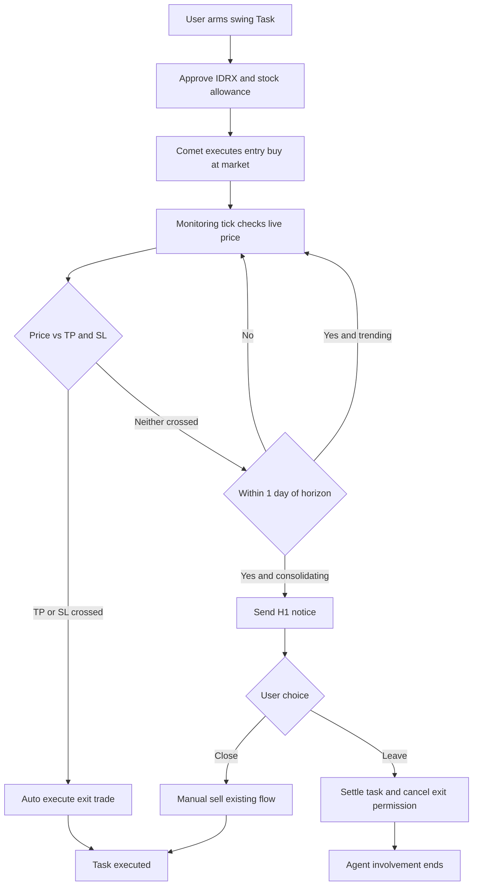

# Swing Trade Auto-Exit and Position Monitoring

| | |
|---|---|
| **Version** | 1.0 |
| **Status** | Draft |
| **Date Created** | 2026-09-17 |
| **Last Updated** | 2026-09-17 |

| Version | Date | Change |
|---|---|---|
| 1.0 | 2026-09-17 | Initial draft |

## 1. Problem Statement

The `swing` trade shape already exists end-to-end in the intake prompt, the `agent_tasks` schema (`horizon_expires_at`, `horizon_notified_at`, `exit_policy`), and the Arm Card UI (`ArmPanel.tsx` renders a horizon picker), but it has no behavior that actually distinguishes it from `scalp` beyond a longer expiry clock and a single time-based H-1 notice. There is no scheduler job that watches an armed swing position between arm-time and horizon expiry (`TaskService.Evaluate` is a documented no-op), no on-chain price-guardrail enforcement for take-profit/stop-loss (`hasPriceGuardrail`/`triggerPrice` were designed in a now-closed plan and never implemented — zero occurrences in the current codebase), and no deterministic technical read of price action (Nova free-reads a raw price series with no computed indicators).

As a result, today a swing Task provides no real automation value during its holding period: the user either has to manually watch the market for days to catch a good exit, or waits passively for a single H-1 notice that fires regardless of what the price is actually doing. This also leaves the shape's core promise — "the agent watches this for you" — entirely unfulfilled, and the only enforcement of exit intent is a backend-only Postgres field with no on-chain guarantee.

## 2. Definition of Done

- [ ] Arming a swing-shape Task grants **two** on-chain `TradePermission`s under one Task: an **entry permission** (side Buy, executed immediately at market once the user approves) and an **exit permission** (side Sell, carrying take-profit and stop-loss price guardrails with OCO semantics — whichever threshold is reached first executes and cancels the other).
- [ ] Both ERC-20 allowances (IDRX for entry, the target stock token for exit) are requested during the single arm flow — two wallet prompts up front, and **no further wallet prompt occurs for the rest of the position's life**, including the automatic TP/SL exit.
- [ ] `AgentTaskManager` reverts with `PriceConditionNotMet` if an exit is attempted before its trigger price is reached, checked against the live `PulsarProtocol.quoteStockToIdrx` pool price.
- [ ] A new scheduler tick periodically re-checks the live price of every armed, unexecuted swing exit permission and auto-calls `executeTrade` the instant TP or SL is crossed — no user interaction required.
- [ ] The H-1 notice fires only when a deterministic indicator read classifies the position as **consolidating** (no clear directional bias toward TP or SL) — not unconditionally for every swing task as today.
- [ ] "Close" on the H-1 card reuses the existing manual-sell flow unchanged.
- [ ] "Leave" on the H-1 card (a) sets `status=settled_held` / `exit_policy=leave_open` (already implemented) and (b) additionally **cancels the on-chain exit `TradePermission`**, so the agent can no longer auto-execute anything on that position afterward.
- [ ] Once a Task is settled via "Leave", the agent's involvement ends permanently for that position — there is no "resume monitoring" action; if the user wants automation again, they ask Quasar to open a new Task.
- [ ] Deterministic technical indicators (moving average, support/resistance band, a volatility/consolidation measure) are computed in Go and feed both Nova's evidence and the H-1 consolidation check — not estimated freehand by an LLM reading a raw price list.
- [ ] A minimal position/lot record (entry price, cost basis, linked exit permission id) persists per swing Task so the monitoring loop and any P&L display don't reconstruct state from `stock_transactions` every cycle.

## 3. Feature Description

**Arming.** When Quasar's intake resolves `shape=swing`, `side`, ticker, budget, and horizon, arming a Task now performs two on-chain grants instead of one: an entry `TradePermission` (Buy, `expiresAt` = now, single-fill) and an exit `TradePermission` (Sell, `expiresAt` = horizon, carrying `takeProfitPrice`/`stopLossPrice`). The frontend requests both ERC-20 approvals (IDRX, target stock) back-to-back in the same arm flow.

**Entry.** Once the IDRX approval confirms, Comet executes the entry Buy immediately at market — identical to the existing scalp execution path. No conditional/limit entry is introduced in this iteration; Nova's pre-arm verdict (`tradeable`/`entry_price`/`confidence`) is treated as the "why now is a reasonable entry" check.

**Monitoring.** A new scheduler job (distinct from the existing 60s DCA/horizon tick, run on a longer interval to bound LLM/RPC cost) reads the live pool price for every armed, unexecuted swing exit permission. Deterministic indicators computed in Go classify the position's trend state. When price crosses either the TP or SL threshold, the job calls `executeTrade` on the exit permission directly (no LLM call needed for the mechanical trigger check) — Nova is only invoked for supplementary evidence gathering, not as a gate on whether the trigger fires.

**H-1 notice.** 24 hours before `horizon_expires_at`, the existing `processHorizonNotices` job now first asks the indicator layer whether the position is consolidating (no clear bias toward TP or SL). If it is trending clearly toward one side, no notice is sent — the auto-exit mechanism is left to handle it. If it is consolidating, the existing `HorizonNoticeCard` fires with Close/Leave.

**Close.** Unchanged — opens a normal manual sell Arm Card.

**Leave.** Sets `status=settled_held` (existing) and additionally issues an agent-submitted `cancelTask`/permission-revoke call against the exit `TradePermission` — a normal agent-signed transaction, no extra user wallet prompt. From this point the Task is fully closed on the agent side; the user holds the position with no further agent involvement unless they start a new Task.

## 4. Impacted Files

### Smart Contract
| File | Change |
|---|---|
| `smart-contract/src/AgentTaskManager.sol` | `[MODIFY]` Add take-profit/stop-loss price-guardrail fields to `TradePermission` (or a paired exit-permission variant), `PriceConditionNotMet` revert, OCO cancellation between TP and SL, a `grantTradePermission` overload, and a cancel/revoke path callable on Leave. |
| `smart-contract/test/AgentTaskManagerPriceGuardrail.t.sol` | `[NEW]` Fork tests: TP fires, SL fires, OCO cancels the other side, cancel-on-Leave blocks a later trigger attempt, allowance-covers-both-sides at arm time. |
| `smart-contract/script/DeployAgentTaskManager.s.sol` | `[MODIFY]` Redeploy script update if the struct/ABI changes (this contract is redeployed rather than upgraded — needs `AGENT_ROLE` re-grant and BE/FE address rewiring, see Open Questions). |

### Backend
| File | Change |
|---|---|
| `backend/src/service/agent/scheduler_service.go` | `[MODIFY]` Add a swing-monitoring tick (new interval, separate from the 60s DCA/horizon loop); gate `processHorizonNotices` on the consolidation check. |
| `backend/src/service/agent/task_service.go` | `[MODIFY]` Implement `Evaluate` (currently a no-op); wire arm to grant two permissions; wire "Leave" to cancel the exit permission on-chain. |
| `backend/src/service/agent/indicators/` | `[NEW]` Deterministic Go package: moving averages, support/resistance, a consolidation/volatility score. |
| `backend/src/service/agent/analyzer/` (Nova) | `[MODIFY]` Consume the new deterministic indicators as advisory input instead of a raw price list. |
| `backend/src/contracts/agent.go` | `[MODIFY]` Add TP/SL and dual-permission DTO fields. |
| `backend/migrations/026_add_swing_exit_guardrails.sql` | `[NEW]` `agent_positions` (entry price, cost basis, entry/exit permission ids, status) + any new columns on `agent_tasks` needed to track the two permission ids. |

### Frontend
| File | Change |
|---|---|
| `frontend/components/agent/ArmPanel.tsx` | `[MODIFY]` Request two approvals at arm for swing shape; add TP/SL input fields. |
| `frontend/components/agent/SwingPositionCard.tsx` | `[NEW]` Mid-horizon monitoring view: days elapsed, price vs. TP/SL, trend state — surfaced in the QuasarPanel Tasks tab and Portfolio. |
| `frontend/components/agent/HorizonNoticeCard.tsx` | `[MODIFY]` Copy update reflecting that "Leave" also revokes on-chain permission (agent-signed, no extra user wallet prompt). |
| `frontend/components/agent/cardContract.ts` | `[MODIFY]` New label fields for TP/SL inputs and the swing monitoring card. |

## 5. UI/UX Changes (Lo-Fi)

**ArmPanel — swing shape, additional TP/SL block:**
```
[ Budget: 2,000,000 IDRX ]
[ Holding Horizon: 7d  14d  30d ]
[ Take Profit price: ______ ]   (optional)
[ Stop Loss price:   ______ ]   (optional)
"Both approvals happen now. No further wallet action once armed."
[ Arm Trade ]
```

**New — Swing Position monitoring card (QuasarPanel Tasks tab / Portfolio):**
```
BUMIP · Swing · Day 4 of 14
Entry: Rp 1,250   Current: Rp 1,310  (+4.8%)
TP: Rp 1,400   SL: Rp 1,150
State: Trending toward TP
```

**HorizonNoticeCard — consolidation notice (unchanged trigger UI, updated copy):**
```
"BUMIP is consolidating with 1 day left on this swing position."
[ Close Position (Sell to IDRX) ]   [ Leave — I'll manage it myself ]
"Leave ends PulsarFi's automation on this position permanently."
```

## 6. Flowchart



## 7. Open Questions

- **Exit-permission shape**: should TP and SL live as two fields on a single exit `TradePermission` (one struct, OCO handled inside `executeTrade`), or as two separate permissions that cancel each other? The former is simpler for the allowance/budget model; the latter reuses the existing single-purpose `TradePermission` struct unmodified. Leaning toward the single-struct approach but this needs a contract-level design pass before implementation.
- **`AgentTaskManager` redeploy impact**: this contract is redeployed (not upgraded) when its ABI changes. Adding guardrail fields means a fresh address, a new `AGENT_ROLE` grant, and updating both `AGENT_TASK_MANAGER` (backend) and its frontend equivalent — plus checking whether the added struct fields risk the same EIP-170 size pressure `PulsarProtocol` hit (which needed the Ops delegatecall split). Needs a size check before committing to the struct design.
- **Monitoring tick interval**: not yet decided — needs to balance responsiveness (how much price a fast-moving swing position could move between checks) against RPC/LLM cost.

## 8. Verification Plan

**Automated tests**
- Foundry fork tests: TP fires and executes; SL fires and executes; OCO — triggering one cancels the other; a trigger attempt before either threshold reverts with `PriceConditionNotMet`; cancel-on-Leave blocks any further trigger attempt; one arm covers both entry and exit allowances with no additional approval calls.
- Go unit tests: indicator computation (moving average, support/resistance, consolidation score) against known price series with expected classifications; scheduler monitoring tick correctly picks up due permissions and skips non-due ones; `processHorizonNotices` correctly gates on consolidation state.

**Manual verification**
- Arm a swing Task on Arbitrum Sepolia testnet, confirm exactly two wallet prompts at arm time and zero further prompts through to auto-exit.
- Force a TP condition (e.g. testnet price manipulation or a tight threshold) and confirm auto-execution with no user action.
- Reach H-1 in a consolidating state, choose "Leave", then attempt to independently verify the exit permission is no longer executable on-chain.
- Reach H-1 in a consolidating state, choose "Close", confirm it reuses the existing manual sell flow unchanged.
